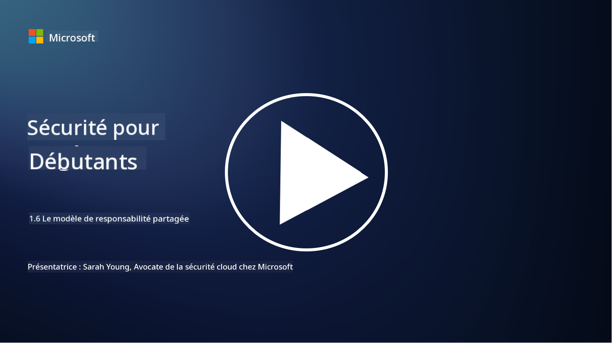

<!--
CO_OP_TRANSLATOR_METADATA:
{
  "original_hash": "a48db640d80c786b928ca178c414f084",
  "translation_date": "2025-09-03T18:35:07+00:00",
  "source_file": "1.6 Shared responsibility model.md",
  "language_code": "fr"
}
-->
# Le modèle de responsabilité partagée

La responsabilité partagée est un concept relativement nouveau en informatique, apparu avec l’avènement du cloud computing. Du point de vue de la cybersécurité, il est essentiel de comprendre qui fournit quels contrôles de sécurité afin d’éviter toute lacune dans la défense.

## Introduction

Dans cette leçon, nous aborderons :

 - Qu’est-ce que la responsabilité partagée dans le contexte de la cybersécurité ?
   
 - Quelle est la différence dans la responsabilité partagée des contrôles de sécurité
   entre IaaS, PaaS et SaaS ?

   

 - Où pouvez-vous trouver les contrôles de sécurité fournis par votre plateforme cloud ?

   
 

 - Que signifie « faire confiance mais vérifier » ?

## Qu’est-ce que la responsabilité partagée dans le contexte de la cybersécurité ?

La responsabilité partagée en cybersécurité fait référence à la répartition des responsabilités en matière de sécurité entre un fournisseur de services cloud (CSP) et ses clients. Dans les environnements de cloud computing, tels que l’Infrastructure as a Service (IaaS), la Platform as a Service (PaaS) et le Software as a Service (SaaS), le CSP et le client ont chacun un rôle à jouer pour garantir la sécurité des données, des applications et des systèmes.

## Quelle est la différence dans la responsabilité partagée des contrôles de sécurité entre IaaS, PaaS et SaaS ?

La répartition des responsabilités dépend généralement du type de service cloud utilisé :

 - **IaaS (Infrastructure as a Service)** : Le CSP fournit l’infrastructure de base (serveurs, réseau, stockage), tandis que le client est responsable de la gestion des systèmes d’exploitation, des applications et des configurations de sécurité sur cette infrastructure.
   
   
 - **PaaS (Platform as a Service)** : Le CSP offre une plateforme sur laquelle les clients peuvent développer et déployer des applications. Le CSP gère l’infrastructure sous-jacente, et le client se concentre sur le développement des applications et la sécurité des données.

   

 - **SaaS (Software as a Service)** : Le CSP fournit des applications entièrement fonctionnelles accessibles via Internet. Dans ce cas, le CSP est responsable de la sécurité de l’application et de l’infrastructure, tandis que le client gère l’accès des utilisateurs et l’utilisation des données.

Comprendre la responsabilité partagée est crucial, car cela clarifie quels aspects de la sécurité sont pris en charge par le CSP et lesquels doivent être gérés par le client. Cela permet d’éviter les malentendus et garantit que les mesures de sécurité sont mises en œuvre de manière globale.

## Où pouvez-vous trouver les contrôles de sécurité fournis par votre plateforme cloud ?

Pour savoir quels contrôles de sécurité votre plateforme cloud fournit, vous devez consulter la documentation et les ressources du fournisseur de services cloud. Cela inclut :

 - **Site web et documentation du CSP** : Le site web du CSP contient des informations sur les fonctionnalités et les contrôles de sécurité inclus dans leurs services. Les CSP proposent généralement une documentation détaillée expliquant leurs pratiques, contrôles et recommandations en matière de sécurité. Cela peut inclure des livres blancs, des guides de sécurité et de la documentation technique.
   
 - **Évaluations et audits de sécurité** : La plupart des CSP font évaluer leurs contrôles de sécurité par des experts et des organisations indépendants. Ces examens peuvent fournir des informations sur la qualité des mesures de sécurité du CSP. Parfois, cela conduit le CSP à obtenir une certification de conformité en matière de sécurité (voir le point suivant).
 - **Certifications de conformité en matière de sécurité** : La plupart des CSP obtiennent des certifications telles que ISO:27001, SOC 2 et FedRAMP, etc. Ces certifications démontrent que le fournisseur respecte des normes spécifiques en matière de sécurité et de conformité.

Gardez à l’esprit que le niveau de détail et la disponibilité des informations peuvent varier d’un fournisseur cloud à l’autre. Assurez-vous toujours de consulter des ressources officielles et à jour fournies par le fournisseur de services cloud pour prendre des décisions éclairées sur la sécurité de vos actifs dans le cloud.

## Que signifie « faire confiance mais vérifier » ?

Dans le contexte de l’utilisation d’un CSP, d’un logiciel tiers ou d’un autre service de sécurité informatique, une organisation peut initialement faire confiance aux affirmations du fournisseur concernant les mesures de sécurité. Cependant, pour garantir réellement la sécurité de ses données et systèmes, elle doit vérifier ces affirmations par le biais d’évaluations de sécurité, de tests d’intrusion et d’un examen des contrôles de sécurité du tiers avant d’intégrer pleinement le logiciel ou le service dans ses opérations. Toutes les personnes et organisations doivent chercher à faire confiance mais vérifier les contrôles de sécurité dont elles ne sont pas responsables.

## Responsabilité partagée au sein d’une organisation

N’oubliez pas que la responsabilité partagée en matière de sécurité au sein d’une organisation entre différentes équipes doit également être prise en compte. L’équipe de sécurité mettra rarement en œuvre tous les contrôles elle-même et devra collaborer avec les équipes opérationnelles, les développeurs et d’autres parties de l’entreprise pour mettre en place tous les contrôles de sécurité nécessaires pour protéger l’organisation.

## Lectures complémentaires
- [Responsabilité partagée dans le cloud - Microsoft Azure | Microsoft Learn](https://learn.microsoft.com/azure/security/fundamentals/shared-responsibility?WT.mc_id=academic-96948-sayoung)
- [Qu’est-ce que le modèle de responsabilité partagée ? – Définition de TechTarget.com](https://www.techtarget.com/searchcloudcomputing/definition/shared-responsibility-model)
- [Le modèle de responsabilité partagée expliqué et ce qu’il signifie pour la sécurité dans le cloud | CSO Online](https://www.csoonline.com/article/570779/the-shared-responsibility-model-explained-and-what-it-means-for-cloud-security.html)
- [Responsabilité partagée pour la sécurité dans le cloud : ce que vous devez savoir (cisecurity.org)](https://www.cisecurity.org/insights/blog/shared-responsibility-cloud-security-what-you-need-to-know)

---

**Avertissement** :  
Ce document a été traduit à l'aide du service de traduction automatique [Co-op Translator](https://github.com/Azure/co-op-translator). Bien que nous nous efforcions d'assurer l'exactitude, veuillez noter que les traductions automatisées peuvent contenir des erreurs ou des inexactitudes. Le document original dans sa langue d'origine doit être considéré comme la source faisant autorité. Pour des informations critiques, il est recommandé de recourir à une traduction professionnelle réalisée par un humain. Nous déclinons toute responsabilité en cas de malentendus ou d'interprétations erronées résultant de l'utilisation de cette traduction.