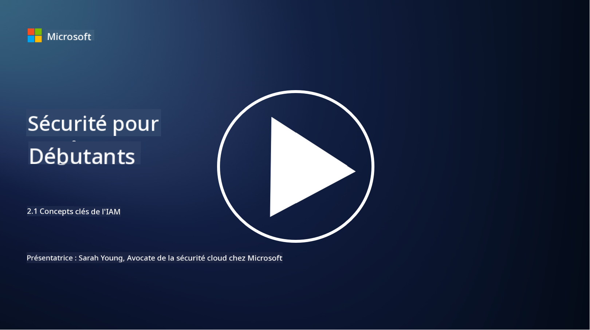

<!--
CO_OP_TRANSLATOR_METADATA:
{
  "original_hash": "2e3864e3d579f0dbb4ac2ec8c5f82acf",
  "translation_date": "2025-09-03T18:04:42+00:00",
  "source_file": "2.1 IAM key concepts.md",
  "language_code": "fr"
}
-->
# Concepts clés de la gestion des identités et des accès (IAM)

Avez-vous déjà ouvert une session sur un ordinateur ou un site web ? Bien sûr que oui ! Cela signifie que vous avez déjà utilisé des contrôles d'identité dans votre vie quotidienne. La gestion des identités et des accès (IAM) est un pilier essentiel de la sécurité, et nous en apprendrons davantage dans les prochaines leçons.

**Introduction**

Dans cette leçon, nous aborderons :

- Que signifie la gestion des identités et des accès (IAM) dans le contexte de la cybersécurité ?
- Qu'est-ce que le principe du moindre privilège ?
- Qu'est-ce que la séparation des tâches ?
- Qu'est-ce que l'authentification et l'autorisation ?

## Que signifie la gestion des identités et des accès (IAM) dans le contexte de la cybersécurité ?

La gestion des identités et des accès (IAM) fait référence à un ensemble de processus, technologies et politiques mis en œuvre pour garantir que les bonnes personnes disposent des accès appropriés aux ressources dans l'environnement numérique d'une organisation. L'IAM consiste à gérer les identités numériques (utilisateurs, employés, partenaires) et leurs accès aux systèmes, applications, données et réseaux. L'objectif principal de l'IAM est d'améliorer la sécurité, de simplifier l'accès des utilisateurs et d'assurer la conformité avec les politiques et réglementations de l'organisation. Les solutions IAM incluent généralement l'authentification des utilisateurs, l'autorisation, la gestion des identités, le contrôle des accès et la gestion du cycle de vie des utilisateurs (s'assurer que les comptes sont supprimés lorsqu'ils ne sont plus utilisés).

## Qu'est-ce que le principe du moindre privilège ?

Le principe du moindre privilège est un concept fondamental qui préconise d'accorder aux utilisateurs et aux systèmes uniquement les privilèges minimums nécessaires pour accomplir leurs tâches ou rôles prévus. Ce principe permet de limiter les dommages potentiels en cas de violation de sécurité ou de menace interne. En respectant le principe du moindre privilège, les organisations réduisent la surface d'attaque et minimisent les risques d'accès non autorisé, de violations de données et d'utilisation abusive accidentelle des privilèges. En pratique, cela signifie que les utilisateurs ne reçoivent un accès qu'aux ressources et fonctionnalités spécifiques nécessaires à leurs rôles professionnels, et rien de plus. Par exemple, si vous avez simplement besoin de lire un document, il serait excessif de vous accorder des privilèges d'administrateur complet sur ce document.

## Qu'est-ce que la séparation des tâches ?

La séparation des tâches est un principe visant à prévenir les conflits d'intérêts et à réduire les risques de fraude et d'erreurs en répartissant les tâches et responsabilités critiques entre différentes personnes au sein d'une organisation. Dans le contexte de la cybersécurité, la séparation des tâches consiste à s'assurer qu'aucun individu n'a le contrôle sur tous les aspects d'un processus ou système critique. L'objectif est de créer un système de contrôles croisés qui empêche une seule personne d'avoir la capacité de réaliser à la fois les étapes de configuration et d'approbation d'un processus. Par exemple, dans les systèmes financiers, cela pourrait signifier que la personne qui saisit les transactions dans le système ne doit pas être la même que celle qui approuve ces transactions. Cela réduit le risque d'actions non autorisées ou frauduleuses passant inaperçues.

## Qu'est-ce que l'authentification et l'autorisation ?

L'authentification et l'autorisation sont deux concepts fondamentaux en cybersécurité qui jouent un rôle crucial pour garantir la sécurité et l'intégrité des systèmes informatiques et des données. Ils sont souvent utilisés conjointement pour contrôler l'accès aux ressources et protéger les informations sensibles.

**1. Authentification** :  
L'authentification est le processus de vérification de l'identité d'un utilisateur, d'un système ou d'une entité tentant d'accéder à un système informatique ou à une ressource spécifique. Elle garantit que l'identité revendiquée est authentique et exacte. Les méthodes d'authentification impliquent généralement l'utilisation d'un ou plusieurs des facteurs suivants :

   a. Quelque chose que vous savez : Cela inclut les mots de passe, les codes PIN ou d'autres informations secrètes que seul l'utilisateur autorisé devrait connaître.  
   b. Quelque chose que vous possédez : Cela inclut des objets physiques ou des dispositifs comme des cartes à puce, des jetons de sécurité ou des téléphones mobiles utilisés pour confirmer l'identité de l'utilisateur.  
   c. Quelque chose que vous êtes : Cela fait référence à des facteurs biométriques comme les empreintes digitales, la reconnaissance faciale ou les scans rétiniens, qui sont uniques à un individu.  

Les mécanismes d'authentification sont utilisés pour confirmer qu'un utilisateur est bien celui qu'il prétend être avant de lui permettre d'accéder à un système ou une ressource. Cela aide à prévenir les accès non autorisés et garantit que seuls les utilisateurs légitimes peuvent effectuer des actions dans un système.

**2. Autorisation** :  
L'autorisation est le processus consistant à accorder ou refuser des permissions et privilèges spécifiques aux utilisateurs ou entités authentifiés une fois leur identité vérifiée. Elle détermine quelles actions ou opérations un utilisateur est autorisé à effectuer dans un système ou sur des ressources spécifiques. L'autorisation repose souvent sur des politiques prédéfinies, des règles de contrôle d'accès et des rôles attribués aux utilisateurs.

L'autorisation peut être vue comme la réponse à la question : "Que peut faire un utilisateur authentifié ?" Elle implique la définition et l'application de politiques de contrôle d'accès pour protéger les données et ressources sensibles contre tout accès ou modification non autorisé.

**En résumé :**

- L'authentification établit l'identité des utilisateurs ou entités.  
- L'autorisation détermine quelles actions et ressources les utilisateurs authentifiés sont autorisés à accéder ou manipuler.

## Lectures complémentaires

- [Décrire les concepts d'identité - Formation | Microsoft Learn](https://learn.microsoft.com/training/modules/describe-identity-principles-concepts/?WT.mc_id=academic-96948-sayoung)  
- [Introduction à l'identité - Microsoft Entra | Microsoft Learn](https://learn.microsoft.com/azure/active-directory/fundamentals/identity-fundamental-concepts?WT.mc_id=academic-96948-sayoung)  
- [Qu'est-ce que la gestion des identités et des accès (IAM) ? | Microsoft Security](https://www.microsoft.com/security/business/security-101/what-is-identity-access-management-iam?WT.mc_id=academic-96948-sayoung)  
- [Qu'est-ce que l'IAM ? Explication de la gestion des identités et des accès | CSO Online](https://www.csoonline.com/article/518296/what-is-iam-identity-and-access-management-explained.html)  
- [Qu'est-ce que l'IAM ? (auth0.com)](https://auth0.com/blog/what-is-iam/)  
- [Security+ : mise en œuvre des contrôles IAM [mise à jour 2021] | Infosec (infosecinstitute.com)](https://resources.infosecinstitute.com/certifications/securityplus/security-implementing-identity-and-access-management-iam-controls/)  
- [Moindre privilège - Glossaire | CSRC (nist.gov)](https://csrc.nist.gov/glossary/term/least_privilege)  
- [Sécurité : le principe du moindre privilège (POLP) - Microsoft Community Hub](https://techcommunity.microsoft.com/t5/azure-sql-blog/security-the-principle-of-least-privilege-polp/ba-p/2067390?WT.mc_id=academic-96948-sayoung)  
- [Principe du moindre privilège | CERT NZ](https://www.cert.govt.nz/it-specialists/critical-controls/principle-of-least-privilege/)  
- [Pourquoi la séparation des tâches est-elle requise par NIST 800-171 et CMMC ? - (totem.tech)](https://www.totem.tech/cmmc-separation-of-duties/)  

---

**Avertissement** :  
Ce document a été traduit à l'aide du service de traduction automatique [Co-op Translator](https://github.com/Azure/co-op-translator). Bien que nous nous efforcions d'assurer l'exactitude, veuillez noter que les traductions automatisées peuvent contenir des erreurs ou des inexactitudes. Le document original dans sa langue d'origine doit être considéré comme la source faisant autorité. Pour des informations critiques, il est recommandé de recourir à une traduction professionnelle réalisée par un humain. Nous déclinons toute responsabilité en cas de malentendus ou d'interprétations erronées résultant de l'utilisation de cette traduction.