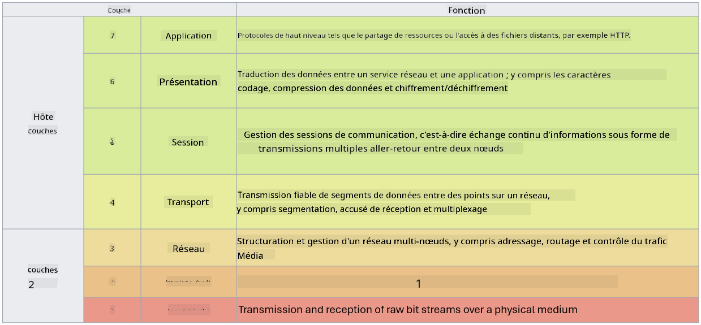

<!--
CO_OP_TRANSLATOR_METADATA:
{
  "original_hash": "252724eceeb183fb9018f88c5e1a3f0c",
  "translation_date": "2025-09-03T18:56:23+00:00",
  "source_file": "3.1 Networking key concepts.md",
  "language_code": "fr"
}
-->
# Concepts clés en réseau

Si vous avez déjà travaillé dans le domaine de l'informatique, il est probable que vous ayez été exposé à des concepts de réseau. Bien que nous utilisions l'identité comme principal contrôle de périmètre dans les environnements modernes, cela ne signifie pas que les contrôles réseau sont superflus. Bien que ce soit un sujet vaste, dans cette leçon, nous aborderons quelques concepts clés en réseau.

Dans cette leçon, nous verrons :

 - Qu'est-ce que l'adressage IP ?
   
 - Qu'est-ce que le modèle OSI ?

 

 - Qu'est-ce que TCP/UDP ?

   
 

 - Que sont les numéros de port ?

   
  

 - Qu'est-ce que le chiffrement au repos et en transit ?

## Qu'est-ce que l'adressage IP ?

L'adressage IP, ou adressage par protocole Internet, est une étiquette numérique attribuée à chaque appareil connecté à un réseau informatique utilisant le protocole Internet pour communiquer. Il sert d'identifiant unique pour les appareils au sein d'un réseau, leur permettant d'envoyer et de recevoir des données sur Internet ou d'autres réseaux interconnectés. Il existe deux principales versions de l'adressage IP : IPv4 (protocole Internet version 4) et IPv6 (protocole Internet version 6). Une adresse IP est généralement représentée au format IPv4 (par exemple, 192.168.1.1) ou au format IPv6 (par exemple, 2001:0db8:85a3:0000:0000:8a2e:0370:7334).

## Qu'est-ce que le modèle OSI ?

Le modèle OSI (Open Systems Interconnection) est un cadre conceptuel qui standardise les fonctions d'un système de communication en sept couches distinctes. Chaque couche effectue des tâches spécifiques et communique avec les couches adjacentes pour garantir une communication efficace et fiable entre les appareils d'un réseau. Les couches, de la plus basse à la plus haute, sont les suivantes :

 1. Couche physique
    
 
 2. Couche liaison de données

    
    

 1. Couche réseau

    
   

 1. Couche transport

    

 1. Couche session

    
   

 1. Couche présentation

    
    

 1. Couche application

Le modèle OSI fournit une référence commune pour comprendre comment les protocoles et technologies réseau interagissent, indépendamment des implémentations matérielles ou logicielles spécifiques.

_ref: https://en.wikipedia.org/wiki/OSI_model_

## Qu'est-ce que TCP/UDP ?

TCP (Transmission Control Protocol) et UDP (User Datagram Protocol) sont deux protocoles fondamentaux de la couche transport utilisés dans les réseaux informatiques pour faciliter la communication entre les appareils sur Internet ou au sein d'un réseau local. Ils sont responsables de la fragmentation des données en paquets pour la transmission, puis de la reconstitution de ces paquets en données originales à la réception. Cependant, ils diffèrent par leurs caractéristiques et leurs cas d'utilisation.

**TCP (Transmission Control Protocol)** :

TCP est un protocole orienté connexion qui assure une livraison fiable et ordonnée des données entre les appareils. Il établit une connexion entre l'expéditeur et le destinataire avant que l'échange de données ne commence. TCP garantit que les paquets de données arrivent dans le bon ordre et peut gérer la retransmission des paquets perdus pour garantir l'intégrité et l'exhaustivité des données. Cela rend TCP adapté aux applications nécessitant une livraison fiable des données, telles que la navigation web, les courriels, le transfert de fichiers (FTP) et la communication avec les bases de données.

**UDP (User Datagram Protocol)** :

UDP est un protocole sans connexion qui offre une transmission de données plus rapide mais ne fournit pas le même niveau de fiabilité que TCP. Il n'établit pas de connexion formelle avant d'envoyer des données et n'inclut pas de mécanismes pour accuser réception ou retransmettre les paquets perdus. UDP est adapté aux applications où la vitesse et l'efficacité sont plus importantes que la garantie de livraison, telles que la communication en temps réel, le streaming multimédia, les jeux en ligne et les requêtes DNS.

En résumé, TCP privilégie la fiabilité et la livraison ordonnée, ce qui le rend adapté aux applications nécessitant une précision des données, tandis que UDP met l'accent sur la vitesse et l'efficacité, ce qui le rend approprié pour les applications où une perte de données mineure ou un réarrangement des données est acceptable en échange d'une latence réduite. Le choix entre TCP et UDP dépend des exigences spécifiques de l'application ou du service utilisé.

## Que sont les numéros de port ?

En réseau, un numéro de port est un identifiant numérique utilisé pour différencier les différents services ou applications qui fonctionnent sur un même appareil au sein d'un réseau. Les ports permettent de diriger les données entrantes vers l'application appropriée. Les numéros de port sont des entiers non signés sur 16 bits, ce qui signifie qu'ils vont de 0 à 65535. Ils sont divisés en trois plages :

- Ports bien connus (0-1023) : Réservés aux services standards comme HTTP (port 80) et FTP (port 21).

- Ports enregistrés (1024-49151) : Utilisés pour les applications et services qui ne font pas partie de la plage bien connue mais sont officiellement enregistrés.

- Ports dynamiques/privés (49152-65535) : Disponibles pour une utilisation temporaire ou privée par des applications.

## Qu'est-ce que le chiffrement au repos et en transit ?

Le chiffrement est le processus de conversion des données en un format sécurisé pour les protéger contre tout accès ou altération non autorisé. Le chiffrement peut être appliqué aux données "au repos" (lorsqu'elles sont stockées sur un appareil ou un serveur) et "en transit" (lorsqu'elles sont transmises entre appareils ou sur des réseaux).

Chiffrement au repos : Cela implique de chiffrer les données stockées sur des appareils, des serveurs ou des systèmes de stockage. Même si un attaquant accède physiquement au support de stockage, il ne peut pas accéder aux données sans les clés de chiffrement. Cela est crucial pour protéger les données sensibles en cas de vol d'appareil, de violation de données ou d'accès non autorisé.

Chiffrement en transit : Cela implique de chiffrer les données lorsqu'elles circulent entre des appareils ou sur des réseaux. Cela empêche l'écoute clandestine et l'interception non autorisée des données pendant leur transmission. Les protocoles courants pour le chiffrement en transit incluent HTTPS pour la communication web et TLS/SSL pour sécuriser divers types de trafic réseau.

## Lectures complémentaires
- [How Do IP Addresses Work? (howtogeek.com)](https://www.howtogeek.com/341307/how-do-ip-addresses-work/)
- [Understanding IP Address: An Introductory Guide (geekflare.com)](https://geekflare.com/understanding-ip-address/)
- [What is the OSI model? The 7 layers of OSI explained (techtarget.com)](https://www.techtarget.com/searchnetworking/definition/OSI)
- [The OSI Model – The 7 Layers of Networking Explained in Plain English (freecodecamp.org)](https://www.freecodecamp.org/news/osi-model-networking-layers-explained-in-plain-english/)
- [TCP/IP protocols - IBM Documentation](https://www.ibm.com/docs/en/aix/7.3?topic=protocol-tcpip-protocols)
- [Common Ports Cheat Sheet: The Ultimate Ports & Protocols List (stationx.net)](https://www.stationx.net/common-ports-cheat-sheet/)
- [Azure Data Encryption-at-Rest - Azure Security | Microsoft Learn](https://learn.microsoft.com/azure/security/fundamentals/encryption-atrest?WT.mc_id=academic-96948-sayoung)

---

**Avertissement** :  
Ce document a été traduit à l'aide du service de traduction automatique [Co-op Translator](https://github.com/Azure/co-op-translator). Bien que nous nous efforcions d'assurer l'exactitude, veuillez noter que les traductions automatisées peuvent contenir des erreurs ou des inexactitudes. Le document original dans sa langue d'origine doit être considéré comme la source faisant autorité. Pour des informations critiques, il est recommandé de faire appel à une traduction humaine professionnelle. Nous déclinons toute responsabilité en cas de malentendus ou d'interprétations erronées résultant de l'utilisation de cette traduction.