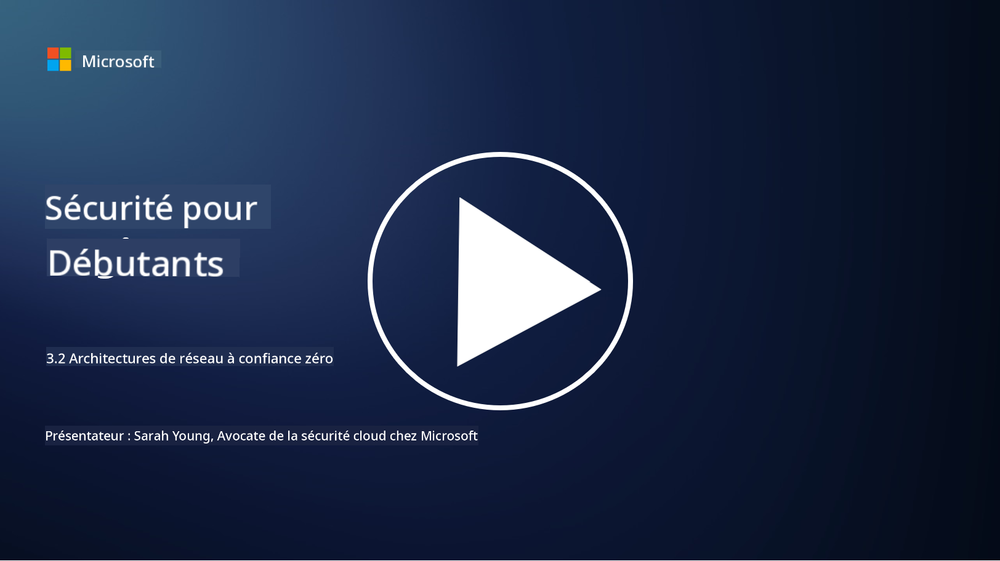

<!--
CO_OP_TRANSLATOR_METADATA:
{
  "original_hash": "680d6e14d9d33fc471c22f44679713f8",
  "translation_date": "2025-09-03T18:38:23+00:00",
  "source_file": "3.2 Networking zero trust architecture.md",
  "language_code": "fr"
}
-->
# Architectures réseau de confiance zéro

Le réseau constitue une couche essentielle dans les contrôles de confiance zéro. Dans cette leçon, nous allons en apprendre davantage sur :

- Qu'est-ce que la segmentation réseau ?  
- Comment la segmentation réseau aide-t-elle à mettre en œuvre la confiance zéro ?  
- Qu'est-ce que le chiffrement de bout en bout ?

## Qu'est-ce que la segmentation réseau ?

La segmentation réseau consiste à diviser un réseau en segments ou sous-réseaux plus petits et isolés. Chaque segment est séparé des autres, et l'accès entre les segments est contrôlé et restreint selon des politiques de sécurité spécifiques. La segmentation réseau est utilisée pour améliorer la sécurité en limitant l'impact des éventuelles violations et en réduisant les mouvements latéraux des attaquants au sein du réseau.

En mettant en œuvre la segmentation réseau, une organisation peut créer des "zones" qui séparent différents types d'utilisateurs, d'applications et de données. Cela réduit la surface d'attaque et minimise les dommages potentiels causés par un incident de sécurité. La segmentation réseau peut être réalisée grâce à des technologies telles que les réseaux locaux virtuels (VLANs), les pare-feu et les contrôles d'accès.

## Comment la segmentation réseau aide-t-elle à mettre en œuvre la confiance zéro ?

La segmentation réseau est étroitement alignée avec les principes du modèle de confiance zéro. Dans une architecture de confiance zéro, la segmentation réseau aide à appliquer le principe du "moindre privilège" en veillant à ce que les utilisateurs et les appareils aient accès uniquement aux ressources et services spécifiques dont ils ont besoin pour accomplir leurs tâches. En segmentant le réseau en zones plus petites, les organisations peuvent mettre en place des contrôles d'accès stricts, isoler les actifs critiques et empêcher les mouvements latéraux des attaquants.

La segmentation réseau contribue également à l'application des contrôles d'accès basés sur l'identité, où les utilisateurs et les appareils sont minutieusement authentifiés et autorisés avant d'accéder à des segments spécifiques. Cela empêche l'accès non autorisé aux ressources sensibles et atténue l'impact potentiel des identifiants compromis.

## Qu'est-ce que le chiffrement de bout en bout ?

Le chiffrement de bout en bout (E2E) est une mesure de sécurité qui garantit que les données restent chiffrées tout au long de leur parcours, du point d'envoi au point de réception. Dans ce processus, les données sont chiffrées à l'origine par l'expéditeur, et seul le destinataire possède la clé de déchiffrement pour les déverrouiller et les lire. Les processus de chiffrement et de déchiffrement se déroulent aux points d'extrémité, rendant extrêmement difficile l'accès aux données en clair par des parties non autorisées, y compris les fournisseurs de services et les intermédiaires.

Le chiffrement de bout en bout offre un niveau élevé de confidentialité et de sécurité pour la transmission des données, même si celles-ci transitent par divers systèmes ou réseaux intermédiaires. Il est couramment utilisé dans les applications de messagerie sécurisée, les services de courrier électronique et d'autres plateformes de communication pour protéger les informations sensibles contre l'interception et l'accès non autorisé.

Cette méthode de chiffrement garantit que, même si des attaquants parviennent à accéder aux données en transit, ils ne verront que du contenu chiffré, inutile sans la clé de déchiffrement. Le chiffrement de bout en bout joue un rôle crucial dans la protection de la vie privée des utilisateurs et la sécurisation des informations sensibles contre toute exposition à des parties non autorisées.

## Qu'est-ce que le SASE ?

SASE signifie "Secure Access Service Edge" (Périmètre de Service d'Accès Sécurisé), et c'est un cadre et une architecture de cybersécurité qui combinent la sécurité réseau et les capacités de réseau étendu (WAN) en un service unique basé sur le cloud. SASE est conçu pour fournir un accès sécurisé et évolutif aux ressources réseau, aux applications et aux données pour les utilisateurs distants et mobiles, tout en simplifiant la gestion du réseau et en réduisant la complexité des architectures réseau et de sécurité traditionnelles.

Les caractéristiques clés et les composants du SASE incluent :

1. **Basé sur le cloud :** SASE est fourni sous forme de service cloud, ce qui signifie que les fonctions de sécurité et de réseau sont proposées depuis le cloud plutôt que de s'appuyer sur des équipements et des appliances sur site.  

2. **Intégration de la sécurité et du réseau :** SASE intègre divers services de sécurité tels que les passerelles web sécurisées (SWG), les pare-feu en tant que service (FWaaS), la prévention des pertes de données (DLP), l'accès réseau de confiance zéro (ZTNA) et l'optimisation WAN avec des capacités de réseau étendu. Cette intégration permet de rationaliser les opérations de sécurité et de réseau.  

3. **Confiance zéro :** SASE fonctionne selon le principe de la confiance zéro, ce qui signifie qu'il applique des contrôles d'accès stricts et des politiques de moindre privilège. Les utilisateurs et les appareils ne sont pas considérés comme fiables par défaut et doivent être authentifiés et autorisés avant d'accéder aux ressources.  

4. **Centré sur l'identité :** SASE met l'accent sur les identités des utilisateurs et des appareils comme base du contrôle d'accès. Des politiques basées sur l'identité et le contexte sont utilisées pour déterminer les permissions d'accès, et ces politiques s'adaptent dynamiquement en fonction du comportement et du contexte des utilisateurs.  

5. **Évolutivité et flexibilité :** SASE peut facilement évoluer pour accueillir un grand nombre d'utilisateurs et d'appareils, ce qui le rend adapté aux organisations ayant des besoins réseau et de sécurité divers et en constante évolution.  

SASE est particulièrement pertinent à l'ère moderne du travail à distance et de l'adoption du cloud, car il offre une approche complète et agile pour sécuriser et gérer l'accès au réseau. Il aide les organisations à s'adapter aux exigences changeantes en matière de sécurité et de réseau tout en maintenant un fort accent sur les modèles de sécurité centrés sur l'utilisateur et la confiance zéro.

## Lectures complémentaires

- [Qu'est-ce que la segmentation réseau ? - Cisco](https://www.cisco.com/c/en/us/products/security/what-is-network-segmentation.html#~benefits)  
- [Qu'est-ce que la micro-segmentation ? - Cisco](https://www.cisco.com/c/en/us/products/security/what-is-microsegmentation.html)  
- [Mettre en œuvre la segmentation et la séparation réseau | Cyber.gov.au](https://www.cyber.gov.au/resources-business-and-government/maintaining-devices-and-systems/system-hardening-and-administration/network-hardening/implementing-network-segmentation-and-segregation)  
- [Qu'est-ce que la segmentation réseau et pourquoi est-ce important | CompTIA](https://www.comptia.org/blog/security-awareness-training-network-segmentation)  
- [Segmentation réseau : concepts et pratiques (cmu.edu)](https://insights.sei.cmu.edu/blog/network-segmentation-concepts-and-practices/)  
- [Sécuriser les réseaux avec la confiance zéro | Microsoft Learn](https://learn.microsoft.com/security/zero-trust/deploy/networks?WT.mc_id=academic-96948-sayoung)  
- [Qu'est-ce que le chiffrement de bout en bout ? | IBM](https://www.ibm.com/topics/end-to-end-encryption)  
- [Qu'est-ce que le chiffrement de bout en bout et pourquoi est-ce important ? (howtogeek.com)](https://www.howtogeek.com/711656/what-is-end-to-end-encryption-and-why-does-it-matter/)  
- [Définition de Secure Access Service Edge (SASE) - Glossaire Gartner Information Technology](https://www.gartner.com/en/information-technology/glossary/secure-access-service-edge-sase)  
- [Qu'est-ce que le Secure Access Service Edge (SASE) ? | Microsoft Security](https://www.microsoft.com/security/business/security-101/what-is-sase?WT.mc_id=academic-96948-sayoung)  

---

**Avertissement** :  
Ce document a été traduit à l'aide du service de traduction automatique [Co-op Translator](https://github.com/Azure/co-op-translator). Bien que nous nous efforcions d'assurer l'exactitude, veuillez noter que les traductions automatisées peuvent contenir des erreurs ou des inexactitudes. Le document original dans sa langue d'origine doit être considéré comme la source faisant autorité. Pour des informations critiques, il est recommandé de recourir à une traduction professionnelle réalisée par un humain. Nous déclinons toute responsabilité en cas de malentendus ou d'interprétations erronées résultant de l'utilisation de cette traduction.