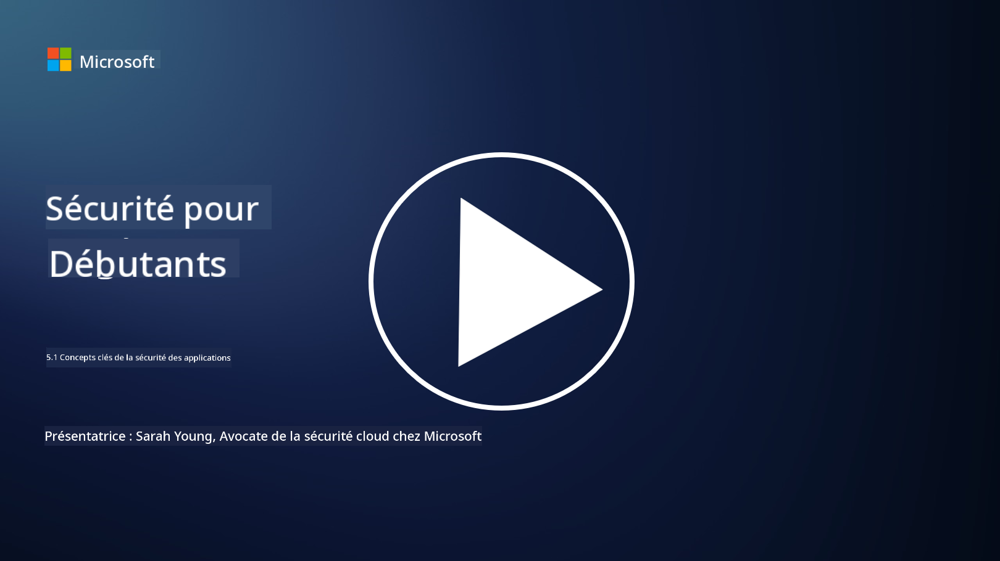

<!--
CO_OP_TRANSLATOR_METADATA:
{
  "original_hash": "e4b56bb23078d3ffb7ad407d280b0c36",
  "translation_date": "2025-09-03T18:36:39+00:00",
  "source_file": "5.1 AppSec key concepts.md",
  "language_code": "fr"
}
-->
# Concepts clés de la sécurité des applications

La sécurité des applications est une spécialisation en matière de sécurité à part entière. Dans cette partie du cours, nous allons approfondir la sécurité des applications.

## Introduction

Dans cette leçon, nous aborderons :

- Qu'est-ce que la sécurité des applications ?

- Quels sont les concepts/principes clés de la sécurité des applications ?

## Qu'est-ce que la sécurité des applications ?

La sécurité des applications, souvent abrégée en "AppSec", désigne la pratique consistant à protéger les applications logicielles contre les menaces, les vulnérabilités et les attaques. Elle englobe les processus, techniques et outils utilisés pour identifier, atténuer et prévenir les risques de sécurité tout au long du cycle de développement, de déploiement et de maintenance d'une application.

La sécurité des applications est essentielle car les applications sont des cibles fréquentes pour les cyberattaques. Les acteurs malveillants exploitent les vulnérabilités et faiblesses des logiciels pour obtenir un accès non autorisé, voler des données, perturber des services ou mener d'autres activités malveillantes. Une sécurité efficace des applications permet de garantir la confidentialité, l'intégrité et la disponibilité d'une application et des données qui y sont associées.

## Quels sont les concepts/principes clés de la sécurité des applications ?

Les concepts et principes fondamentaux qui sous-tendent la sécurité des applications incluent :

1. **Sécurité dès la conception** :

- La sécurité doit être intégrée dans la conception et l'architecture de l'application dès le départ, plutôt que d'être ajoutée après coup.

2. **Validation des entrées** :

- Toutes les entrées utilisateur doivent être validées pour s'assurer qu'elles respectent les formats attendus et qu'elles sont exemptes de code ou de données malveillants.

3. **Encodage des sorties** :

- Les données envoyées au client doivent être correctement encodées pour prévenir les vulnérabilités telles que les scripts intersites (XSS).

4. **Authentification et autorisation** :

- Authentifiez les utilisateurs et autorisez leur accès aux ressources en fonction de leurs rôles et permissions.

5. **Protection des données** :

- Les données sensibles doivent être chiffrées lorsqu'elles sont stockées, transmises et traitées afin d'empêcher tout accès non autorisé.

6. **Gestion des sessions** :

- Une gestion sécurisée des sessions garantit que les sessions utilisateur sont protégées contre le détournement et les accès non autorisés.

7. **Dépendances sécurisées** :

- Maintenez toutes les dépendances logicielles à jour avec les correctifs de sécurité pour éviter les vulnérabilités.

8. **Gestion des erreurs et journalisation** :

- Implémentez une gestion sécurisée des erreurs pour éviter de révéler des informations sensibles et adoptez des pratiques de journalisation sécurisées.

9. **Tests de sécurité** :

- Testez régulièrement les applications pour détecter les vulnérabilités en utilisant des méthodes telles que les tests de pénétration, les revues de code et les outils d'analyse automatisés.

10. **Cycle de vie de développement logiciel sécurisé (SDLC)** :

- Intégrez des pratiques de sécurité à chaque phase du cycle de vie de développement logiciel, des exigences au déploiement et à la maintenance.

## Lectures complémentaires

- [SheHacksPurple : Qu'est-ce que la sécurité des applications ? - YouTube](https://www.youtube.com/watch?v=eNmccQNzSSY)
- [Qu'est-ce que la sécurité des applications ? - Cisco](https://www.cisco.com/c/en/us/solutions/security/application-first-security/what-is-application-security.html#~how-does-it-work)
- [Qu'est-ce que la sécurité des applications ? Un processus et des outils pour sécuriser les logiciels | CSO Online](https://www.csoonline.com/article/566471/what-is-application-security-a-process-and-tools-for-securing-software.html)
- [OWASP Cheat Sheet Series | OWASP Foundation](https://owasp.org/www-project-cheat-sheets/)

---

**Avertissement** :  
Ce document a été traduit à l'aide du service de traduction automatique [Co-op Translator](https://github.com/Azure/co-op-translator). Bien que nous nous efforcions d'assurer l'exactitude, veuillez noter que les traductions automatisées peuvent contenir des erreurs ou des inexactitudes. Le document original dans sa langue d'origine doit être considéré comme la source faisant autorité. Pour des informations critiques, il est recommandé de faire appel à une traduction humaine professionnelle. Nous déclinons toute responsabilité en cas de malentendus ou d'interprétations erronées résultant de l'utilisation de cette traduction.