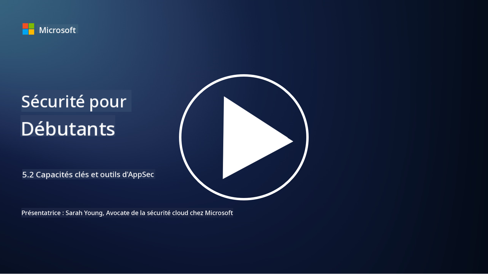

<!--
CO_OP_TRANSLATOR_METADATA:
{
  "original_hash": "790a3fa7e535ec60bb51bde13e759781",
  "translation_date": "2025-09-03T18:41:53+00:00",
  "source_file": "5.2 AppSec key capabilities.md",
  "language_code": "fr"
}
-->
Dans cette section, nous allons explorer en détail les outils et capacités essentiels utilisés dans la sécurité des applications :

## Introduction

Dans cette leçon, nous allons examiner les principales capacités et outils utilisés dans la sécurité des applications.

## Capacités clés et outils de la sécurité des applications

Les capacités et outils clés utilisés dans la sécurité des applications sont essentiels pour identifier, atténuer et prévenir les vulnérabilités et menaces de sécurité dans les logiciels. Voici quelques-uns des plus importants :

**1. Tests de sécurité des applications statiques (SAST)** :

- **Capacités** : Analyse le code source, le bytecode ou le code binaire pour identifier les vulnérabilités de sécurité dans la base de code de l'application.

- **Outils** : Exemples : Fortify, Checkmarx et Veracode.

**2. Tests de sécurité des applications dynamiques (DAST)** :

- **Capacités** : Scanne une application en cours d'exécution pour identifier les vulnérabilités en envoyant des requêtes et en analysant les réponses.

- **Outils** : Exemples : ZAP, Burp Suite et Qualys Web Application Scanning.

**3. Tests de sécurité des applications interactifs (IAST)** :

- **Capacités** : Combine des éléments de SAST et DAST pour analyser le code pendant l'exécution, offrant des résultats plus précis et réduisant les faux positifs.

- **Outils** : Exemples : Contrast Security et HCL AppScan.

**4. Protection des applications en temps réel (RASP)** :

- **Capacités** : Surveille et protège les applications en temps réel, détectant et répondant aux menaces de sécurité au fur et à mesure qu'elles surviennent.

- **Outils** : Exemples : Veracode Runtime Protection et F5 Advanced WAF avec RASP.

**5. Pare-feu pour applications web (WAF)** :

- **Capacités** : Fournit une couche de protection entre l'application et Internet, filtrant le trafic entrant et bloquant les requêtes malveillantes.

- **Outils** : Exemples : ModSecurity, AWS WAF et Akamai Kona Site Defender.

**6. Analyse des dépendances** :

- **Capacités** : Identifie les vulnérabilités dans les bibliothèques et composants tiers utilisés dans l'application.

- **Outils** : Exemples : OWASP Dependency-Check et Snyk.

**7. Tests de pénétration (Pen Testing)** :

- **Capacités** : Simule des attaques réelles pour découvrir les vulnérabilités et évaluer la sécurité d'une application.

- **Outils** : Réalisés par des hackers éthiques certifiés et des professionnels de la sécurité utilisant divers outils comme Metasploit et Nmap.

**8. Analyse et scan de sécurité** :

- **Capacités** : Scanne les vulnérabilités connues, les erreurs de configuration et les mauvaises configurations de sécurité.

- **Outils** : Exemples : Nessus, Qualys Vulnerability Management et OpenVAS.

**9. Outils de sécurité des conteneurs** :

- **Capacités** : Se concentrent sur la sécurisation des applications conteneurisées et de leurs environnements.

- **Outils** : Exemples : Docker Security Scanning et Aqua Security.

**10. Formation au développement sécurisé** :

- **Capacités** : Fournit des programmes de formation et de sensibilisation aux équipes de développement pour encourager les pratiques de codage sécurisé.

- **Outils** : Programmes de formation personnalisés et plateformes.

**11. Cadres de tests de sécurité** :

- **Capacités** : Fournit des cadres de tests complets pour différents besoins en matière de sécurité des applications.

- **Outils** : OWASP Amass, OWASP OWTF et FrAppSec.

**12. Outils de revue de code sécurisé** :

- **Capacités** : Examine le code source pour détecter les vulnérabilités de sécurité et les bonnes pratiques de codage.

- **Outils** : Exemples : SonarQube et Checkmarx.

**13. Outils de sécurité des API et microservices** :

- **Capacités** : Se concentrent sur la sécurisation des API et microservices, y compris l'authentification, l'autorisation et la protection des données.

- **Outils** : Exemples : Apigee, AWS API Gateway et Istio.

## Lectures complémentaires

- [Qu'est-ce que la sécurité des applications ? Concepts, outils et meilleures pratiques | HackerOne](https://www.hackerone.com/knowledge-center/what-application-security-concepts-tools-best-practices)
- [Qu'est-ce que l'IAST ? (Interactive Application Security Testing) (comparitech.com)](https://www.comparitech.com/net-admin/what-is-iast/)
- [10 types d'outils de tests de sécurité des applications : quand et comment les utiliser (cmu.edu)](https://insights.sei.cmu.edu/blog/10-types-of-application-security-testing-tools-when-and-how-to-use-them/)
- [Rééquilibrer les risques de cybersécurité : principes et approches pour une sécurité par conception et par défaut | Cyber.gov.au](https://www.cyber.gov.au/about-us/view-all-content/publications/principles-and-approaches-for-security-by-design-and-default)

---

**Avertissement** :  
Ce document a été traduit à l'aide du service de traduction automatique [Co-op Translator](https://github.com/Azure/co-op-translator). Bien que nous nous efforcions d'assurer l'exactitude, veuillez noter que les traductions automatisées peuvent contenir des erreurs ou des inexactitudes. Le document original dans sa langue d'origine doit être considéré comme la source faisant autorité. Pour des informations critiques, il est recommandé de faire appel à une traduction humaine professionnelle. Nous déclinons toute responsabilité en cas de malentendus ou d'interprétations erronées résultant de l'utilisation de cette traduction.