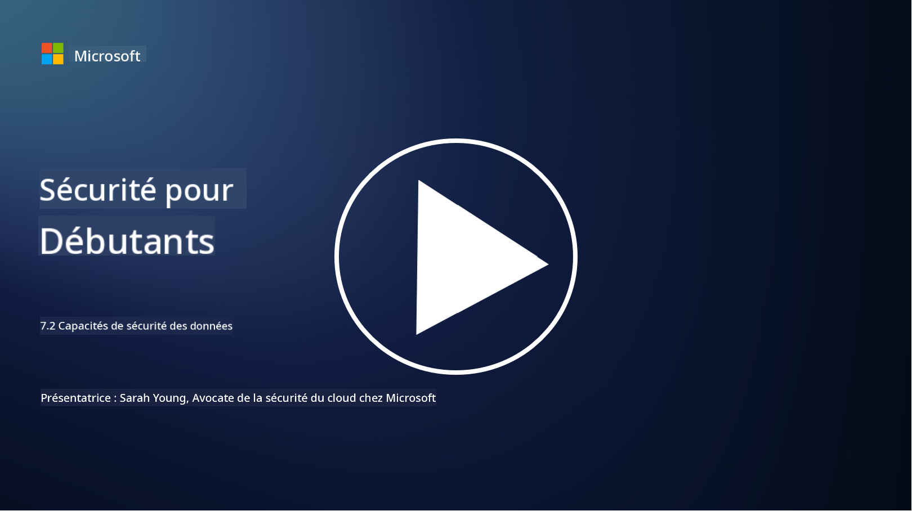

<!--
CO_OP_TRANSLATOR_METADATA:
{
  "original_hash": "50697add9758e54693442d502d2d5f8a",
  "translation_date": "2025-09-03T18:43:17+00:00",
  "source_file": "7.2 Data security capabilities.md",
  "language_code": "fr"
}
-->
# Capacités de sécurité des données

Dans cette section, nous allons examiner en détail les outils et capacités essentiels utilisés pour la sécurité des données :

**Introduction**

Dans cette leçon, nous aborderons :

- Qu'est-ce que les outils de prévention des pertes de données ?

- Qu'est-ce que les outils de gestion des risques internes ?

- Quels outils de conservation des données sont disponibles ?

## Qu'est-ce que les outils de prévention des pertes de données ?

Les outils de prévention des pertes de données (DLP) désignent un ensemble de solutions logicielles et de technologies conçues pour empêcher l'accès non autorisé, le partage ou la fuite de données sensibles ou confidentielles au sein d'une organisation. Ces outils utilisent l'inspection de contenu, l'application de politiques et la surveillance pour identifier et protéger les données sensibles contre toute exposition ou utilisation abusive. Exemples de produits DLP : Symantec Data Loss Prevention, McAfee Total Protection for Data Loss Prevention, Microsoft 365 DLP** : S'intègre aux applications Microsoft 365 pour aider les organisations à identifier et protéger les données sensibles dans les e-mails, documents et messages.

## Qu'est-ce que les outils de gestion des risques internes ?

Les outils de gestion des risques internes aident les organisations à identifier et atténuer les risques posés par les employés, les sous-traitants ou les partenaires qui pourraient compromettre la sécurité des données, intentionnellement ou non. Ces outils surveillent le comportement des utilisateurs, les modèles d'accès et l'utilisation des données pour détecter les activités suspectes et les menaces internes potentielles. Exemples de produits de gestion des risques internes : Microsoft Insider Risk Management (partie de Microsoft 365), Forcepoint Insider Threat Data Protection, Varonis Insider Threat Detection.

## Quels outils de conservation des données sont disponibles ?

Les outils de conservation des données incluent des logiciels et solutions conçus pour gérer la conservation et la suppression des données conformément aux politiques de conservation des données et aux exigences légales d'une organisation. Ces outils automatisent le processus de conservation des données pendant des durées spécifiques et leur suppression sécurisée lorsqu'elles ne sont plus nécessaires. Exemples de produits de conservation des données : Veritas Enterprise Vault, Commvault Complete Data Protection, Microsoft data lifecycle management. Ces solutions aident les organisations à garder le contrôle sur la conservation et l'élimination des données, en assurant la conformité aux réglementations sur la protection des données tout en gérant efficacement les données tout au long de leur cycle de vie.

## Lectures complémentaires

- [Guide de gestion de la posture de sécurité des données (DSPM) | CSA (cloudsecurityalliance.org)](https://cloudsecurityalliance.org/blog/2023/03/31/the-big-guide-to-data-security-posture-management-dspm/)
- [Prévention des pertes de données sur les terminaux, applications et services | Microsoft Purview](https://youtu.be/hvqq8L_0kgI)
- [18 meilleurs outils logiciels de prévention des pertes de données 2023 (Gratuits + Payants) (comparitech.com)](https://www.comparitech.com/data-privacy-management/data-loss-prevention-tools-software/)
- [Prévention des pertes de données (nist.gov)](https://tsapps.nist.gov/publication/get_pdf.cfm?pub_id=904672)
- [En savoir plus sur la gestion des risques internes | Microsoft Learn](https://learn.microsoft.com/purview/insider-risk-management?WT.mc_id=academic-96948-sayoung)
- [Gestion du cycle de vie des données | IBM](https://www.ibm.com/topics/data-lifecycle-management)
- [Qu'est-ce que la gestion du cycle de vie des données (DLM) ? | Meilleures pratiques 2023 (selecthub.com)](https://www.selecthub.com/big-data-analytics/data-lifecycle-management/)

---

**Avertissement** :  
Ce document a été traduit à l'aide du service de traduction automatique [Co-op Translator](https://github.com/Azure/co-op-translator). Bien que nous nous efforcions d'assurer l'exactitude, veuillez noter que les traductions automatisées peuvent contenir des erreurs ou des inexactitudes. Le document original dans sa langue d'origine doit être considéré comme la source faisant autorité. Pour des informations critiques, il est recommandé de faire appel à une traduction humaine professionnelle. Nous déclinons toute responsabilité en cas de malentendus ou d'interprétations erronées résultant de l'utilisation de cette traduction.