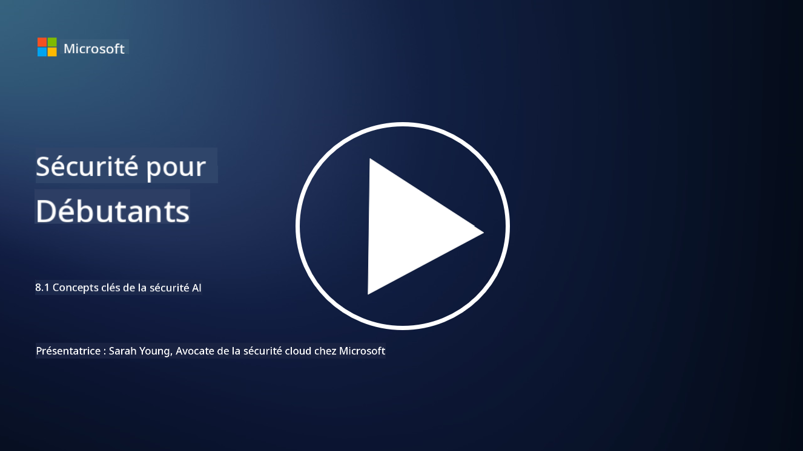

<!--
CO_OP_TRANSLATOR_METADATA:
{
  "original_hash": "66b61d96936cf25d20fcb411d4ce5227",
  "translation_date": "2025-09-03T18:06:53+00:00",
  "source_file": "8.1 AI security key concepts.md",
  "language_code": "fr"
}
-->
# Concepts clés de la sécurité de l'IA

## En quoi la sécurité de l'IA diffère-t-elle de la cybersécurité traditionnelle ?

La sécurisation des systèmes d'IA présente des défis uniques par rapport à la cybersécurité traditionnelle, principalement en raison de la nature des capacités d'apprentissage et des processus de prise de décision de l'IA. Voici quelques différences clés :

-   **Intégrité des données** : Les systèmes d'IA dépendent fortement des données pour apprendre. [Garantir l'intégrité de ces données est essentiel, car les attaquants peuvent manipuler les données pour influencer le comportement de l'IA, une tactique connue sous le nom de "empoisonnement des données".
-   **Sécurité des modèles** : Le modèle de prise de décision de l'IA lui-même peut être une cible. [Les attaquants peuvent tenter de rétroconcevoir le modèle ou exploiter ses faiblesses pour provoquer des décisions incorrectes ou nuisibles.
-   **Attaques adverses** : Les systèmes d'IA peuvent être vulnérables aux attaques adverses, où de légères modifications souvent imperceptibles des données d'entrée peuvent amener l'IA à commettre des erreurs ou à faire des prédictions incorrectes.
-   **Sécurité de l'infrastructure** : Bien que la cybersécurité traditionnelle se concentre également sur la protection de l'infrastructure, les systèmes d'IA peuvent comporter des couches de complexité supplémentaires, telles que des services basés sur le cloud ou du matériel spécialisé, nécessitant des mesures de sécurité spécifiques.
-   **Considérations éthiques** : L'utilisation de l'IA dans la sécurité soulève des questions éthiques, telles que les préoccupations en matière de confidentialité et le risque de biais dans la prise de décision, qui doivent être intégrées dans la stratégie de sécurité.

En somme, sécuriser les systèmes d'IA nécessite une approche différente qui prend en compte les aspects uniques de la technologie de l'IA, notamment la protection des données, des modèles et du processus d'apprentissage de l'IA, tout en abordant les implications éthiques de son déploiement.

La sécurité de l'IA et la cybersécurité traditionnelle partagent de nombreuses similitudes, mais elles présentent également des différences distinctes en raison des caractéristiques et capacités uniques des systèmes d'intelligence artificielle. Voici comment elles diffèrent :

- **Complexité des menaces** : Les systèmes d'IA introduisent de nouvelles couches de complexité dans la cybersécurité. La cybersécurité traditionnelle traite principalement des menaces telles que les logiciels malveillants, les attaques par hameçonnage et les intrusions réseau. Cependant, les systèmes d'IA peuvent être vulnérables à des attaques comme les attaques adverses, l'empoisonnement des données et l'évasion des modèles, qui ciblent spécifiquement les algorithmes d'apprentissage automatique.

- **Surface d'attaque** : Les systèmes d'IA ont souvent des surfaces d'attaque plus larges par rapport aux systèmes traditionnels. Cela s'explique par le fait qu'ils reposent non seulement sur des logiciels, mais aussi sur des données et des modèles. Les attaquants peuvent cibler les données d'entraînement, manipuler les modèles ou exploiter les vulnérabilités des algorithmes eux-mêmes.

- **Adaptabilité des menaces** : Les systèmes d'IA peuvent s'adapter et apprendre de leur environnement, ce qui les rend plus vulnérables aux menaces adaptatives et évolutives. Les mesures de cybersécurité traditionnelles peuvent ne pas suffire à défendre contre des attaques qui évoluent constamment en fonction du comportement du système d'IA.

- **Interprétabilité et explicabilité** : Comprendre pourquoi un système d'IA a pris une décision particulière est souvent plus difficile par rapport aux systèmes logiciels traditionnels. Ce manque d'interprétabilité et d'explicabilité peut compliquer la détection et la mitigation des attaques contre les systèmes d'IA.

- **Préoccupations en matière de confidentialité des données** : Les systèmes d'IA reposent souvent sur de grandes quantités de données, ce qui peut introduire des risques de confidentialité si elles ne sont pas correctement gérées. Les mesures de cybersécurité traditionnelles peuvent ne pas répondre adéquatement à ces préoccupations spécifiques aux systèmes d'IA.

- **Conformité réglementaire** : Le paysage réglementaire de la sécurité de l'IA est encore en évolution, avec des réglementations et normes spécifiques émergentes pour répondre aux défis uniques posés par les systèmes d'IA. Les cadres de cybersécurité traditionnels peuvent devoir être étendus ou adaptés pour garantir la conformité à ces nouvelles réglementations.

- **Considérations éthiques** : La sécurité de l'IA implique non seulement de protéger les systèmes contre les attaques malveillantes, mais aussi de garantir que les systèmes d'IA sont utilisés de manière éthique et responsable. Cela inclut des considérations telles que l'équité, la transparence et la responsabilité, qui peuvent ne pas être aussi présentes dans la cybersécurité traditionnelle.

## En quoi la sécurité de l'IA est-elle similaire à celle des systèmes informatiques traditionnels ?

La sécurisation des systèmes d'IA partage plusieurs principes fondamentaux avec la cybersécurité traditionnelle :

-   **Protection contre les menaces** : Les systèmes d'IA et traditionnels doivent être protégés contre l'accès non autorisé, la modification des données et leur destruction, ainsi que contre d'autres menaces courantes.
-   **Gestion des vulnérabilités** : De nombreuses vulnérabilités qui affectent les systèmes traditionnels, telles que les bugs logiciels ou les mauvaises configurations, peuvent également impacter les systèmes d'IA.
-   **Sécurité des données** : La protection des données traitées est cruciale dans les deux domaines pour prévenir les violations de données et garantir la confidentialité.
-   **Sécurité de la chaîne d'approvisionnement** : Les deux types de systèmes sont vulnérables aux attaques sur la chaîne d'approvisionnement, où un composant compromis peut compromettre la sécurité de l'ensemble du système.

Ces similitudes montrent que, bien que les systèmes d'IA introduisent de nouveaux défis en matière de sécurité, ils nécessitent également l'application des pratiques de cybersécurité établies pour garantir une protection robuste. C'est un mélange entre l'utilisation des connaissances traditionnelles en matière de sécurité et l'adaptation aux aspects uniques de la technologie de l'IA.

## Lectures complémentaires

- [Not with a Bug, But with a Sticker [Book] (oreilly.com)](https://www.oreilly.com/library/view/not-with-a/9781119883982/)
   
- [Intro to AI Security Part 1: AI Security 101 | by HarrietHacks | Medium](https://medium.com/@harrietfarlow/intro-to-ai-security-part-1-ai-security-101-b8662a9efe5)
   
- [Best practices for AI security risk management | Microsoft Security Blog](https://www.microsoft.com/en-us/security/blog/2021/12/09/best-practices-for-ai-security-risk-management/?WT.mc_id=academic-96948-sayoung)
   
- [OWASP AI Security and Privacy Guide | OWASP Foundation](https://owasp.org/www-project-ai-security-and-privacy-guide/)

---

**Avertissement** :  
Ce document a été traduit à l'aide du service de traduction automatique [Co-op Translator](https://github.com/Azure/co-op-translator). Bien que nous nous efforcions d'assurer l'exactitude, veuillez noter que les traductions automatisées peuvent contenir des erreurs ou des inexactitudes. Le document original dans sa langue d'origine doit être considéré comme la source faisant autorité. Pour des informations critiques, il est recommandé de recourir à une traduction professionnelle réalisée par un humain. Nous déclinons toute responsabilité en cas de malentendus ou d'interprétations erronées résultant de l'utilisation de cette traduction.