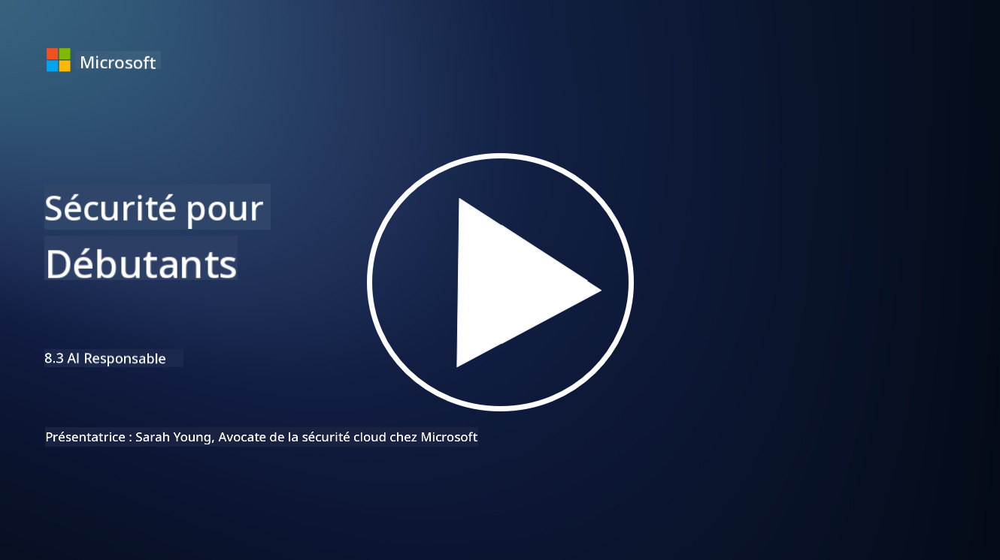

<!--
CO_OP_TRANSLATOR_METADATA:
{
  "original_hash": "5e9775ee91bde7d44577891d5f11c4c5",
  "translation_date": "2025-09-03T18:29:09+00:00",
  "source_file": "8.3 Responsible AI.md",
  "language_code": "fr"
}
-->
# IA Responsable

## Qu'est-ce que l'IA responsable et quel est son lien avec la sécurité de l'IA ?

L'IA responsable désigne le développement et l'utilisation de l'intelligence artificielle de manière éthique, transparente et en accord avec les valeurs sociétales. Elle englobe des principes tels que l'équité, la responsabilité et la robustesse, garantissant que les systèmes d'IA sont conçus et exploités pour bénéficier aux individus, aux communautés et à la société dans son ensemble.

La relation entre l'IA responsable et la sécurité de l'IA est importante car :

-   **Considérations éthiques** : L'IA responsable implique des considérations éthiques qui ont un impact direct sur la sécurité, comme la protection de la vie privée et des données. Garantir que les systèmes d'IA respectent la vie privée des utilisateurs et sécurisent les données personnelles est un aspect clé de l'IA responsable.
-   **Robustesse et fiabilité** : Les systèmes d'IA doivent être robustes face aux manipulations et aux attaques, ce qui est un principe fondamental de l'IA responsable et de la sécurité de l'IA. Cela inclut la protection contre les attaques adverses et la garantie de l'intégrité des processus décisionnels de l'IA.
-   **Transparence et explicabilité** : Une partie de l'IA responsable consiste à s'assurer que les systèmes d'IA sont transparents et que leurs décisions peuvent être expliquées. Cela est crucial pour la sécurité, car les parties prenantes doivent comprendre le fonctionnement des systèmes d'IA pour faire confiance à leurs mesures de sécurité.
-   **Responsabilité** : Les systèmes d'IA doivent être responsables de leurs actions, ce qui signifie qu'il doit exister des mécanismes permettant de tracer les décisions et de corriger les problèmes. Cela s'aligne sur les pratiques de sécurité qui surveillent et auditent les activités des systèmes pour prévenir et répondre aux violations.

En somme, l'IA responsable et la sécurité de l'IA sont étroitement liées, les pratiques d'IA responsable renforçant la sécurité des systèmes d'IA et vice versa. La mise en œuvre des principes d'IA responsable contribue à créer des systèmes d'IA à la fois éthiques et mieux protégés contre les menaces potentielles.

## Comment puis-je garantir que mon système d'IA est à la fois sécurisé et éthique ?

Garantir que votre système d'IA est à la fois sécurisé et éthique nécessite une approche multifacette comprenant les étapes suivantes :

- **Respecter les principes éthiques** : Suivez des lignes directrices éthiques établies qui mettent l'accent sur le bien-être humain, sociétal et environnemental ; l'équité ; la protection de la vie privée ; la fiabilité ; la transparence ; la contestabilité ; et la responsabilité.

- **Mettre en œuvre des mesures de sécurité robustes** : Utilisez des tests de sécurité proactifs et des programmes de gestion de la confiance, des risques et de la sécurité de l'IA pour vous protéger contre les menaces et les vulnérabilités.

- **Impliquer des parties prenantes diverses** : Faites participer un large éventail d'intervenants dans le processus de développement de l'IA, y compris des éthiciens, des sociologues et des représentants des communautés concernées, afin de prendre en compte des perspectives et des valeurs variées.

- **Assurer la transparence et l'explicabilité** : Veillez à ce que les processus décisionnels de l'IA soient transparents et explicables, permettant ainsi une plus grande confiance et une identification plus facile des biais ou erreurs potentiels.

- **Protéger la vie privée des données** : Préservez la confidentialité et l'authenticité des données grâce au chiffrement et à d'autres mesures de protection des données pour respecter les droits à la vie privée des utilisateurs.

- **Permettre une supervision humaine** : Mettez en place des mécanismes de supervision humaine pour permettre la contestation des décisions prises par les systèmes d'IA et garantir la responsabilité.

- **Rester informé sur la sécurité de l'IA** : Suivez les dernières recherches et discussions sur la sécurité de l'IA pour comprendre l'évolution du paysage de la sécurité et de l'éthique de l'IA.

- **Respecter les réglementations** : Assurez-vous que votre système d'IA est conforme à toutes les lois et réglementations pertinentes, notamment les lois sur la protection des données, les lois anti-discrimination et les directives spécifiques à l'industrie.

## Pouvez-vous me donner des exemples de problèmes de sécurité causés par une utilisation non éthique de l'IA ?

Voici quelques exemples de problèmes de sécurité pouvant découler d'une utilisation non éthique de l'IA :

- **Décisions biaisées** : Les systèmes d'IA peuvent perpétuer et amplifier des biais existants s'ils sont entraînés sur des ensembles de données biaisés. Par exemple, si un moteur de recherche est entraîné sur des données reflétant des stéréotypes sociétaux, il peut afficher des résultats de recherche biaisés, entraînant un traitement injuste ou une discrimination.

- **IA dans les systèmes judiciaires** : L'utilisation de l'IA dans la prise de décisions juridiques peut soulever des préoccupations éthiques, en particulier si le processus décisionnel de l'IA manque de transparence ou est influencé par des données biaisées. Cela pourrait entraîner des résultats juridiques injustes et porter atteinte aux droits des individus.

- **Manipulation des systèmes d'IA** : Les systèmes d'IA peuvent être vulnérables aux attaques adverses, où de légères modifications des données d'entrée peuvent entraîner des résultats incorrects. Par exemple, des véhicules autonomes pourraient être induits en erreur pour mal interpréter des panneaux de signalisation, ce qui poserait des risques pour la sécurité.

- **Surveillance alimentée par l'IA** : Le déploiement de l'IA à des fins de surveillance peut entraîner des violations de la vie privée, notamment si elle est utilisée sans consentement ou de manière à porter atteinte aux libertés individuelles. Cela peut être particulièrement problématique dans les régimes autoritaires qui pourraient utiliser l'IA pour surveiller et réprimer la dissidence.

Ces exemples soulignent l'importance des considérations éthiques dans le développement et le déploiement des systèmes d'IA afin de prévenir les problèmes de sécurité et de protéger les droits et la vie privée des individus.

## Lectures complémentaires

 - [Microsoft Responsible AI Standard v2 General Requirements](https://query.prod.cms.rt.microsoft.com/cms/api/am/binary/RE5cmFl?culture=en-us&country=us&WT.mc_id=academic-96948-sayoung)
 - [Responsible AI (mit.edu)](https://sloanreview.mit.edu/big-ideas/responsible-ai/)
 - [13 Principles for Using AI Responsibly (hbr.org)](https://hbr.org/2023/06/13-principles-for-using-ai-responsibly)

---

**Avertissement** :  
Ce document a été traduit à l'aide du service de traduction automatique [Co-op Translator](https://github.com/Azure/co-op-translator). Bien que nous nous efforcions d'assurer l'exactitude, veuillez noter que les traductions automatisées peuvent contenir des erreurs ou des inexactitudes. Le document original dans sa langue d'origine doit être considéré comme la source faisant autorité. Pour des informations critiques, il est recommandé de recourir à une traduction professionnelle réalisée par un humain. Nous déclinons toute responsabilité en cas de malentendus ou d'interprétations erronées résultant de l'utilisation de cette traduction.