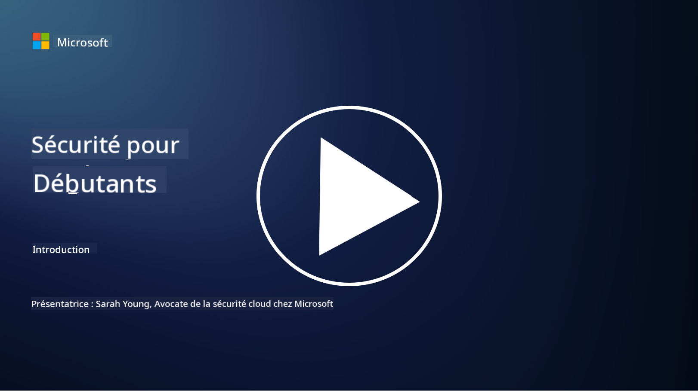

<!--
CO_OP_TRANSLATOR_METADATA:
{
  "original_hash": "fc3d47b5af0cc4fc954ae5d2ea2f7811",
  "translation_date": "2025-10-24T08:52:35+00:00",
  "source_file": "README.md",
  "language_code": "fr"
}
-->
  
  
  
  
  
  

### 🌐 Support multilingue

#### Pris en charge via GitHub Action (Automatisé et toujours à jour)

<!-- TABLEAU DES LANGUES DU TRADUCTEUR CO-OP START -->
[Arabe](../ar/README.md) | [Bengali](../bn/README.md) | [Bulgare](../bg/README.md) | [Birman (Myanmar)](../my/README.md) | [Chinois (Simplifié)](../zh/README.md) | [Chinois (Traditionnel, Hong Kong)](../hk/README.md) | [Chinois (Traditionnel, Macao)](../mo/README.md) | [Chinois (Traditionnel, Taïwan)](../tw/README.md) | [Croate](../hr/README.md) | [Tchèque](../cs/README.md) | [Danois](../da/README.md) | [Néerlandais](../nl/README.md) | [Estonien](../et/README.md) | [Finnois](../fi/README.md) | [Français](./README.md) | [Allemand](../de/README.md) | [Grec](../el/README.md) | [Hébreu](../he/README.md) | [Hindi](../hi/README.md) | [Hongrois](../hu/README.md) | [Indonésien](../id/README.md) | [Italien](../it/README.md) | [Japonais](../ja/README.md) | [Coréen](../ko/README.md) | [Lituanien](../lt/README.md) | [Malais](../ms/README.md) | [Marathi](../mr/README.md) | [Népalais](../ne/README.md) | [Norvégien](../no/README.md) | [Persan (Farsi)](../fa/README.md) | [Polonais](../pl/README.md) | [Portugais (Brésil)](../br/README.md) | [Portugais (Portugal)](../pt/README.md) | [Punjabi (Gurmukhi)](../pa/README.md) | [Roumain](../ro/README.md) | [Russe](../ru/README.md) | [Serbe (Cyrillique)](../sr/README.md) | [Slovaque](../sk/README.md) | [Slovène](../sl/README.md) | [Espagnol](../es/README.md) | [Swahili](../sw/README.md) | [Suédois](../sv/README.md) | [Tagalog (Filipino)](../tl/README.md) | [Tamoul](../ta/README.md) | [Thaï](../th/README.md) | [Turc](../tr/README.md) | [Ukrainien](../uk/README.md) | [Ourdou](../ur/README.md) | [Vietnamien](../vi/README.md)  
<!-- TABLEAU DES LANGUES DU TRADUCTEUR CO-OP END -->

**Si vous souhaitez ajouter des langues supplémentaires, les langues prises en charge sont listées [ici](https://github.com/Azure/co-op-translator/blob/main/getting_started/supported-languages.md)**

#### Rejoignez notre communauté  

# 🚀 Cybersécurité pour débutants – un programme

Dans cette ère de changement rapide et d'adoption des technologies d'IA, il est encore plus crucial de comprendre comment sécuriser les systèmes informatiques. Ce cours est conçu pour vous enseigner les concepts fondamentaux de la cybersécurité afin de démarrer votre apprentissage en sécurité. Il est indépendant des fournisseurs et divisé en petites leçons qui devraient prendre environ 30 à 60 minutes chacune. Chaque leçon comprend un petit quiz et des liens pour approfondir le sujet si vous le souhaitez.

Ce que ce cours couvre 📚

- 🔐 Concepts de base en cybersécurité tels que la triade CIA, les différences entre les risques, les menaces, etc.
- 🛡️ Comprendre ce qu'est un contrôle de sécurité et sous quelles formes il peut se présenter.
- 🌐 Comprendre ce qu'est le zéro confiance et pourquoi cela est important dans la cybersécurité moderne.
- 🔑 Comprendre les concepts et thèmes clés liés à l'identité, au réseau, aux opérations de sécurité, à l'infrastructure et à la sécurité des données.
- 🔧 Donner des exemples d'outils utilisés pour mettre en œuvre des contrôles de sécurité.

Ce que ce cours ne couvre pas 🙅‍♂️

- 🚫 Comment utiliser des outils de sécurité spécifiques.
- 🚫 Comment "pirater" ou faire du red teaming/sécurité offensive.
- 🚫 Apprendre des normes de conformité spécifiques.

Une fois ce cours terminé, vous pouvez passer à certains de nos modules Microsoft Learn. Nous vous recommandons de poursuivre votre apprentissage avec [Microsoft Security, Compliance, and Identity Fundamentals.](https://learn.microsoft.com/training/paths/describe-concepts-of-security-compliance-identity/?WT.mc_id=academic-96948-sayoung)  

En fin de compte, vous pourriez envisager de passer l'examen [SC-900: Microsoft Security, Compliance, and Identity Fundamentals.](https://learn.microsoft.com/credentials/certifications/exams/sc-900/?WT.mc_id=academic-96948-sayoung)  

> 💁 Si vous avez des commentaires ou des suggestions sur ce cours ou sur tout contenu manquant, nous serions ravis de vous entendre !

## Aperçu des modules 📝  
| **Numéro du module** | **Nom du module**                       | **Concepts enseignés**               | **Objectifs d'apprentissage**                                                                                   |
|-----------------------|-----------------------------------------|---------------------------------------|-----------------------------------------------------------------------------------------------------------------|
| **1.1**               | Concepts de sécurité de base           | [La triade CIA](https://github.com/microsoft/Security-101/blob/main/1.1%20The%20CIA%20triad%20and%20other%20key%20concepts.md)                        | Apprenez la confidentialité, la disponibilité et l'intégrité. Aussi l'authenticité, la non-répudiation et la vie privée. |
| **1.2**               | Concepts de sécurité de base           | [Menaces courantes en cybersécurité](https://github.com/microsoft/Security-101/blob/main/1.2%20Common%20cybersecurity%20threats.md)        | Apprenez les menaces courantes en cybersécurité auxquelles font face les individus et les organisations.        |
| **1.3**               | Concepts de sécurité de base           | [Comprendre la gestion des risques](https://github.com/microsoft/Security-101/blob/main/1.3%20Understanding%20risk%20management.md)       | Apprenez à évaluer et comprendre les risques – impact/probabilité et mise en œuvre des contrôles.                                                                                                               | |
| **1.4**               | Concepts de sécurité de base           | [Pratiques et documentation de sécurité](https://github.com/microsoft/Security-101/blob/main/1.4%20Security%20practices%20and%20documentation.md) | Apprenez la différence entre les politiques, les procédures, les normes et les réglementations/lois.           |
| **1.5**               | Concepts de sécurité de base           | [Zéro confiance](https://github.com/microsoft/Security-101/blob/main/1.5%20Zero%20trust.md)                           | Apprenez ce qu'est le zéro confiance et comment cela affecte l'architecture. Qu'est-ce que la défense en profondeur ? |
| **1.6**               | Concepts de sécurité de base           | [Le modèle de responsabilité partagée](https://github.com/microsoft/Security-101/blob/main/1.6%20Shared%20responsibility%20model.md)                           | Qu'est-ce que le modèle de responsabilité partagée et comment cela affecte la cybersécurité ?                  |
| **1.7**               | [Quiz de fin de module](https://github.com/microsoft/Security-101/blob/main/1.7%20End%20of%20module%20quiz.md)                        |                                       |                                                                                                                 |
| **2.1**               | Fondamentaux de la gestion des identités et des accès | [Concepts clés IAM](https://github.com/microsoft/Security-101/blob/main/2.1%20IAM%20key%20concepts.md)                     | Apprenez le principe du moindre privilège, la séparation des tâches, comment IAM soutient le zéro confiance.   |
| **2.2**               | Fondamentaux de la gestion des identités et des accès | [Architecture IAM zéro confiance](https://github.com/microsoft/Security-101/blob/main/2.2%20IAM%20zero%20trust%20architecture.md)          | Apprenez comment l'identité est le nouveau périmètre pour les environnements informatiques modernes et les menaces qu'elle atténue. |
| **2.3**               | Fondamentaux de la gestion des identités et des accès | [Capacités IAM](https://github.com/microsoft/Security-101/blob/main/2.3%20IAM%20capabilities.md)                     | Apprenez les capacités et les contrôles IAM pour sécuriser les identités.                                       |
| **2.4**               | [Quiz de fin de module](https://github.com/microsoft/Security-101/blob/main/2.4%20End%20of%20module%20quiz.md)                        |                                       |                                                                                                                 |
| **3.1**               | Fondamentaux de la sécurité réseau     | [Concepts clés du réseau](https://github.com/microsoft/Security-101/blob/main/3.1%20Networking%20key%20concepts.md)              | Apprenez les concepts de réseau (adresses IP, numéros de port, cryptage, etc.).                                 |
| **3.2**               | Fondamentaux de la sécurité réseau     | [Architecture réseau zéro confiance](https://github.com/microsoft/Security-101/blob/main/3.2%20Networking%20zero%20trust%20architecture.md)   | Apprenez comment le réseau contribue à une architecture E2E ZT et les menaces qu'il atténue.                   |
| **3.3**               | Fondamentaux de la sécurité réseau     | [Capacités de sécurité réseau](https://github.com/microsoft/Security-101/blob/main/3.3%20Network%20security%20capabilities.md)        | Apprenez les outils de sécurité réseau – pare-feu, WAF, protection DDoS, etc.                                  |
| **3.4**               | [Quiz de fin de module](https://github.com/microsoft/Security-101/blob/main/3.4%20End%20of%20module%20quiz.md)                        |                                       |                                                                                                                 |
| **4.1**               | Fondamentaux des opérations de sécurité | [Concepts clés SecOps](https://github.com/microsoft/Security-101/blob/main/4.1%20SecOps%20key%20concepts.md)                  | Apprenez pourquoi les opérations de sécurité sont importantes et comment elles diffèrent des équipes IT classiques. |
| **4.2**               | Fondamentaux des opérations de sécurité | [Architecture SecOps zéro confiance](https://github.com/microsoft/Security-101/blob/main/4.2%20SecOps%20zero%20trust%20architecture.md)       | Apprenez comment SecOps contribue à une architecture E2E ZT et les menaces qu'il atténue.                      |
| **4.3**               | Fondamentaux des opérations de sécurité | [Capacités SecOps](https://github.com/microsoft/Security-101/blob/main/4.3%20SecOps%20capabilities.md)                  | Apprenez les outils SecOps – SIEM, XDR, etc.                                                                    |
| **4.4**               | [Quiz de fin de module](https://github.com/microsoft/Security-101/blob/main/4.4%20End%20of%20module%20quiz.md)                        |                                       |                                                                                                                 |
| **5.1**               | Fondamentaux de la sécurité des applications | [Concepts clés AppSec](https://github.com/microsoft/Security-101/blob/main/5.1%20AppSec%20key%20concepts.md)                  | Apprenez les concepts AppSec tels que la sécurité par conception, la validation des entrées, etc.              |
| **5.2**           | Fondamentaux de la sécurité des applications         | [Capacités AppSec](https://github.com/microsoft/Security-101/blob/main/5.2%20AppSec%20key%20capabilities.md)                  | Découvrez les outils AppSec : outils de sécurité pour pipelines, analyse de code, analyse des secrets, etc.                       |
| **5.3**           | [Quiz de fin de module](https://github.com/microsoft/Security-101/blob/main/5.3%20End%20of%20module%20quiz.md)                        |                                      |                                                                                                                 |
| **6.1**           | Fondamentaux de la sécurité des infrastructures      | [Concepts clés de la sécurité des infrastructures](https://github.com/microsoft/Security-101/blob/main/6.1%20Infrastructure%20security%20key%20concepts.md) | Découvrez le renforcement des systèmes, les mises à jour, l'hygiène de sécurité, la sécurité des conteneurs.                                  |
| **6.2**           | Fondamentaux de la sécurité des infrastructures      | [Capacités de sécurité des infrastructures](https://github.com/microsoft/Security-101/blob/main/6.2%20Infrastructure%20security%20capabilities.md) | Découvrez les outils qui peuvent aider à sécuriser les infrastructures, par exemple CSPM, sécurité des conteneurs, etc.            |
| **6.3**           | [Quiz de fin de module](https://github.com/microsoft/Security-101/blob/main/6.3%20End%20of%20module%20quiz.md)                        |                                      |                                                                                                                 |
| **7.1**           | Fondamentaux de la sécurité des données                | [Concepts clés de la sécurité des données](https://github.com/microsoft/Security-101/blob/main/7.1%20Data%20security%20key%20concepts.md)           | Découvrez la classification et la conservation des données, et pourquoi cela est important pour une organisation.                     |
| **7.2**           | Fondamentaux de la sécurité des données                | [Capacités de sécurité des données](https://github.com/microsoft/Security-101/blob/main/7.2%20Data%20security%20capabilities.md)           | Découvrez les outils de sécurité des données – DLP, gestion des risques internes, gouvernance des données, etc.                          |
| **7.3**           | [Quiz de fin de module](https://github.com/microsoft/Security-101/blob/main/7.3%20End%20of%20module%20quiz.md)                        |
| **8.1**           | Fondamentaux de la sécurité de l'IA                | [Concepts clés de la sécurité de l'IA](https://github.com/microsoft/Security-101/blob/main/8.1%20AI%20security%20key%20concepts.md)          | Découvrez les différences et similitudes entre la sécurité traditionnelle et la sécurité de l'IA.                 |
| **8.2**           | Fondamentaux de la sécurité de l'IA                | [Capacités de sécurité de l'IA](https://github.com/microsoft/Security-101/blob/main/8.2%20AI%20security%20capabilities.md)           | Découvrez les outils de sécurité de l'IA et les contrôles qui peuvent être utilisés pour sécuriser l'IA.                         |
| **8.3**           | Fondamentaux de la sécurité de l'IA                | [IA responsable](https://github.com/microsoft/Security-101/blob/main/8.3%20Responsible%20AI.md)          | Découvrez ce qu'est une IA responsable et les dommages spécifiques à l'IA que les professionnels de la sécurité doivent connaître.                          |
| **8.4**           | [Quiz de fin de module](https://github.com/microsoft/Security-101/blob/main/8.4%20End%20of%20module%20quiz.md)     

## 🎒 Autres cours 

Notre équipe propose d'autres cours ! Découvrez :

<!-- CO-OP TRANSLATOR OTHER COURSES START -->
### Azure / Edge / MCP / Agents

---
 
### Série IA générative

[-9333EA?style=for-the-badge&labelColor=E5E7EB&color=9333EA)](https://github.com/microsoft/Generative-AI-for-beginners-dotnet?WT.mc_id=academic-105485-koreyst)
[-C084FC?style=for-the-badge&labelColor=E5E7EB&color=C084FC)](https://github.com/microsoft/generative-ai-for-beginners-java?WT.mc_id=academic-105485-koreyst)
[-E879F9?style=for-the-badge&labelColor=E5E7EB&color=E879F9)](https://github.com/microsoft/generative-ai-with-javascript?WT.mc_id=academic-105485-koreyst)

---
 
### Apprentissage de base

---
 
### Série Copilot

<!-- CO-OP TRANSLATOR OTHER COURSES END -->

## Obtenir de l'aide

Si vous êtes bloqué ou avez des questions sur la création d'applications IA, rejoignez :

Si vous avez des retours sur les produits ou des erreurs lors de la création, visitez :

---

**Avertissement** :  
Ce document a été traduit à l'aide du service de traduction automatique [Co-op Translator](https://github.com/Azure/co-op-translator). Bien que nous nous efforcions d'assurer l'exactitude, veuillez noter que les traductions automatisées peuvent contenir des erreurs ou des inexactitudes. Le document original dans sa langue d'origine doit être considéré comme la source faisant autorité. Pour des informations critiques, il est recommandé de recourir à une traduction humaine professionnelle. Nous ne sommes pas responsables des malentendus ou des interprétations erronées résultant de l'utilisation de cette traduction.