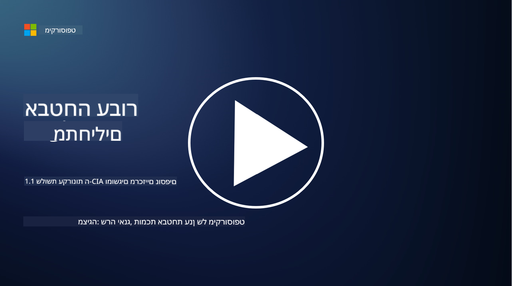
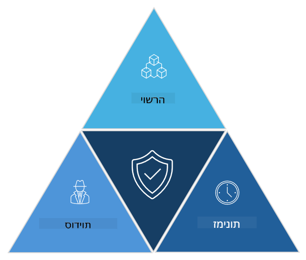

<!--
CO_OP_TRANSLATOR_METADATA:
{
  "original_hash": "16a76f9fa372fb63cffb6d76b855f023",
  "translation_date": "2025-09-03T21:40:14+00:00",
  "source_file": "1.1 The CIA triad and other key concepts.md",
  "language_code": "he"
}
-->
# שלושת העקרונות של ה-CIA ומושגים חשובים נוספים

## הקדמה

בשיעור הזה נדבר על:

- מהי אבטחת סייבר?

- מהו מודל ה-CIA באבטחת סייבר?

- מהם אותנטיות, אי-הכחשה ופרטיות בהקשר של אבטחת סייבר?

## מהי אבטחת סייבר?

אבטחת סייבר, הידועה גם כאבטחת מידע, היא הפרקטיקה של הגנה על מערכות מחשב, רשתות, מכשירים ונתונים מפני התקפות דיגיטליות, גישה לא מורשית, נזק או גניבה. המטרה העיקרית של אבטחת סייבר היא להבטיח את הסודיות, השלמות והזמינות של נכסים ומידע דיגיטליים. אנשי מקצוע בתחום אבטחת סייבר מתכננים ומיישמים אמצעי הגנה כדי להגן על נכסים, נתונים ומידע. ככל שיותר ויותר מהחיים שלנו הפכו לדיגיטליים ומקוונים, אבטחת סייבר הפכה לדאגה מרכזית עבור אנשים פרטיים וארגונים כאחד.

## מהו מודל ה-CIA באבטחת סייבר?

מודל ה-CIA מתייחס למודל שמאגד את שלושת השיקולים המרכזיים בכל עבודה בתחום אבטחת סייבר או בתכנון מערכת/סביבה:

### סודיות

זהו השיקול שרוב האנשים מכירים כאשר הם חושבים על "אבטחת סייבר": סודיות היא התהליך של הגנה על נתונים ומידע מפני ניסיונות גישה לא מורשית, כלומר רק אנשים שצריכים לראות את המידע יכולים לגשת אליו. לא כל הנתונים שווים בערכם, ונתונים בדרך כלל מסווגים ומוגנים בהתאם לנזק שיכול להיגרם אם הם יגיעו לידיים הלא נכונות.

### שלמות

מתייחסת להגנה על דיוק ואמינות הנתונים בסביבות מסוימות ולמניעת שינוי או תיקון הנתונים על ידי אנשים לא מורשים. לדוגמה, סטודנט משנה את תאריך הלידה שלו ברישום הנהיגה במשרד הרישוי כדי להיראות מבוגר יותר וכך להדפיס מחדש את רישיון הנהיגה עם תאריך לידה מוקדם יותר כדי לקנות אלכוהול.

### זמינות

זהו שיקול חשוב בכל תחום ה-IT התפעולי, אך זמינות חשובה גם באבטחת סייבר. ישנם סוגים ספציפיים של התקפות שמטרתן לפגוע בזמינות, ואנשי אבטחת מידע חייבים להגן מפניהן (לדוגמה, התקפות מניעת שירות מבוזרות – DDoS).

**מודל ה-CIA באבטחת סייבר**

## מהם אותנטיות, אי-הכחשה ופרטיות בהקשר של אבטחת סייבר?

אלו מושגים חשובים נוספים שקשורים להבטחת האמינות והבטיחות של מערכות ונתונים:

**אותנטיות** - מתייחסת להבטחה שהמידע, התקשורת או הגורם שאיתו אתם מתקשרים הם אמיתיים ולא שונו או הושפעו על ידי גורמים לא מורשים.

**אי-הכחשה** - הוא מושג שמבטיח שצד מסוים לא יוכל להכחיש את מעורבותו או את האותנטיות של פעולה או תקשורת. זה מונע ממישהו לטעון שהוא לא שלח הודעה או לא ביצע פעולה מסוימת כאשר יש ראיות שמוכיחות אחרת.

**פרטיות** - מתייחסת להגנה על מידע רגיש ומזהה אישי מפני גישה, שימוש, חשיפה או שינוי לא מורשים. היא כוללת שליטה על מי יכול לגשת לנתונים אישיים וכיצד הנתונים הללו נאספים, נשמרים ומשותפים.

## קריאה נוספת

[What Is Information Security (InfoSec)? | Microsoft Security](https://www.microsoft.com/security/business/security-101/what-is-information-security-infosec#:~:text=Three%20pillars%20of%20information%20security%3A%20the%20CIA%20triad,as%20guiding%20principles%20for%20implementing%20an%20InfoSec%20plan.)

---

**כתב ויתור**:  
מסמך זה תורגם באמצעות שירות תרגום מבוסס בינה מלאכותית [Co-op Translator](https://github.com/Azure/co-op-translator). למרות שאנו שואפים לדיוק, יש לקחת בחשבון שתרגומים אוטומטיים עשויים להכיל שגיאות או אי דיוקים. המסמך המקורי בשפתו המקורית צריך להיחשב כמקור הסמכותי. עבור מידע קריטי, מומלץ להשתמש בתרגום מקצועי על ידי אדם. איננו נושאים באחריות לאי הבנות או לפרשנויות שגויות הנובעות משימוש בתרגום זה.