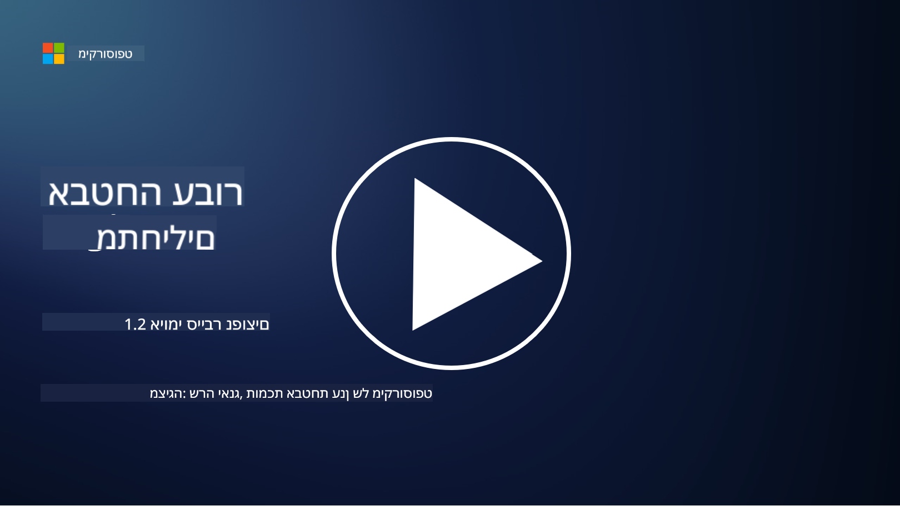

<!--
CO_OP_TRANSLATOR_METADATA:
{
  "original_hash": "6fc3030323139d7134a4ca9d03eccac9",
  "translation_date": "2025-09-03T20:13:39+00:00",
  "source_file": "1.2 Common cybersecurity threats.md",
  "language_code": "he"
}
-->
# איומי סייבר נפוצים

## מבוא

בשיעור זה נעסוק ב:

- מהו איום סייבר?

- מדוע גורמים זדוניים רוצים לפגוע בנתונים ובמערכות IT?

- מהם סוגי איומי הסייבר הנפוצים ביותר?

- מהו מסגרת MITRE ATT&CK?

- היכן ניתן להתעדכן בנוף איומי הסייבר?

## מהו איום סייבר?

איום סייבר מתייחס לכל סכנה או סיכון פוטנציאלי שעלול לפגוע בסודיות, בשלמות או בזמינות של נתונים או מערכות IT. איומים אלו נגרמים על ידי גורמים זדוניים שמנסים לנצל חולשות כדי להשיג גישה לא מורשית, לגנוב מידע רגיש, לשבש פעולות או לגרום נזק לאנשים, ארגונים או אפילו למדינות שלמות. איומי סייבר יכולים להופיע בצורות שונות ולכוון להיבטים שונים של מערכות דיגיטליות ונתונים.

## מדוע גורמים זדוניים רוצים לפגוע בנתונים ובמערכות IT?

גורמים זדוניים פוגעים בנתונים ובמערכות IT ממגוון סיבות, לעיתים מתוך רצון לרווח אישי, מניעים אידיאולוגיים או רצון לגרום לשיבוש. הבנת המניעים הללו יכולה לעזור לארגונים ולאנשים להגן טוב יותר מפני איומי סייבר. כמה מהסיבות הנפוצות לכך שגורמים זדוניים מבצעים מתקפות סייבר כוללות:

1. **רווח כספי**: מתקפות רבות מונעות מהרצון לרווח כספי. גורמים זדוניים עשויים לגנוב מידע רגיש כמו מספרי כרטיסי אשראי, פרטי חשבון בנק או מידע אישי כדי לבצע הונאה, גניבת זהות, לסחוט אדם או ארגון או למכור את הנתונים הגנובים ברשת האפלה.

2. **ריגול**: מדינות, מתחרים או גורמים אחרים עשויים לעסוק בריגול סייבר כדי לגנוב מידע רגיש ממשלתי, עסקי או מחקרי לצורך יתרון פוליטי, כלכלי או צבאי.

3. **שיבוש וחבלה**: חלק מהמתקפות מכוונות לשיבוש תשתיות קריטיות, שירותים או פעולות מסיבות פוליטיות או אידיאולוגיות. מתקפות אלו יכולות לגרום לכאוס נרחב, הפסדים כספיים ופגיעה במוניטין.

4. **מניעים אידיאולוגיים**: האקטיביסטים וקבוצות עם מניעים אידיאולוגיים או פוליטיים עשויים לפגוע במערכות כדי להעלות מודעות לנושאים מסוימים, לקדם את אמונותיהם או למחות נגד פעולות או ארגונים מסוימים.

5. **פעולות לא מכוונות**: לא כל הפעולות הזדוניות נעשות בכוונה; חלק מהאנשים עשויים לתרום לאיומי סייבר מבלי לדעת, על ידי נפילה קורבן להנדסה חברתית או היותם חלק מרשת שנפגעה.

בסופו של דבר, המניעים לפגיעה בנתונים ובמערכות IT יכולים להיות מגוונים, וההשפעה של מתקפות אלו יכולה להיות חמורה. חשוב שאנשים, ארגונים וממשלות יתייחסו ברצינות לאבטחת סייבר ויישמו אמצעים להגנה מפני איומים אלו.

## מהם סוגי איומי הסייבר הנפוצים ביותר?

ישנם מספר סוגי מתקפות סייבר נפוצות שגורמים זדוניים משתמשים בהן כדי לפגוע במערכות, לגנוב נתונים ולגרום לשיבושים. להלן כמה מהסוגים הנפוצים ביותר נכון למועד כתיבת שורות אלו:

1. **פישינג**:

פישינג כולל שליחת הודעות דוא"ל או מסרים מטעים שנראים כאילו הם ממקורות לגיטימיים, במטרה להטעות את הנמענים ולגרום להם לחשוף מידע רגיש, כמו סיסמאות, מספרי כרטיסי אשראי או פרטים אישיים. פישינג יכול גם להוביל קורבנות לאתרים זדוניים או להורדת תוכנות זדוניות.

2. **תוכנות זדוניות**:

תוכנות זדוניות (Malware) כוללות מגוון תוכנות זדוניות שמיועדות להדביק מערכות, לגנוב נתונים או לגרום נזק. סוגי תוכנות זדוניות כוללים:

- **תוכנות כופר**: מצפינות קבצים ודורשות כופר כדי לשחררם.

- **טרויאנים**: מתחזות לתוכנות לגיטימיות ומעניקות לתוקפים גישה לא מורשית.

- **וירוסים**: תוכנות שמתרבות בעצמן ונצמדות לקבצים ומתפשטות.

- **תולעים**: תוכנות שמתרבות בעצמן ומתפשטות דרך רשתות.

3. **מתקפות מניעת שירות (DoS) ומניעת שירות מבוזרת (DDoS)**:

מתקפות DoS מעמיסות על מערכת יעד, מה שגורם לה להיות בלתי זמינה למשתמשים. מתקפות DDoS כוללות שימוש ברשת של מכשירים שנפגעו כדי להציף את היעד בתעבורה, מה שמקשה על המערכת לתפקד כראוי או עשוי לגרום להפסקת פעילותה לחלוטין.

4. **הזרקת SQL**:

במתקפה זו, תוקפים מנצלים שדות קלט של אפליקציות אינטרנטיות כדי להזריק שאילתות SQL זדוניות, מה שעשוי להוביל לגישה לא מורשית למסדי נתונים ולמידע רגיש.

5. **Cross-Site Scripting (XSS)**:

תוקפים מזריקים סקריפטים זדוניים לאפליקציות אינטרנטיות, שמבוצעים לאחר מכן על ידי דפדפני המשתמשים. זה יכול להוביל לגניבת נתוני משתמשים ו/או להפצת תוכנות זדוניות.

6. **הנדסה חברתית**:

הנדסה חברתית מנצלת את הפסיכולוגיה האנושית כדי להטעות אנשים לחשוף מידע סודי או לבצע פעולות שמסכנות את האבטחה.

7. **מתקפות Zero-Day (0day)**:

מתקפות אלו מכוונות לחולשות בתוכנה או חומרה שעדיין לא ידועות ליצרן או לציבור. תוקפים מנצלים חולשות אלו לפני שפיתוח תיקונים מתבצע. ארגונים רבים חוששים ממתקפות Zero-Day מכיוון שאין תיקון זמין עבורן, אך הן אינן נפוצות כמו המתקפות האחרות ברשימה זו. כאשר חולשת Zero-Day מתגלה, חוקרי אבטחה פועלים במהירות לפיתוח תיקון, ולכן מתקפות אלו בדרך כלל קצרות טווח.

8. **מתקפות על אישורים**:

מתקפות אלו כוללות מתקפות כוח גס, שבהן תוקפים מנחשים סיסמאות שוב ושוב, ומתקפות Credential Stuffing, שבהן אישורים גנובים מאתר אחד משמשים לניסיון גישה באתרים אחרים.

## מהו מסגרת MITRE ATT&CK?

[מסגרת MITRE ATT&CK](https://attack.mitre.org/) (Adversarial Tactics, Techniques, and Common Knowledge) היא מסגרת שמקטלגת ומסווגת את הטקטיקות, הטכניקות והפרוצדורות (TTPs) שבהן משתמשים תוקפים במהלך מתקפות סייבר. המסגרת נוצרה על ידי MITRE Corporation, ארגון ללא מטרות רווח שמפעיל מרכזי מחקר ופיתוח עבור סוכנויות ממשלתיות שונות.

מסגרת MITRE ATT&CK מספקת דרך סטנדרטית לתאר ולנתח איומי סייבר, ומאפשרת לאנשי אבטחת מידע להבין ולהגן טוב יותר מפני טכניקות תקיפה שונות. היא משמשת באופן נרחב על ידי צוותי אבטחה, ציידי איומים ומגיבי אירועים כדי:

1. **להבין התנהגות תוקפים**: המסגרת מתעדת התנהגויות תקיפה בעולם האמיתי, ומפרטת את השלבים שתוקפים מבצעים מהכניסה הראשונית ועד להשגת מטרותיהם. היא מכסה מגוון רחב של טכניקות תקיפה שמשמשות קבוצות איומים שונות.

2. **לתכנן וליישם אסטרטגיות הגנה**: צוותי אבטחה יכולים להשתמש במסגרת כדי לפתח אסטרטגיות הגנה פרואקטיביות שמתאימות לטקטיקות וטכניקות ספציפיות שתוקפים עשויים להפעיל.

3. **תגובה לאירועים וציד איומים**: בעת חקירת אירועים או ביצוע ציד איומים, אנשי אבטחה יכולים להיעזר במסגרת כדי לזהות ולהפחית טכניקות ספציפיות שבהן השתמשו תוקפים.

המסגרת מאורגנת במטריצות שמקבצות טכניקות תקיפה לפי פלטפורמות וסביבות ספציפיות, כמו Windows, macOS, Linux ושירותי ענן. כל מטריצה מחולקת לטקטיקות (מטרות ברמה גבוהה) וטכניקות (שיטות ספציפיות להשגת מטרות אלו). עבור כל טכניקה, המסגרת מספקת מידע על אופן הפעולה שלה, אפשרויות למניעה והתייחסות לקבוצות איומים בעולם האמיתי שהשתמשו בטכניקה.

המסגרת מתעדכנת ומתרחבת באופן רציף ככל שנאסף מידע מודיעיני חדש וככל שנוף איומי הסייבר מתפתח. זהו משאב בעל ערך לשיפור מצב אבטחת הסייבר של ארגון על ידי הבנה מעמיקה יותר של אופן הפעולה של תוקפים וכיצד להגן מפני הטקטיקות שלהם.

## היכן ניתן להתעדכן בנוף איומי הסייבר?

ישנם מקורות רבים שניתן להשתמש בהם כדי להתעדכן באיומי סייבר. להלן מבחר:

- [Open Web Application Security Project (OWASP) top 10 vulnerabilities](https://owasp.org/Top10/)
- [Common Vulnerabilities and Exposures (CVEs)](https://www.bing.com/ck/a?!&&p=53df6007f017bca2JmltdHM9MTY5MjU3NjAwMCZpZ3VpZD0zYmY4N2RiYS1jYWI1LTYwMDgtMWY1YS02ZmYyY2JjNjYxZWUmaW5zaWQ9NTc2OQ&ptn=3&hsh=3&fclid=3bf87dba-cab5-6008-1f5a-6ff2cbc661ee&psq=cve&u=a1aHR0cHM6Ly9iaW5nLmNvbS9hbGluay9saW5rP3VybD1odHRwcyUzYSUyZiUyZmN2ZS5taXRyZS5vcmclMmYmc291cmNlPXNlcnAtcnImaD1BZXN4S0VBWTNnbGhNZEFpd3daMlNSZkZQNTlrODhIUnYxRUtlSkY1RTk0JTNkJnA9a2NvZmZjaWFsd2Vic2l0ZQ&ntb=1 "Common Vulnerabilities and Exposures")
- [Microsoft Security Response Center blogs](https://msrc.microsoft.com/blog/)
- [National Institute of Standards and Technology (NIST)](https://www.dhs.gov/topics/cybersecurity): NIST מספק משאבים, התראות ועדכונים אחרונים על איומי סייבר פוטנציאליים.
- [Cybersecurity and Infrastructure Security Agency (CISA)](https://www.cisa.gov/resources-tools/resources/free-cybersecurity-services-and-tools): CISA מספקת משאבי אבטחת סייבר ופרקטיקות מומלצות לעסקים, סוכנויות ממשלתיות וארגונים אחרים. CISA משתפת מידע עדכני על סוגי פעילות אבטחה בעלי השפעה גבוהה שמשפיעים על הקהילה הרחבה וניתוח מעמיק על איומי סייבר חדשים ומתפתחים.
- [National Cybersecurity Center of Excellence (NCCoE)](https://www.dhs.gov/topics/cybersecurity): NCCoE הוא מרכז שמספק פתרונות אבטחת סייבר מעשיים שניתן ליישם במצבים אמיתיים.
- [US-CERT](https://www.cisa.gov/resources-tools/resources/free-cybersecurity-services-and-tools): צוות המוכנות למחשבים של ארצות הברית (US-CERT) מספק מגוון משאבי אבטחת סייבר, כולל התראות, טיפים ועוד.
- צוות המוכנות למחשבים (CERT) של מדינתכם.

---

**כתב ויתור**:  
מסמך זה תורגם באמצעות שירות תרגום מבוסס בינה מלאכותית [Co-op Translator](https://github.com/Azure/co-op-translator). למרות שאנו שואפים לדיוק, יש לקחת בחשבון שתרגומים אוטומטיים עשויים להכיל שגיאות או אי דיוקים. המסמך המקורי בשפתו המקורית צריך להיחשב כמקור סמכותי. עבור מידע קריטי, מומלץ להשתמש בתרגום מקצועי על ידי אדם. איננו נושאים באחריות לאי הבנות או לפרשנויות שגויות הנובעות משימוש בתרגום זה.