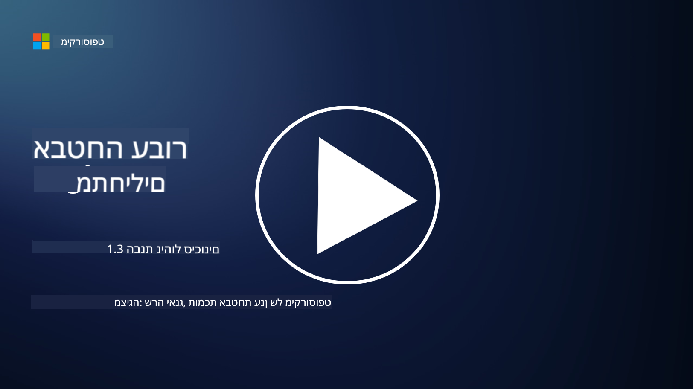
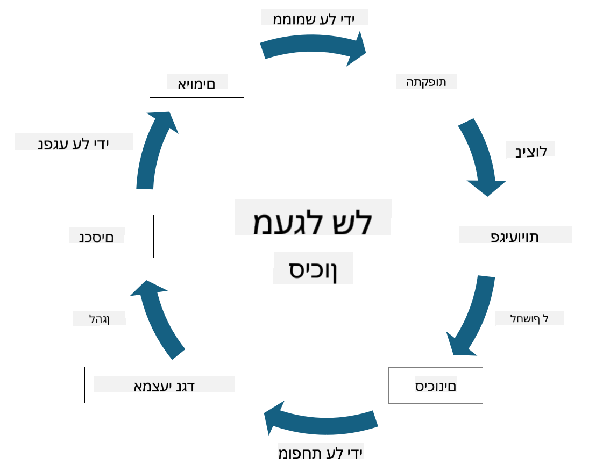

<!--
CO_OP_TRANSLATOR_METADATA:
{
  "original_hash": "fcca304f072cabf206388199e8e2e578",
  "translation_date": "2025-09-03T21:54:56+00:00",
  "source_file": "1.3 Understanding risk management.md",
  "language_code": "he"
}
-->
# הבנת ניהול סיכונים

## מבוא

בשיעור זה נעסוק ב:

- הגדרות של מונחים נפוצים בתחום האבטחה

- סוגי בקרות אבטחה

- הערכת סיכוני אבטחה

## הגדרות של מונחים נפוצים בתחום האבטחה

מונחים אלו הם מושגים בסיסיים בתחום הסייבר וניהול סיכונים. בואו נפרק כל מונח ונבין כיצד הם קשורים זה לזה:

1. **גורם איום**:

גורם איום הוא אדם, קבוצה, ארגון או מערכת אוטומטית שיש להם פוטנציאל לנצל חולשות במערכת או ברשת כדי לגרום נזק. גורמי איום יכולים להיות האקרים, כותבי תוכנות זדוניות, עובדים ממורמרים או כל גורם שמסכן מערכות מידע וטכנולוגיה.

2. **איום**:

איום הוא אירוע או פעולה פוטנציאלית שיכולה לנצל חולשות במערכת ולגרום נזק לנכס. איומים יכולים לכלול פעולות כמו פריצה, דליפות מידע, התקפות מניעת שירות ועוד. איומים הם ה"מה" מבחינת הנזק הפוטנציאלי שיכול להיגרם לנכסי הארגון.

3. **חולשה**:

חולשה היא נקודת תורפה או פגם בעיצוב, יישום או תצורה של מערכת שניתן לנצל על ידי גורם איום כדי לפגוע באבטחת המערכת. חולשות יכולות להימצא בתוכנה, חומרה, תהליכים או בהתנהגות אנושית. זיהוי וטיפול בחולשות חיוניים למזעור הסיכון להתקפות מוצלחות.

4. **סיכון**:

סיכון הוא הפוטנציאל להפסד, נזק או פגיעה הנובע מהאינטראקציה בין איום לחולשה. זהו הסיכוי שגורם איום ינצל חולשה ויגרום להשפעה שלילית. סיכונים נמדדים לרוב במונחים של השפעה פוטנציאלית והסבירות להתרחשות.

5. **נכס**:

נכס הוא כל דבר בעל ערך שהארגון שואף להגן עליו. נכסים יכולים לכלול חפצים פיזיים (כמו מחשבים ושרתים), נתונים (מידע לקוחות, רשומות פיננסיות), קניין רוחני (סודות מסחריים, פטנטים) ואפילו משאבי אנוש (כישורים וידע של עובדים). הגנה על נכסים היא מטרה מרכזית באבטחת מידע.

6. **חשיפה**:

חשיפה מתייחסת למצב שבו קיימת פגיעות לאיומים פוטנציאליים. היא מתרחשת כאשר קיימת חולשה שניתן לנצל על ידי גורם איום. חשיפה מדגישה את הסיכון הקשור לקיומן של חולשות במערכת או ברשת.

7. **בקרה**:

בקרה היא אמצעי שנועד להפחית את הסיכון הקשור לחולשות ואיומים. בקרות יכולות להיות טכניות, תהליכיות או מנהלתיות. הן נועדו למנוע, לזהות או לצמצם איומים וחולשות. דוגמאות כוללות חומות אש, בקרות גישה, הצפנה, מדיניות אבטחה והכשרת עובדים.

לסיכום הקשר בין המונחים: גורמי איום מנצלים חולשות כדי לבצע איומים, שיכולים להוביל לסיכונים עם פוטנציאל לגרום נזק לנכסים בעלי ערך. חשיפה מתרחשת כאשר קיימות חולשות, ובקרות מיושמות כדי להפחית את הסיכון על ידי מניעה או צמצום ההשפעה של איומים על נכסים. מסגרת זו מהווה את הבסיס לניהול סיכוני סייבר, ומנחה ארגונים בזיהוי, הערכה וטיפול בסיכונים פוטנציאליים למערכות המידע והנכסים שלהם.

## סוגי בקרות אבטחה

בקרות אבטחה הן אמצעים או הגנות שמיושמים כדי להגן על מערכות מידע ונכסים מפני איומים וחולשות שונים. ניתן לסווג אותן למספר קטגוריות בהתאם למיקודן ומטרתן. להלן סוגים נפוצים של בקרות אבטחה:

1. **בקרות מנהלתיות**:

בקרות אלו קשורות למדיניות, נהלים והנחיות שמנהלות את נהלי האבטחה של הארגון והתנהגות המשתמשים.

- מדיניות ונהלי אבטחה: הנחיות מתועדות שמגדירות כיצד נשמרת האבטחה בארגון.

- מודעות והכשרה באבטחה: תוכניות להדרכת עובדים על שיטות עבודה מומלצות באבטחה ואיומים פוטנציאליים.

- תגובה וניהול אירועים: תוכניות להתמודדות עם אירועי אבטחה וצמצום השפעתם.

2. **בקרות טכניות**:

בקרות טכניות כוללות שימוש בטכנולוגיה כדי לאכוף אמצעי אבטחה ולהגן על מערכות ונתונים. דוגמאות לבקרות טכניות:

- בקרות גישה: אמצעים שמגבילים את גישת המשתמשים למשאבים בהתאם לתפקידיהם והרשאותיהם.

- הצפנה: המרת נתונים לפורמט מאובטח כדי למנוע גישה לא מורשית.

- חומות אש: התקני אבטחת רשת שמסננים ומפקחים על תעבורה נכנסת ויוצאת.

- מערכות זיהוי ומניעת חדירות (IDPS): כלים שמנטרים תעבורת רשת לאיתור פעילות חשודה.

- תוכנות אנטי-וירוס ואנטי-תוכנות זדוניות: תוכניות שמזהות ומסירות תוכנות זדוניות.

- מנגנוני אימות: שיטות לאימות זהות המשתמשים, כמו סיסמאות, ביומטריה ואימות רב-שלבי.

- ניהול עדכונים: עדכון תוכנה באופן קבוע כדי לטפל בחולשות ידועות.

3. **בקרות פיזיות**:

בקרות פיזיות הן אמצעים להגנה על נכסים פיזיים ומתקנים.

- שומרים ובקרי גישה: אנשי צוות שמפקחים ומנהלים גישה למתחמים פיזיים.

- מצלמות אבטחה: מערכות וידאו לניטור והקלטת פעילויות.

- מנעולים ומחסומים פיזיים: אמצעים פיזיים שמגבילים גישה לאזורים רגישים.

- בקרות סביבתיות: אמצעים לוויסות טמפרטורה, לחות וגורמים סביבתיים אחרים שמשפיעים על ציוד ומרכזי נתונים.

4. **בקרות תפעוליות**:

בקרות אלו קשורות לפעולות יומיומיות שמבטיחות את אבטחת המערכות באופן שוטף.

- ניהול שינויים: תהליכים למעקב ואישור שינויים במערכות ובתצורות.

- גיבוי והתאוששות מאסון: תוכניות לגיבוי נתונים והתאוששות במקרה של כשלי מערכת או אסונות.

- רישום וביקורת: ניטור והקלטת פעילויות מערכת לצורכי אבטחה וציות.

- שיטות קידוד מאובטחות: הנחיות לכתיבת תוכנה שממזערת חולשות.

5. **בקרות משפטיות ורגולטוריות**:

בקרות אלו מבטיחות עמידה בחוקים, תקנות וסטנדרטים תעשייתיים רלוונטיים. הסטנדרטים שהארגון צריך לעמוד בהם תלויים בתחומי השיפוט, ענף התעשייה וגורמים נוספים.

- תקנות הגנת נתונים: עמידה בחוקים כמו GDPR, HIPAA ו-CCPA.

- סטנדרטים תעשייתיים: עמידה בסטנדרטים כמו PCI DSS לאבטחת נתוני כרטיסי אשראי.

קטגוריות אלו של בקרות אבטחה פועלות יחד כדי ליצור מצב אבטחה מקיף עבור ארגונים, ולעזור להגן על מערכותיהם, נתוניהם ונכסיהם מפני מגוון רחב של איומים.

## הערכת סיכוני אבטחה

יש אנשי אבטחה שמרגישים שניהול סיכונים הוא תחום שמיועד למומחי סיכונים בלבד, אך הבנת תהליך ניהול סיכוני אבטחה חשובה לכל איש אבטחה כדי שיוכל לבטא סיכוני אבטחה בשפה שהארגון יכול להבין ולפעול לפיה.

ארגונים חייבים להעריך סיכוני אבטחה באופן מתמיד ולהחליט אילו פעולות (או אי-פעולות) לנקוט מול סיכונים לעסק. להלן סקירה של האופן שבו תהליך זה מתבצע בדרך כלל. שימו לב שתהליך זה מתבצע לרוב על ידי מספר צוותים שונים בתוך הארגון, ורק לעיתים נדירות צוות אחד אחראי לניהול הסיכונים מקצה לקצה.

1. **זיהוי נכסים ואיומים**:

הארגון מזהה את הנכסים שהוא רוצה להגן עליהם. נכסים אלו יכולים לכלול נתונים, מערכות, חומרה, תוכנה, קניין רוחני ועוד. לאחר מכן, מזהים איומים פוטנציאליים שיכולים לפגוע בנכסים אלו.

2. **הערכת חולשות**:

הארגון מזהה חולשות או נקודות תורפה במערכות או בתהליכים שיכולות להיות מנוצלות על ידי איומים. חולשות אלו יכולות לנבוע מפגמים בתוכנה, תצורות שגויות, מחסור בבקרות אבטחה או טעויות אנוש.

3. **הערכת סבירות**:

הארגון מעריך את הסבירות להתרחשות כל איום. הדבר כולל התחשבות בנתונים היסטוריים, מודיעין איומים, מגמות בתעשייה וגורמים פנימיים. סבירות יכולה להיות מסווגת כנמוכה, בינונית או גבוהה בהתאם להסתברות שהאיום יתממש.

4. **הערכת השפעה**:

הארגון קובע את ההשפעה הפוטנציאלית של כל איום אם ינצל חולשה. השפעה יכולה לכלול הפסדים כספיים, שיבושים תפעוליים, פגיעה במוניטין, השלכות משפטיות ועוד. גם ההשפעה יכולה להיות מסווגת כנמוכה, בינונית או גבוהה בהתאם לתוצאות האפשריות.

5. **חישוב סיכון**:

הערכת הסבירות וההשפעה משולבות כדי לחשב את רמת הסיכון הכוללת עבור כל איום מזוהה. הדבר נעשה לעיתים קרובות באמצעות מטריצת סיכונים שמקצה ערכים מספריים או תיאורים איכותיים לרמות הסבירות וההשפעה. רמת הסיכון המתקבלת מסייעת לתעדף אילו סיכונים דורשים תשומת לב מיידית.

6. **תעדוף וקבלת החלטות**:

הארגון מתעדף סיכונים על ידי התמקדות באלו עם הערכים המשולבים הגבוהים ביותר של סבירות והשפעה. הדבר מאפשר להקצות משאבים וליישם בקרות בצורה יעילה יותר. איומים בסיכון גבוה דורשים תשומת לב מיידית, בעוד שאיומים בסיכון נמוך עשויים להיות מטופלים לאורך זמן.

7. **טיפול בסיכון**:

בהתבסס על הערכת הסיכונים, הארגון קובע כיצד לצמצם או לנהל כל סיכון. הדבר יכול לכלול יישום בקרות אבטחה, העברת סיכון באמצעות ביטוח, או אפילו קבלת רמות מסוימות של סיכון שיורי אם הן נחשבות לניתנות לניהול/יקרות מדי לתיקון/וכו'.

8. **מעקב וביקורת מתמשכת**:

הערכת סיכונים אינה תהליך חד-פעמי. יש לבצע אותה באופן תקופתי או בכל פעם שיש שינויים משמעותיים בסביבת הארגון. מעקב מתמשך מבטיח שאיומים חדשים, חולשות או שינויים בנוף העסקי יילקחו בחשבון.

על ידי הערכת סיכוני אבטחה בצורה מובנית זו, ארגונים יכולים לקבל החלטות מושכלות לגבי הקצאת משאבים, בקרות אבטחה ואסטרטגיות ניהול סיכונים כוללות. המטרה היא לצמצם את החשיפה הכוללת של הארגון לסיכונים תוך התאמת מאמצי האבטחה למטרות וליעדים העסקיים של הארגון.

---

**כתב ויתור**:  
מסמך זה תורגם באמצעות שירות תרגום מבוסס בינה מלאכותית [Co-op Translator](https://github.com/Azure/co-op-translator). למרות שאנו שואפים לדיוק, יש לקחת בחשבון שתרגומים אוטומטיים עשויים להכיל שגיאות או אי-דיוקים. המסמך המקורי בשפתו המקורית צריך להיחשב כמקור הסמכותי. למידע קריטי, מומלץ להשתמש בתרגום מקצועי על ידי בני אדם. איננו נושאים באחריות לכל אי-הבנה או פרשנות שגויה הנובעת משימוש בתרגום זה.