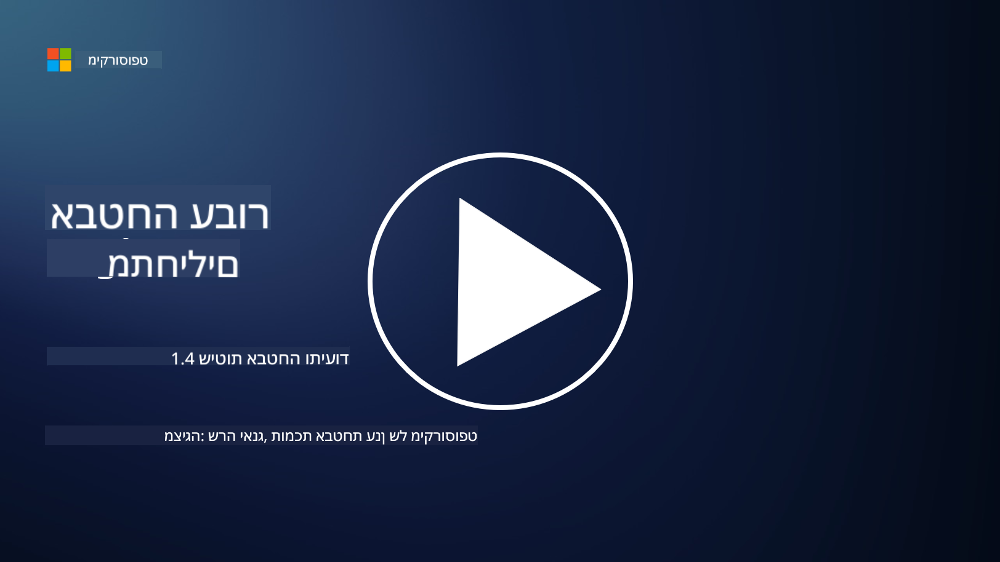

<!--
CO_OP_TRANSLATOR_METADATA:
{
  "original_hash": "d33500902124e52870935bdce4546fcc",
  "translation_date": "2025-09-03T21:00:01+00:00",
  "source_file": "1.4 Security practices and documentation.md",
  "language_code": "he"
}
-->
# נהלי אבטחה ותיעוד

ייתכן ששמעתם את הביטויים "מדיניות אבטחה", "תקן אבטחה" וכו', אך המציאות היא שרבים מאנשי מקצוע בתחום הסייבר אינם משתמשים בהם כראוי. בחלק זה נסביר מה כל אחד מהביטויים הללו אומר ולמה ארגון עשוי להשתמש בהם.

## הקדמה

בשיעור זה נעסוק ב:

 - מהי מדיניות אבטחה?
   
 - מהו תקן אבטחה?

   

 - מהו בסיס אבטחה?

   

 - מהו קו מנחה לאבטחה?
 - מהו נוהל אבטחה?

   

 - מהם חוקים ותקנות בהקשר של אבטחת מידע?

מונחים אלו משמשים לעיתים קרובות בהקשר של אבטחת מידע כדי להגדיר רמות שונות של תיעוד ונהלים בתוך ארגון. בואו נבהיר כל מונח:

## מהי מדיניות אבטחה?

מדיניות אבטחה היא מסמך ברמה גבוהה שמתאר את מטרות האבטחה הכלליות, העקרונות וההנחיות של הארגון. היא מספקת מסגרת לקבלת החלטות הקשורות לאבטחה וקובעת את הטון למצב האבטחה של הארגון. מדיניות אבטחה בדרך כלל מכסה נושאים כמו שימוש מקובל במשאבים, הגנת נתונים, בקרת גישה, תגובה לאירועים ועוד. מדיניות היא בלתי תלויה בפתרונות וטכנולוגיות. דוגמה למדיניות אבטחה שרבים מכירים היא מדיניות השימוש המקובל של הארגון.

## מהו תקן אבטחה?

תקן אבטחה הוא מסמך מפורט ומדויק יותר שמספק הנחיות ודרישות ליישום אמצעי אבטחה בתוך הארגון. תקנים הם יותר קונקרטיים וטכניים ממדיניות, ומציעים הוראות והמלצות ספציפיות להגדרת ושמירת מערכות, רשתות ותהליכים כדי לעמוד במטרות האבטחה. דוגמה לתקן אבטחה תהיה _"כל הנתונים הפנימיים חייבים להיות מוצפנים במצב מנוחה ובמעבר."_

## מהו בסיס אבטחה?

בסיס אבטחה הוא סט של הגדרות אבטחה מינימליות שנחשבות חיוניות עבור מערכת, יישום או סביבה מסוימת בנקודת זמן מסוימת. הוא מגדיר נקודת התחלה לאבטחה שצריכה להיות מיושמת בכל המקרים הרלוונטיים. בסיסי אבטחה עוזרים להבטיח עקביות ורמת אבטחה מסוימת בכל תשתית ה-IT של הארגון. דוגמה לבסיס אבטחה תהיה _"VMs ב-Azure לא חייבים להיות בעלי גישה ישירה לאינטרנט."_

## מהו קו מנחה לאבטחה?

קו מנחה לאבטחה הוא מסמך שמציע המלצות והכוונה כאשר תקן אבטחה ספציפי אינו חל. קווים מנחים מנסים להתמודד עם "אזורים אפורים" שמתעוררים כאשר תקן אינו מכסה, או מכסה באופן חלקי בלבד, נושא מסוים.

## מהו נוהל אבטחה?

נוהל אבטחה הוא מדריך מפורט שלב-אחר-שלב שמתאר את הפעולות והמשימות הספציפיות שיש לבצע כדי לבצע תהליך או משימה הקשורים לאבטחה. נהלים הם מסמכים מעשיים וניתנים ליישום שמספקים רצף ברור של פעולות שיש לבצע במהלך תגובה לאירועים, תחזוקת מערכות, קליטת משתמשים חדשים ועוד פעילויות הקשורות לאבטחה. דוגמה לנוהל אבטחה תהיה _"כאשר אירוע אבטחה ברמת P1 נוצר על ידי Microsoft Sentinel, מרכז תפעול האבטחה (SOC) חייב להודיע מיד למנהל האבטחה התורן ולשלוח לו את פרטי האירוע."_

לסיכום, מונחים אלו מייצגים רמות שונות של תיעוד והכוונה במסגרת אבטחת המידע של הארגון. מדיניות אבטחה קובעת את המטרות הכלליות, תקנים מספקים דרישות מפורטות, בסיסים מגדירים הגדרות מינימליות, קווים מנחים מציעים המלצות, ונהלים מספקים צעדים מעשיים לתהליכי אבטחה.

## מהם חוקים ותקנות בהקשר של אבטחת מידע?

חוקים ותקנות מתייחסים למסגרות משפטיות שנקבעו על ידי ממשלות וגופים רגולטוריים כדי להגדיר ולאכוף כללים, תקנים ודרישות לאבטחת מערכות דיגיטליות, נתונים ומידע. חוקים ותקנות אלו משתנים לפי תחום שיפוט ומתמקדים בהיבטים שונים של אבטחת מידע, כולל הגנת נתונים, פרטיות, דיווח על אירועים ואבטחת תשתיות קריטיות. הנה כמה דוגמאות לחוקים ותקנות הקשורים לאבטחת מידע: לדוגמה, תקנת הגנת המידע הכללית (GDPR), חוק ניידות ואחריות ביטוח בריאות (HIPAA), חוק פרטיות הצרכן בקליפורניה (CCPA), תקן אבטחת נתונים של תעשיית כרטיסי התשלום (PCI DSS).

## קריאה נוספת

[תבניות מדיניות אבטחת מידע | מכון SANS](https://www.sans.org/information-security-policy/)

[עמידה בחוקים ותקנות בתחום אבטחת מידע ופרטיות | NIST](https://www.nist.gov/mep/cybersecurity-resources-manufacturers/compliance-cybersecurity-and-privacy-laws-and-regulations)

---

**כתב ויתור**:  
מסמך זה תורגם באמצעות שירות תרגום מבוסס בינה מלאכותית [Co-op Translator](https://github.com/Azure/co-op-translator). למרות שאנו שואפים לדיוק, יש לקחת בחשבון שתרגומים אוטומטיים עשויים להכיל שגיאות או אי דיוקים. המסמך המקורי בשפתו המקורית צריך להיחשב כמקור סמכותי. עבור מידע קריטי, מומלץ להשתמש בתרגום מקצועי על ידי אדם. איננו נושאים באחריות לאי הבנות או לפרשנויות שגויות הנובעות משימוש בתרגום זה.