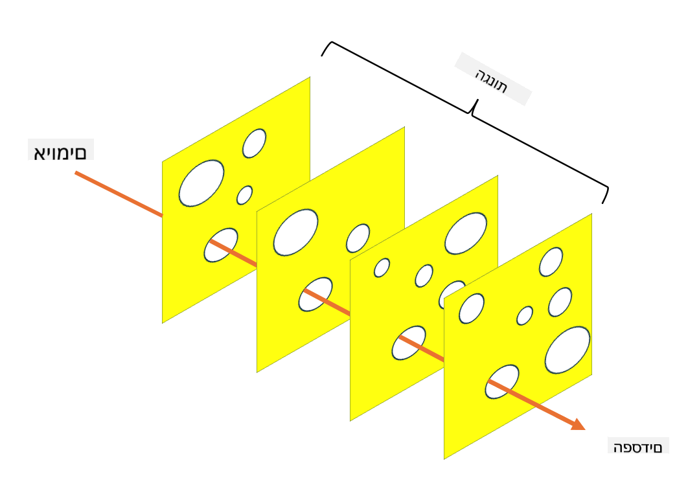

<!--
CO_OP_TRANSLATOR_METADATA:
{
  "original_hash": "75f77f972d2233c584f87c1eb96c983b",
  "translation_date": "2025-09-03T20:32:17+00:00",
  "source_file": "1.5 Zero trust.md",
  "language_code": "he"
}
-->
# אפס אמון

"אפס אמון" הוא ביטוי שנעשה בו שימוש רב בימינו בקרב אנשי אבטחת מידע. אבל מה המשמעות שלו? האם מדובר רק במילת באז? בשיעור הזה, נעמיק ונבין בדיוק מהו אפס אמון.

## מבוא

- בשיעור הזה נעסוק ב:

- מהו אפס אמון?

- כיצד אפס אמון שונה מארכיטקטורות אבטחה מסורתיות?

- מהי הגנה לעומק?

## אפס אמון

אפס אמון הוא גישה לאבטחת סייבר שמאתגרת את התפיסה המסורתית של "תן אמון אבל תוודא" על ידי הנחה שאף גורם, בין אם בתוך או מחוץ לרשת הארגונית, אינו ראוי לאמון באופן מובנה. במקום זאת, אפס אמון דוגל באימות כל משתמש, מכשיר ואפליקציה שמנסים לגשת למשאבים, ללא קשר למיקומם. העיקרון המרכזי של אפס אמון הוא לצמצם את "שטח התקיפה" ולהפחית את ההשפעה הפוטנציאלית של פריצות אבטחה.

במודל אפס אמון, מודגשים העקרונות הבאים:

1. **אימות זהות**: אימות והרשאה מיושמים בקפדנות על כל המשתמשים והמכשירים, ללא קשר למיקומם. חשוב לזכור שזהות אינה בהכרח אנושית: היא יכולה להיות מכשיר, אפליקציה וכו'.

2. **מינימום הרשאות**: משתמשים ומכשירים מקבלים את רמת הגישה המינימלית הנדרשת לביצוע המשימות שלהם, מה שמפחית את הנזק הפוטנציאלי במקרה של פשרה.

3. **מיקרו-סגמנטציה**: משאבי הרשת מחולקים למקטעים קטנים יותר כדי להגביל תנועה רוחבית בתוך הרשת במקרה של פריצה.

4. **מעקב מתמשך**: מתבצע מעקב וניתוח מתמשך של התנהגות משתמשים ומכשירים כדי לזהות חריגות ואיומים פוטנציאליים. שימוש בטכניקות מעקב מודרניות כולל גם למידת מכונה, בינה מלאכותית ומודיעין איומים כדי לספק פרטים והקשר נוספים למעקב.

5. **הצפנת נתונים**: נתונים מוצפנים הן בזמן מעבר והן במצב מנוחה כדי למנוע גישה לא מורשית.

6. **בקרת גישה מחמירה**: בקרות גישה נאכפות על בסיס הקשר, כגון תפקידי משתמש, מצב המכשיר ומיקום הרשת.

מיקרוסופט מחלקת את אפס אמון לחמישה עמודי תווך, עליהם נדון בשיעור מאוחר יותר.

## הבדלים מארכיטקטורות אבטחה מסורתיות

אפס אמון שונה מארכיטקטורות אבטחה מסורתיות, כמו מודלים מבוססי היקף, בכמה דרכים:

1. **היקף מול זהות**: מודלים מסורתיים מתמקדים באבטחת היקף הרשת ומניחים שמשתמשים ומכשירים פנימיים יכולים להיות אמינים ברגע שהם בפנים. אפס אמון, לעומת זאת, מניח שאיומים יכולים להגיע גם מבפנים וגם מבחוץ ומחיל בקרות מחמירות מבוססות זהות.

2. **אמון מובנה מול אמון מפורש**: מודלים מסורתיים נותנים אמון מובנה במכשירים ומשתמשים בתוך הרשת עד שיוכח אחרת. אפס אמון מאמת זהויות באופן מפורש ומבצע מעקב מתמשך אחר חריגות.

3. **רשת שטוחה מול רשת מקוטעת**: ארכיטקטורות מסורתיות כוללות לעיתים קרובות רשתות שטוחות שבהן למשתמשים פנימיים יש גישה רחבה. אפס אמון דוגל בחלוקת הרשת לאזורים קטנים ומבודדים כדי להכיל פריצות פוטנציאליות.

4. **תגובתי מול יוזם**: אבטחה מסורתית מסתמכת לעיתים קרובות על אמצעים תגובתיים כמו חומות אש היקפיות וזיהוי פריצות. אפס אמון נוקט בגישה יוזמת על ידי הנחת פריצות אפשריות וצמצום השפעתן.

## הגנה לעומק

הגנה לעומק, הידועה גם כאבטחה רב-שכבתית, היא אסטרטגיית אבטחת סייבר הכוללת פריסה של שכבות רבות של בקרות ואמצעי אבטחה כדי להגן על נכסי הארגון. המטרה היא ליצור שכבות הגנה חופפות כך שאם שכבה אחת נפרצת, אחרות עדיין יוכלו לספק הגנה. כל שכבה מתמקדת בהיבט אחר של אבטחה ומגבירה את רמת האבטחה הכוללת של הארגון.

הגנה לעומק כוללת שילוב של אמצעים טכניים, פרוצדורליים ופיזיים. אלה יכולים לכלול חומות אש, מערכות זיהוי פריצות, בקרות גישה, הצפנה, הכשרת משתמשים, מדיניות אבטחה ועוד. הרעיון הוא ליצור מחסומים מרובים שמקשים על תוקפים לחדור למערכות ולרשתות של הארגון. זה מכונה לעיתים גם "מודל הגבינה השוויצרית", שמשמש גם במניעת תאונות בתעשיות אחרות (למשל, תחבורה).

## קריאה נוספת

[מהו אפס אמון?](https://learn.microsoft.com/security/zero-trust/zero-trust-overview?WT.mc_id=academic-96948-sayoung)

[אפס אמון מתפתח – נייר עמדה של מיקרוסופט](https://query.prod.cms.rt.microsoft.com/cms/api/am/binary/RWJJdT?WT.mc_id=academic-96948-sayoung)

[אפס אמון ו-BeyondCorp Google Cloud | בלוג Google Cloud](https://cloud.google.com/blog/topics/developers-practitioners/zero-trust-and-beyondcorp-google-cloud)

---

**כתב ויתור**:  
מסמך זה תורגם באמצעות שירות תרגום מבוסס בינה מלאכותית [Co-op Translator](https://github.com/Azure/co-op-translator). למרות שאנו שואפים לדיוק, יש לקחת בחשבון שתרגומים אוטומטיים עשויים להכיל שגיאות או אי-דיוקים. המסמך המקורי בשפתו המקורית נחשב למקור הסמכותי. למידע קריטי, מומלץ להשתמש בתרגום מקצועי על ידי בני אדם. איננו נושאים באחריות לכל אי-הבנה או פרשנות שגויה הנובעת משימוש בתרגום זה.  