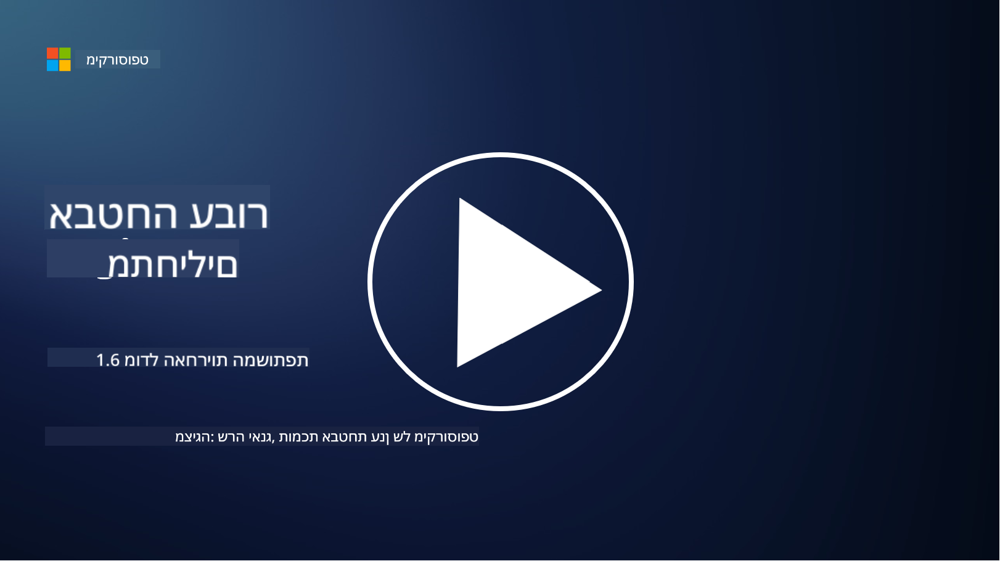

<!--
CO_OP_TRANSLATOR_METADATA:
{
  "original_hash": "a48db640d80c786b928ca178c414f084",
  "translation_date": "2025-09-03T21:05:08+00:00",
  "source_file": "1.6 Shared responsibility model.md",
  "language_code": "he"
}
-->
# מודל האחריות המשותפת

אחריות משותפת היא מושג חדש יחסית בעולם ה-IT, שנוצר עם הופעת מחשוב הענן. מנקודת מבט של אבטחת סייבר, חשוב להבין מי מספק אילו בקרות אבטחה, כדי להימנע מפערים בהגנה.

## מבוא

בשיעור זה נעסוק ב:

- מהי אחריות משותפת בהקשר של אבטחת סייבר?

- מה ההבדל באחריות המשותפת לבקרות אבטחה בין IaaS, PaaS ו-SaaS?

- היכן ניתן למצוא מידע על בקרות האבטחה שמספקת פלטפורמת הענן שלכם?

- מה המשמעות של "לסמוך אבל לוודא"?

## מהי אחריות משותפת בהקשר של אבטחת סייבר?

אחריות משותפת באבטחת סייבר מתייחסת לחלוקת האחריות על האבטחה בין ספק שירותי הענן (CSP) לבין לקוחותיו. בסביבות מחשוב ענן, כמו Infrastructure as a Service (IaaS), Platform as a Service (PaaS) ו-Software as a Service (SaaS), גם ה-CSP וגם הלקוח ממלאים תפקידים חשובים בהבטחת אבטחת הנתונים, היישומים והמערכות.

## מה ההבדל באחריות המשותפת לבקרות אבטחה בין IaaS, PaaS ו-SaaS?

חלוקת האחריות תלויה בדרך כלל בסוג שירות הענן שבו נעשה שימוש:

- **IaaS (תשתית כשירות)**: ה-CSP מספק את התשתית הבסיסית (שרתים, רשתות, אחסון), בעוד הלקוח אחראי לניהול מערכות ההפעלה, היישומים והגדרות האבטחה על גבי התשתית הזו.

- **PaaS (פלטפורמה כשירות)**: ה-CSP מציע פלטפורמה שעליה הלקוחות יכולים לבנות ולהפעיל יישומים. ה-CSP מנהל את התשתית הבסיסית, והלקוח מתמקד בפיתוח יישומים ובאבטחת הנתונים.

- **SaaS (תוכנה כשירות)**: ה-CSP מספק יישומים פונקציונליים מלאים שנגישים דרך האינטרנט. במקרה זה, ה-CSP אחראי על אבטחת היישום והתשתית, בעוד הלקוח מנהל את הגישה של המשתמשים ואת השימוש בנתונים.

הבנת האחריות המשותפת היא קריטית מכיוון שהיא מבהירה אילו היבטי אבטחה מכוסים על ידי ה-CSP ואילו היבטים הלקוח צריך לטפל בהם. הדבר מסייע למנוע אי-הבנות ומבטיח יישום כולל של אמצעי אבטחה.

## היכן ניתן למצוא מידע על בקרות האבטחה שמספקת פלטפורמת הענן שלכם?

כדי למצוא מידע על בקרות האבטחה שמספקת פלטפורמת הענן שלכם, יש לפנות לתיעוד ולמשאבים של ספק שירותי הענן. אלו כוללים:

- **אתר ותיעוד של ה-CSP**: באתר ה-CSP ניתן למצוא מידע על תכונות האבטחה והבקרות שמוצעות כחלק מהשירותים שלהם. בדרך כלל, CSPs מספקים תיעוד מפורט שמסביר את שיטות האבטחה, הבקרות וההמלצות שלהם. זה עשוי לכלול מסמכים טכניים, מדריכי אבטחה ומאמרים מקצועיים.

- **הערכות אבטחה וביקורות**: רוב ה-CSPs מבצעים הערכות אבטחה על ידי מומחי אבטחה וארגונים עצמאיים. ביקורות אלו יכולות לספק תובנות על איכות אמצעי האבטחה של ה-CSP. לעיתים, הדבר מוביל לכך שה-CSP מקבל תעודת תאימות אבטחה (ראו סעיף הבא).

- **תעודות תאימות אבטחה**: רוב ה-CSPs משיגים תעודות כמו ISO:27001, SOC 2 ו-FedRAMP, ועוד. תעודות אלו מעידות על כך שהספק עומד בסטנדרטים מסוימים של אבטחה ותאימות.

זכרו שרמת הפירוט וזמינות המידע עשויות להשתנות בין ספקי הענן. תמיד יש לוודא שאתם מתייעצים עם משאבים רשמיים ומעודכנים שמספק ספק שירותי הענן כדי לקבל החלטות מושכלות לגבי אבטחת הנכסים שלכם בענן.

## מה המשמעות של "לסמוך אבל לוודא"?

בהקשר של שימוש ב-CSP, תוכנה של צד שלישי או שירותי אבטחת IT אחרים, ארגון עשוי בתחילה לסמוך על טענות הספק לגבי אמצעי האבטחה. עם זאת, כדי להבטיח באמת את בטיחות הנתונים והמערכות שלהם, עליהם לוודא את הטענות הללו באמצעות הערכות אבטחה, בדיקות חדירה ובחינה של בקרות האבטחה של הצד החיצוני לפני שילוב מלא של התוכנה או השירות בפעילותם. כל אדם וארגון צריכים לשאוף לסמוך אבל לוודא את בקרות האבטחה שאינם אחראים עליהן.

## אחריות משותפת בתוך הארגון

זכרו, גם בתוך הארגון יש לקחת בחשבון את האחריות המשותפת לאבטחה בין צוותים שונים. צוות האבטחה לעיתים רחוקות יישם את כל הבקרות בעצמו, ויהיה עליו לשתף פעולה עם צוותי תפעול, מפתחים וחלקים אחרים בעסק כדי ליישם את כל בקרות האבטחה הנדרשות לשמירה על אבטחת הארגון.

## קריאה נוספת
- [אחריות משותפת בענן - Microsoft Azure | Microsoft Learn](https://learn.microsoft.com/azure/security/fundamentals/shared-responsibility?WT.mc_id=academic-96948-sayoung)
- [מהו מודל האחריות המשותפת? – הגדרה מ-TechTarget.com](https://www.techtarget.com/searchcloudcomputing/definition/shared-responsibility-model)
- [הסבר על מודל האחריות המשותפת ומה הוא אומר לגבי אבטחת ענן | CSO Online](https://www.csoonline.com/article/570779/the-shared-responsibility-model-explained-and-what-it-means-for-cloud-security.html)
- [אחריות משותפת לאבטחת ענן: מה שאתם צריכים לדעת (cisecurity.org)](https://www.cisecurity.org/insights/blog/shared-responsibility-cloud-security-what-you-need-to-know)

---

**כתב ויתור**:  
מסמך זה תורגם באמצעות שירות תרגום מבוסס בינה מלאכותית [Co-op Translator](https://github.com/Azure/co-op-translator). למרות שאנו שואפים לדיוק, יש לקחת בחשבון שתרגומים אוטומטיים עשויים להכיל שגיאות או אי-דיוקים. המסמך המקורי בשפתו המקורית נחשב למקור הסמכותי. למידע קריטי, מומלץ להשתמש בתרגום מקצועי על ידי בני אדם. איננו נושאים באחריות לכל אי-הבנה או פרשנות שגויה הנובעת משימוש בתרגום זה.  