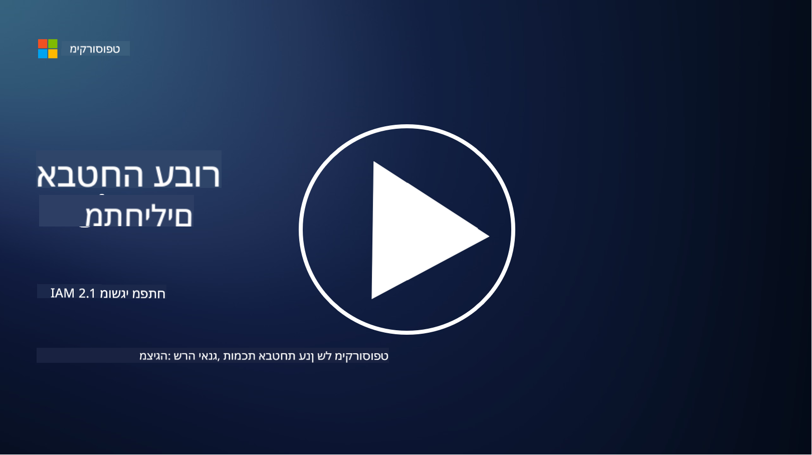

<!--
CO_OP_TRANSLATOR_METADATA:
{
  "original_hash": "2e3864e3d579f0dbb4ac2ec8c5f82acf",
  "translation_date": "2025-09-03T19:36:54+00:00",
  "source_file": "2.1 IAM key concepts.md",
  "language_code": "he"
}
-->
# מושגי יסוד של IAM

האם אי פעם התחברת למחשב או לאתר אינטרנט? כמובן שכן! זה אומר שכבר השתמשת בבקרות זהות בחיי היומיום שלך. ניהול זהות וגישה (IAM) הוא עמוד תווך מרכזי באבטחת מידע, ובשיעורים הבאים נלמד עליו יותר.

**מבוא**

בשיעור הזה נעסוק ב:

- מה הכוונה בניהול זהות וגישה (IAM) בהקשר של אבטחת מידע?

- מהו עקרון המינימום ההכרחי?

- מהי הפרדת תפקידים?

- מהי אימות וזהות?

## מה הכוונה בניהול זהות וגישה (IAM) בהקשר של אבטחת מידע?

ניהול זהות וגישה (IAM) מתייחס למערך תהליכים, טכנולוגיות ומדיניות שמיושמים כדי להבטיח שלאנשים הנכונים תהיה גישה מתאימה למשאבים בסביבה הדיגיטלית של הארגון. IAM כולל ניהול זהויות דיגיטליות (משתמשים, עובדים, שותפים) וגישה שלהם למערכות, יישומים, נתונים ורשתות. המטרה העיקרית של IAM היא לשפר את האבטחה, לייעל את הגישה של המשתמשים ולהבטיח עמידה במדיניות ובתקנות הארגון. פתרונות IAM כוללים בדרך כלל אימות משתמשים, הרשאות, הקצאת זהויות, בקרת גישה וניהול מחזור חיי משתמשים (לדאוג שחשבונות יימחקו כשהם כבר לא בשימוש).

## מהו עקרון המינימום ההכרחי?

עקרון המינימום ההכרחי הוא מושג יסוד שממליץ להעניק למשתמשים ולמערכות רק את ההרשאות המינימליות הנדרשות לביצוע המשימות או התפקידים שלהם. עקרון זה מסייע להגביל את הנזק הפוטנציאלי במקרה של פרצת אבטחה או איום פנימי. על ידי הקפדה על עקרון המינימום ההכרחי, ארגונים מצמצמים את שטח התקיפה ומפחיתים את הסיכון לגישה לא מורשית, פרצות נתונים ושימוש שגוי בהרשאות. בפועל, זה אומר שמשתמשים מקבלים גישה רק למשאבים ולפונקציות הספציפיות הנדרשות לתפקידם, ולא יותר מכך. לדוגמה, אם כל מה שאתה צריך זה לקרוא מסמך, אין צורך להעניק לך הרשאות מנהל מלאות למסמך הזה.

## מהי הפרדת תפקידים?

הפרדת תפקידים היא עקרון שמטרתו למנוע ניגודי עניינים ולהפחית את הסיכון להונאה ולשגיאות על ידי חלוקת משימות ואחריות קריטיות בין אנשים שונים בארגון. בהקשר של אבטחת מידע, הפרדת תפקידים כוללת הבטחה שאף אדם יחיד לא ישלוט בכל ההיבטים של תהליך או מערכת קריטיים. המטרה היא ליצור מערכת של איזונים ובלמים שמונעת מאדם יחיד את היכולת לבצע גם את שלב ההגדרה וגם את שלב האישור של תהליך. לדוגמה, במערכות פיננסיות, זה עשוי לקבוע שהאדם שמזין עסקאות למערכת לא יהיה אותו אדם שמאשר את העסקאות הללו. כך מצמצמים את הסיכון לפעולות לא מורשות או הונאה שלא יזוהו.

## מהי אימות וזהות?

אימות וזהות הם שני מושגים יסודיים באבטחת מידע שממלאים תפקיד קריטי בהבטחת האבטחה והשלמות של מערכות מחשב ונתונים. הם משמשים לעיתים קרובות יחד כדי לשלוט בגישה למשאבים ולהגן על מידע רגיש.

**1. אימות**:  
אימות הוא תהליך של אימות זהותו של משתמש, מערכת או גורם שמנסה לגשת למערכת מחשב או למשאב מסוים. הוא מבטיח שהזהות המוצהרת היא אמיתית ומדויקת. שיטות אימות כוללות בדרך כלל שימוש באחד או יותר מהגורמים הבאים:

   א. משהו שאתה יודע: כולל סיסמאות, קודי PIN או ידע סודי אחר שרק המשתמש המורשה אמור להחזיק.  
   ב. משהו שיש לך: כולל טוקנים פיזיים או מכשירים כמו כרטיסים חכמים, טוקנים אבטחה או טלפונים ניידים שמשמשים לאישור זהות המשתמש.  
   ג. משהו שאתה: מתייחס לגורמים ביומטריים כמו טביעות אצבע, זיהוי פנים או סריקות רשתית שהם ייחודיים לאדם.  

מנגנוני אימות משמשים לאישור שהמשתמש הוא מי שהוא טוען להיות לפני מתן גישה למערכת או למשאב. הם מסייעים למנוע גישה לא מורשית ומבטיחים שרק משתמשים לגיטימיים יוכלו לבצע פעולות בתוך מערכת.

**2. זהות**:  
זהות היא תהליך של הענקת או שלילת הרשאות ופריבילגיות ספציפיות למשתמשים או גורמים מאומתים לאחר שזהותם אומתה. היא קובעת אילו פעולות או פעילויות משתמש רשאי לבצע בתוך מערכת או על משאבים מסוימים. זהות מבוססת לעיתים קרובות על מדיניות מוגדרת מראש, כללי בקרת גישה ותפקידים שהוקצו למשתמשים.

זהות יכולה להיחשב כמתן תשובה לשאלה "מה יכול משתמש מאומת לעשות?" היא כוללת הגדרה ואכיפה של מדיניות בקרת גישה כדי להגן על נתונים ומשאבים רגישים מפני גישה או שינוי לא מורשים.

**לסיכום:**

- אימות קובע את זהות המשתמשים או הגורמים.  
- זהות קובעת אילו פעולות ומשאבים משתמשים מאומתים רשאים לגשת אליהם או לשנות.

## קריאה נוספת

- [Describe identity concepts - Training | Microsoft Learn](https://learn.microsoft.com/training/modules/describe-identity-principles-concepts/?WT.mc_id=academic-96948-sayoung)  
- [Introduction to identity - Microsoft Entra | Microsoft Learn](https://learn.microsoft.com/azure/active-directory/fundamentals/identity-fundamental-concepts?WT.mc_id=academic-96948-sayoung)  
- [What is Identity Access Management (IAM)? | Microsoft Security](https://www.microsoft.com/security/business/security-101/what-is-identity-access-management-iam?WT.mc_id=academic-96948-sayoung)  
- [What is IAM? Identity and access management explained | CSO Online](https://www.csoonline.com/article/518296/what-is-iam-identity-and-access-management-explained.html)  
- [What is IAM? (auth0.com)](https://auth0.com/blog/what-is-iam/)  
- [Security+: implementing Identity and Access Management (IAM) controls [updated 2021] | Infosec (infosecinstitute.com)](https://resources.infosecinstitute.com/certifications/securityplus/security-implementing-identity-and-access-management-iam-controls/)  
- [least privilege - Glossary | CSRC (nist.gov)](https://csrc.nist.gov/glossary/term/least_privilege)  
- [Security: The Principle of Least Privilege (POLP) - Microsoft Community Hub](https://techcommunity.microsoft.com/t5/azure-sql-blog/security-the-principle-of-least-privilege-polp/ba-p/2067390?WT.mc_id=academic-96948-sayoung)  
- [Principle of least privilege | CERT NZ](https://www.cert.govt.nz/it-specialists/critical-controls/principle-of-least-privilege/)  
- [Why is separation of duties required by NIST 800-171 and CMMC? - (totem.tech)](https://www.totem.tech/cmmc-separation-of-duties/)  

---

**כתב ויתור**:  
מסמך זה תורגם באמצעות שירות תרגום מבוסס בינה מלאכותית [Co-op Translator](https://github.com/Azure/co-op-translator). למרות שאנו שואפים לדיוק, יש לקחת בחשבון שתרגומים אוטומטיים עשויים להכיל שגיאות או אי דיוקים. המסמך המקורי בשפתו המקורית צריך להיחשב כמקור סמכותי. עבור מידע קריטי, מומלץ להשתמש בתרגום מקצועי על ידי אדם. איננו נושאים באחריות לאי הבנות או לפרשנויות שגויות הנובעות משימוש בתרגום זה.