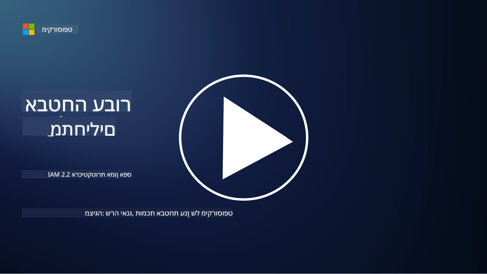

<!--
CO_OP_TRANSLATOR_METADATA:
{
  "original_hash": "4774a978af123f72ebb872199c4c4d4f",
  "translation_date": "2025-09-03T20:27:04+00:00",
  "source_file": "2.2 IAM zero trust architecture.md",
  "language_code": "he"
}
-->
# ארכיטקטורת IAM בגישת אפס אמון

זהות היא חלק מרכזי ביישום ארכיטקטורת אפס אמון ובבניית היקף הגנה לכל סביבה טכנולוגית. בחלק זה נחקור מדוע חשוב להשתמש בבקרות זהות כדי ליישם גישת אפס אמון.

## הקדמה

בשיעור זה נעסוק ב:

- מדוע עלינו להשתמש בזהות כהיקף ההגנה שלנו בסביבות IT מודרניות?

- כיצד זה שונה מארכיטקטורות IT מסורתיות?

- כיצד משתמשים בזהות כדי ליישם ארכיטקטורת אפס אמון?

## מדוע עלינו להשתמש בזהות כהיקף ההגנה שלנו בסביבות IT מודרניות?

בסביבות IT מודרניות, הרעיון המסורתי של היקף פיזי (באמצעות כלים כמו חומות אש וגבולות רשת) כקו ההגנה הראשוני מפני איומי סייבר הופך לפחות אפקטיבי בשל המורכבות הגוברת של הטכנולוגיה, העלייה בעבודה מרחוק ואימוץ שירותי ענן. במקום זאת, ארגונים עוברים לשימוש בזהות כהיקף החדש. המשמעות היא שהאבטחה מתמקדת באימות וניהול הזהות של משתמשים, מכשירים ואפליקציות שמנסים לגשת למשאבים, ללא קשר למיקומם הפיזי.

הנה הסיבות לכך ששימוש בזהות כהיקף הוא קריטי בסביבות IT מודרניות:

**כוח עבודה מרחוק**: עם עבודה מרחוק ומכשירים ניידים שהפכו לנורמה, משתמשים יכולים לגשת למשאבים ממקומות ומכשירים שונים. הגישה המסורתית של היקף פיזי אינה עובדת כאשר משתמשים כבר אינם מוגבלים למשרד פיזי.

**סביבות ענן והיברידיות**: ארגונים מאמצים יותר ויותר שירותי ענן וסביבות היברידיות. נתונים ואפליקציות כבר אינם נמצאים רק בתוך תחומי הארגון, מה שהופך את ההגנות המסורתיות לפחות רלוונטיות.

**אבטחת אפס אמון**: גישת אפס אמון מניחה שאף גורם, בין אם בתוך הרשת או מחוצה לה, לא צריך לקבל אמון אוטומטי. זהות הופכת ליסוד לאימות בקשות גישה, ללא קשר למקורן.

**נוף איומים**: איומי סייבר מתפתחים, ותוקפים מוצאים דרכים לעקוף הגנות מסורתיות. פישינג, הנדסה חברתית ואיומים פנימיים מנצלים לעיתים קרובות חולשות אנושיות במקום לנסות לפרוץ גבולות רשת.

**גישה ממוקדת נתונים**: הגנה על נתונים רגישים היא קריטית. על ידי התמקדות בזהות, ארגונים יכולים לשלוט מי ניגש לאילו נתונים, ולהפחית את הסיכון לדליפות מידע.

## כיצד זה שונה מארכיטקטורות IT מסורתיות?

ארכיטקטורות IT מסורתיות הסתמכו במידה רבה על מודלים אבטחה מבוססי היקף, שבהם חומות אש וגבולות רשת שיחקו תפקיד משמעותי בשמירה מפני איומים. ההבדלים העיקריים בין גישות מסורתיות לגישות מבוססות זהות הם:

|      היבט                  |      ארכיטקטורות IT מסורתיות                                                                  |      גישה מבוססת זהות                                                                                     |
|-----------------------------|----------------------------------------------------------------------------------------------------|------------------------------------------------------------------------------------------------------------|
|     מיקוד                  |     מיקוד בהיקף: הסתמכות על הגנות היקפיות כמו חומות אש ובקרת גישה.                              |     מיקוד באימות זהות: מעבר מגבולות רשת לאימות זהות משתמש/מכשיר.                                         |
|     תלות במיקום            |     תלות במיקום: אבטחה קשורה למיקומים פיזיים ולגבולות רשת.                                      |     עצמאות ממיקום: אבטחה שאינה תלויה במיקום ספציפי; גישה מכל מקום.                                       |
|     הנחת אמון              |     הנחת אמון: אמון הונח בתוך היקף הרשת עבור משתמשים/מכשירים.                                   |     גישת אפס אמון: אמון אינו מונח מראש; גישה מאומתת על בסיס זהות והקשר.                                   |
|     התייחסות למכשירים      |     מגוון מכשירים: הנחה שמכשירים בתוך היקף הרשת הם בטוחים.                                       |     מודעות למכשירים: התחשבות בבריאות ובמצב אבטחת המכשיר, ללא קשר למיקום.                                 |
|     הגנת נתונים            |     הגנת נתונים: התמקדות בהגנה על גבולות רשת לשם הגנת נתונים.                                   |     הגנה ממוקדת נתונים: התמקדות בשליטה בגישה לנתונים על בסיס זהות ורגישות הנתונים.                        |
|                             |                                                                                                    |                                                                                                            |

## כיצד משתמשים בזהות כדי ליישם ארכיטקטורת אפס אמון?

בארכיטקטורת אפס אמון, העיקרון הבסיסי הוא לא להעניק אמון אוטומטי לאף גורם, בין אם הוא בתוך הרשת או מחוצה לה. זהות משחקת תפקיד מרכזי ביישום גישת אפס אמון על ידי אפשרות לאימות מתמשך של גורמים שמנסים לגשת למשאבים. בקרות אבטחת זהות מודרניות מאפשרות שכל משתמש, מכשיר, אפליקציה ושירות שמבקשים גישה למשאבים יזוהו ויאומתו באופן יסודי לפני מתן גישה. זה כולל אימות זהות דיגיטלית באמצעות שיטות כמו שילובי שם משתמש/סיסמה, אימות רב-גורמי (MFA), ביומטריה ומנגנוני אימות חזקים אחרים.

## קריאה נוספת

- [Securing identity with Zero Trust | Microsoft Learn](https://learn.microsoft.com/security/zero-trust/deploy/identity?WT.mc_id=academic-96948-sayoung)
- [Zero Trust Principles and Guidance for Identity and Access | CSA (cloudsecurityalliance.org)](https://cloudsecurityalliance.org/artifacts/zero-trust-principles-and-guidance-for-iam/)
- [Zero Trust Identity Controls - Essentials Series - Episode 2 - YouTube](https://www.youtube.com/watch?v=fQZQznIKcGM&list=PLXtHYVsvn_b_gtX1-NB62wNervQx1Fhp4&index=13)

---

**כתב ויתור**:  
מסמך זה תורגם באמצעות שירות תרגום מבוסס בינה מלאכותית [Co-op Translator](https://github.com/Azure/co-op-translator). בעוד שאנו שואפים לדיוק, יש להיות מודעים לכך שתרגומים אוטומטיים עשויים להכיל שגיאות או אי דיוקים. המסמך המקורי בשפתו המקורית צריך להיחשב כמקור הסמכותי. עבור מידע קריטי, מומלץ להשתמש בתרגום מקצועי על ידי אדם. איננו נושאים באחריות לאי הבנות או לפרשנויות שגויות הנובעות משימוש בתרגום זה.