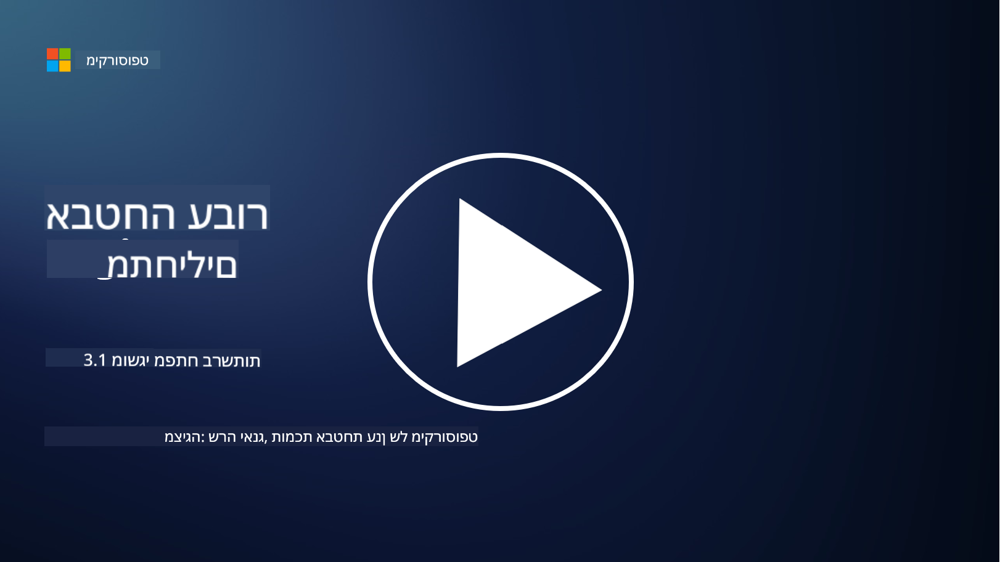
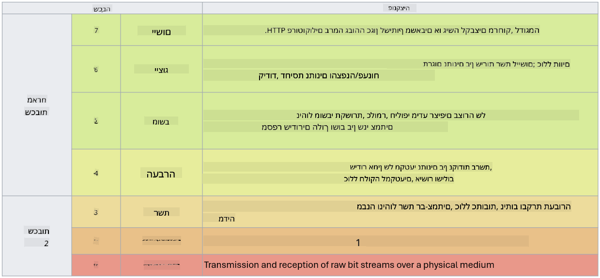

<!--
CO_OP_TRANSLATOR_METADATA:
{
  "original_hash": "252724eceeb183fb9018f88c5e1a3f0c",
  "translation_date": "2025-09-03T22:05:19+00:00",
  "source_file": "3.1 Networking key concepts.md",
  "language_code": "he"
}
-->
# מושגי יסוד ברשתות

אם עבדתם אי פעם בתחום ה-IT, סביר להניח שנחשפתם למושגים הקשורים לרשתות. למרות שבסביבות מודרניות אנו משתמשים בזהות כשליטה ראשית על היקף הגישה, זה לא אומר ששליטה ברשתות אינה חשובה. למרות שמדובר בנושא רחב מאוד, בשיעור זה נסקור כמה מושגי יסוד ברשתות.

בשיעור זה נעסוק ב:

- מהי כתובת IP?

- מהו מודל OSI?

- מהו TCP/UDP?

- מהם מספרי פורטים?

- מהי הצפנה במצב מנוחה ובמצב מעבר?

## מהי כתובת IP?

כתובת IP, או כתובת פרוטוקול אינטרנט, היא תווית מספרית שמוקצית לכל מכשיר המחובר לרשת מחשבים המשתמשת בפרוטוקול האינטרנט לצורך תקשורת. היא משמשת כמזהה ייחודי למכשירים בתוך רשת, ומאפשרת להם לשלוח ולקבל נתונים דרך האינטרנט או רשתות מחוברות אחרות. קיימות שתי גרסאות עיקריות של כתובות IP: IPv4 (גרסה 4 של פרוטוקול האינטרנט) ו-IPv6 (גרסה 6 של פרוטוקול האינטרנט). כתובת IP מיוצגת בדרך כלל בפורמט IPv4 (לדוגמה, 192.168.1.1) או בפורמט IPv6 (לדוגמה, 2001:0db8:85a3:0000:0000:8a2e:0370:7334).

## מהו מודל OSI?

מודל OSI (Open Systems Interconnection) הוא מסגרת רעיונית שמגדירה את הפונקציות של מערכת תקשורת לשבע שכבות נפרדות. כל שכבה מבצעת משימות ספציפיות ומתקשרת עם השכבות הסמוכות לה כדי להבטיח תקשורת יעילה ואמינה בין מכשירים ברשת. השכבות, מלמטה למעלה, הן:

1. שכבת הפיזיקה

2. שכבת הקישור הנתונים

3. שכבת הרשת

4. שכבת התעבורה

5. שכבת ההפעלה

6. שכבת ההצגה

7. שכבת היישום

מודל OSI מספק נקודת ייחוס משותפת להבנת האופן שבו פרוטוקולים וטכנולוגיות רשת מתקשרים, ללא תלות בחומרה או בתוכנה ספציפית.

_ref: https://en.wikipedia.org/wiki/OSI_model_

## מהו TCP/UDP?

TCP (Transmission Control Protocol) ו-UDP (User Datagram Protocol) הם שני פרוטוקולים בסיסיים בשכבת התעבורה המשמשים ברשתות מחשבים כדי לאפשר תקשורת בין מכשירים דרך האינטרנט או בתוך רשת מקומית. הם אחראים על פירוק נתונים לחבילות לצורך שידור והרכבתן מחדש לנתונים המקוריים בצד המקבל. עם זאת, הם שונים במאפיינים ובשימושים שלהם.

**TCP (Transmission Control Protocol)**:

TCP הוא פרוטוקול מבוסס חיבור המספק העברת נתונים אמינה ומסודרת בין מכשירים. הוא יוצר חיבור בין השולח למקבל לפני תחילת העברת הנתונים. TCP מבטיח שחבילות הנתונים יגיעו בסדר הנכון ויכול להתמודד עם שידור חוזר של חבילות שאבדו כדי להבטיח שלמות הנתונים. זה הופך את TCP למתאים ליישומים שדורשים העברת נתונים אמינה, כמו גלישה באינטרנט, דואר אלקטרוני, העברת קבצים (FTP) ותקשורת עם מסדי נתונים.

**UDP (User Datagram Protocol)**:

UDP הוא פרוטוקול ללא חיבור שמציע שידור נתונים מהיר יותר אך אינו מספק את אותה רמת אמינות כמו TCP. הוא אינו יוצר חיבור פורמלי לפני שליחת נתונים ואינו כולל מנגנונים לאישור או שידור חוזר של חבילות שאבדו. UDP מתאים ליישומים שבהם מהירות ויעילות חשובים יותר מאשר הבטחת העברת נתונים, כמו תקשורת בזמן אמת, מדיה זורמת, משחקים מקוונים ושאילתות DNS.

לסיכום, TCP נותן עדיפות לאמינות ולסדר העברת הנתונים, מה שהופך אותו למתאים ליישומים שדורשים דיוק בנתונים, בעוד UDP מדגיש מהירות ויעילות, מה שהופך אותו למתאים ליישומים שבהם אובדן נתונים קטן או שינוי סדר הנתונים מתקבלים בתמורה להפחתת זמן השהייה. הבחירה בין TCP ל-UDP תלויה בדרישות הספציפיות של היישום או השירות.

## מהם מספרי פורטים?

ברשתות, מספר פורט הוא מזהה מספרי המשמש להבדיל בין שירותים או יישומים שונים הפועלים על מכשיר יחיד בתוך רשת. פורטים מסייעים בהכוונת נתונים נכנסים ליישום המתאים. מספרי פורטים הם מספרים שלמים בגודל 16 ביט, כלומר הם נעים בין 0 ל-65535. הם מחולקים לשלוש טווחים:

- פורטים ידועים (0-1023): שמורים לשירותים סטנדרטיים כמו HTTP (פורט 80) ו-FTP (פורט 21).

- פורטים רשומים (1024-49151): משמשים ליישומים ושירותים שאינם חלק מהטווח הידוע אך רשומים באופן רשמי.

- פורטים דינמיים/פרטיים (49152-65535): זמינים לשימוש זמני או פרטי על ידי יישומים.

## מהי הצפנה במצב מנוחה ובמצב מעבר?

הצפנה היא תהליך של המרת נתונים לפורמט מאובטח כדי להגן עליהם מפני גישה או שינוי בלתי מורשים. ניתן ליישם הצפנה על נתונים הן "במצב מנוחה" (כאשר הם מאוחסנים על מכשיר או שרת) והן "במצב מעבר" (כאשר הם מועברים בין מכשירים או דרך רשתות).

הצפנה במצב מנוחה: מדובר בהצפנת נתונים המאוחסנים על מכשירים, שרתים או מערכות אחסון. גם אם תוקף מקבל גישה פיזית למדיה האחסון, הוא לא יוכל לגשת לנתונים ללא מפתחות ההצפנה. זה חשוב להגנה על נתונים רגישים במקרה של גניבת מכשיר, פריצות נתונים או גישה בלתי מורשית.

הצפנה במצב מעבר: מדובר בהצפנת נתונים בזמן שהם מועברים בין מכשירים או דרך רשתות. זה מונע ציתות וגישה בלתי מורשית לנתונים במהלך השידור. פרוטוקולים נפוצים להצפנה במצב מעבר כוללים HTTPS לתקשורת אינטרנט ו-TLS/SSL לאבטחת סוגים שונים של תעבורת רשת.

## קריאה נוספת
- [How Do IP Addresses Work? (howtogeek.com)](https://www.howtogeek.com/341307/how-do-ip-addresses-work/)
- [Understanding IP Address: An Introductory Guide (geekflare.com)](https://geekflare.com/understanding-ip-address/)
- [What is the OSI model? The 7 layers of OSI explained (techtarget.com)](https://www.techtarget.com/searchnetworking/definition/OSI)
- [The OSI Model – The 7 Layers of Networking Explained in Plain English (freecodecamp.org)](https://www.freecodecamp.org/news/osi-model-networking-layers-explained-in-plain-english/)
- [TCP/IP protocols - IBM Documentation](https://www.ibm.com/docs/en/aix/7.3?topic=protocol-tcpip-protocols)
- [Common Ports Cheat Sheet: The Ultimate Ports & Protocols List (stationx.net)](https://www.stationx.net/common-ports-cheat-sheet/)
- [Azure Data Encryption-at-Rest - Azure Security | Microsoft Learn](https://learn.microsoft.com/azure/security/fundamentals/encryption-atrest?WT.mc_id=academic-96948-sayoung)

---

**כתב ויתור**:  
מסמך זה תורגם באמצעות שירות תרגום מבוסס בינה מלאכותית [Co-op Translator](https://github.com/Azure/co-op-translator). למרות שאנו שואפים לדיוק, יש לקחת בחשבון שתרגומים אוטומטיים עשויים להכיל שגיאות או אי דיוקים. המסמך המקורי בשפתו המקורית צריך להיחשב כמקור סמכותי. עבור מידע קריטי, מומלץ להשתמש בתרגום מקצועי על ידי אדם. איננו נושאים באחריות לאי הבנות או לפרשנויות שגויות הנובעות משימוש בתרגום זה.