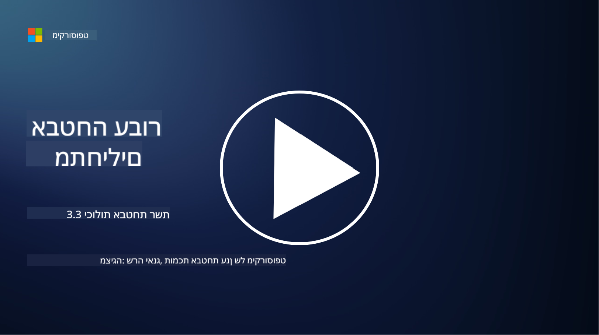

<!--
CO_OP_TRANSLATOR_METADATA:
{
  "original_hash": "c3aba077bb98eebc925dd58d870229ab",
  "translation_date": "2025-09-03T20:20:46+00:00",
  "source_file": "3.3 Network security capabilities.md",
  "language_code": "he"
}
-->
# יכולות אבטחת רשת

בשיעור זה נלמד על היכולות הבאות שניתן להשתמש בהן כדי לאבטח רשת:

 - חומות אש מסורתיות
 - חומות אש ליישומי אינטרנט
 - קבוצות אבטחה בענן
 - CDN
 - מאזני עומסים
 - שרתי Bastion
 - VPNs
 - הגנה מפני התקפות DDoS

## חומות אש מסורתיות

חומות אש מסורתיות הן התקני אבטחה שמפקחים ושולטים בתעבורת רשת נכנסת ויוצאת על בסיס כללי אבטחה מוגדרים מראש. הן פועלות כמחסום בין רשת פנימית מהימנה לבין רשתות חיצוניות לא מהימנות, ומסננות תעבורה כדי למנוע גישה לא מורשית ואיומים פוטנציאליים.

## חומות אש ליישומי אינטרנט

חומות אש ליישומי אינטרנט (WAFs) הן חומות אש מתמחות שנועדו להגן על יישומי אינטרנט מפני התקפות שונות, כגון הזרקת SQL, סקריפטים בין-אתריים ופגיעויות אחרות. הן מנתחות בקשות ותשובות HTTP כדי לזהות ולחסום תעבורה זדונית המכוונת ליישומי אינטרנט.

## קבוצות אבטחה בענן

קבוצות אבטחה הן תכונת אבטחת רשת בסיסית המסופקת על ידי ספקי שירותי ענן. הן פועלות כחומות אש וירטואליות השולטות בתעבורה נכנסת ויוצאת אל וממשאבי ענן, כגון מכונות וירטואליות (VMs) ומופעים. קבוצות אבטחה מאפשרות לארגונים להגדיר כללים שקובעים אילו סוגי תעבורה מותרים ואילו נדחים, ומוסיפות שכבת הגנה נוספת לפריסות ענן.

## רשת הפצת תוכן (CDN)

רשת הפצת תוכן היא רשת מבוזרת של שרתים הממוקמים במיקומים גיאוגרפיים שונים. CDNs מסייעים בשיפור הביצועים והזמינות של אתרים על ידי שמירת תוכן במטמון והגשתו משרתים הקרובים יותר למשתמש. הם גם מספקים רמה מסוימת של הגנה מפני התקפות DDoS על ידי הפצת התעבורה בין מיקומי שרתים שונים.

## מאזני עומסים

מאזני עומסים מפזרים תעבורת רשת נכנסת בין מספר שרתים כדי לייעל את ניצול המשאבים, להבטיח זמינות גבוהה ולשפר את ביצועי היישומים. הם מסייעים במניעת עומס יתר על שרתים ושומרים על זמני תגובה יעילים, מה שמחזק את עמידות הרשת.

## שרתי Bastion

שרתי Bastion הם שרתים מאובטחים ומבודדים המספקים גישה מבוקרת לרשת מתוך רשת חיצונית ולא מהימנה (כגון האינטרנט). הם משמשים כנקודות כניסה למנהלים לגשת למערכות פנימיות בצורה מאובטחת. שרתי Bastion מוגדרים בדרך כלל עם אמצעי אבטחה חזקים כדי לצמצם את שטח התקיפה.

## רשתות פרטיות וירטואליות (VPNs)

VPNs יוצרים מנהרות מוצפנות בין מכשיר המשתמש לבין שרת מרוחק, ומבטיחים תקשורת מאובטחת ופרטית על גבי רשתות שעלולות להיות לא בטוחות כמו האינטרנט. VPNs משמשים בדרך כלל כדי לספק גישה מרחוק לרשתות פנימיות, ומאפשרים למשתמשים לגשת למשאבים כאילו הם נמצאים פיזית באותה רשת.

## כלי הגנה מפני התקפות DDoS

כלים ושירותים להגנה מפני התקפות DDoS (התקפות מניעת שירות מבוזרות) נועדו לצמצם את ההשפעה של התקפות DDoS, שבהן מספר מכשירים שנפגעו מציפים רשת או שירות כדי להעמיס עליו. פתרונות הגנה מפני DDoS מזהים ומסננים תעבורה זדונית, ומבטיחים שהתעבורה הלגיטימית תוכל להגיע ליעדה.

## קריאה נוספת

- [What Is a Firewall? - Cisco](https://www.cisco.com/c/en/us/products/security/firewalls/what-is-a-firewall.html#~types-of-firewalls)
- [What Does a Firewall Actually Do? (howtogeek.com)](https://www.howtogeek.com/144269/htg-explains-what-firewalls-actually-do/)
- [What is a Firewall? How Firewalls Work & Types of Firewalls (kaspersky.com)](https://www.kaspersky.com/resource-center/definitions/firewall)
- [Network security group - how it works | Microsoft Learn](https://learn.microsoft.com/azure/virtual-network/network-security-group-how-it-works)
- [Introduction to Azure Content Delivery Network (CDN) - Training | Microsoft Learn](https://learn.microsoft.com/training/modules/intro-to-azure-content-delivery-network/?WT.mc_id=academic-96948-sayoung)
- [What is a content delivery network (CDN)? - Azure | Microsoft Learn](https://learn.microsoft.com/azure/cdn/cdn-overview?WT.mc_id=academic-96948-sayoung)
- [What Is Load Balancing? How Load Balancers Work (nginx.com)](https://www.nginx.com/resources/glossary/load-balancing/)
- [Bastion hosts vs. VPNs · Tailscale](https://tailscale.com/learn/bastion-hosts-vs-vpns/)
- [What is VPN? How It Works, Types of VPN (kaspersky.com)](https://www.kaspersky.com/resource-center/definitions/what-is-a-vpn)
- [Introduction to Azure DDoS Protection - Training | Microsoft Learn](https://learn.microsoft.com/training/modules/introduction-azure-ddos-protection/?WT.mc_id=academic-96948-sayoung)
- [What Is a DDoS Attack? | Microsoft Security](https://www.microsoft.com/security/business/security-101/what-is-a-ddos-attack?WT.mc_id=academic-96948-sayoung)

---

**כתב ויתור**:  
מסמך זה תורגם באמצעות שירות תרגום מבוסס בינה מלאכותית [Co-op Translator](https://github.com/Azure/co-op-translator). למרות שאנו שואפים לדיוק, יש לקחת בחשבון שתרגומים אוטומטיים עשויים להכיל שגיאות או אי דיוקים. המסמך המקורי בשפתו המקורית צריך להיחשב כמקור סמכותי. עבור מידע קריטי, מומלץ להשתמש בתרגום מקצועי על ידי אדם. איננו נושאים באחריות לאי הבנות או לפרשנויות שגויות הנובעות משימוש בתרגום זה.