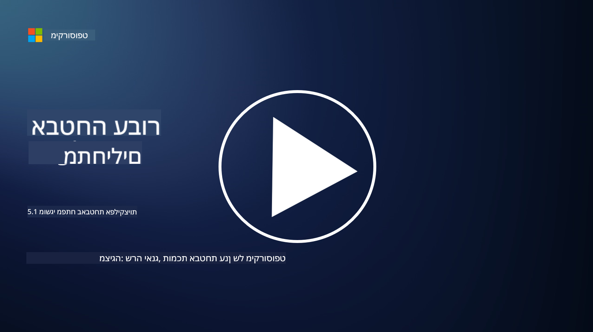

<!--
CO_OP_TRANSLATOR_METADATA:
{
  "original_hash": "e4b56bb23078d3ffb7ad407d280b0c36",
  "translation_date": "2025-09-03T21:09:38+00:00",
  "source_file": "5.1 AppSec key concepts.md",
  "language_code": "he"
}
-->
# מושגי יסוד באבטחת אפליקציות

אבטחת אפליקציות היא תחום התמחות באבטחת מידע בפני עצמו. בחלק זה של הקורס נעמיק יותר באבטחת אפליקציות.

## מבוא

בשיעור זה נעסוק ב:

- מהי אבטחת אפליקציות?

- מהם מושגי היסוד/עקרונות של אבטחת אפליקציות?

## מהי אבטחת אפליקציות?

אבטחת אפליקציות, המכונה לעיתים "AppSec", מתייחסת לפרקטיקה של הגנה על אפליקציות תוכנה מפני איומי אבטחה, חולשות ותקיפות. היא כוללת את התהליכים, הטכניקות והכלים המשמשים לזיהוי, צמצום ומניעת סיכוני אבטחה לאורך כל מחזור החיים של פיתוח, פריסה ותחזוקת אפליקציה.

אבטחת אפליקציות היא קריטית מכיוון שאפליקציות הן יעד נפוץ לתקיפות סייבר. גורמים זדוניים מנצלים חולשות ותקלות בתוכנה כדי להשיג גישה לא מורשית, לגנוב נתונים, לשבש שירותים או לבצע פעילויות זדוניות אחרות. אבטחת אפליקציות אפקטיבית מסייעת להבטיח את סודיות, שלמות וזמינות האפליקציה והנתונים הקשורים אליה.

## מהם מושגי היסוד/עקרונות של אבטחת אפליקציות?

מושגי יסוד ועקרונות שמנחים את אבטחת האפליקציות כוללים:

1. **אבטחה בתכנון**:

- יש לשלב את האבטחה בתכנון ובארכיטקטורה של האפליקציה מההתחלה, ולא להוסיף אותה בדיעבד.

2. **אימות קלט**:

- יש לאמת את כל הקלטים מהמשתמשים כדי לוודא שהם תואמים לפורמטים הצפויים ואינם מכילים קוד או נתונים זדוניים.

3. **קידוד פלט**:

- נתונים שנשלחים ללקוח צריכים להיות מקודדים כראוי כדי למנוע חולשות כמו XSS (Cross-Site Scripting).

4. **אימות והרשאות**:

- יש לאמת משתמשים ולהעניק להם גישה למשאבים בהתאם לתפקידים והרשאות שלהם.

5. **הגנת נתונים**:

- נתונים רגישים צריכים להיות מוצפנים בעת אחסון, העברה ועיבוד כדי למנוע גישה לא מורשית.

6. **ניהול סשנים**:

- ניהול סשנים מאובטח מבטיח שהסשנים של המשתמשים מוגנים מפני חטיפה וגישה לא מורשית.

7. **תלות מאובטחת**:

- יש לעדכן את כל התלויות התוכנתיות עם תיקוני אבטחה כדי למנוע חולשות.

8. **טיפול בשגיאות ורישום**:

- יש ליישם טיפול בשגיאות בצורה מאובטחת כדי להימנע מחשיפת מידע רגיש ולהבטיח פרקטיקות רישום מאובטחות.

9. **בדיקות אבטחה**:

- יש לבדוק באופן קבוע את האפליקציות לאיתור חולשות באמצעות שיטות כמו בדיקות חדירה, סקירות קוד וכלי סריקה אוטומטיים.

10. **מחזור חיים מאובטח לפיתוח תוכנה (SDLC)**:

- יש לשלב פרקטיקות אבטחה בכל שלב במחזור החיים של פיתוח התוכנה, החל מדרישות ועד לפריסה ותחזוקה.

## קריאה נוספת

- [SheHacksPurple: מהי אבטחת אפליקציות? - YouTube](https://www.youtube.com/watch?v=eNmccQNzSSY)
- [מהי אבטחת אפליקציות? - Cisco](https://www.cisco.com/c/en/us/solutions/security/application-first-security/what-is-application-security.html#~how-does-it-work)
- [מהי אבטחת אפליקציות? תהליך וכלים לאבטחת תוכנה | CSO Online](https://www.csoonline.com/article/566471/what-is-application-security-a-process-and-tools-for-securing-software.html)
- [סדרת Cheat Sheet של OWASP | OWASP Foundation](https://owasp.org/www-project-cheat-sheets/)

---

**כתב ויתור**:  
מסמך זה תורגם באמצעות שירות תרגום מבוסס AI [Co-op Translator](https://github.com/Azure/co-op-translator). בעוד שאנו שואפים לדיוק, יש להיות מודעים לכך שתרגומים אוטומטיים עשויים להכיל שגיאות או אי דיוקים. המסמך המקורי בשפתו המקורית צריך להיחשב כמקור סמכותי. עבור מידע קריטי, מומלץ להשתמש בתרגום מקצועי על ידי אדם. איננו נושאים באחריות לאי הבנות או לפרשנויות שגויות הנובעות משימוש בתרגום זה.