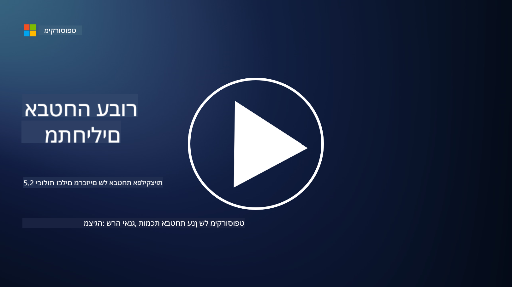

<!--
CO_OP_TRANSLATOR_METADATA:
{
  "original_hash": "790a3fa7e535ec60bb51bde13e759781",
  "translation_date": "2025-09-03T21:25:08+00:00",
  "source_file": "5.2 AppSec key capabilities.md",
  "language_code": "he"
}
-->
בקטע זה, נסקור פרטים נוספים על הכלים והיכולות המרכזיים שמשמשים באבטחת יישומים:

## הקדמה

בשיעור זה, נסקור מהם הכלים והיכולות המרכזיים שמשמשים באבטחת יישומים.

## יכולות וכלים מרכזיים באבטחת יישומים

היכולות והכלים המרכזיים שמשמשים באבטחת יישומים חיוניים לזיהוי, צמצום ומניעת פגיעויות ואיומים באפליקציות תוכנה. הנה כמה מהחשובים ביותר:

**1. בדיקות אבטחה סטטיות ליישומים (SAST)**:

- **יכולות**: מנתח קוד מקור, קוד בינארי או קוד מכונה כדי לזהות פגיעויות אבטחה בקוד של היישום.

- **כלים**: דוגמאות כוללות Fortify, Checkmarx ו-Veracode.

**2. בדיקות אבטחה דינמיות ליישומים (DAST)**:

- **יכולות**: סורק יישום פעיל כדי לזהות פגיעויות באמצעות שליחת בקשות קלט וניתוח תגובות.

- **כלים**: דוגמאות כוללות ZAP, Burp Suite ו-Qualys Web Application Scanning.

**3. בדיקות אבטחה אינטראקטיביות ליישומים (IAST)**:

- **יכולות**: משלב אלמנטים של SAST ו-DAST כדי לנתח קוד בזמן ריצה, מספק תוצאות מדויקות יותר ומפחית חיוביות שגויות.

- **כלים**: דוגמאות כוללות Contrast Security ו-HCL AppScan.

**4. הגנה עצמית בזמן ריצה ליישומים (RASP)**:

- **יכולות**: מנטר ומגן על יישומים בזמן אמת, מזהה ומגיב לאיומי אבטחה בזמן התרחשותם.

- **כלים**: דוגמאות כוללות Veracode Runtime Protection ו-F5 Advanced WAF עם RASP.

**5. חומות אש ליישומים אינטרנטיים (WAFs)**:

- **יכולות**: מספק שכבת הגנה בין היישום לאינטרנט, מסנן תעבורה נכנסת וחוסם בקשות זדוניות.

- **כלים**: דוגמאות כוללות ModSecurity, AWS WAF ו-Akamai Kona Site Defender.

**6. סריקת תלות**:

- **יכולות**: מזהה פגיעויות בספריות ובמרכיבים צד שלישי שמשמשים ביישום.

- **כלים**: דוגמאות כוללות OWASP Dependency-Check ו-Snyk.

**7. בדיקות חדירה (Pen Testing)**:

- **יכולות**: מדמה התקפות בעולם האמיתי כדי לגלות פגיעויות ולהעריך את אבטחת היישום.

- **כלים**: מבוצע על ידי האקרים מוסמכים ואנשי מקצוע באבטחה באמצעות כלים כמו Metasploit ו-Nmap.

**8. סריקות וניתוח אבטחה**:

- **יכולות**: סורק פגיעויות ידועות, שגיאות קונפיגורציה ומחדלי אבטחה.

- **כלים**: דוגמאות כוללות Nessus, Qualys Vulnerability Management ו-OpenVAS.

**9. כלים לאבטחת קונטיינרים**:

- **יכולות**: מתמקדים באבטחת יישומים מבוססי קונטיינרים וסביבתם.

- **כלים**: דוגמאות כוללות Docker Security Scanning ו-Aqua Security.

**10. הכשרה לפיתוח מאובטח**:

- **יכולות**: מספק הכשרה ותוכניות מודעות לצוותי פיתוח כדי לעודד שיטות קידוד מאובטחות.

- **כלים**: תוכניות הכשרה מותאמות ופלטפורמות.

**11. מסגרות בדיקות אבטחה**:

- **יכולות**: מספק מסגרות בדיקה מקיפות לצרכים שונים של בדיקות אבטחת יישומים.

- **כלים**: OWASP Amass, OWASP OWTF ו-FrAppSec.

**12. כלים לבדיקת קוד מאובטח**:

- **יכולות**: בודקים קוד מקור לאיתור פגיעויות אבטחה ושיטות קידוד מומלצות.

- **כלים**: דוגמאות כוללות SonarQube ו-Checkmarx.

**13. כלים לאבטחת APIs ומיקרו-שירותים**:

- **יכולות**: מתמקדים באבטחת APIs ומיקרו-שירותים, כולל אימות, הרשאה והגנת נתונים.

- **כלים**: דוגמאות כוללות Apigee, AWS API Gateway ו-Istio.

## קריאה נוספת

- [What Is Application Security? Concepts, Tools & Best Practices | HackerOne](https://www.hackerone.com/knowledge-center/what-application-security-concepts-tools-best-practices)
- [What is IAST? (Interactive Application Security Testing) (comparitech.com)](https://www.comparitech.com/net-admin/what-is-iast/)
- [10 Types of Application Security Testing Tools: When and How to Use Them (cmu.edu)](https://insights.sei.cmu.edu/blog/10-types-of-application-security-testing-tools-when-and-how-to-use-them/)
- [Shifting the Balance of Cybersecurity Risk: Principles and Approaches for Security-by-Design and Default | Cyber.gov.au](https://www.cyber.gov.au/about-us/view-all-content/publications/principles-and-approaches-for-security-by-design-and-default)

---

**כתב ויתור**:  
מסמך זה תורגם באמצעות שירות תרגום מבוסס בינה מלאכותית [Co-op Translator](https://github.com/Azure/co-op-translator). למרות שאנו שואפים לדיוק, יש לקחת בחשבון שתרגומים אוטומטיים עשויים להכיל שגיאות או אי דיוקים. המסמך המקורי בשפתו המקורית צריך להיחשב כמקור סמכותי. עבור מידע קריטי, מומלץ להשתמש בתרגום מקצועי על ידי אדם. איננו נושאים באחריות לאי הבנות או לפרשנויות שגויות הנובעות משימוש בתרגום זה.