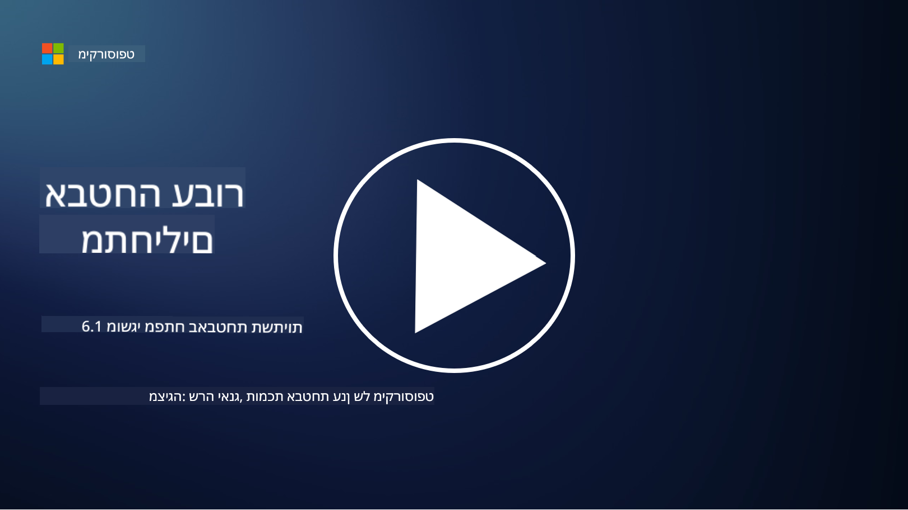

<!--
CO_OP_TRANSLATOR_METADATA:
{
  "original_hash": "882ebf66a648f419bcbf680ed6aefa00",
  "translation_date": "2025-09-03T20:05:09+00:00",
  "source_file": "6.1 Infrastructure security key concepts.md",
  "language_code": "he"
}
-->
# מושגי מפתח באבטחת תשתיות

"תשתיות" מתייחסות לאבני הבניין של כל סביבה טכנולוגית מידע (IT), הכוללות שרתים, שירותי ענן וקונטיינרים – מגוון רחב של טכנולוגיות שונות. היישומים שנדונו בסעיף הקודם פועלים על גבי תשתיות, ולכן גם הם יכולים להיות יעד לתוקפים.

בשיעור זה נדון ב:

- מהי היגיינת אבטחה ולמה היא חשובה?

- מהו ניהול מצב אבטחה?

- מהו תהליך עדכון תוכנה ולמה הוא חשוב?

- מה הם קונטיינרים ומה שונה באבטחתם?

## מהי היגיינת אבטחה ולמה היא חשובה?

**היגיינת אבטחה** מתייחסת למערכת של פרקטיקות והתנהגויות שאנשים וארגונים מאמצים כדי לשמור על הרגלי אבטחת סייבר טובים. היא כוללת נקיטת צעדים להגנה על מערכות, נתונים ורשתות מפני איומים ופגיעויות. היגיינת אבטחה טובה חשובה מכמה סיבות:

- **מניעת התקפות**: יישום פרקטיקות מומלצות יכול למנוע התקפות סייבר נפוצות, כמו דיוג, הדבקות בתוכנות זדוניות וגישה לא מורשית.

- **הגנה על נתונים**: היגיינת אבטחה נכונה מגנה על נתונים רגישים וסודיים מפני גניבה או חשיפה.

- **שמירה על אמון**: ארגונים שמפגינים היגיינת אבטחה טובה בונים אמון עם לקוחות ושותפים.

- **עמידה בדרישות רגולציה**: תקנות וסטנדרטים רבים מחייבים ארגונים ליישם פרקטיקות של היגיינת אבטחה.

- **הפחתת סיכונים**: היגיינת אבטחה עקבית מפחיתה את הסיכון הכולל לאירועי אבטחה והפרות.

היגיינת אבטחה כוללת פרקטיקות כמו עדכון תוכנה באופן שוטף, שימוש בסיסמאות חזקות ואימות רב-שלבי, גיבויים קבועים, הכשרת עובדים, וניטור פעילויות חשודות. היא מהווה את הבסיס לעמידה חזקה באבטחת סייבר.

## מהו ניהול מצב אבטחה?

ניהול מצב אבטחה מתייחס לתהליך הערכה, ניטור וניהול של מצב האבטחה הכולל של ארגון. מצב אבטחה מתאר את הגישה הכוללת של ארגון ואת מוכנותו להגן על מערכות טכנולוגיות מידע (IT), רשתות, נתונים ונכסים מפני איומי סייבר והתקפות. הוא כולל את האסטרטגיות, המדיניות, הפרקטיקות והטכנולוגיות שהארגון משתמש בהם כדי להגן על נכסיו הדיגיטליים ולשמור על סודיות, שלמות וזמינות המידע שלו. 

ניהול מצב אבטחה כולל הערכה ושמירה על אבטחת מערכות, רשתות, יישומים ונתונים כדי לוודא שהם עומדים במדיניות אבטחה, פרקטיקות מומלצות ודרישות רגולציה. מטרת ניהול מצב אבטחה היא לספק תמונה מקיפה של מצב האבטחה של הארגון, לזהות פגיעויות וחולשות, ולתעדף מאמצי תיקון.

## מהו תהליך עדכון תוכנה ולמה הוא חשוב?

**עדכון תוכנה** מתייחס לתהליך של יישום עדכונים לתוכנה, מערכות הפעלה ויישומים, הידועים גם כ"תיקונים" או "שיפורים". עדכונים אלו בדרך כלל מטפלים בפגיעויות אבטחה, באגים ובעיות אחרות שיכולות להיות מנוצלות על ידי תוקפים. גם מכשירי חומרה דורשים עדכונים: זה יכול להיות הקושחה שלהם או מערכת ההפעלה המובנית. עדכון חומרה יכול להיות קשה יותר מעדכון תוכנה.

עדכון תוכנה חשוב מכמה סיבות:

- **אבטחה**: עדכונים מתקנים פגיעויות ידועות שתוקפים יכולים לנצל כדי לפגוע במערכות ולגנוב נתונים.

- **יציבות**: עדכונים כוללים לעיתים שיפורים ביציבות ובביצועים, ומפחיתים את הסיכון לקריסות או תקלות מערכת.

- **עמידה בדרישות רגולציה**: תקנות וסטנדרטים רבים מחייבים ארגונים ליישם עדכוני אבטחה באופן מהיר.

- **שמירה על אמון**: עדכון תוכנה באופן שוטף מסייע לשמור על אמון הלקוחות ובעלי העניין על ידי הפגנת מחויבות לאבטחה.

- **הפחתת סיכונים**: עדכונים מפחיתים את שטח ההתקפה ואת הסבירות להצלחת התקפות סייבר.

אי יישום עדכונים בזמן יכול להשאיר מערכות פגיעות לניצול ידוע, ולהגדיל את הסיכון להפרות אבטחה ואובדן נתונים.

## מה הם קונטיינרים ומה שונה באבטחתם?

קונטיינרים הם צורה של חבילות תוכנה קלות משקל, עצמאיות וניתנות להרצה, המכילות את כל מה שנדרש להפעלת תוכנה, כולל קוד, זמן ריצה, ספריות וכלי מערכת. קונטיינרים מספקים סביבה עקבית ומבודדת ליישומים, מה שמקל על פיתוח, אריזה ופריסה של תוכנה בסביבות ופלטפורמות שונות. טכנולוגיות קונטיינריזציה פופולריות כוללות Docker ו-Kubernetes.

אבטחת קונטיינרים מתייחסת לפרקטיקות וטכנולוגיות המשמשות להגנה על קונטיינרים והיישומים שהם מארחים מפני איומי אבטחה ופגיעויות שונות. אבטחת קונטיינרים חשובה מכיוון שבעוד שקונטיינרים מציעים יתרונות רבים מבחינת ניידות ויכולת הרחבה, הם גם מציגים אתגרים אבטחתיים פוטנציאליים:

1. **אבטחת תמונות**: תמונות קונטיינרים יכולות להכיל פגיעויות, ואם לא מעדכנים ומתקנים אותן באופן שוטף, הן יכולות להיות מנוצלות על ידי תוקפים. אבטחת קונטיינרים כוללת סריקת תמונות לזיהוי פגיעויות ידועות והבטחת שימוש בתמונות מהימנות בלבד.

2. **אבטחת זמן ריצה**: קונטיינרים פועלים חייבים להיות מבודדים זה מזה ומהמערכת המארחת כדי למנוע גישה לא מורשית והתקפות פוטנציאליות. מנגנוני אבטחת זמן ריצה כוללים טכנולוגיות בידוד כמו namespaces ו-cgroups, וכן כלים לניטור וביקורת התנהגות קונטיינרים.

3. **אבטחת רשת**: קונטיינרים מתקשרים זה עם זה ועם מערכות חיצוניות דרך רשתות. חלוקה נכונה של רשתות וכללי חומת אש חיוניים לשליטה בתעבורה בין קונטיינרים ולמניעת גישה לא מורשית.

4. **בקרת גישה**: הבטחת גישה ושינויים בקונטיינרים רק על ידי משתמשים ותהליכים מורשים היא קריטית. בקרת גישה מבוססת תפקידים (RBAC) וכלי ניהול זהויות משמשים לעיתים קרובות לבקרת גישה.

5. **רישום וניטור**: אבטחת קונטיינרים כוללת איסוף וניתוח של יומנים ונתוני ניטור כדי לזהות ולהגיב לאירועי אבטחה ואנומליות בזמן אמת.

6. **אבטחת אורקסטרציה**: בעת שימוש בפלטפורמות אורקסטרציה כמו Kubernetes, אבטחת שכבת האורקסטרציה חשובה באותה מידה. זה כולל אבטחת שרת ה-API של Kubernetes, הבטחת מדיניות RBAC נכונה וביקורת פעילות הקלאסטר.

7. **ניהול סודות**: טיפול במידע רגיש, כמו מפתחות API וסיסמאות, בקונטיינרים דורש פתרונות אחסון וניהול מאובטחים כדי למנוע חשיפה.

פתרונות אבטחת קונטיינרים כוללים לרוב שילוב של פרקטיקות אבטחה מומלצות, כלי סריקת פגיעויות, מנגנוני הגנה בזמן ריצה, תצורות אבטחת רשת ותכונות אבטחת אורקסטרציה. ניטור מתמשך ואוטומציה הם מרכיבים חיוניים באבטחת קונטיינרים כדי לזהות ולהגיב במהירות לאיומים ככל שיישומים מבוססי קונטיינרים מתפתחים ומתרחבים.

## קריאה נוספת

- [The importance of security hygiene | Security Magazine](https://www.securitymagazine.com/articles/99510-the-importance-of-security-hygiene)
- [What is CSPM? | Microsoft Security](https://www.microsoft.com/security/business/security-101/what-is-cspm?WT.mc_id=academic-96948-sayoung)
- [What is Cloud Security Posture Management (CSPM)? | HackerOne](https://www.hackerone.com/knowledge-center/what-cloud-security-posture-management)
- [Function of cloud security posture management - Cloud Adoption Framework | Microsoft Learn](https://learn.microsoft.com/azure/cloud-adoption-framework/organize/cloud-security-posture-management?WT.mc_id=academic-96948-sayoung)
- [What Is a CNAPP? | Microsoft Security](https://www.microsoft.com/security/business/security-101/what-is-cnapp)
- [Why Everyone Is Talking About CNAPP (forbes.com)](https://www.forbes.com/sites/forbestechcouncil/2021/12/10/why-everyone-is-talking-about-cnapp/?sh=567275ca1549)
- [Why is patching important to cybersecurity? - CyberSmart](https://cybersmart.co.uk/blog/why-is-patching-important-to-cybersecurity/)
- [What Is Container Security? Complete Guide [2023] (aquasec.com)](https://www.aquasec.com/cloud-native-academy/container-security/container-security/)

---

**כתב ויתור**:  
מסמך זה תורגם באמצעות שירות תרגום מבוסס בינה מלאכותית [Co-op Translator](https://github.com/Azure/co-op-translator). למרות שאנו שואפים לדיוק, יש לקחת בחשבון שתרגומים אוטומטיים עשויים להכיל שגיאות או אי דיוקים. המסמך המקורי בשפתו המקורית צריך להיחשב כמקור סמכותי. עבור מידע קריטי, מומלץ להשתמש בתרגום מקצועי על ידי אדם. איננו נושאים באחריות לאי הבנות או לפרשנויות שגויות הנובעות משימוש בתרגום זה.