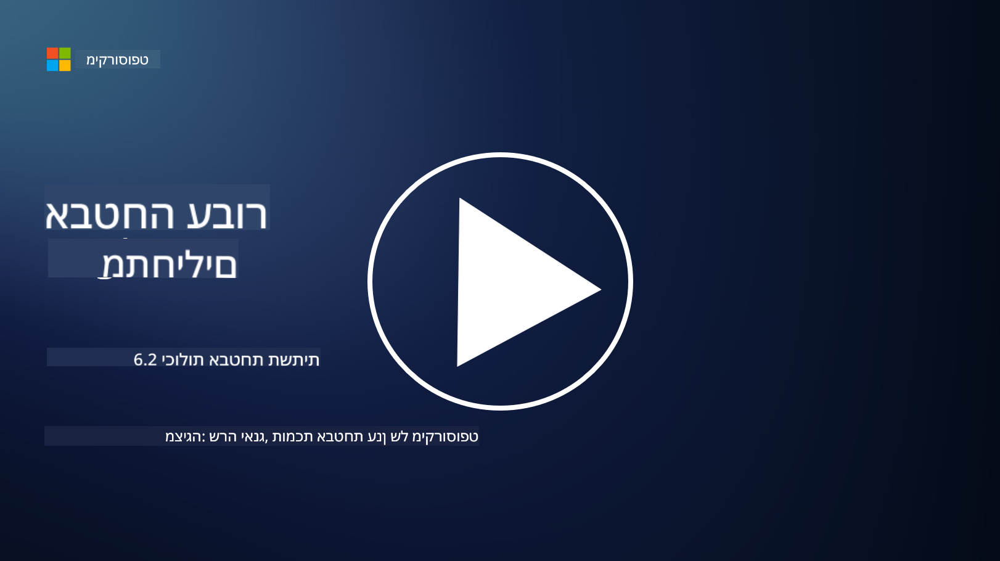

<!--
CO_OP_TRANSLATOR_METADATA:
{
  "original_hash": "7d79ba0e7668b3bdae1fba7aa047f6c0",
  "translation_date": "2025-09-03T20:53:37+00:00",
  "source_file": "6.2 Infrastructure security capabilities.md",
  "language_code": "he"
}
-->
# יכולות אבטחת תשתיות

בפרק זה, נסקור פרטים נוספים על הכלים והיכולות המרכזיים המשמשים באבטחת תשתיות.

**מבוא**

בשיעור זה נעסוק ב:

- מהו ניהול חולשות?

- מהו CSPM?

- מהו CNAPP?

## מהו ניהול חולשות?

ניהול חולשות הוא תהליך שיטתי לזיהוי, הערכה, תיעדוף, טיפול ומעקב אחר חולשות במערכות מחשב, תוכנה, רשתות ותשתיות. המטרה המרכזית של ניהול חולשות היא להפחית את החשיפה של הארגון לסיכוני אבטחה על ידי טיפול יזום בחולשות ידועות לפני שניתן לנצלן על ידי גורמים זדוניים. להלן סקירה של השלבים המרכזיים בתהליך:

זיהוי: סריקה וגילוי חולשות בנכסי הארגון, כולל שרתים, יישומים, התקני רשת ונקודות קצה.

הערכה: הערכת חומרת החולשה וההשפעה הפוטנציאלית שלה בהתבסס על גורמים כמו ציון CVSS והקשר עסקי.

תיעדוף: דירוג חולשות לפי רמת הסיכון שלהן וההשפעה הפוטנציאלית על פעילות הארגון והנתונים.

טיפול: פיתוח ויישום אסטרטגיות לתיקון או הפחתת חולשות, כולל התקנת עדכונים, הגדרת הגדרות אבטחה או פריסת אמצעי הגנה חלופיים.

אימות: אישור שהצעדים שננקטו היו יעילים בטיפול בחולשות.

מעקב מתמשך: מעקב שוטף אחר חולשות ואיומים פוטנציאליים, כולל סריקות והערכות חולשות קבועות.

ניהול חולשות הוא מרכיב קריטי באבטחת סייבר, המסייע לארגונים לשמור על מצב אבטחה חזק ולהפחית את הסבירות לפריצות אבטחה. דוגמאות לכלי ניהול חולשות כוללות Defender for Cloud, Nessus ו-Qualys.

## מהו CSPM?

ניהול מצב אבטחת ענן (Cloud Security Posture Management - CSPM) הוא סט של כלים, תהליכים ופרקטיקות שנועדו להעריך, לעקוב ולאכוף הגדרות אבטחה ונהלים מומלצים בסביבות ענן. פתרונות CSPM מסייעים לארגונים לזהות ולתקן שגיאות תצורה, פערי אבטחה והפרות תאימות בתשתית הענן שלהם, כגון ב-Amazon Web Services (AWS), Microsoft Azure, Google Cloud Platform (GCP) וספקי ענן אחרים.

היבטים מרכזיים של CSPM כוללים:

- הערכת תצורה: סריקת משאבי ושירותי ענן לזיהוי שגיאות תצורה, הגדרות לא בטוחות וסטיות מנהלים מומלצים.

- אכיפת מדיניות אבטחה: אכיפת מדיניות אבטחה וסטנדרטים תאימות בסביבות ענן על ידי תיקון אוטומטי של שגיאות תצורה או יצירת התראות.

- מעקב מתמשך: מתן נראות מתמשכת למצב האבטחה של נכסי ומשאבי ענן, עם התראות בזמן אמת על אירועי אבטחה.

- דיווח תאימות: יצירת דוחות ולוחות מחוונים להוכחת תאימות לדרישות רגולטוריות וסטנדרטים בתעשייה.

CSPM מסייע לארגונים להבטיח שתשתית הענן שלהם בטוחה, תואמת ומותאמת לנהלים מומלצים, ובכך להפחית את הסיכון לאירועי אבטחה הקשורים לענן. דוגמאות לכלי CSPM כוללות Defender for Cloud ו-Snyk.

## מהו CNAPP?

CNAPP הוא ראשי תיבות של Cloud-Native Application Protection Platform. מדובר בפלטפורמת תוכנה עננית מקיפה שמפשטת את המעקב, הזיהוי והתגובה לאיומי אבטחה וחולשות בענן. היא משלבת כלים ויכולות מרובים לפתרון תוכנה יחיד כדי להפחית את המורכבות ולהקל על פעולות צוותי DevOps ו-DevSecOps. CNAPP מציע אבטחת ענן ויישומים מקצה לקצה לאורך כל מחזור החיים של יישומי CI/CD, מהפיתוח ועד הייצור. הוא עונה על הצורך בתעשייה בכלי ניטור אבטחת ענן מודרניים, ניהול מצב אבטחה, מניעת פריצות וכלי שליטה. פתרונות CNAPP מספקים לצוותי אבטחה את היכולת לכמת ולהגיב לסיכונים בסביבת הענן. חלק מהתכונות של CNAPP כוללות נראות משופרת, כימות סיכונים, פיתוח תוכנה מאובטח ופתרון אבטחת ענן משולב. CNAPP משלב פתרונות אבטחת ענן מסורתיים שהיו מופרדים בממשק משתמש יחיד, מה שמקל על ארגונים להגן על כל טביעת הרגל של יישומי הענן שלהם. CNAPPs מאחדים כלים ומקורות נתונים מרובים לאבטחת ענן, כולל סריקת קונטיינרים, ניהול מצב אבטחת ענן, סריקת תשתית כקוד, ניהול הרשאות תשתית ענן ופלטפורמות הגנה על עומסי עבודה בזמן ריצה בענן.

## קריאה נוספת
- [What is CSPM? | Microsoft Security](https://www.microsoft.com/security/business/security-101/what-is-cspm?WT.mc_id=academic-96948-sayoung)
- [What is Cloud Security Posture Management (CSPM)? | HackerOne](https://www.hackerone.com/knowledge-center/what-cloud-security-posture-management)
- [Function of cloud security posture management - Cloud Adoption Framework | Microsoft Learn](https://learn.microsoft.com/azure/cloud-adoption-framework/organize/cloud-security-posture-management?WT.mc_id=academic-96948-sayoung)
- [What Is a CNAPP? | Microsoft Security](https://www.microsoft.com/security/business/security-101/what-is-cnapp?WT.mc_id=academic-96948-sayoung)
- [Why Everyone Is Talking About CNAPP (forbes.com)](https://www.forbes.com/sites/forbestechcouncil/2021/12/10/why-everyone-is-talking-about-cnapp/?sh=567275ca1549)
- [Improving Your Multi-Cloud Security with a Cloud-Native Application Protection Platform (CNAPP)](https://www.youtube.com/watch?v=5w42kQ_QjZg&t=212s)

---

**כתב ויתור**:  
מסמך זה תורגם באמצעות שירות תרגום מבוסס בינה מלאכותית [Co-op Translator](https://github.com/Azure/co-op-translator). בעוד שאנו שואפים לדיוק, יש להיות מודעים לכך שתרגומים אוטומטיים עשויים להכיל שגיאות או אי דיוקים. המסמך המקורי בשפתו המקורית צריך להיחשב כמקור סמכותי. עבור מידע קריטי, מומלץ להשתמש בתרגום מקצועי על ידי אדם. איננו נושאים באחריות לאי הבנות או לפרשנויות שגויות הנובעות משימוש בתרגום זה.