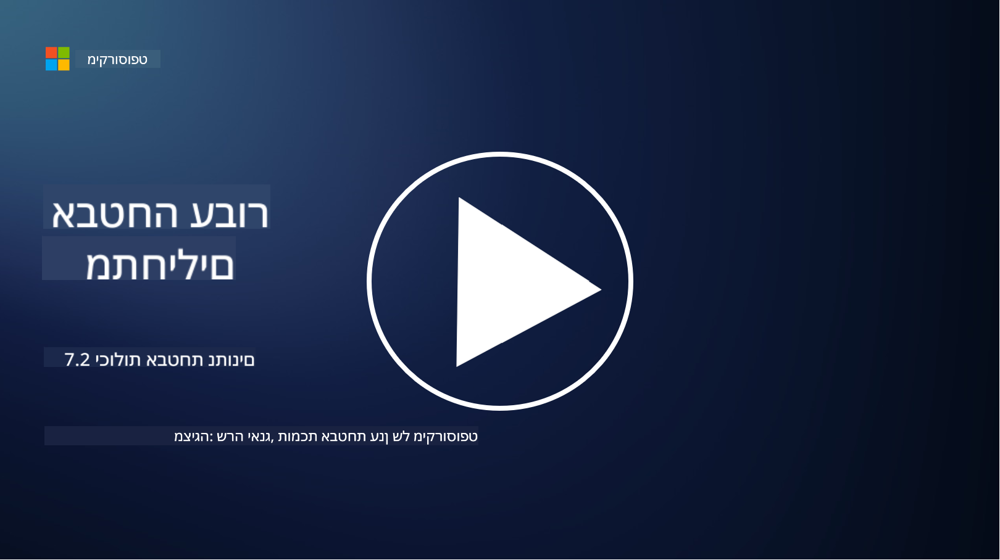

<!--
CO_OP_TRANSLATOR_METADATA:
{
  "original_hash": "50697add9758e54693442d502d2d5f8a",
  "translation_date": "2025-09-03T21:29:20+00:00",
  "source_file": "7.2 Data security capabilities.md",
  "language_code": "he"
}
-->
# יכולות אבטחת נתונים

בקטע זה, נסקור פרטים נוספים על הכלים והיכולות המרכזיים המשמשים באבטחת נתונים:

**מבוא**

בשיעור זה נעסוק ב:

- מהו כלי למניעת אובדן נתונים?

- מהו כלי לניהול סיכונים פנימיים?

- אילו כלים זמינים לניהול שמירת נתונים?

## מהו כלי למניעת אובדן נתונים?

כלי למניעת אובדן נתונים (Data Loss Prevention - DLP) מתייחס למערך פתרונות תוכנה וטכנולוגיות שנועדו למנוע גישה לא מורשית, שיתוף או דליפה של נתונים רגישים או סודיים בתוך ארגון. כלים אלו משתמשים בבדיקת תוכן, אכיפת מדיניות וניטור כדי לזהות ולהגן על נתונים רגישים מפני חשיפה או שימוש לרעה. דוגמאות למוצרים DLP כוללות: Symantec Data Loss Prevention, McAfee Total Protection for Data Loss Prevention, Microsoft 365 DLP**: משתלב עם יישומי Microsoft 365 כדי לעזור לארגונים לזהות ולהגן על נתונים רגישים בתוך מיילים, מסמכים והודעות.

## מהו כלי לניהול סיכונים פנימיים?

כלי לניהול סיכונים פנימיים מסייע לארגונים לזהות ולהפחית סיכונים הנובעים מעובדים, קבלנים או שותפים שעשויים לפגוע באבטחת הנתונים בכוונה או בטעות. כלים אלו מנטרים התנהגות משתמשים, דפוסי גישה ושימוש בנתונים כדי לזהות פעילויות חשודות ואיומים פנימיים פוטנציאליים. דוגמאות למוצרים לניהול סיכונים פנימיים כוללות: Microsoft Insider Risk Management (חלק מ-Microsoft 365), Forcepoint Insider Threat Data Protection, Varonis Insider Threat Detection.

## אילו כלים זמינים לניהול שמירת נתונים?

כלים לניהול שמירת נתונים כוללים תוכנות ופתרונות שנועדו לנהל את שמירת הנתונים ומחיקתם בהתאם למדיניות שמירת הנתונים של הארגון ולדרישות החוקיות. כלים אלו מסייעים באוטומציה של תהליך שמירת נתונים למשך תקופות זמן מוגדרות ומחיקתם בצורה מאובטחת כאשר הם אינם נחוצים עוד. דוגמאות למוצרים לניהול שמירת נתונים כוללות: Veritas Enterprise Vault, Commvault Complete Data Protection, Microsoft data lifecycle management. פתרונות אלו מסייעים לארגונים לשמור על שליטה בשמירת ומחיקת נתונים, להבטיח עמידה בתקנות הגנת נתונים ולנהל נתונים בצורה יעילה לאורך מחזור החיים שלהם.

## קריאה נוספת

- [Guide to Data Security Posture Management (DSPM) | CSA (cloudsecurityalliance.org)](https://cloudsecurityalliance.org/blog/2023/03/31/the-big-guide-to-data-security-posture-management-dspm/)
- [Data Loss Prevention across endpoints, apps, & services | Microsoft Purview](https://youtu.be/hvqq8L_0kgI)
- [18 Best Data Loss Prevention Software Tools 2023 (Free + Paid) (comparitech.com)](https://www.comparitech.com/data-privacy-management/data-loss-prevention-tools-software/)
- [Data Loss Prevention (nist.gov)](https://tsapps.nist.gov/publication/get_pdf.cfm?pub_id=904672)
- [Learn about insider risk management | Microsoft Learn](https://learn.microsoft.com/purview/insider-risk-management?WT.mc_id=academic-96948-sayoung)
- [Data Lifecycle Management | IBM](https://www.ibm.com/topics/data-lifecycle-management)
- [What Is Data Lifecycle Management (DLM)? | 2023 Best Practices (selecthub.com)](https://www.selecthub.com/big-data-analytics/data-lifecycle-management/)

---

**כתב ויתור**:  
מסמך זה תורגם באמצעות שירות תרגום מבוסס בינה מלאכותית [Co-op Translator](https://github.com/Azure/co-op-translator). בעוד שאנו שואפים לדיוק, יש להיות מודעים לכך שתרגומים אוטומטיים עשויים להכיל שגיאות או אי דיוקים. המסמך המקורי בשפתו המקורית צריך להיחשב כמקור סמכותי. עבור מידע קריטי, מומלץ להשתמש בתרגום מקצועי על ידי אדם. איננו נושאים באחריות לאי הבנות או לפרשנויות שגויות הנובעות משימוש בתרגום זה.