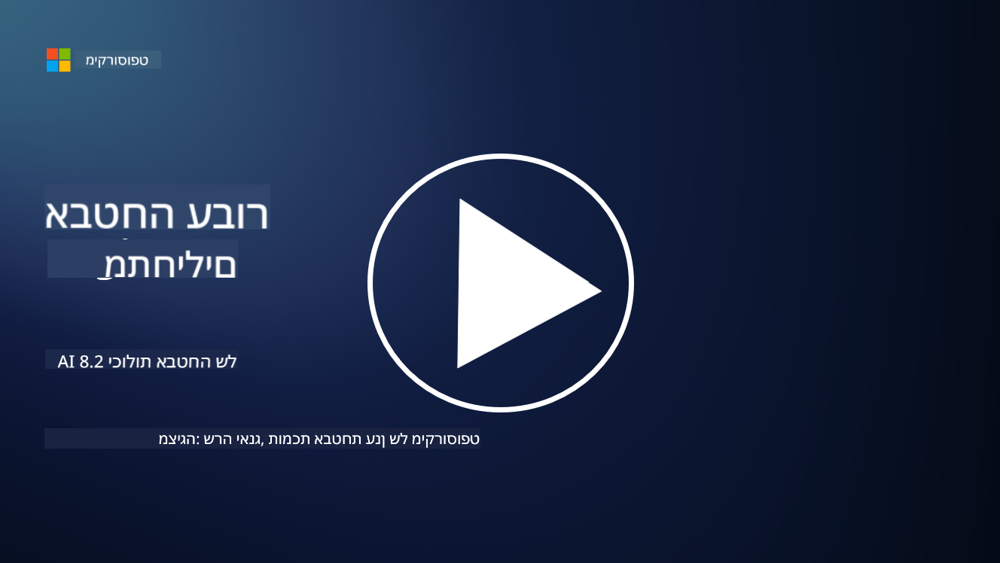

<!--
CO_OP_TRANSLATOR_METADATA:
{
  "original_hash": "b6bb7175672298d1e2f73ba7e0006f95",
  "translation_date": "2025-09-03T21:36:20+00:00",
  "source_file": "8.2 AI security capabilities.md",
  "language_code": "he"
}
-->
# יכולות אבטחת AI

## אילו כלים ויכולות קיימים כיום לאבטחת מערכות AI?

כיום קיימים מספר כלים ויכולות לאבטחת מערכות AI:

-   **Counterfit**: כלי אוטומציה בקוד פתוח לבדיקות אבטחה של מערכות AI, שנועד לעזור לארגונים לבצע הערכות סיכוני אבטחת AI ולהבטיח את החוסן של האלגוריתמים שלהם.
-   **כלים ללמידת מכונה עוינת**: כלים אלו מעריכים את החוסן של מודלים ללמידת מכונה כנגד התקפות עוינות, ועוזרים לזהות ולצמצם פגיעויות.
-   **ערכות כלים לאבטחת AI**: קיימות ערכות כלים בקוד פתוח המספקות משאבים לאבטחת מערכות AI, כולל ספריות ומסגרות ליישום אמצעי אבטחה.
-   **פלטפורמות שיתופיות**: שיתופי פעולה בין חברות וקהילות AI לפיתוח סורקי אבטחה ייעודיים ל-AI וכלים נוספים לאבטחת שרשרת האספקה של AI.

כלים ויכולות אלו הם חלק מתחום מתפתח שמטרתו לשפר את אבטחת מערכות AI כנגד מגוון איומים. הם מייצגים שילוב של מחקר, כלים מעשיים ושיתופי פעולה בתעשייה שמטרתם להתמודד עם האתגרים הייחודיים שמציבים טכנולוגיות AI.

## מה לגבי צוותי אדום ל-AI? כיצד זה שונה מצוותי אדום מסורתיים לאבטחה?

צוותי אדום ל-AI שונים מצוותי אדום מסורתיים לאבטחה בכמה היבטים מרכזיים:

-   **מיקוד במערכות AI**: צוותי אדום ל-AI מתמקדים בפגיעויות הייחודיות של מערכות AI, כמו מודלים ללמידת מכונה וצינורות נתונים, ולא בתשתיות IT מסורתיות.
-   **בדיקת התנהגות AI**: הם בודקים כיצד מערכות AI מגיבות לקלטים חריגים או בלתי צפויים, מה שיכול לחשוף פגיעויות שניתן לנצל על ידי תוקפים.
-   **חקר כשלי AI**: צוותי אדום ל-AI בוחנים כשלונות הן זדוניים והן תמימים, תוך התחשבות במגוון רחב יותר של דמויות וכשלי מערכת מעבר להפרות אבטחה בלבד.
-   **הזרקת פקודות ויצירת תוכן**: הם כוללים גם בדיקות לכשלונות כמו הזרקת פקודות, שבהן תוקפים משנים את התנהגות מערכות AI ליצירת תוכן מזיק או לא מבוסס.
-   **AI אתי ואחראי**: זהו חלק מהבטחת AI אחראי בעיצוב, שמוודא שמערכות AI עמידות בפני ניסיונות לגרום להן להתנהג בדרכים לא מכוונות.

בסך הכל, צוותי אדום ל-AI הם פרקטיקה מורחבת שלא רק כוללת בדיקות לפגיעויות אבטחה, אלא גם בדיקות לסוגים אחרים של כשלי מערכת ייחודיים לטכנולוגיות AI. זהו חלק חיוני בפיתוח מערכות AI בטוחות יותר על ידי הבנה וצמצום סיכונים חדשים הקשורים לפריסת AI.

## קריאה נוספת

 - [Microsoft AI Red Team building future of safer AI | Microsoft Security Blog](https://www.microsoft.com/en-us/security/blog/2023/08/07/microsoft-ai-red-team-building-future-of-safer-ai/?WT.mc_id=academic-96948-sayoung)
 - [Announcing Microsoft’s open automation framework to red team generative AI Systems | Microsoft Security Blog](https://www.microsoft.com/en-us/security/blog/2024/02/22/announcing-microsofts-open-automation-framework-to-red-team-generative-ai-systems/?WT.mc_id=academic-96948-sayoung)
 - [AI Security Tools: The Open-Source Toolkit | Wiz](https://www.wiz.io/academy/ai-security-tools)

---

**כתב ויתור**:  
מסמך זה תורגם באמצעות שירות תרגום מבוסס בינה מלאכותית [Co-op Translator](https://github.com/Azure/co-op-translator). למרות שאנו שואפים לדיוק, יש לקחת בחשבון שתרגומים אוטומטיים עשויים להכיל שגיאות או אי דיוקים. המסמך המקורי בשפתו המקורית צריך להיחשב כמקור סמכותי. עבור מידע קריטי, מומלץ להשתמש בתרגום מקצועי על ידי אדם. איננו נושאים באחריות לאי הבנות או לפרשנויות שגויות הנובעות משימוש בתרגום זה.