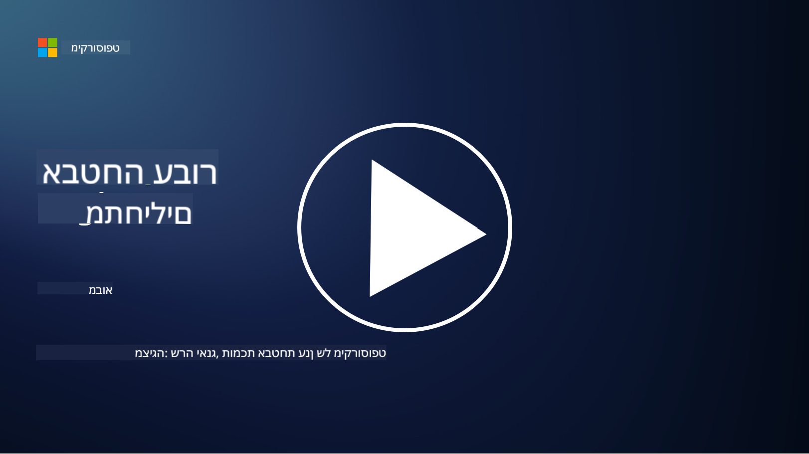

<!--
CO_OP_TRANSLATOR_METADATA:
{
  "original_hash": "fc3d47b5af0cc4fc954ae5d2ea2f7811",
  "translation_date": "2025-10-24T09:11:09+00:00",
  "source_file": "README.md",
  "language_code": "he"
}
-->
  
  
  
  
  
  

### 🌐 תמיכה רב-לשונית

#### נתמכת באמצעות GitHub Action (אוטומטית ותמיד מעודכנת)

[ערבית](../ar/README.md) | [בנגלית](../bn/README.md) | [בולגרית](../bg/README.md) | [בורמזית (מיאנמר)](../my/README.md) | [סינית (פשוטה)](../zh/README.md) | [סינית (מסורתית, הונג קונג)](../hk/README.md) | [סינית (מסורתית, מקאו)](../mo/README.md) | [סינית (מסורתית, טייוואן)](../tw/README.md) | [קרואטית](../hr/README.md) | [צ'כית](../cs/README.md) | [דנית](../da/README.md) | [הולנדית](../nl/README.md) | [אסטונית](../et/README.md) | [פינית](../fi/README.md) | [צרפתית](../fr/README.md) | [גרמנית](../de/README.md) | [יוונית](../el/README.md) | [עברית](./README.md) | [הינדית](../hi/README.md) | [הונגרית](../hu/README.md) | [אינדונזית](../id/README.md) | [איטלקית](../it/README.md) | [יפנית](../ja/README.md) | [קוריאנית](../ko/README.md) | [ליטאית](../lt/README.md) | [מלאית](../ms/README.md) | [מרטהי](../mr/README.md) | [נפאלית](../ne/README.md) | [נורווגית](../no/README.md) | [פרסית (פארסי)](../fa/README.md) | [פולנית](../pl/README.md) | [פורטוגזית (ברזיל)](../br/README.md) | [פורטוגזית (פורטוגל)](../pt/README.md) | [פונג'בית (גורמוקי)](../pa/README.md) | [רומנית](../ro/README.md) | [רוסית](../ru/README.md) | [סרבית (קירילית)](../sr/README.md) | [סלובקית](../sk/README.md) | [סלובנית](../sl/README.md) | [ספרדית](../es/README.md) | [סוואהילית](../sw/README.md) | [שוודית](../sv/README.md) | [טאגאלוג (פיליפינית)](../tl/README.md) | [טמילית](../ta/README.md) | [תאית](../th/README.md) | [טורקית](../tr/README.md) | [אוקראינית](../uk/README.md) | [אורדו](../ur/README.md) | [וייטנאמית](../vi/README.md)

**אם ברצונכם להוסיף שפות תרגום נוספות, הרשימה זמינה [כאן](https://github.com/Azure/co-op-translator/blob/main/getting_started/supported-languages.md)**

#### הצטרפו לקהילה שלנו  

# 🚀 סייבר למתחילים – תוכנית לימודים

בעידן המשתנה במהירות של אימוץ טכנולוגיות AI, חשוב יותר מתמיד להבין כיצד להגן על מערכות IT. הקורס הזה נועד ללמד אתכם מושגי יסוד בסייבר כדי להתחיל את הלמידה שלכם בתחום האבטחה. הקורס אינו תלוי ספק והוא מחולק לשיעורים קטנים שאמורים לקחת כ-30-60 דקות להשלמה. כל שיעור כולל מבחן קצר וקישורים לקריאה נוספת אם תרצו להעמיק בנושא.

מה הקורס כולל 📚

- 🔐 מושגי יסוד בסייבר כמו משולש ה-CIA, ההבדלים בין סיכונים, איומים ועוד.
- 🛡️ הבנת מהו אמצעי אבטחה ואילו צורות הוא יכול לקחת.
- 🌐 הבנת מהו אפס אמון ולמה זה חשוב באבטחת סייבר מודרנית.
- 🔑 הבנת מושגים ונושאים מרכזיים בתחום זהות, רשתות, תפעול אבטחה, תשתיות ואבטחת נתונים.
- 🔧 דוגמאות לכלים המשמשים ליישום אמצעי אבטחה.

מה הקורס אינו כולל 🙅‍♂️

- 🚫 כיצד להשתמש בכלי אבטחה ספציפיים.
- 🚫 כיצד "לפרוץ" או לבצע אבטחה התקפית.
- 🚫 לימוד תקני ציות ספציפיים.

לאחר שתסיימו את הקורס הזה, תוכלו להמשיך לכמה ממודולי הלמידה של Microsoft. אנו ממליצים להמשיך את הלמידה עם [Microsoft Security, Compliance, and Identity Fundamentals.](https://learn.microsoft.com/training/paths/describe-concepts-of-security-compliance-identity/?WT.mc_id=academic-96948-sayoung)

בסופו של דבר, תוכלו לשקול לגשת ל-[בחינת SC-900: Microsoft Security, Compliance, and Identity Fundamentals.](https://learn.microsoft.com/credentials/certifications/exams/sc-900/?WT.mc_id=academic-96948-sayoung)

> 💁 אם יש לכם משוב או הצעות על הקורס הזה או על תוכן שחסר לנו, נשמח לשמוע מכם!

## סקירת מודולים 📝  
| **מספר מודול** | **שם מודול**                           | **מושגים נלמדים**                  | **מטרות למידה**                                                                                          |
|-------------------|-------------------------------------------|--------------------------------------|-----------------------------------------------------------------------------------------------------------------|
| **1.1**           | מושגי אבטחה בסיסיים                   | [משולש ה-CIA](https://github.com/microsoft/Security-101/blob/main/1.1%20The%20CIA%20triad%20and%20other%20key%20concepts.md)                        | למדו על סודיות, זמינות ושלמות. גם על אותנטיות, אי-הכחשה ופרטיות. |
| **1.2**           | מושגי אבטחה בסיסיים                   | [איומי סייבר נפוצים](https://github.com/microsoft/Security-101/blob/main/1.2%20Common%20cybersecurity%20threats.md)        | למדו על איומי סייבר נפוצים שמאיימים על אנשים וארגונים.                             |
| **1.3**           | מושגי אבטחה בסיסיים                   | [הבנת ניהול סיכונים](https://github.com/microsoft/Security-101/blob/main/1.3%20Understanding%20risk%20management.md)       | למדו על הערכת והבנת סיכונים – השפעה/סבירות ויישום אמצעי אבטחה.                                                                                                               | |
| **1.4**           | מושגי אבטחה בסיסיים                   | [שיטות אבטחה ותיעוד](https://github.com/microsoft/Security-101/blob/main/1.4%20Security%20practices%20and%20documentation.md) | למדו על ההבדל בין מדיניות, נהלים, תקנים ותקנות/חוקים.                         |
| **1.5**           | מושגי אבטחה בסיסיים                   | [אפס אמון](https://github.com/microsoft/Security-101/blob/main/1.5%20Zero%20trust.md)                           | למדו על מהו אפס אמון וכיצד הוא משפיע על ארכיטקטורה? מהי הגנה לעומק?                   |
| **1.6**           | מושגי אבטחה בסיסיים                   | [מודל אחריות משותפת](https://github.com/microsoft/Security-101/blob/main/1.6%20Shared%20responsibility%20model.md)                           | מהו מודל אחריות משותפת וכיצד הוא משפיע על אבטחת סייבר?                  |
| **1.7**           | [מבחן סוף מודול](https://github.com/microsoft/Security-101/blob/main/1.7%20End%20of%20module%20quiz.md)                        |                                      |                                                                                                                 |
| **2.1**           | יסודות ניהול זהות וגישה | [מושגי מפתח ב-IAM](https://github.com/microsoft/Security-101/blob/main/2.1%20IAM%20key%20concepts.md)                     | למדו על עקרון המינימום הנדרש, הפרדת תפקידים, כיצד IAM תומך באפס אמון.               |
| **2.2**           | יסודות ניהול זהות וגישה | [ארכיטקטורת אפס אמון ב-IAM](https://github.com/microsoft/Security-101/blob/main/2.2%20IAM%20zero%20trust%20architecture.md)          | למדו על כיצד זהות היא ההיקף החדש עבור סביבות IT מודרניות והאיומים שהיא מפחיתה.          |
| **2.3**           | יסודות ניהול זהות וגישה | [יכולות IAM](https://github.com/microsoft/Security-101/blob/main/2.3%20IAM%20capabilities.md)                     | למדו על יכולות IAM ואמצעי אבטחה לזהויות                                                  |
| **2.4**           | [מבחן סוף מודול](https://github.com/microsoft/Security-101/blob/main/2.4%20End%20of%20module%20quiz.md)                        |                                      |                                                                                                                 |
| **3.1**           | יסודות אבטחת רשת             | [מושגי מפתח ברשתות](https://github.com/microsoft/Security-101/blob/main/3.1%20Networking%20key%20concepts.md)              | למדו על מושגי רשתות (כתובות IP, מספרי פורטים, הצפנה ועוד).                                 |
| **3.2**           | יסודות אבטחת רשת             | [ארכיטקטורת אפס אמון ברשתות](https://github.com/microsoft/Security-101/blob/main/3.2%20Networking%20zero%20trust%20architecture.md)   | למדו על כיצד רשתות תורמות לארכיטקטורת אפס אמון מקצה לקצה והאיומים שהיא מפחיתה.                  |
| **3.3**           | יסודות אבטחת רשת             | [יכולות אבטחת רשת](https://github.com/microsoft/Security-101/blob/main/3.3%20Network%20security%20capabilities.md)        | למדו על כלי אבטחת רשת – חומות אש, WAF, הגנה מפני DDoS ועוד.                                    |
| **3.4**           | [מבחן סוף מודול](https://github.com/microsoft/Security-101/blob/main/3.4%20End%20of%20module%20quiz.md)                        |                                      |                                                                                                                 |
| **4.1**           | יסודות תפעול אבטחה          | [מושגי מפתח ב-SecOps](https://github.com/microsoft/Security-101/blob/main/4.1%20SecOps%20key%20concepts.md)                  | למדו על למה תפעול אבטחה חשוב וכיצד הוא שונה מצוותי תפעול IT רגילים.                  |
| **4.2**           | יסודות תפעול אבטחה          | [ארכיטקטורת אפס אמון ב-SecOps](https://github.com/microsoft/Security-101/blob/main/4.2%20SecOps%20zero%20trust%20architecture.md)       | למדו על כיצד תפעול אבטחה תורם לארכיטקטורת אפס אמון מקצה לקצה והאיומים שהיא מפחיתה.                      |
| **4.3**           | יסודות תפעול אבטחה          | [יכולות SecOps](https://github.com/microsoft/Security-101/blob/main/4.3%20SecOps%20capabilities.md)                  | למדו על כלי תפעול אבטחה – SIEM, XDR ועוד.                                                                    |
| **4.4**           | [מבחן סוף מודול](https://github.com/microsoft/Security-101/blob/main/4.4%20End%20of%20module%20quiz.md)                        |                                      |                                                                                                                 |
| **5.1**           | יסודות אבטחת אפליקציות         | [מושגי מפתח ב-AppSec](https://github.com/microsoft/Security-101/blob/main/5.1%20AppSec%20key%20concepts.md)                  | למדו על מושגי אבטחת אפליקציות כמו עיצוב מאובטח, אימות קלט ועוד.                                    |
| **5.2**           | יסודות אבטחת יישומים                   | [יכולות אבטחת יישומים](https://github.com/microsoft/Security-101/blob/main/5.2%20AppSec%20key%20capabilities.md)                  | למדו על כלי אבטחת יישומים: כלי אבטחת צינור, סריקת קוד, סריקת סודות ועוד.                       |
| **5.3**           | [מבחן סיום מודול](https://github.com/microsoft/Security-101/blob/main/5.3%20End%20of%20module%20quiz.md)                        |                                      |                                                                                                                 |
| **6.1**           | יסודות אבטחת תשתיות                    | [מושגי מפתח באבטחת תשתיות](https://github.com/microsoft/Security-101/blob/main/6.1%20Infrastructure%20security%20key%20concepts.md) | למדו על חיזוק מערכות, עדכונים, היגיינת אבטחה ואבטחת קונטיינרים.                                  |
| **6.2**           | יסודות אבטחת תשתיות                    | [יכולות אבטחת תשתיות](https://github.com/microsoft/Security-101/blob/main/6.2%20Infrastructure%20security%20capabilities.md) | למדו על כלים שיכולים לסייע באבטחת תשתיות, כגון CSPM, אבטחת קונטיינרים ועוד.            |
| **6.3**           | [מבחן סיום מודול](https://github.com/microsoft/Security-101/blob/main/6.3%20End%20of%20module%20quiz.md)                        |                                      |                                                                                                                 |
| **7.1**           | יסודות אבטחת מידע                      | [מושגי מפתח באבטחת מידע](https://github.com/microsoft/Security-101/blob/main/7.1%20Data%20security%20key%20concepts.md)           | למדו על סיווג ושימור מידע ולמה זה חשוב לארגון.                     |
| **7.2**           | יסודות אבטחת מידע                      | [יכולות אבטחת מידע](https://github.com/microsoft/Security-101/blob/main/7.2%20Data%20security%20capabilities.md)           | למדו על כלי אבטחת מידע – DLP, ניהול סיכונים פנימיים, ממשל מידע ועוד.                          |
| **7.3**           | [מבחן סיום מודול](https://github.com/microsoft/Security-101/blob/main/7.3%20End%20of%20module%20quiz.md)                        |
| **8.1**           | יסודות אבטחת AI                      | [מושגי מפתח באבטחת AI](https://github.com/microsoft/Security-101/blob/main/8.1%20AI%20security%20key%20concepts.md)          | למדו על ההבדלים והדמיון בין אבטחה מסורתית לאבטחת AI.                 |
| **8.2**           | יסודות אבטחת AI                      | [יכולות אבטחת AI](https://github.com/microsoft/Security-101/blob/main/8.2%20AI%20security%20capabilities.md)           | למדו על כלי אבטחת AI והבקרות שניתן להשתמש בהן כדי לאבטח AI.                         |
| **8.3**           | יסודות אבטחת AI                      | [AI אחראי](https://github.com/microsoft/Security-101/blob/main/8.3%20Responsible%20AI.md)          | למדו מהו AI אחראי ומהם הנזקים הספציפיים ל-AI שעל אנשי אבטחה להיות מודעים אליהם.                          |
| **8.4**           | [מבחן סיום מודול](https://github.com/microsoft/Security-101/blob/main/8.4%20End%20of%20module%20quiz.md)     

## 🎒 קורסים נוספים 

הצוות שלנו מייצר קורסים נוספים! בדקו:

### Azure / Edge / MCP / סוכנים

---

### סדרת AI גנרטיבי

[-9333EA?style=for-the-badge&labelColor=E5E7EB&color=9333EA)](https://github.com/microsoft/Generative-AI-for-beginners-dotnet?WT.mc_id=academic-105485-koreyst)
[-C084FC?style=for-the-badge&labelColor=E5E7EB&color=C084FC)](https://github.com/microsoft/generative-ai-for-beginners-java?WT.mc_id=academic-105485-koreyst)
[-E879F9?style=for-the-badge&labelColor=E5E7EB&color=E879F9)](https://github.com/microsoft/generative-ai-with-javascript?WT.mc_id=academic-105485-koreyst)

---

### למידה בסיסית

---

### סדרת Copilot

## קבלת עזרה

אם אתם נתקעים או יש לכם שאלות על בניית אפליקציות AI, הצטרפו:

אם יש לכם משוב על מוצרים או נתקלתם בשגיאות במהלך הבנייה, בקרו:

---

**הצהרת אחריות**:  
מסמך זה תורגם באמצעות שירות תרגום AI [Co-op Translator](https://github.com/Azure/co-op-translator). למרות שאנו שואפים לדיוק, יש להיות מודעים לכך שתרגומים אוטומטיים עשויים להכיל שגיאות או אי דיוקים. המסמך המקורי בשפתו המקורית צריך להיחשב כמקור סמכותי. עבור מידע קריטי, מומלץ להשתמש בתרגום מקצועי אנושי. אנו לא נושאים באחריות לכל אי הבנות או פרשנויות שגויות הנובעות משימוש בתרגום זה.