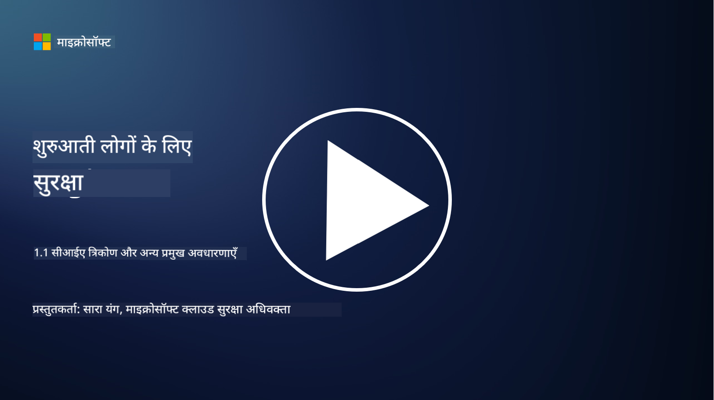
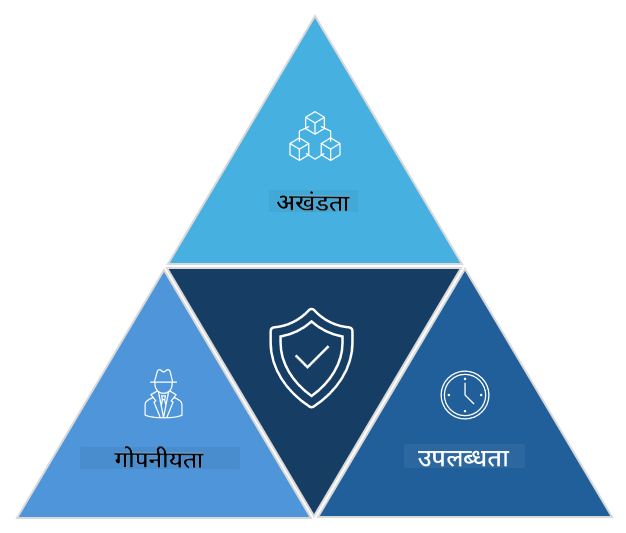

<!--
CO_OP_TRANSLATOR_METADATA:
{
  "original_hash": "16a76f9fa372fb63cffb6d76b855f023",
  "translation_date": "2025-09-03T18:47:21+00:00",
  "source_file": "1.1 The CIA triad and other key concepts.md",
  "language_code": "hi"
}
-->
# CIA त्रय और अन्य प्रमुख अवधारणाएँ

## परिचय

इस पाठ में, हम चर्चा करेंगे:

 - साइबर सुरक्षा क्या है?
   
 - साइबर सुरक्षा का CIA त्रय क्या है?

 - साइबर सुरक्षा के संदर्भ में प्रामाणिकता, गैर-प्रतिस्वीकृति और गोपनीयता क्या हैं?

## साइबर सुरक्षा क्या है?

साइबर सुरक्षा, जिसे सूचना सुरक्षा भी कहा जाता है, कंप्यूटर सिस्टम, नेटवर्क, उपकरण और डेटा को डिजिटल हमलों, अनधिकृत पहुंच, क्षति या चोरी से बचाने का अभ्यास है। साइबर सुरक्षा का मुख्य उद्देश्य डिजिटल संपत्तियों और जानकारी की गोपनीयता, अखंडता और उपलब्धता सुनिश्चित करना है। साइबर सुरक्षा विशेषज्ञ सुरक्षा नियंत्रणों को डिज़ाइन और लागू करते हैं ताकि संपत्तियों, डेटा और जानकारी की सुरक्षा की जा सके। जैसे-जैसे हमारा जीवन अधिक से अधिक डिजिटल और ऑनलाइन होता जा रहा है, साइबर सुरक्षा निजी व्यक्तियों और संगठनों दोनों के लिए एक प्रमुख चिंता का विषय बन गई है।

## साइबर सुरक्षा का CIA त्रय क्या है?

साइबर सुरक्षा त्रय उस मॉडल को संदर्भित करता है जो किसी भी साइबर सुरक्षा कार्य या सिस्टम/पर्यावरण को डिज़ाइन करने के लिए तीन मुख्य विचारों को शामिल करता है:

### गोपनीयता (Confidentiality)

यह वह विचार है जिसे अधिकांश लोग "साइबर सुरक्षा" के बारे में सोचते समय पहचानते हैं: गोपनीयता डेटा और जानकारी को अनधिकृत पहुंच प्रयासों से बचाने की प्रक्रिया है, यानी केवल वही लोग जो जानकारी देखना चाहते हैं, उसे एक्सेस कर सकते हैं। हालांकि, सभी डेटा समान नहीं होते हैं, और डेटा को आमतौर पर इस आधार पर वर्गीकृत और संरक्षित किया जाता है कि यदि इसे गलत लोगों द्वारा एक्सेस किया गया तो कितना नुकसान होगा।

### अखंडता (Integrity)

यह डेटा की सटीकता और विश्वसनीयता की सुरक्षा को संदर्भित करता है और यह सुनिश्चित करता है कि अनधिकृत व्यक्तियों द्वारा डेटा को बदला या संशोधित न किया जाए। उदाहरण के लिए, एक छात्र DMV में अपने ड्राइवर रिकॉर्ड पर अपनी जन्म तिथि बदल देता है ताकि वह अपनी उम्र अधिक दिखा सके और शराब खरीदने के लिए अपनी जन्म तिथि के साथ नया लाइसेंस प्राप्त कर सके।

### उपलब्धता (Availability)

यह परिचालन आईटी के लिए एक महत्वपूर्ण विचार है, लेकिन उपलब्धता साइबर सुरक्षा के लिए भी महत्वपूर्ण है। कुछ विशेष प्रकार के हमले होते हैं जो उपलब्धता को लक्षित करते हैं, जिनसे सुरक्षा विशेषज्ञों को बचाव करना होता है (जैसे, वितरित सेवा अस्वीकृति – DDoS – हमले)।

**साइबर सुरक्षा CIA त्रय**

## साइबर सुरक्षा के संदर्भ में प्रामाणिकता, गैर-प्रतिस्वीकृति और गोपनीयता क्या हैं?

ये अतिरिक्त महत्वपूर्ण अवधारणाएँ हैं जो सिस्टम और डेटा की सुरक्षा और विश्वसनीयता सुनिश्चित करने से संबंधित हैं:

**प्रामाणिकता (Authenticity)** - यह आश्वासन देता है कि वह जानकारी, संचार, या इकाई जिसके साथ आप बातचीत कर रहे हैं, वास्तविक है और अनधिकृत पक्षों द्वारा छेड़छाड़ या संशोधित नहीं की गई है।

**गैर-प्रतिस्वीकृति (Nonrepudiation)** - यह सुनिश्चित करने की अवधारणा है कि कोई पक्ष अपनी भागीदारी या किसी लेन-देन या संचार की प्रामाणिकता से इनकार नहीं कर सकता। यह किसी को यह दावा करने से रोकता है कि उन्होंने कोई संदेश नहीं भेजा या कोई विशेष कार्य नहीं किया, जब इसके विपरीत सबूत मौजूद हो।

**गोपनीयता (Privacy)** - यह संवेदनशील और व्यक्तिगत रूप से पहचान योग्य जानकारी को अनधिकृत पहुंच, उपयोग, प्रकटीकरण, या हेरफेर से बचाने को संदर्भित करता है। इसमें यह नियंत्रित करना शामिल है कि व्यक्तिगत डेटा तक कौन पहुंच सकता है और उस डेटा को कैसे संग्रहित, संग्रहीत और साझा किया जाता है।

## अतिरिक्त पढ़ाई

[What Is Information Security (InfoSec)? | Microsoft Security](https://www.microsoft.com/security/business/security-101/what-is-information-security-infosec#:~:text=Three%20pillars%20of%20information%20security%3A%20the%20CIA%20triad,as%20guiding%20principles%20for%20implementing%20an%20InfoSec%20plan.)

---

**अस्वीकरण**:  
यह दस्तावेज़ AI अनुवाद सेवा [Co-op Translator](https://github.com/Azure/co-op-translator) का उपयोग करके अनुवादित किया गया है। जबकि हम सटीकता सुनिश्चित करने का प्रयास करते हैं, कृपया ध्यान दें कि स्वचालित अनुवाद में त्रुटियां या अशुद्धियां हो सकती हैं। मूल भाषा में उपलब्ध मूल दस्तावेज़ को प्रामाणिक स्रोत माना जाना चाहिए। महत्वपूर्ण जानकारी के लिए, पेशेवर मानव अनुवाद की सिफारिश की जाती है। इस अनुवाद के उपयोग से उत्पन्न किसी भी गलतफहमी या गलत व्याख्या के लिए हम जिम्मेदार नहीं हैं।