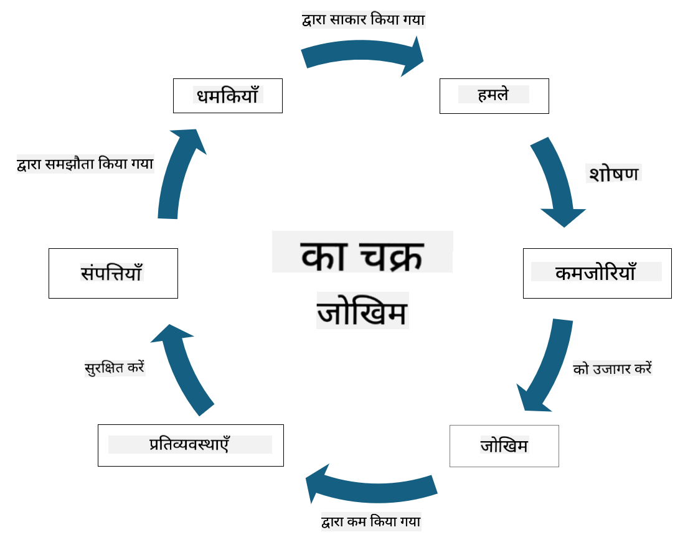

<!--
CO_OP_TRANSLATOR_METADATA:
{
  "original_hash": "fcca304f072cabf206388199e8e2e578",
  "translation_date": "2025-09-03T18:53:18+00:00",
  "source_file": "1.3 Understanding risk management.md",
  "language_code": "hi"
}
-->
# जोखिम प्रबंधन को समझना

## परिचय

इस पाठ में, हम चर्चा करेंगे:

- सामान्यतः उपयोग किए जाने वाले सुरक्षा शब्दावली की परिभाषाएँ  
- सुरक्षा नियंत्रण के प्रकार  
- सुरक्षा जोखिम का मूल्यांकन  

## सामान्यतः उपयोग किए जाने वाले सुरक्षा शब्दावली की परिभाषाएँ

ये शब्द साइबर सुरक्षा और जोखिम प्रबंधन के क्षेत्र में बुनियादी अवधारणाएँ हैं। आइए प्रत्येक शब्द को समझें और उनके आपसी संबंध को जानें:

1. **थ्रेट एजेंट**:

थ्रेट एजेंट वह व्यक्ति, समूह, संगठन, या स्वचालित प्रणाली है जो किसी सिस्टम या नेटवर्क की कमजोरियों का फायदा उठाकर नुकसान या हानि पहुंचा सकता है। थ्रेट एजेंट्स में हैकर्स, मैलवेयर लेखक, असंतुष्ट कर्मचारी, या कोई भी इकाई शामिल हो सकती है जो सूचना और तकनीकी सिस्टम के लिए खतरा पैदा करती है।

2. **थ्रेट (खतरा)**:

थ्रेट वह संभावित घटना या क्रिया है जो सिस्टम की कमजोरियों का फायदा उठाकर किसी संपत्ति को नुकसान पहुंचा सकती है। थ्रेट्स में हैकिंग, डेटा चोरी, डिनायल-ऑफ-सर्विस अटैक आदि शामिल हो सकते हैं। थ्रेट्स वह "क्या" हैं जो किसी संगठन की संपत्तियों को नुकसान पहुंचा सकते हैं।

3. **वल्नरेबिलिटी (कमजोरी)**:

वल्नरेबिलिटी सिस्टम के डिज़ाइन, कार्यान्वयन, या कॉन्फ़िगरेशन में वह कमजोरी या दोष है जिसे थ्रेट एजेंट द्वारा सिस्टम की सुरक्षा को खतरे में डालने के लिए उपयोग किया जा सकता है। वल्नरेबिलिटी सॉफ़्टवेयर, हार्डवेयर, प्रक्रियाओं, या मानव व्यवहार में हो सकती है। कमजोरियों की पहचान और समाधान करना सफल हमलों के जोखिम को कम करने के लिए आवश्यक है।

4. **रिस्क (जोखिम)**:

रिस्क वह संभावना है कि थ्रेट एजेंट वल्नरेबिलिटी का फायदा उठाकर नकारात्मक प्रभाव डालेगा। यह नुकसान, हानि, या क्षति की संभावना है जो थ्रेट और वल्नरेबिलिटी के बीच की बातचीत से उत्पन्न होती है। जोखिम को अक्सर इसके संभावित प्रभाव और घटना की संभावना के आधार पर आंका जाता है।

5. **एसेट (संपत्ति)**:

एसेट वह है जिसे संगठन सुरक्षित रखना चाहता है। इसमें भौतिक वस्तुएं (जैसे कंप्यूटर और सर्वर), डेटा (ग्राहक जानकारी, वित्तीय रिकॉर्ड), बौद्धिक संपत्ति (व्यापार रहस्य, पेटेंट), और मानव संसाधन (कर्मचारियों के कौशल और ज्ञान) शामिल हो सकते हैं। संपत्तियों की सुरक्षा साइबर सुरक्षा का मुख्य लक्ष्य है।

6. **एक्सपोज़र (खुलासा)**:

एक्सपोज़र वह स्थिति है जब संभावित थ्रेट्स के लिए कमजोरियां मौजूद होती हैं। यह दिखाता है कि सिस्टम या नेटवर्क में कमजोरियों के कारण जोखिम कितना है।

7. **कंट्रोल (नियंत्रण)**:

कंट्रोल वह उपाय है जो कमजोरियों और थ्रेट्स से जुड़े जोखिम को कम करने के लिए लागू किया जाता है। कंट्रोल्स तकनीकी, प्रक्रियात्मक, या प्रशासनिक हो सकते हैं। इनका उद्देश्य संभावित थ्रेट्स और कमजोरियों को रोकना, पहचानना, या कम करना है। उदाहरणों में फायरवॉल, एक्सेस कंट्रोल्स, एन्क्रिप्शन, सुरक्षा नीतियां, और कर्मचारी प्रशिक्षण शामिल हैं।

इन शब्दों के बीच संबंध को संक्षेप में समझें: थ्रेट एजेंट कमजोरियों का फायदा उठाकर थ्रेट्स को अंजाम देते हैं, जो जोखिम पैदा कर सकते हैं और मूल्यवान संपत्तियों को नुकसान पहुंचा सकते हैं। एक्सपोज़र तब होता है जब कमजोरियां मौजूद होती हैं, और कंट्रोल्स जोखिम को कम करने के लिए लगाए जाते हैं ताकि थ्रेट्स के प्रभाव को रोका या कम किया जा सके। यह ढांचा साइबर सुरक्षा जोखिम प्रबंधन का आधार बनता है, जो संगठनों को उनके सूचना सिस्टम और संपत्तियों के संभावित जोखिमों की पहचान, मूल्यांकन, और समाधान करने में मार्गदर्शन करता है।

## सुरक्षा नियंत्रण के प्रकार

सुरक्षा नियंत्रण वे उपाय या सुरक्षा उपाय हैं जो सूचना सिस्टम और संपत्तियों को विभिन्न थ्रेट्स और कमजोरियों से बचाने के लिए लागू किए जाते हैं। इन्हें उनके उद्देश्य और फोकस के आधार पर कई श्रेणियों में वर्गीकृत किया जा सकता है। यहां सुरक्षा नियंत्रण के कुछ सामान्य प्रकार दिए गए हैं:

1. **प्रशासनिक नियंत्रण**:

ये नियंत्रण संगठन की सुरक्षा प्रथाओं और उपयोगकर्ता व्यवहार को नियंत्रित करने वाली नीतियों, प्रक्रियाओं, और दिशानिर्देशों से संबंधित हैं।

- सुरक्षा नीतियां और प्रक्रियाएं: दस्तावेज़ित दिशानिर्देश जो संगठन में सुरक्षा बनाए रखने के तरीके को परिभाषित करते हैं।  
- सुरक्षा जागरूकता और प्रशिक्षण: कर्मचारियों को सुरक्षा सर्वोत्तम प्रथाओं और संभावित थ्रेट्स के बारे में शिक्षित करने के कार्यक्रम।  
- घटना प्रतिक्रिया और प्रबंधन: सुरक्षा घटनाओं का जवाब देने और उन्हें कम करने की योजनाएं।  

2. **तकनीकी नियंत्रण**:

तकनीकी नियंत्रण सुरक्षा उपायों को लागू करने और सिस्टम और डेटा की सुरक्षा के लिए तकनीक का उपयोग करते हैं। तकनीकी नियंत्रण के उदाहरण हैं:

- एक्सेस कंट्रोल्स: उपाय जो उपयोगकर्ताओं की भूमिकाओं और अनुमतियों के आधार पर संसाधनों तक पहुंच को प्रतिबंधित करते हैं।  
- एन्क्रिप्शन: डेटा को सुरक्षित प्रारूप में बदलना ताकि अनधिकृत पहुंच को रोका जा सके।  
- फायरवॉल: नेटवर्क सुरक्षा उपकरण जो आने-जाने वाले ट्रैफ़िक को फ़िल्टर और नियंत्रित करते हैं।  
- इंट्रूज़न डिटेक्शन और प्रिवेंशन सिस्टम (IDPS): उपकरण जो संदिग्ध गतिविधि के लिए नेटवर्क ट्रैफ़िक की निगरानी करते हैं।  
- एंटीवायरस और एंटी-मैलवेयर सॉफ़्टवेयर: प्रोग्राम जो दुर्भावनापूर्ण सॉफ़्टवेयर का पता लगाते और हटाते हैं।  
- प्रमाणीकरण तंत्र: उपयोगकर्ताओं की पहचान सत्यापित करने के तरीके, जैसे पासवर्ड, बायोमेट्रिक्स, और मल्टी-फैक्टर प्रमाणीकरण।  
- पैच प्रबंधन: ज्ञात कमजोरियों को संबोधित करने के लिए सॉफ़्टवेयर को नियमित रूप से अपडेट करना।  

3. **भौतिक नियंत्रण**:

भौतिक नियंत्रण भौतिक संपत्तियों और सुविधाओं की सुरक्षा के उपाय हैं।

- सुरक्षा गार्ड और एक्सेस कंट्रोल कर्मी: भौतिक परिसर की निगरानी और नियंत्रण करने वाले कर्मी।  
- निगरानी कैमरे: गतिविधियों की निगरानी और रिकॉर्डिंग के लिए वीडियो मॉनिटरिंग सिस्टम।  
- ताले और भौतिक बाधाएं: संवेदनशील क्षेत्रों तक पहुंच को प्रतिबंधित करने के लिए भौतिक उपाय।  
- पर्यावरणीय नियंत्रण: उपकरण और डेटा केंद्रों को प्रभावित करने वाले तापमान, आर्द्रता, और अन्य पर्यावरणीय कारकों को नियंत्रित करने के उपाय।  

4. **ऑपरेशनल नियंत्रण**:

ये नियंत्रण दिन-प्रतिदिन के संचालन और गतिविधियों से संबंधित हैं जो सिस्टम की सुरक्षा सुनिश्चित करते हैं।

- परिवर्तन प्रबंधन: सिस्टम और कॉन्फ़िगरेशन में परिवर्तनों को ट्रैक और अनुमोदित करने की प्रक्रियाएं।  
- बैकअप और आपदा पुनर्प्राप्ति: सिस्टम विफलताओं या आपदाओं के मामले में डेटा बैकअप और पुनर्प्राप्ति की योजनाएं।  
- लॉगिंग और ऑडिटिंग: सुरक्षा और अनुपालन उद्देश्यों के लिए सिस्टम गतिविधियों की निगरानी और रिकॉर्डिंग।  
- सुरक्षित कोडिंग प्रथाएं: सॉफ़्टवेयर लिखने के दिशानिर्देश जो कमजोरियों को कम करते हैं।  

5. **कानूनी और नियामक नियंत्रण**:

ये नियंत्रण प्रासंगिक कानूनों, विनियमों, और उद्योग मानकों के अनुपालन को सुनिश्चित करते हैं। संगठन को जिन मानकों का पालन करना होता है, वे क्षेत्राधिकार, उद्योग क्षेत्र, और अन्य कारकों पर निर्भर करते हैं।

- डेटा संरक्षण विनियम: GDPR, HIPAA, और CCPA जैसे कानूनों का अनुपालन।  
- उद्योग-विशिष्ट मानक: भुगतान कार्ड डेटा सुरक्षा के लिए PCI DSS जैसे मानकों का पालन।  

सुरक्षा नियंत्रण की ये श्रेणियां संगठनों के लिए एक व्यापक सुरक्षा स्थिति बनाने में मदद करती हैं, जिससे उनके सिस्टम, डेटा, और संपत्तियों को विभिन्न प्रकार के थ्रेट्स से बचाया जा सके।

## सुरक्षा जोखिम का मूल्यांकन

कुछ सुरक्षा पेशेवरों का मानना है कि जोखिम प्रबंधन केवल जोखिम पेशेवरों के लिए है, लेकिन सुरक्षा जोखिम प्रबंधन की प्रक्रिया को समझना किसी भी सुरक्षा पेशेवर के लिए महत्वपूर्ण है ताकि वे सुरक्षा जोखिम को उस भाषा में व्यक्त कर सकें जिसे संगठन समझ सके और उस पर कार्रवाई कर सके।

संगठनों को लगातार सुरक्षा जोखिमों का मूल्यांकन करना चाहिए और यह तय करना चाहिए कि व्यवसाय के जोखिमों के खिलाफ क्या कार्रवाई करनी है (या नहीं करनी है)। नीचे इस प्रक्रिया का एक अवलोकन दिया गया है। ध्यान दें कि यह प्रक्रिया आमतौर पर संगठन के कई अलग-अलग टीमों द्वारा की जाती है; यह दुर्लभ है कि एक टीम जोखिम प्रबंधन की शुरुआत से अंत तक जिम्मेदार हो।

1. **संपत्तियों और थ्रेट्स की पहचान करें**:

संगठन उन संपत्तियों की पहचान करता है जिन्हें वह सुरक्षित रखना चाहता है। इनमें डेटा, सिस्टम, हार्डवेयर, सॉफ़्टवेयर, बौद्धिक संपत्ति आदि शामिल हो सकते हैं। इसके बाद, वे संभावित थ्रेट्स की पहचान करते हैं जो इन संपत्तियों को लक्षित कर सकते हैं।

2. **वल्नरेबिलिटी का मूल्यांकन करें**:

संगठन सिस्टम या प्रक्रियाओं में कमजोरियों या दोषों की पहचान करता है जिन्हें थ्रेट्स द्वारा उपयोग किया जा सकता है। ये कमजोरियां सॉफ़्टवेयर दोष, गलत कॉन्फ़िगरेशन, सुरक्षा नियंत्रण की कमी, और मानव त्रुटि से उत्पन्न हो सकती हैं।

3. **संभावना का मूल्यांकन करें**:

संगठन प्रत्येक थ्रेट के होने की संभावना का मूल्यांकन करता है। इसमें ऐतिहासिक डेटा, थ्रेट इंटेलिजेंस, उद्योग रुझान, और आंतरिक कारकों पर विचार करना शामिल है। संभावना को निम्न, मध्यम, या उच्च के रूप में वर्गीकृत किया जा सकता है।

4. **प्रभाव का मूल्यांकन करें**:

इसके बाद, संगठन प्रत्येक थ्रेट के संभावित प्रभाव को निर्धारित करता है यदि वह वल्नरेबिलिटी का फायदा उठाए। प्रभाव में वित्तीय नुकसान, परिचालन व्यवधान, प्रतिष्ठा को नुकसान, कानूनी परिणाम आदि शामिल हो सकते हैं। प्रभाव को भी निम्न, मध्यम, या उच्च के रूप में वर्गीकृत किया जा सकता है।

5. **जोखिम की गणना करें**:

संभावना और प्रभाव के मूल्यांकन को मिलाकर प्रत्येक पहचाने गए थ्रेट के लिए समग्र जोखिम स्तर की गणना की जाती है। यह अक्सर एक जोखिम मैट्रिक्स का उपयोग करके किया जाता है जो संभावना और प्रभाव स्तरों को संख्यात्मक मान या गुणात्मक विवरण प्रदान करता है। परिणामी जोखिम स्तर यह तय करने में मदद करता है कि किन जोखिमों को तुरंत ध्यान देने की आवश्यकता है।

6. **प्राथमिकता और निर्णय लेना**:

संगठन उच्चतम संभावना और प्रभाव मूल्यों वाले जोखिमों पर ध्यान केंद्रित करके जोखिमों को प्राथमिकता देता है। यह उन्हें संसाधनों को आवंटित करने और नियंत्रणों को अधिक प्रभावी ढंग से लागू करने की अनुमति देता है। उच्च जोखिम वाले थ्रेट्स को तुरंत ध्यान देने की आवश्यकता होती है, जबकि निम्न जोखिम वाले थ्रेट्स को लंबे समय तक संबोधित किया जा सकता है।

7. **जोखिम उपचार**:

जोखिम मूल्यांकन के आधार पर, संगठन प्रत्येक जोखिम को कम करने या प्रबंधित करने का निर्णय करता है। इसमें सुरक्षा नियंत्रण लागू करना, बीमा के माध्यम से जोखिम स्थानांतरित करना, या कुछ स्तर के शेष जोखिम को स्वीकार करना शामिल हो सकता है यदि वे प्रबंधनीय/बहुत महंगे हैं आदि।

8. **निरंतर निगरानी और समीक्षा**:

जोखिम मूल्यांकन एक बार की प्रक्रिया नहीं है। इसे समय-समय पर या जब भी संगठन के वातावरण में महत्वपूर्ण परिवर्तन होते हैं, किया जाना चाहिए। निरंतर निगरानी यह सुनिश्चित करती है कि नए थ्रेट्स, कमजोरियां, या व्यवसाय परिदृश्य में परिवर्तन को ध्यान में रखा जाए।

इस संरचित तरीके से सुरक्षा जोखिमों का मूल्यांकन करके, संगठन संसाधन आवंटन, सुरक्षा नियंत्रण, और समग्र जोखिम प्रबंधन रणनीतियों के बारे में सूचित निर्णय ले सकते हैं। लक्ष्य संगठन के समग्र जोखिम एक्सपोज़र को कम करना है, जबकि सुरक्षा प्रयासों को संगठन के व्यावसायिक लक्ष्यों और उद्देश्यों के साथ संरेखित करना है।

---

**अस्वीकरण**:  
यह दस्तावेज़ AI अनुवाद सेवा [Co-op Translator](https://github.com/Azure/co-op-translator) का उपयोग करके अनुवादित किया गया है। जबकि हम सटीकता के लिए प्रयासरत हैं, कृपया ध्यान दें कि स्वचालित अनुवाद में त्रुटियां या अशुद्धियां हो सकती हैं। मूल भाषा में उपलब्ध मूल दस्तावेज़ को आधिकारिक स्रोत माना जाना चाहिए। महत्वपूर्ण जानकारी के लिए, पेशेवर मानव अनुवाद की सिफारिश की जाती है। इस अनुवाद के उपयोग से उत्पन्न किसी भी गलतफहमी या गलत व्याख्या के लिए हम उत्तरदायी नहीं हैं।  