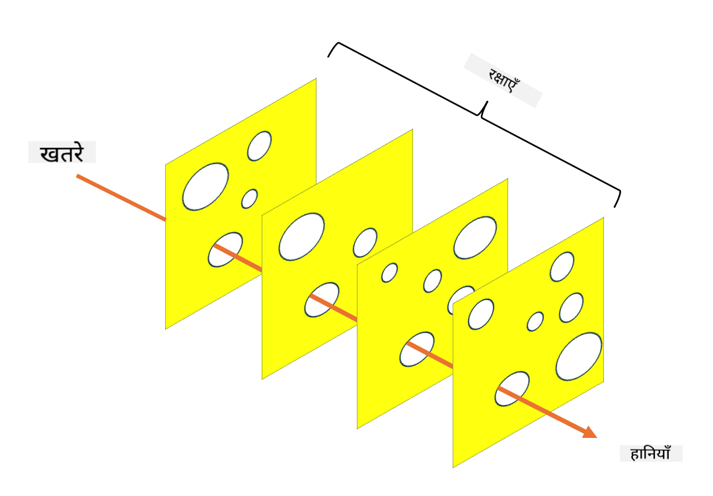

<!--
CO_OP_TRANSLATOR_METADATA:
{
  "original_hash": "75f77f972d2233c584f87c1eb96c983b",
  "translation_date": "2025-09-03T18:24:10+00:00",
  "source_file": "1.5 Zero trust.md",
  "language_code": "hi"
}
-->
# ज़ीरो ट्रस्ट

"ज़ीरो ट्रस्ट" आजकल सुरक्षा क्षेत्र में बहुत चर्चा में है। लेकिन इसका मतलब क्या है? क्या यह सिर्फ एक फैशन शब्द है? इस पाठ में, हम ज़ीरो ट्रस्ट के बारे में विस्तार से जानेंगे।

## परिचय

 - इस पाठ में, हम चर्चा करेंगे:
   
   
 - ज़ीरो ट्रस्ट क्या है?

   
  

 - ज़ीरो ट्रस्ट पारंपरिक सुरक्षा आर्किटेक्चर से कैसे अलग है?

   
   

 - डिफेंस इन डेप्थ क्या है?

## ज़ीरो ट्रस्ट

ज़ीरो ट्रस्ट एक साइबर सुरक्षा दृष्टिकोण है जो "ट्रस्ट बट वेरिफाई" की पारंपरिक सोच को चुनौती देता है। यह मानता है कि किसी भी इकाई, चाहे वह संगठन के नेटवर्क के अंदर हो या बाहर, पर स्वाभाविक रूप से भरोसा नहीं किया जाना चाहिए। इसके बजाय, ज़ीरो ट्रस्ट हर उपयोगकर्ता, डिवाइस और एप्लिकेशन को संसाधनों तक पहुंचने से पहले सत्यापित करने की वकालत करता है, चाहे वे कहीं भी हों। ज़ीरो ट्रस्ट का मुख्य सिद्धांत "अटैक सरफेस" को कम करना और सुरक्षा उल्लंघनों के संभावित प्रभाव को घटाना है।

ज़ीरो ट्रस्ट मॉडल में निम्नलिखित सिद्धांतों पर जोर दिया जाता है:

1. **पहचान सत्यापन करें**: सभी उपयोगकर्ताओं और डिवाइसों के लिए प्रमाणीकरण और प्राधिकरण को सख्ती से लागू किया जाता है, चाहे वे कहीं भी हों। ध्यान दें कि पहचान हमेशा मानव नहीं होती; यह डिवाइस, एप्लिकेशन आदि भी हो सकती है।

2. **कम से कम विशेषाधिकार**: उपयोगकर्ताओं और डिवाइसों को केवल उतनी ही पहुंच दी जाती है जितनी उनके कार्यों को पूरा करने के लिए आवश्यक है, जिससे समझौता होने पर संभावित नुकसान कम हो जाता है।

3. **माइक्रो-सेगमेंटेशन**: नेटवर्क संसाधनों को छोटे हिस्सों में विभाजित किया जाता है ताकि उल्लंघन की स्थिति में नेटवर्क के भीतर पार्श्व गति को सीमित किया जा सके।

4. **निरंतर निगरानी**: उपयोगकर्ता और डिवाइस व्यवहार की लगातार निगरानी और विश्लेषण किया जाता है ताकि असामान्यताओं और संभावित खतरों का पता लगाया जा सके। आधुनिक निगरानी तकनीकों में मशीन लर्निंग, एआई और थ्रेट इंटेलिजेंस का उपयोग करके अतिरिक्त विवरण और संदर्भ प्रदान किया जाता है।

5. **डेटा एन्क्रिप्शन**: डेटा को ट्रांजिट और रेस्ट दोनों में एन्क्रिप्ट किया जाता है ताकि अनधिकृत पहुंच को रोका जा सके।

6. **सख्त पहुंच नियंत्रण**: उपयोगकर्ता भूमिकाओं, डिवाइस की स्थिति और नेटवर्क स्थान जैसे संदर्भों के आधार पर पहुंच नियंत्रण लागू किए जाते हैं।

माइक्रोसॉफ्ट ज़ीरो ट्रस्ट को पांच स्तंभों में विभाजित करता है, जिन पर हम बाद के पाठ में चर्चा करेंगे।

## पारंपरिक सुरक्षा आर्किटेक्चर से अंतर

ज़ीरो ट्रस्ट पारंपरिक सुरक्षा आर्किटेक्चर, जैसे कि परिधि-आधारित मॉडल, से कई तरीकों से अलग है:

1. **परिधि बनाम पहचान-केंद्रित**: पारंपरिक मॉडल नेटवर्क की परिधि को सुरक्षित करने और यह मानने पर ध्यान केंद्रित करते हैं कि आंतरिक उपयोगकर्ता और डिवाइस अंदर आने के बाद भरोसेमंद हैं। ज़ीरो ट्रस्ट, इसके विपरीत, मानता है कि खतरे नेटवर्क के अंदर और बाहर दोनों से उत्पन्न हो सकते हैं और सख्त पहचान-आधारित नियंत्रण लागू करता है।

2. **अप्रत्यक्ष बनाम स्पष्ट भरोसा**: पारंपरिक मॉडल नेटवर्क के भीतर डिवाइस और उपयोगकर्ताओं पर अप्रत्यक्ष रूप से भरोसा करते हैं जब तक कि अन्यथा साबित न हो। ज़ीरो ट्रस्ट स्पष्ट रूप से पहचान को सत्यापित करता है और असामान्यताओं के लिए लगातार निगरानी करता है।

3. **फ्लैट बनाम खंडित नेटवर्क**: पारंपरिक आर्किटेक्चर में अक्सर फ्लैट नेटवर्क होते हैं जहां आंतरिक उपयोगकर्ताओं को व्यापक पहुंच होती है। ज़ीरो ट्रस्ट नेटवर्क को छोटे, अलग-अलग क्षेत्रों में विभाजित करने की वकालत करता है ताकि संभावित उल्लंघनों को सीमित किया जा सके।

4. **प्रतिक्रियात्मक बनाम सक्रिय**: पारंपरिक सुरक्षा अक्सर परिधि फायरवॉल और घुसपैठ का पता लगाने जैसे प्रतिक्रियात्मक उपायों पर निर्भर करती है। ज़ीरो ट्रस्ट सक्रिय दृष्टिकोण अपनाता है, यह मानते हुए कि उल्लंघन संभव हैं और उनके प्रभाव को कम करता है।

## डिफेंस इन डेप्थ

डिफेंस इन डेप्थ, जिसे लेयर्ड सिक्योरिटी भी कहा जाता है, एक साइबर सुरक्षा रणनीति है जिसमें संगठन की संपत्तियों की सुरक्षा के लिए कई स्तरों के सुरक्षा नियंत्रण और उपाय तैनात किए जाते हैं। इसका उद्देश्य सुरक्षा की ओवरलैपिंग परतें बनाना है ताकि यदि एक परत टूट जाए, तो अन्य अभी भी सुरक्षा प्रदान कर सकें। प्रत्येक परत सुरक्षा के एक अलग पहलू पर ध्यान केंद्रित करती है और संगठन की समग्र सुरक्षा स्थिति को बढ़ाती है।

डिफेंस इन डेप्थ में तकनीकी, प्रक्रियात्मक और भौतिक सुरक्षा उपायों का संयोजन शामिल होता है। इनमें फायरवॉल, घुसपैठ का पता लगाने की प्रणाली, पहुंच नियंत्रण, एन्क्रिप्शन, उपयोगकर्ता प्रशिक्षण, सुरक्षा नीतियां और अन्य उपाय शामिल हो सकते हैं। विचार यह है कि कई बाधाएं बनाई जाएं जो सामूहिक रूप से हमलावरों के लिए संगठन की प्रणालियों और नेटवर्क में प्रवेश करना कठिन बना दें। इसे कभी-कभी "स्विस चीज़" मॉडल भी कहा जाता है, जो अन्य उद्योगों (जैसे परिवहन) में दुर्घटना रोकथाम के लिए उपयोग किया जाता है।

## आगे पढ़ें

[ज़ीरो ट्रस्ट क्या है?](https://learn.microsoft.com/security/zero-trust/zero-trust-overview?WT.mc_id=academic-96948-sayoung)

[ज़ीरो ट्रस्ट का विकास – माइक्रोसॉफ्ट पोजिशन पेपर](https://query.prod.cms.rt.microsoft.com/cms/api/am/binary/RWJJdT?WT.mc_id=academic-96948-sayoung)

[ज़ीरो ट्रस्ट और बियॉन्डकॉर्प गूगल क्लाउड | गूगल क्लाउड ब्लॉग](https://cloud.google.com/blog/topics/developers-practitioners/zero-trust-and-beyondcorp-google-cloud)

---

**अस्वीकरण**:  
यह दस्तावेज़ AI अनुवाद सेवा [Co-op Translator](https://github.com/Azure/co-op-translator) का उपयोग करके अनुवादित किया गया है। जबकि हम सटीकता सुनिश्चित करने का प्रयास करते हैं, कृपया ध्यान दें कि स्वचालित अनुवाद में त्रुटियां या अशुद्धियां हो सकती हैं। मूल भाषा में उपलब्ध मूल दस्तावेज़ को प्रामाणिक स्रोत माना जाना चाहिए। महत्वपूर्ण जानकारी के लिए, पेशेवर मानव अनुवाद की सिफारिश की जाती है। इस अनुवाद के उपयोग से उत्पन्न किसी भी गलतफहमी या गलत व्याख्या के लिए हम उत्तरदायी नहीं हैं।