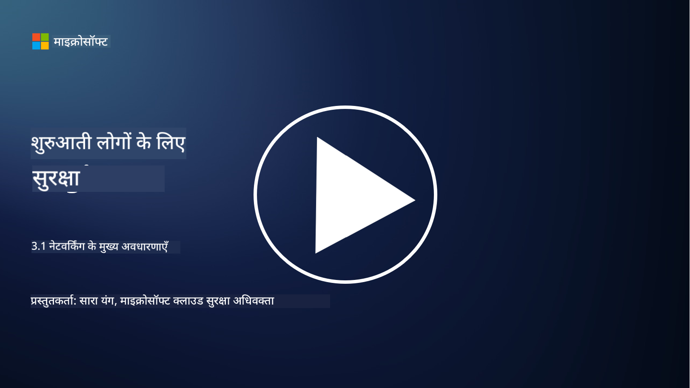
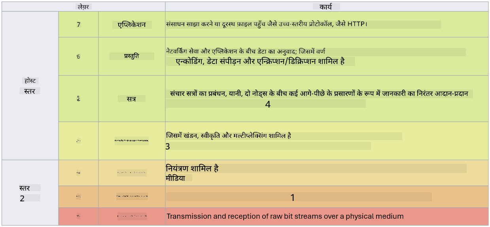

<!--
CO_OP_TRANSLATOR_METADATA:
{
  "original_hash": "252724eceeb183fb9018f88c5e1a3f0c",
  "translation_date": "2025-09-03T18:57:07+00:00",
  "source_file": "3.1 Networking key concepts.md",
  "language_code": "hi"
}
-->
# नेटवर्किंग के मुख्य अवधारणाएँ

यदि आपने आईटी में कोई काम किया है, तो संभावना है कि आप नेटवर्किंग अवधारणाओं से परिचित हुए होंगे। हालांकि आधुनिक वातावरण में हम पहचान को प्राथमिक परिधि नियंत्रण के रूप में उपयोग करते हैं, इसका मतलब यह नहीं है कि नेटवर्क नियंत्रण अप्रासंगिक हो गए हैं। यह एक बहुत बड़ा विषय है, लेकिन इस पाठ में हम नेटवर्किंग की कुछ मुख्य अवधारणाओं को कवर करेंगे।

इस पाठ में, हम चर्चा करेंगे:

- IP एड्रेसिंग क्या है?

- OSI मॉडल क्या है?

- TCP/UDP क्या है?

- पोर्ट नंबर क्या हैं?

- डेटा को स्थिर और ट्रांजिट में एन्क्रिप्ट करना क्या है?

## IP एड्रेसिंग क्या है?

IP एड्रेसिंग, या इंटरनेट प्रोटोकॉल एड्रेसिंग, एक संख्यात्मक लेबल है जो हर उस डिवाइस को दिया जाता है जो इंटरनेट प्रोटोकॉल का उपयोग करके कंप्यूटर नेटवर्क से जुड़ा होता है। यह नेटवर्क में डिवाइसों के लिए एक अद्वितीय पहचानकर्ता के रूप में कार्य करता है, जिससे वे इंटरनेट या अन्य जुड़े नेटवर्क के माध्यम से डेटा भेज और प्राप्त कर सकते हैं। IP एड्रेसिंग के दो मुख्य संस्करण हैं: IPv4 (इंटरनेट प्रोटोकॉल संस्करण 4) और IPv6 (इंटरनेट प्रोटोकॉल संस्करण 6)। एक IP एड्रेस आमतौर पर IPv4 प्रारूप (जैसे, 192.168.1.1) या IPv6 प्रारूप (जैसे, 2001:0db8:85a3:0000:0000:8a2e:0370:7334) में प्रदर्शित होता है।

## OSI मॉडल क्या है?

OSI (ओपन सिस्टम्स इंटरकनेक्शन) मॉडल एक अवधारणात्मक ढांचा है जो संचार प्रणाली के कार्यों को सात अलग-अलग स्तरों में मानकीकृत करता है। प्रत्येक स्तर विशिष्ट कार्य करता है और नेटवर्क में डिवाइसों के बीच कुशल और विश्वसनीय डेटा संचार सुनिश्चित करने के लिए आस-पास के स्तरों के साथ संवाद करता है। नीचे से ऊपर तक स्तर इस प्रकार हैं:

1. फिजिकल लेयर  
2. डेटा लिंक लेयर  
3. नेटवर्क लेयर  
4. ट्रांसपोर्ट लेयर  
5. सेशन लेयर  
6. प्रेजेंटेशन लेयर  
7. एप्लिकेशन लेयर  

OSI मॉडल यह समझने के लिए एक सामान्य संदर्भ प्रदान करता है कि नेटवर्किंग प्रोटोकॉल और तकनीकें कैसे परस्पर क्रिया करती हैं, चाहे हार्डवेयर या सॉफ़्टवेयर कार्यान्वयन कुछ भी हो।

  
_ref: https://en.wikipedia.org/wiki/OSI_model_

## TCP/UDP क्या है?

TCP (ट्रांसमिशन कंट्रोल प्रोटोकॉल) और UDP (यूज़र डेटाग्राम प्रोटोकॉल) दो मूलभूत ट्रांसपोर्ट लेयर प्रोटोकॉल हैं जो कंप्यूटर नेटवर्क में डिवाइसों के बीच इंटरनेट या स्थानीय नेटवर्क पर संचार को सक्षम करते हैं। ये डेटा को पैकेट्स में तोड़ने और फिर प्राप्त करने वाले छोर पर उन पैकेट्स को मूल डेटा में पुनः संयोजित करने के लिए जिम्मेदार होते हैं। हालांकि, इनके गुण और उपयोग के मामले अलग-अलग हैं।

**TCP (ट्रांसमिशन कंट्रोल प्रोटोकॉल)**:  
TCP एक कनेक्शन-ओरिएंटेड प्रोटोकॉल है जो डिवाइसों के बीच विश्वसनीय और क्रमबद्ध डेटा डिलीवरी प्रदान करता है। यह डेटा एक्सचेंज शुरू होने से पहले भेजने वाले और प्राप्त करने वाले के बीच एक कनेक्शन स्थापित करता है। TCP सुनिश्चित करता है कि डेटा पैकेट सही क्रम में पहुंचे और खोए हुए पैकेट्स को पुनः भेजने की क्षमता रखता है ताकि डेटा की अखंडता और पूर्णता सुनिश्चित हो सके। यह वेब ब्राउज़िंग, ईमेल, फ़ाइल ट्रांसफर (FTP), और डेटाबेस संचार जैसे अनुप्रयोगों के लिए उपयुक्त है।

**UDP (यूज़र डेटाग्राम प्रोटोकॉल)**:  
UDP एक कनेक्शनलेस प्रोटोकॉल है जो तेज़ डेटा ट्रांसमिशन प्रदान करता है लेकिन TCP जितनी विश्वसनीयता नहीं देता। यह डेटा भेजने से पहले औपचारिक कनेक्शन स्थापित नहीं करता और खोए हुए पैकेट्स को पुनः भेजने या स्वीकार करने के लिए कोई तंत्र शामिल नहीं करता। UDP उन अनुप्रयोगों के लिए उपयुक्त है जहां गति और दक्षता विश्वसनीय डिलीवरी से अधिक महत्वपूर्ण है, जैसे रीयल-टाइम संचार, स्ट्रीमिंग मीडिया, ऑनलाइन गेमिंग, और DNS क्वेरी।

सारांश में, TCP विश्वसनीयता और क्रमबद्ध डिलीवरी को प्राथमिकता देता है, जिससे यह उन अनुप्रयोगों के लिए उपयुक्त बनता है जिन्हें डेटा की सटीकता की आवश्यकता होती है, जबकि UDP गति और दक्षता पर जोर देता है, जिससे यह उन अनुप्रयोगों के लिए उपयुक्त बनता है जहां मामूली डेटा हानि या क्रम पुनः व्यवस्था स्वीकार्य है। TCP और UDP के बीच चयन अनुप्रयोग या सेवा की विशिष्ट आवश्यकताओं पर निर्भर करता है।

## पोर्ट नंबर क्या हैं?

नेटवर्किंग में, पोर्ट नंबर एक संख्यात्मक पहचानकर्ता है जिसका उपयोग एक नेटवर्क में एक ही डिवाइस पर चलने वाली विभिन्न सेवाओं या अनुप्रयोगों के बीच अंतर करने के लिए किया जाता है। पोर्ट्स इनकमिंग डेटा को सही अनुप्रयोग तक पहुंचाने में मदद करते हैं। पोर्ट नंबर 16-बिट अनसाइनड इंटीजर होते हैं, जिसका मतलब है कि इनकी रेंज 0 से 65535 तक होती है। इन्हें तीन श्रेणियों में विभाजित किया गया है:

- वेल-नोन पोर्ट्स (0-1023): HTTP (पोर्ट 80) और FTP (पोर्ट 21) जैसी मानक सेवाओं के लिए आरक्षित।  
- रजिस्टरड पोर्ट्स (1024-49151): उन अनुप्रयोगों और सेवाओं के लिए उपयोग किए जाते हैं जो वेल-नोन रेंज का हिस्सा नहीं हैं लेकिन आधिकारिक रूप से पंजीकृत हैं।  
- डायनामिक/प्राइवेट पोर्ट्स (49152-65535): अनुप्रयोगों द्वारा अस्थायी या निजी उपयोग के लिए उपलब्ध।  

## डेटा को स्थिर और ट्रांजिट में एन्क्रिप्ट करना क्या है?

एन्क्रिप्शन वह प्रक्रिया है जिसमें डेटा को एक सुरक्षित प्रारूप में परिवर्तित किया जाता है ताकि इसे अनधिकृत पहुंच या छेड़छाड़ से बचाया जा सके। एन्क्रिप्शन को "स्थिर" (जब डेटा डिवाइस या सर्वर पर संग्रहीत होता है) और "ट्रांजिट में" (जब डेटा डिवाइसों के बीच या नेटवर्क पर भेजा जा रहा होता है) लागू किया जा सकता है।

**स्थिर डेटा का एन्क्रिप्शन**:  
यह उन डेटा को एन्क्रिप्ट करने में शामिल होता है जो डिवाइस, सर्वर, या स्टोरेज सिस्टम पर संग्रहीत होते हैं। यदि कोई हमलावर स्टोरेज मीडिया तक भौतिक पहुंच प्राप्त कर लेता है, तो वह एन्क्रिप्शन कुंजियों के बिना डेटा तक पहुंच नहीं सकता। यह संवेदनशील डेटा को डिवाइस चोरी, डेटा उल्लंघन, या अनधिकृत पहुंच के मामले में सुरक्षित रखने के लिए महत्वपूर्ण है।

**ट्रांजिट में डेटा का एन्क्रिप्शन**:  
यह डेटा को एन्क्रिप्ट करने में शामिल होता है जब वह डिवाइसों के बीच या नेटवर्क पर यात्रा कर रहा होता है। यह डेटा ट्रांसमिशन के दौरान ईव्सड्रॉपिंग और अनधिकृत इंटरसेप्शन को रोकता है। ट्रांजिट में एन्क्रिप्शन के सामान्य प्रोटोकॉल में वेब संचार के लिए HTTPS और विभिन्न प्रकार के नेटवर्क ट्रैफिक को सुरक्षित करने के लिए TLS/SSL शामिल हैं।

## अतिरिक्त पढ़ाई
- [How Do IP Addresses Work? (howtogeek.com)](https://www.howtogeek.com/341307/how-do-ip-addresses-work/)  
- [Understanding IP Address: An Introductory Guide (geekflare.com)](https://geekflare.com/understanding-ip-address/)  
- [What is the OSI model? The 7 layers of OSI explained (techtarget.com)](https://www.techtarget.com/searchnetworking/definition/OSI)  
- [The OSI Model – The 7 Layers of Networking Explained in Plain English (freecodecamp.org)](https://www.freecodecamp.org/news/osi-model-networking-layers-explained-in-plain-english/)  
- [TCP/IP protocols - IBM Documentation](https://www.ibm.com/docs/en/aix/7.3?topic=protocol-tcpip-protocols)  
- [Common Ports Cheat Sheet: The Ultimate Ports & Protocols List (stationx.net)](https://www.stationx.net/common-ports-cheat-sheet/)  
- [Azure Data Encryption-at-Rest - Azure Security | Microsoft Learn](https://learn.microsoft.com/azure/security/fundamentals/encryption-atrest?WT.mc_id=academic-96948-sayoung)  

---

**अस्वीकरण**:  
यह दस्तावेज़ AI अनुवाद सेवा [Co-op Translator](https://github.com/Azure/co-op-translator) का उपयोग करके अनुवादित किया गया है। जबकि हम सटीकता के लिए प्रयासरत हैं, कृपया ध्यान दें कि स्वचालित अनुवाद में त्रुटियां या अशुद्धियां हो सकती हैं। मूल भाषा में उपलब्ध मूल दस्तावेज़ को आधिकारिक स्रोत माना जाना चाहिए। महत्वपूर्ण जानकारी के लिए, पेशेवर मानव अनुवाद की सिफारिश की जाती है। इस अनुवाद के उपयोग से उत्पन्न किसी भी गलतफहमी या गलत व्याख्या के लिए हम उत्तरदायी नहीं हैं।  