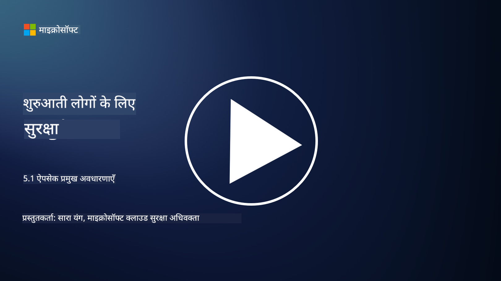

<!--
CO_OP_TRANSLATOR_METADATA:
{
  "original_hash": "e4b56bb23078d3ffb7ad407d280b0c36",
  "translation_date": "2025-09-03T18:36:51+00:00",
  "source_file": "5.1 AppSec key concepts.md",
  "language_code": "hi"
}
-->
# AppSec के मुख्य सिद्धांत

एप्लिकेशन सुरक्षा अपने आप में एक सुरक्षा विशेषज्ञता है। इस पाठ्यक्रम के इस भाग में, हम एप्लिकेशन सुरक्षा के बारे में अधिक जानेंगे।

## परिचय

इस पाठ में, हम कवर करेंगे:

- एप्लिकेशन सुरक्षा क्या है?

- एप्लिकेशन सुरक्षा के मुख्य सिद्धांत/मूलभूत बातें क्या हैं?

## एप्लिकेशन सुरक्षा क्या है?

एप्लिकेशन सुरक्षा, जिसे अक्सर "AppSec" कहा जाता है, सॉफ़्टवेयर एप्लिकेशन को सुरक्षा खतरों, कमजोरियों, और हमलों से बचाने की प्रक्रिया को संदर्भित करता है। इसमें उन प्रक्रियाओं, तकनीकों, और उपकरणों को शामिल किया जाता है जो एप्लिकेशन के विकास, परिनियोजन, और रखरखाव के जीवनचक्र के दौरान सुरक्षा जोखिमों की पहचान, शमन, और रोकथाम करते हैं।

एप्लिकेशन सुरक्षा महत्वपूर्ण है क्योंकि एप्लिकेशन साइबर हमलों के सामान्य लक्ष्य होते हैं। दुर्भावनापूर्ण हमलावर सॉफ़्टवेयर में कमजोरियों और खामियों का फायदा उठाकर अनधिकृत पहुंच प्राप्त करते हैं, डेटा चुराते हैं, सेवाओं को बाधित करते हैं, या अन्य दुर्भावनापूर्ण गतिविधियों को अंजाम देते हैं। प्रभावी एप्लिकेशन सुरक्षा एप्लिकेशन और उससे जुड़े डेटा की गोपनीयता, अखंडता, और उपलब्धता सुनिश्चित करने में मदद करती है।

## एप्लिकेशन सुरक्षा के मुख्य सिद्धांत/मूलभूत बातें क्या हैं?

एप्लिकेशन सुरक्षा के आधारभूत सिद्धांत और अवधारणाएं निम्नलिखित हैं:

1. **डिज़ाइन से सुरक्षित (Secure by Design)**:

- सुरक्षा को एप्लिकेशन के डिज़ाइन और आर्किटेक्चर में शुरुआत से ही शामिल किया जाना चाहिए, न कि बाद में जोड़ा जाना चाहिए।

2. **इनपुट सत्यापन (Input Validation)**:

- सभी उपयोगकर्ता इनपुट की जांच की जानी चाहिए ताकि यह सुनिश्चित हो सके कि वे अपेक्षित प्रारूपों के अनुरूप हैं और उनमें कोई दुर्भावनापूर्ण कोड या डेटा नहीं है।

3. **आउटपुट एन्कोडिंग (Output Encoding)**:

- क्लाइंट को भेजे गए डेटा को सही तरीके से एन्कोड किया जाना चाहिए ताकि क्रॉस-साइट स्क्रिप्टिंग (XSS) जैसी कमजोरियों को रोका जा सके।

4. **प्रमाणीकरण और प्राधिकरण (Authentication and Authorization)**:

- उपयोगकर्ताओं को प्रमाणित करें और उनकी भूमिकाओं और अनुमतियों के आधार पर संसाधनों तक उनकी पहुंच को अधिकृत करें।

5. **डेटा सुरक्षा (Data Protection)**:

- संवेदनशील डेटा को संग्रहीत, प्रसारित, और संसाधित करते समय एन्क्रिप्ट किया जाना चाहिए ताकि अनधिकृत पहुंच को रोका जा सके।

6. **सत्र प्रबंधन (Session Management)**:

- सुरक्षित सत्र प्रबंधन यह सुनिश्चित करता है कि उपयोगकर्ता सत्र अपहरण और अनधिकृत पहुंच से सुरक्षित हैं।

7. **सुरक्षित निर्भरताएं (Secure Dependencies)**:

- सभी सॉफ़्टवेयर निर्भरताओं को सुरक्षा पैच के साथ अद्यतन रखें ताकि कमजोरियों को रोका जा सके।

8. **त्रुटि प्रबंधन और लॉगिंग (Error Handling and Logging)**:

- सुरक्षित त्रुटि प्रबंधन लागू करें ताकि संवेदनशील जानकारी का खुलासा न हो और सुरक्षित लॉगिंग प्रथाओं का पालन करें।

9. **सुरक्षा परीक्षण (Security Testing)**:

- एप्लिकेशन की कमजोरियों की नियमित रूप से जांच करें, जैसे पेनिट्रेशन टेस्टिंग, कोड रिव्यू, और स्वचालित स्कैनिंग टूल्स का उपयोग करके।

10. **सुरक्षित सॉफ़्टवेयर विकास जीवनचक्र (Secure Software Development Lifecycle - SDLC)**:

- सॉफ़्टवेयर विकास जीवनचक्र के हर चरण में सुरक्षा प्रथाओं को शामिल करें, जैसे आवश्यकताओं से लेकर परिनियोजन और रखरखाव तक।

## आगे पढ़ने के लिए

- [SheHacksPurple: एप्लिकेशन सुरक्षा क्या है? - YouTube](https://www.youtube.com/watch?v=eNmccQNzSSY)
- [एप्लिकेशन सुरक्षा क्या है? - Cisco](https://www.cisco.com/c/en/us/solutions/security/application-first-security/what-is-application-security.html#~how-does-it-work)
- [एप्लिकेशन सुरक्षा क्या है? सॉफ़्टवेयर को सुरक्षित करने की प्रक्रिया और उपकरण | CSO Online](https://www.csoonline.com/article/566471/what-is-application-security-a-process-and-tools-for-securing-software.html)
- [OWASP चीट शीट सीरीज़ | OWASP Foundation](https://owasp.org/www-project-cheat-sheets/)

---

**अस्वीकरण**:  
यह दस्तावेज़ AI अनुवाद सेवा [Co-op Translator](https://github.com/Azure/co-op-translator) का उपयोग करके अनुवादित किया गया है। जबकि हम सटीकता सुनिश्चित करने का प्रयास करते हैं, कृपया ध्यान दें कि स्वचालित अनुवाद में त्रुटियां या अशुद्धियां हो सकती हैं। मूल भाषा में उपलब्ध मूल दस्तावेज़ को प्रामाणिक स्रोत माना जाना चाहिए। महत्वपूर्ण जानकारी के लिए, पेशेवर मानव अनुवाद की सिफारिश की जाती है। इस अनुवाद के उपयोग से उत्पन्न किसी भी गलतफहमी या गलत व्याख्या के लिए हम जिम्मेदार नहीं हैं।