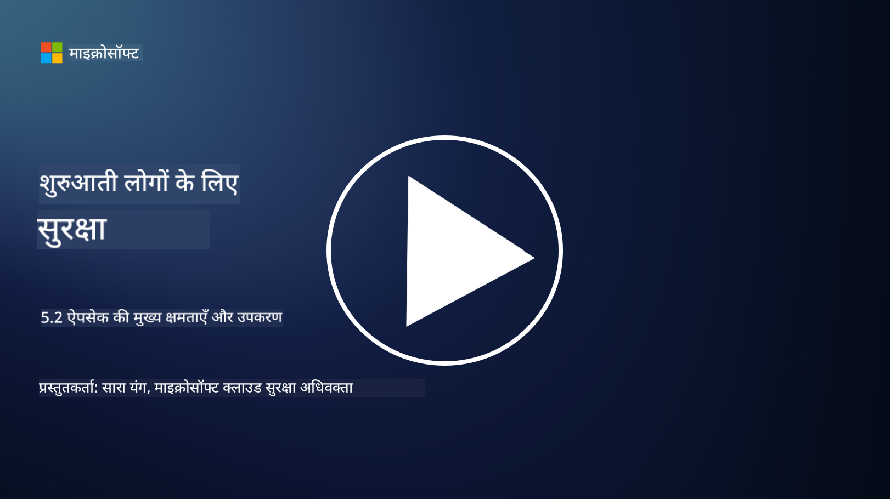

<!--
CO_OP_TRANSLATOR_METADATA:
{
  "original_hash": "790a3fa7e535ec60bb51bde13e759781",
  "translation_date": "2025-09-03T18:42:10+00:00",
  "source_file": "5.2 AppSec key capabilities.md",
  "language_code": "hi"
}
-->
## परिचय

इस खंड में, हम उन मुख्य क्षमताओं और उपकरणों के बारे में जानेंगे जो एप्लिकेशन सुरक्षा में उपयोग किए जाते हैं।

## एप्लिकेशन सुरक्षा की मुख्य क्षमताएं और उपकरण

एप्लिकेशन सुरक्षा में उपयोग की जाने वाली मुख्य क्षमताएं और उपकरण सॉफ़्टवेयर एप्लिकेशन में सुरक्षा कमजोरियों और खतरों की पहचान, उन्हें कम करने और रोकने के लिए आवश्यक हैं। यहां कुछ सबसे महत्वपूर्ण क्षमताएं और उपकरण दिए गए हैं:

**1. स्टैटिक एप्लिकेशन सिक्योरिटी टेस्टिंग (SAST)**:

- **क्षमताएं**: सोर्स कोड, बाइटकोड, या बाइनरी कोड का विश्लेषण करके एप्लिकेशन के कोडबेस में सुरक्षा कमजोरियों की पहचान करता है।

- **उपकरण**: उदाहरण के लिए Fortify, Checkmarx, और Veracode।

**2. डायनामिक एप्लिकेशन सिक्योरिटी टेस्टिंग (DAST)**:

- **क्षमताएं**: एक चल रहे एप्लिकेशन को स्कैन करता है, इनपुट अनुरोध भेजकर और प्रतिक्रियाओं का विश्लेषण करके कमजोरियों की पहचान करता है।

- **उपकरण**: उदाहरण के लिए ZAP, Burp Suite, और Qualys Web Application Scanning।

**3. इंटरएक्टिव एप्लिकेशन सिक्योरिटी टेस्टिंग (IAST)**:

- **क्षमताएं**: SAST और DAST के तत्वों को मिलाकर रनटाइम के दौरान कोड का विश्लेषण करता है, जिससे अधिक सटीक परिणाम मिलते हैं और झूठे सकारात्मक परिणाम कम होते हैं।

- **उपकरण**: उदाहरण के लिए Contrast Security और HCL AppScan।

**4. रनटाइम एप्लिकेशन सेल्फ-प्रोटेक्शन (RASP)**:

- **क्षमताएं**: वास्तविक समय में एप्लिकेशन की निगरानी और सुरक्षा करता है, सुरक्षा खतरों का पता लगाता है और उनका जवाब देता है।

- **उपकरण**: उदाहरण के लिए Veracode Runtime Protection और F5 Advanced WAF with RASP।

**5. वेब एप्लिकेशन फायरवॉल्स (WAFs)**:

- **क्षमताएं**: एप्लिकेशन और इंटरनेट के बीच एक सुरक्षात्मक परत प्रदान करता है, आने वाले ट्रैफ़िक को फ़िल्टर करता है और दुर्भावनापूर्ण अनुरोधों को ब्लॉक करता है।

- **उपकरण**: उदाहरण के लिए ModSecurity, AWS WAF, और Akamai Kona Site Defender।

**6. डिपेंडेंसी स्कैनिंग**:

- **क्षमताएं**: एप्लिकेशन में उपयोग की जाने वाली तृतीय-पक्ष लाइब्रेरी और घटकों में कमजोरियों की पहचान करता है।

- **उपकरण**: उदाहरण के लिए OWASP Dependency-Check और Snyk।

**7. पेनिट्रेशन टेस्टिंग (Pen Testing)**:

- **क्षमताएं**: वास्तविक दुनिया के हमलों का अनुकरण करके कमजोरियों की खोज करता है और एप्लिकेशन की सुरक्षा का आकलन करता है।

- **उपकरण**: प्रमाणित एथिकल हैकर्स और सुरक्षा पेशेवरों द्वारा विभिन्न उपकरणों जैसे Metasploit और Nmap का उपयोग करके किया जाता है।

**8. सुरक्षा स्कैनिंग और विश्लेषण**:

- **क्षमताएं**: ज्ञात कमजोरियों, कॉन्फ़िगरेशन त्रुटियों, और सुरक्षा गलत कॉन्फ़िगरेशन के लिए स्कैन करता है।

- **उपकरण**: उदाहरण के लिए Nessus, Qualys Vulnerability Management, और OpenVAS।

**9. कंटेनर सुरक्षा उपकरण**:

- **क्षमताएं**: कंटेनराइज्ड एप्लिकेशन और उनके वातावरण की सुरक्षा पर ध्यान केंद्रित करता है।

- **उपकरण**: उदाहरण के लिए Docker Security Scanning और Aqua Security।

**10. सुरक्षित विकास प्रशिक्षण**:

- **क्षमताएं**: विकास टीमों के लिए सुरक्षित कोडिंग प्रथाओं को बढ़ावा देने के लिए प्रशिक्षण और जागरूकता कार्यक्रम प्रदान करता है।

- **उपकरण**: कस्टमाइज्ड प्रशिक्षण कार्यक्रम और प्लेटफ़ॉर्म।

**11. सुरक्षा परीक्षण फ्रेमवर्क**:

- **क्षमताएं**: विभिन्न एप्लिकेशन सुरक्षा परीक्षण आवश्यकताओं के लिए व्यापक परीक्षण फ्रेमवर्क प्रदान करता है।

- **उपकरण**: OWASP Amass, OWASP OWTF और FrAppSec।

**12. सुरक्षित कोड समीक्षा उपकरण**:

- **क्षमताएं**: स्रोत कोड की समीक्षा करता है ताकि सुरक्षा कमजोरियों और कोडिंग सर्वोत्तम प्रथाओं की पहचान की जा सके।

- **उपकरण**: उदाहरण के लिए SonarQube और Checkmarx।

**13. सुरक्षित APIs और माइक्रोसर्विसेज उपकरण**:

- **क्षमताएं**: APIs और माइक्रोसर्विसेज की सुरक्षा पर ध्यान केंद्रित करता है, जिसमें प्रमाणीकरण, प्राधिकरण, और डेटा सुरक्षा शामिल है।

- **उपकरण**: उदाहरण के लिए Apigee, AWS API Gateway, और Istio।

## आगे पढ़ने के लिए

- [What Is Application Security? Concepts, Tools & Best Practices | HackerOne](https://www.hackerone.com/knowledge-center/what-application-security-concepts-tools-best-practices)  
- [What is IAST? (Interactive Application Security Testing) (comparitech.com)](https://www.comparitech.com/net-admin/what-is-iast/)  
- [10 Types of Application Security Testing Tools: When and How to Use Them (cmu.edu)](https://insights.sei.cmu.edu/blog/10-types-of-application-security-testing-tools-when-and-how-to-use-them/)  
- [Shifting the Balance of Cybersecurity Risk: Principles and Approaches for Security-by-Design and Default | Cyber.gov.au](https://www.cyber.gov.au/about-us/view-all-content/publications/principles-and-approaches-for-security-by-design-and-default)  

---

**अस्वीकरण**:  
यह दस्तावेज़ AI अनुवाद सेवा [Co-op Translator](https://github.com/Azure/co-op-translator) का उपयोग करके अनुवादित किया गया है। जबकि हम सटीकता के लिए प्रयासरत हैं, कृपया ध्यान दें कि स्वचालित अनुवाद में त्रुटियां या अशुद्धियां हो सकती हैं। मूल भाषा में उपलब्ध मूल दस्तावेज़ को आधिकारिक स्रोत माना जाना चाहिए। महत्वपूर्ण जानकारी के लिए, पेशेवर मानव अनुवाद की सिफारिश की जाती है। इस अनुवाद के उपयोग से उत्पन्न किसी भी गलतफहमी या गलत व्याख्या के लिए हम उत्तरदायी नहीं हैं।