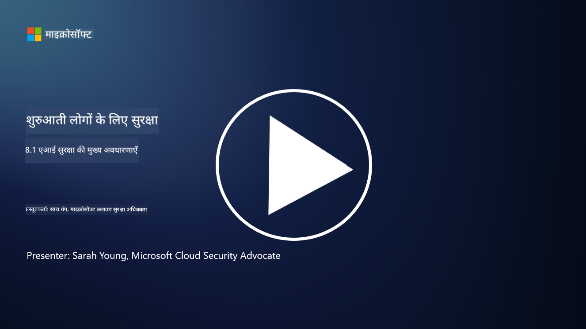

<!--
CO_OP_TRANSLATOR_METADATA:
{
  "original_hash": "66b61d96936cf25d20fcb411d4ce5227",
  "translation_date": "2025-09-03T18:07:11+00:00",
  "source_file": "8.1 AI security key concepts.md",
  "language_code": "hi"
}
-->
# एआई सुरक्षा के मुख्य सिद्धांत

## एआई सुरक्षा पारंपरिक साइबर सुरक्षा से कैसे अलग है?

एआई सिस्टम को सुरक्षित करना पारंपरिक साइबर सुरक्षा की तुलना में अनोखी चुनौतियां पेश करता है, मुख्य रूप से एआई की सीखने की क्षमता और निर्णय लेने की प्रक्रियाओं के कारण। यहां कुछ प्रमुख अंतर दिए गए हैं:

-   **डेटा की अखंडता**: एआई सिस्टम सीखने के लिए डेटा पर बहुत अधिक निर्भर करते हैं। [इस डेटा की अखंडता सुनिश्चित करना महत्वपूर्ण है, क्योंकि हमलावर डेटा में हेरफेर करके एआई के व्यवहार को प्रभावित कर सकते हैं, जिसे डेटा पॉइज़निंग कहा जाता है।
-   **मॉडल सुरक्षा**: एआई का निर्णय लेने वाला मॉडल स्वयं एक लक्ष्य हो सकता है। [हमलावर मॉडल को रिवर्स-इंजीनियर करने या इसकी कमजोरियों का फायदा उठाकर गलत या हानिकारक निर्णय लेने की कोशिश कर सकते हैं।
-   **विरोधी हमले**: एआई सिस्टम विरोधी हमलों के प्रति संवेदनशील हो सकते हैं, जहां इनपुट डेटा में मामूली, अक्सर अदृश्य बदलाव एआई को गलतियां करने या गलत भविष्यवाणियां करने के लिए मजबूर कर सकते हैं।
-   **इन्फ्रास्ट्रक्चर सुरक्षा**: जबकि पारंपरिक साइबर सुरक्षा भी इन्फ्रास्ट्रक्चर की सुरक्षा पर ध्यान केंद्रित करती है, एआई सिस्टम में अतिरिक्त जटिलताएं हो सकती हैं, जैसे क्लाउड-आधारित सेवाएं या विशेष हार्डवेयर, जिन्हें विशिष्ट सुरक्षा उपायों की आवश्यकता होती है।
-   **नैतिक विचार**: सुरक्षा में एआई के उपयोग से नैतिक विचार सामने आते हैं, जैसे गोपनीयता संबंधी चिंताएं और निर्णय लेने में संभावित पक्षपात, जिन्हें सुरक्षा रणनीति में संबोधित करना आवश्यक है।

कुल मिलाकर, एआई सिस्टम को सुरक्षित करने के लिए एक अलग दृष्टिकोण की आवश्यकता होती है जो एआई तकनीक के अनोखे पहलुओं को ध्यान में रखता है, जिसमें डेटा, मॉडल और एआई की सीखने की प्रक्रिया की सुरक्षा शामिल है, साथ ही एआई के उपयोग के नैतिक प्रभावों को भी संबोधित करता है।

एआई सुरक्षा और पारंपरिक साइबर सुरक्षा में कई समानताएं हैं, लेकिन कृत्रिम बुद्धिमत्ता सिस्टम की अनोखी विशेषताओं और क्षमताओं के कारण उनमें कुछ स्पष्ट अंतर भी हैं। यहां बताया गया है कि वे कैसे अलग हैं:

- **खतरों की जटिलता**: एआई सिस्टम साइबर सुरक्षा में नई परतें जोड़ते हैं। पारंपरिक साइबर सुरक्षा मुख्य रूप से मैलवेयर, फ़िशिंग हमलों और नेटवर्क घुसपैठ जैसे खतरों से निपटती है। हालांकि, एआई सिस्टम विरोधी हमलों, डेटा पॉइज़निंग और मॉडल इवेज़न जैसे हमलों के प्रति संवेदनशील हो सकते हैं, जो विशेष रूप से मशीन लर्निंग एल्गोरिदम को लक्षित करते हैं।

- **हमले की सतह**: एआई सिस्टम पारंपरिक सिस्टम की तुलना में अक्सर बड़ी हमले की सतह रखते हैं। ऐसा इसलिए है क्योंकि वे केवल सॉफ़्टवेयर पर ही नहीं बल्कि डेटा और मॉडलों पर भी निर्भर करते हैं। हमलावर प्रशिक्षण डेटा को लक्षित कर सकते हैं, मॉडलों में हेरफेर कर सकते हैं, या एल्गोरिदम की कमजोरियों का फायदा उठा सकते हैं।

- **खतरों की अनुकूलनशीलता**: एआई सिस्टम अपने वातावरण से सीख सकते हैं और अनुकूलित हो सकते हैं, जिससे वे अनुकूलनशील और विकसित होने वाले खतरों के प्रति अधिक संवेदनशील हो सकते हैं। पारंपरिक साइबर सुरक्षा उपाय एआई सिस्टम के व्यवहार के आधार पर लगातार विकसित होने वाले हमलों से बचाव के लिए पर्याप्त नहीं हो सकते।

- **व्याख्या और स्पष्टता**: यह समझना कि एआई सिस्टम ने कोई विशेष निर्णय क्यों लिया, पारंपरिक सॉफ़्टवेयर सिस्टम की तुलना में अक्सर अधिक चुनौतीपूर्ण होता है। इस व्याख्या और स्पष्टता की कमी एआई सिस्टम पर हमलों का पता लगाने और उन्हें प्रभावी ढंग से रोकने में कठिनाई पैदा कर सकती है।

- **डेटा गोपनीयता चिंताएं**: एआई सिस्टम अक्सर बड़ी मात्रा में डेटा पर निर्भर करते हैं, जो यदि सही तरीके से संभाला न जाए तो गोपनीयता जोखिम पैदा कर सकता है। पारंपरिक साइबर सुरक्षा उपाय एआई सिस्टम से संबंधित इन डेटा गोपनीयता चिंताओं को पर्याप्त रूप से संबोधित नहीं कर सकते।

- **नियामक अनुपालन**: एआई सुरक्षा के लिए नियामक परिदृश्य अभी भी विकसित हो रहा है, जिसमें एआई सिस्टम द्वारा उत्पन्न अनोखी चुनौतियों को संबोधित करने के लिए विशिष्ट नियम और मानक उभर रहे हैं। पारंपरिक साइबर सुरक्षा ढांचे को इन नए नियमों के साथ अनुपालन सुनिश्चित करने के लिए विस्तारित या अनुकूलित करने की आवश्यकता हो सकती है।

- **नैतिक विचार**: एआई सुरक्षा में न केवल सिस्टम को दुर्भावनापूर्ण हमलों से बचाना शामिल है, बल्कि यह भी सुनिश्चित करना शामिल है कि एआई सिस्टम का उपयोग नैतिक और जिम्मेदार तरीके से किया जाए। इसमें निष्पक्षता, पारदर्शिता और जवाबदेही जैसे विचार शामिल हैं, जो पारंपरिक साइबर सुरक्षा में उतने प्रमुख नहीं हो सकते।

## एआई को पारंपरिक आईटी सिस्टम की सुरक्षा के समान कैसे सुरक्षित किया जाता है?

एआई सिस्टम को सुरक्षित करना पारंपरिक साइबर सुरक्षा के साथ कई मौलिक सिद्धांत साझा करता है:

-   **खतरे से सुरक्षा**: एआई और पारंपरिक सिस्टम दोनों को अनधिकृत पहुंच, डेटा संशोधन और विनाश, साथ ही अन्य सामान्य खतरों से बचाने की आवश्यकता होती है।
-   **भेद्यता प्रबंधन**: पारंपरिक सिस्टम को प्रभावित करने वाली कई कमजोरियां, जैसे सॉफ़्टवेयर बग या गलत कॉन्फ़िगरेशन, एआई सिस्टम को भी प्रभावित कर सकती हैं।
-   **डेटा सुरक्षा**: डेटा उल्लंघनों को रोकने और गोपनीयता सुनिश्चित करने के लिए संसाधित डेटा की सुरक्षा दोनों क्षेत्रों में महत्वपूर्ण है।
-   **सप्लाई चेन सुरक्षा**: दोनों प्रकार के सिस्टम सप्लाई चेन हमलों के प्रति संवेदनशील होते हैं, जहां एक समझौता किया गया घटक पूरे सिस्टम की सुरक्षा को कमजोर कर सकता है।

ये समानताएं इस बात को उजागर करती हैं कि जबकि एआई सिस्टम नई सुरक्षा चुनौतियां पेश करते हैं, उन्हें मजबूत सुरक्षा सुनिश्चित करने के लिए स्थापित साइबर सुरक्षा प्रथाओं के अनुप्रयोग की भी आवश्यकता होती है। यह पारंपरिक सुरक्षा ज्ञान का उपयोग करने और एआई तकनीक के अनोखे पहलुओं के अनुकूल होने का मिश्रण है।

## आगे पढ़ने के लिए

- [Not with a Bug, But with a Sticker [Book] (oreilly.com)](https://www.oreilly.com/library/view/not-with-a/9781119883982/)
   
- [Intro to AI Security Part 1: AI Security 101 | by HarrietHacks | Medium](https://medium.com/@harrietfarlow/intro-to-ai-security-part-1-ai-security-101-b8662a9efe5)
   
- [Best practices for AI security risk management | Microsoft Security Blog](https://www.microsoft.com/en-us/security/blog/2021/12/09/best-practices-for-ai-security-risk-management/?WT.mc_id=academic-96948-sayoung)
   
- [OWASP AI Security and Privacy Guide | OWASP Foundation](https://owasp.org/www-project-ai-security-and-privacy-guide/)

---

**अस्वीकरण**:  
यह दस्तावेज़ AI अनुवाद सेवा [Co-op Translator](https://github.com/Azure/co-op-translator) का उपयोग करके अनुवादित किया गया है। जबकि हम सटीकता सुनिश्चित करने का प्रयास करते हैं, कृपया ध्यान दें कि स्वचालित अनुवाद में त्रुटियां या अशुद्धियां हो सकती हैं। मूल भाषा में उपलब्ध मूल दस्तावेज़ को प्रामाणिक स्रोत माना जाना चाहिए। महत्वपूर्ण जानकारी के लिए, पेशेवर मानव अनुवाद की सिफारिश की जाती है। इस अनुवाद के उपयोग से उत्पन्न किसी भी गलतफहमी या गलत व्याख्या के लिए हम जिम्मेदार नहीं हैं।