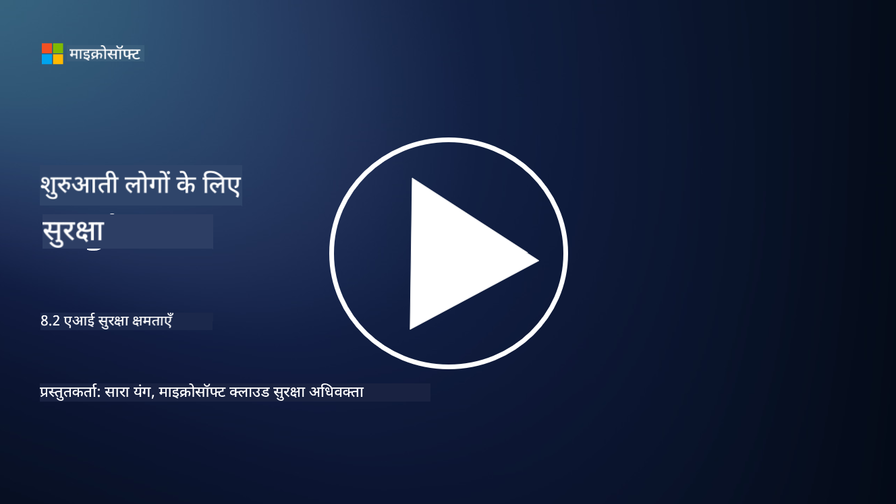

<!--
CO_OP_TRANSLATOR_METADATA:
{
  "original_hash": "b6bb7175672298d1e2f73ba7e0006f95",
  "translation_date": "2025-09-03T18:46:05+00:00",
  "source_file": "8.2 AI security capabilities.md",
  "language_code": "hi"
}
-->
# एआई सुरक्षा क्षमताएं

## वर्तमान में हमारे पास एआई सिस्टम को सुरक्षित करने के लिए कौन-कौन से उपकरण और क्षमताएं हैं?

वर्तमान में, एआई सिस्टम को सुरक्षित करने के लिए कई उपकरण और क्षमताएं उपलब्ध हैं:

-   **Counterfit**: एआई सिस्टम की सुरक्षा परीक्षण के लिए एक ओपन-सोर्स ऑटोमेशन टूल, जो संगठनों को एआई सुरक्षा जोखिम आकलन करने और उनके एल्गोरिदम की मजबूती सुनिश्चित करने में मदद करता है।
-   **Adversarial Machine Learning Tools**: ये टूल मशीन लर्निंग मॉडल की मजबूती का मूल्यांकन करते हैं, खासकर जब उन्हें विरोधात्मक हमलों का सामना करना पड़ता है, और कमजोरियों की पहचान और समाधान में मदद करते हैं।
-   **AI Security Toolkits**: ओपन-सोर्स टूलकिट उपलब्ध हैं जो एआई सिस्टम को सुरक्षित करने के लिए संसाधन प्रदान करते हैं, जैसे कि सुरक्षा उपाय लागू करने के लिए लाइब्रेरी और फ्रेमवर्क।
-   **Collaborative Platforms**: कंपनियों और एआई समुदायों के बीच साझेदारी, एआई-विशिष्ट सुरक्षा स्कैनर और अन्य उपकरण विकसित करने के लिए, ताकि एआई सप्लाई चेन को सुरक्षित किया जा सके।

ये उपकरण और क्षमताएं एआई सिस्टम की सुरक्षा को विभिन्न खतरों से बचाने के लिए समर्पित एक बढ़ते हुए क्षेत्र का हिस्सा हैं। ये शोध, व्यावहारिक उपकरण, और उद्योग सहयोग का संयोजन हैं, जो एआई तकनीकों द्वारा उत्पन्न अनूठी चुनौतियों का समाधान करने के लिए बनाए गए हैं।

## एआई रेड टीमिंग के बारे में क्या? यह पारंपरिक सुरक्षा रेड टीमिंग से कैसे अलग है?

एआई रेड टीमिंग पारंपरिक सुरक्षा रेड टीमिंग से कई महत्वपूर्ण पहलुओं में अलग है:

-   **एआई सिस्टम पर ध्यान केंद्रित**: एआई रेड टीमिंग विशेष रूप से एआई सिस्टम की अनूठी कमजोरियों को लक्षित करता है, जैसे कि मशीन लर्निंग मॉडल और डेटा पाइपलाइन्स, न कि पारंपरिक आईटी इंफ्रास्ट्रक्चर।
-   **एआई व्यवहार का परीक्षण**: इसमें यह परीक्षण शामिल है कि एआई सिस्टम असामान्य या अप्रत्याशित इनपुट पर कैसे प्रतिक्रिया देते हैं, जो कमजोरियों को उजागर कर सकता है जिन्हें हमलावरों द्वारा शोषित किया जा सकता है।
-   **एआई विफलताओं की खोज**: एआई रेड टीमिंग न केवल दुर्भावनापूर्ण बल्कि सामान्य विफलताओं को भी देखता है, और सुरक्षा उल्लंघनों से परे संभावित सिस्टम विफलताओं और विभिन्न परिदृश्यों पर विचार करता है।
-   **प्रॉम्प्ट इंजेक्शन और सामग्री निर्माण**: इसमें प्रॉम्प्ट इंजेक्शन जैसी विफलताओं की जांच भी शामिल है, जहां हमलावर एआई सिस्टम को हानिकारक या आधारहीन सामग्री उत्पन्न करने के लिए हेरफेर करते हैं।
-   **नैतिक और जिम्मेदार एआई**: यह जिम्मेदार एआई सुनिश्चित करने का हिस्सा है, ताकि एआई सिस्टम को इस तरह से डिज़ाइन किया जाए कि वे अनपेक्षित तरीकों से व्यवहार करने के प्रयासों के खिलाफ मजबूत हों।

कुल मिलाकर, एआई रेड टीमिंग एक विस्तारित अभ्यास है जो न केवल सुरक्षा कमजोरियों की जांच करता है बल्कि एआई तकनीकों से संबंधित अन्य प्रकार की सिस्टम विफलताओं का परीक्षण भी करता है। यह एआई सिस्टम को सुरक्षित बनाने के लिए एक महत्वपूर्ण प्रक्रिया है, जो एआई तैनाती से जुड़े नए जोखिमों को समझने और कम करने में मदद करती है।

## आगे पढ़ने के लिए

 - [Microsoft AI Red Team building future of safer AI | Microsoft Security Blog](https://www.microsoft.com/en-us/security/blog/2023/08/07/microsoft-ai-red-team-building-future-of-safer-ai/?WT.mc_id=academic-96948-sayoung)
 - [Announcing Microsoft’s open automation framework to red team generative AI Systems | Microsoft Security Blog](https://www.microsoft.com/en-us/security/blog/2024/02/22/announcing-microsofts-open-automation-framework-to-red-team-generative-ai-systems/?WT.mc_id=academic-96948-sayoung)
 - [AI Security Tools: The Open-Source Toolkit | Wiz](https://www.wiz.io/academy/ai-security-tools)

---

**अस्वीकरण**:  
यह दस्तावेज़ AI अनुवाद सेवा [Co-op Translator](https://github.com/Azure/co-op-translator) का उपयोग करके अनुवादित किया गया है। जबकि हम सटीकता के लिए प्रयासरत हैं, कृपया ध्यान दें कि स्वचालित अनुवाद में त्रुटियां या अशुद्धियां हो सकती हैं। मूल भाषा में उपलब्ध मूल दस्तावेज़ को आधिकारिक स्रोत माना जाना चाहिए। महत्वपूर्ण जानकारी के लिए, पेशेवर मानव अनुवाद की सिफारिश की जाती है। इस अनुवाद के उपयोग से उत्पन्न किसी भी गलतफहमी या गलत व्याख्या के लिए हम उत्तरदायी नहीं हैं।  