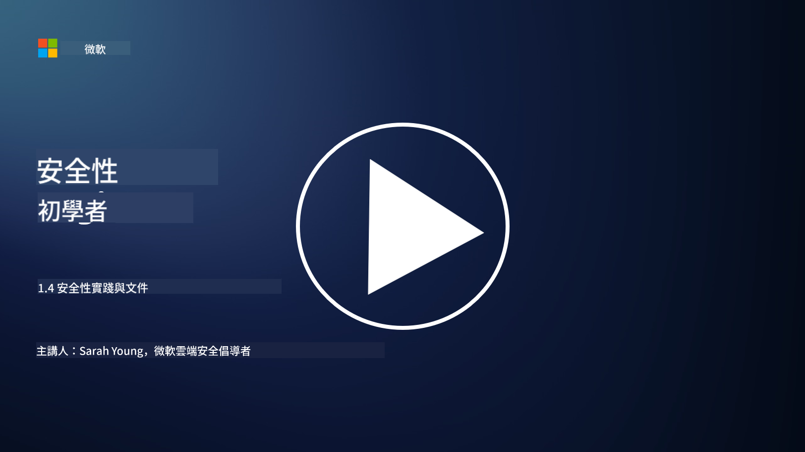

<!--
CO_OP_TRANSLATOR_METADATA:
{
  "original_hash": "d33500902124e52870935bdce4546fcc",
  "translation_date": "2025-09-03T17:26:21+00:00",
  "source_file": "1.4 Security practices and documentation.md",
  "language_code": "hk"
}
-->
# 安全實踐與文件

你可能聽過「安全政策」、「安全標準」等詞語，但事實上，許多網絡安全專業人士並未正確使用這些詞語。因此，在本節中，我們將解釋這些詞語的含義以及組織為何需要使用它們。

## 簡介

在本課中，我們將涵蓋：

- 什麼是安全政策？

- 什麼是安全標準？

- 什麼是安全基線？

- 什麼是安全指引？

- 什麼是安全程序？

- 在網絡安全背景下，法律和法規是什麼？

這些術語通常用於網絡安全的背景中，以定義組織內不同層次的安全文件和實踐。讓我們逐一澄清這些術語：

## 什麼是安全政策？

安全政策是一份高層次的文件，概述了組織的整體安全目標、原則和指導方針。它為安全相關的決策提供框架，並設定組織的安全基調。安全政策通常涵蓋資源的可接受使用、數據保護、訪問控制、事件響應等主題。政策是解決方案和技術無關的。一個大家可能熟悉的安全政策例子是組織的可接受使用政策。

## 什麼是安全標準？

安全標準是一份更詳細和具體的文件，提供指導和要求，以在組織內實施安全控制和措施。標準比政策更具體和技術性，提供配置和維護系統、網絡及流程以達到安全目標的具體指示和建議。一個安全標準的例子是：「所有內部數據必須在靜態和傳輸中加密。」

## 什麼是安全基線？

安全基線是一組最低限度的安全配置，認為在特定系統、應用程序或環境中是必需的。它定義了安全的起點，應在所有相關實例中實施。安全基線有助於確保組織的IT基礎設施的一致性和一定程度的安全性。一個安全基線的例子是：「Azure虛擬機不得直接訪問互聯網。」

## 什麼是安全指引？

安全指引是一份文件，當特定的安全標準不適用時，提供建議和指導。指引試圖處理標準未涵蓋或僅部分涵蓋的「灰色地帶」。

## 什麼是安全程序？

安全程序是一份詳細的逐步指南，概述了執行安全相關流程或任務所需的具體行動和步驟。程序是實際且可操作的文件，提供在事件響應、系統維護、用戶入職及其他安全相關活動中需要遵循的明確行動順序。一個安全程序的例子是：「當Microsoft Sentinel生成P1安全事件時，安全運營中心（SOC）必須立即通知值班安全經理，並將事件的詳細信息發送給他們。」

總結來說，這些術語代表了組織網絡安全框架中的不同層次的文件和指導。安全政策設定高層次目標，標準提供詳細要求，基線建立最低安全配置，指引提供最佳實踐，程序提供安全流程的可操作步驟。

## 在網絡安全背景下，法律和法規是什麼？

法律和法規是指由政府和監管機構建立的法律框架，用於定義和執行保護數字系統、數據和信息的規則、標準和要求。這些法律和法規因司法管轄區而異，並側重於網絡安全的不同方面，包括數據保護、隱私、事件報告以及關鍵基礎設施的安全性。以下是一些與網絡安全相關的法律和法規的例子：例如《通用數據保護條例》（GDPR）、《健康保險流通與責任法案》（HIPAA）、《加州消費者隱私法案》（CCPA）、《支付卡行業數據安全標準》（PCI DSS）。

## 延伸閱讀

[信息安全政策模板 | SANS Institute](https://www.sans.org/information-security-policy/)

[遵守網絡安全和隱私法律及法規 | NIST](https://www.nist.gov/mep/cybersecurity-resources-manufacturers/compliance-cybersecurity-and-privacy-laws-and-regulations)

---

**免責聲明**：  
本文件已使用人工智能翻譯服務 [Co-op Translator](https://github.com/Azure/co-op-translator) 進行翻譯。儘管我們致力於提供準確的翻譯，但請注意，自動翻譯可能包含錯誤或不準確之處。原始文件的母語版本應被視為權威來源。對於重要信息，建議使用專業人工翻譯。我們對因使用此翻譯而引起的任何誤解或錯誤解釋概不負責。