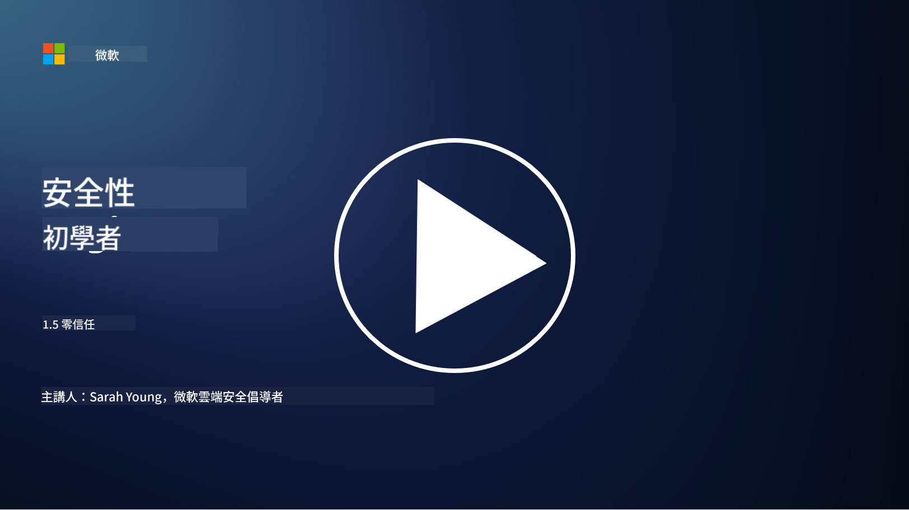

<!--
CO_OP_TRANSLATOR_METADATA:
{
  "original_hash": "75f77f972d2233c584f87c1eb96c983b",
  "translation_date": "2025-09-03T17:17:42+00:00",
  "source_file": "1.5 Zero trust.md",
  "language_code": "hk"
}
-->
# 零信任

「零信任」是現今安全領域中經常被提及的一個詞。但它究竟是什麼？是否只是一個流行語？在這節課中，我們將深入探討零信任的真正含義。

## 簡介

- 在這節課中，我們將涵蓋：

- 什麼是零信任？

- 零信任與傳統安全架構有何不同？

- 什麼是深度防禦？

## 零信任

零信任是一種網絡安全方法，它挑戰了傳統「信任但驗證」的概念，假設無論是組織內部還是外部的任何實體都不應被固有地信任。相反，零信任主張對每個嘗試訪問資源的用戶、設備和應用程式進行驗證，無論它們的所在地。零信任的核心原則是最小化「攻擊面」，並減少安全漏洞的潛在影響。

在零信任模型中，以下原則被強調：

1. **驗證身份**：對所有用戶和設備進行嚴格的身份驗證和授權，無論它們的位置。請記住，身份不一定是人類，它可以是設備、應用程式等。

2. **最小權限**：用戶和設備僅被授予完成任務所需的最低訪問權限，從而減少被攻擊後的潛在損害。

3. **微分段**：將網絡資源劃分為更小的區域，以限制在發生漏洞時的橫向移動。

4. **持續監控**：對用戶和設備行為進行持續監控和分析，以檢測異常和潛在威脅。現代監控技術還使用機器學習、人工智能和威脅情報來提供更多細節和上下文。

5. **數據加密**：數據在傳輸和存儲過程中均進行加密，以防止未授權的訪問。

6. **嚴格的訪問控制**：根據上下文（例如用戶角色、設備健康狀況和網絡位置）強制執行訪問控制。

Microsoft 將零信任分為五個支柱，我們會在後續課程中進一步討論。

## 與傳統安全架構的差異

零信任與傳統安全架構（例如基於邊界的模型）在多方面有所不同：

1. **邊界 vs. 以身份為中心**：傳統模型專注於保護網絡邊界，並假設內部用戶和設備在進入後可以被信任。而零信任假設威脅可能來自網絡內部和外部，並強制執行嚴格的基於身份的控制。

2. **隱式信任 vs. 明確信任**：傳統模型隱式信任網絡內的設備和用戶，直到證明有問題為止。零信任則明確驗證身份並持續監控異常。

3. **平坦網絡 vs. 分段網絡**：傳統架構通常涉及平坦網絡，內部用戶擁有廣泛的訪問權限。零信任主張將網絡分割成更小、更隔離的區域，以遏制潛在的漏洞。

4. **被動 vs. 主動**：傳統安全通常依賴於被動措施，例如邊界防火牆和入侵檢測。零信任採取主動方法，假設漏洞可能發生並將其影響降至最低。

## 深度防禦

深度防禦，也稱為分層安全，是一種網絡安全策略，通過部署多層安全控制和措施來保護組織的資產。其目標是創建重疊的防禦層，以便即使其中一層被突破，其他層仍能提供保護。每一層都專注於不同的安全方面，從而提高組織的整體安全態勢。

深度防禦結合了技術、程序和物理安全措施，包括防火牆、入侵檢測系統、訪問控制、加密、用戶培訓、安全政策等。其理念是創建多重屏障，使攻擊者難以滲透組織的系統和網絡。這有時也被稱為「瑞士芝士」模型，該模型在其他行業（例如交通）中的事故預防中也有應用。

## 延伸閱讀

[什麼是零信任？](https://learn.microsoft.com/security/zero-trust/zero-trust-overview?WT.mc_id=academic-96948-sayoung)

[零信任的演進 – Microsoft 立場文件](https://query.prod.cms.rt.microsoft.com/cms/api/am/binary/RWJJdT?WT.mc_id=academic-96948-sayoung)

[零信任與 BeyondCorp Google Cloud | Google Cloud Blog](https://cloud.google.com/blog/topics/developers-practitioners/zero-trust-and-beyondcorp-google-cloud)

---

**免責聲明**：  
本文件已使用人工智能翻譯服務 [Co-op Translator](https://github.com/Azure/co-op-translator) 進行翻譯。儘管我們致力於提供準確的翻譯，請注意自動翻譯可能包含錯誤或不準確之處。原始語言的文件應被視為權威來源。對於重要資訊，建議使用專業人工翻譯。我們對因使用此翻譯而引起的任何誤解或錯誤解釋概不負責。