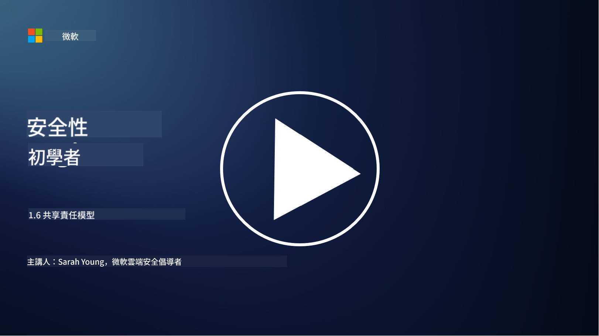

<!--
CO_OP_TRANSLATOR_METADATA:
{
  "original_hash": "a48db640d80c786b928ca178c414f084",
  "translation_date": "2025-09-03T17:28:07+00:00",
  "source_file": "1.6 Shared responsibility model.md",
  "language_code": "hk"
}
-->
# 共擔責任模型

共擔責任是一個隨著雲端運算興起而出現的IT新概念。從網絡安全的角度來看，了解誰負責提供哪些安全控制至關重要，以避免防禦上的漏洞。

## 簡介

在本課程中，我們將探討：

 - 在網絡安全的背景下，什麼是共擔責任？
   
 - 在IaaS、PaaS和SaaS之間，安全控制的共擔責任有何不同？

 - 您可以在哪裡找到您的雲端平台提供的安全控制？

 - 什麼是「信任但驗證」？

## 在網絡安全的背景下，什麼是共擔責任？

網絡安全中的共擔責任是指雲端服務提供商（CSP）與其客戶之間的安全責任分配。在雲端運算環境中，例如基礎設施即服務（IaaS）、平台即服務（PaaS）和軟件即服務（SaaS），CSP和客戶都需要在保護數據、應用程序和系統的安全方面發揮作用。

## 在IaaS、PaaS和SaaS之間，安全控制的共擔責任有何不同？

責任的劃分通常取決於所使用的雲端服務類型：

 - **IaaS（基礎設施即服務）**：CSP提供基礎設施（伺服器、網絡、存儲），而客戶負責管理該基礎設施上的操作系統、應用程序和安全配置。
   
 - **PaaS（平台即服務）**：CSP提供一個平台，客戶可以在其上構建和部署應用程序。CSP管理底層基礎設施，客戶則專注於應用程序開發和數據安全。

 - **SaaS（軟件即服務）**：CSP提供可通過互聯網訪問的完整功能應用程序。在這種情況下，CSP負責應用程序的安全和基礎設施，而客戶則管理用戶訪問和數據使用。

理解共擔責任至關重要，因為它明確了哪些安全方面由CSP負責，哪些由客戶負責。這有助於避免誤解，並確保安全措施得到全面實施。

## 您可以在哪裡找到您的雲端平台提供的安全控制？

要了解您的雲端平台提供哪些安全控制，您需要參考雲端服務提供商的文檔和資源，包括：

 - **CSP的網站和文檔**：CSP的網站通常會提供有關其服務所包含的安全功能和控制的信息。CSP通常提供詳細的文檔，解釋其安全實踐、控制和建議，這可能包括白皮書、安全指南和技術文檔。
   
 - **安全評估和審核**：大多數CSP會讓獨立的安全專家和機構評估其安全控制。這些審查可以提供有關CSP安全措施質量的洞察。有時，這會導致CSP獲得安全合規證書（見下一點）。
   
 - **安全合規證書**：大多數CSP會獲得如ISO:27001、SOC 2和FedRAMP等證書。這些證書表明提供商符合特定的安全和合規標準。

請記住，不同雲端提供商之間的詳細程度和信息可用性可能有所不同。始終確保您參考的是由雲端服務提供商提供的官方且最新的資源，以便對雲端資產的安全性做出明智的決策。

## 什麼是「信任但驗證」？

在使用CSP、第三方軟件或其他IT安全服務的背景下，組織可能會初步信任提供商對安全措施的聲明。然而，為了真正確保其數據和系統的安全，他們需要通過安全評估、滲透測試以及審查外部方的安全控制來驗證這些聲明，然後再將軟件或服務完全整合到其運營中。所有個人和組織都應該對自己不負責的安全控制採取「信任但驗證」的態度。

## 組織內的共擔責任

請記住，組織內不同團隊之間的安全共擔責任也需要考慮。安全團隊通常不會自己實施所有控制，而需要與運營團隊、開發人員以及業務的其他部分合作，共同實施所有必要的安全控制，以確保組織的安全。

## 延伸閱讀
- [Shared responsibility in the cloud - Microsoft Azure | Microsoft Learn](https://learn.microsoft.com/azure/security/fundamentals/shared-responsibility?WT.mc_id=academic-96948-sayoung)
- [What is shared responsibility model? – Definition from TechTarget.com](https://www.techtarget.com/searchcloudcomputing/definition/shared-responsibility-model)
- [The shared responsibility model explained and what it means for cloud security | CSO Online](https://www.csoonline.com/article/570779/the-shared-responsibility-model-explained-and-what-it-means-for-cloud-security.html)
- [Shared Responsibility for Cloud Security: What You Need to Know (cisecurity.org)](https://www.cisecurity.org/insights/blog/shared-responsibility-cloud-security-what-you-need-to-know)

---

**免責聲明**：  
本文件已使用人工智能翻譯服務 [Co-op Translator](https://github.com/Azure/co-op-translator) 進行翻譯。儘管我們致力於提供準確的翻譯，請注意自動翻譯可能包含錯誤或不準確之處。原始語言的文件應被視為權威來源。對於重要資訊，建議使用專業人工翻譯。我們對因使用此翻譯而引起的任何誤解或錯誤解釋概不負責。