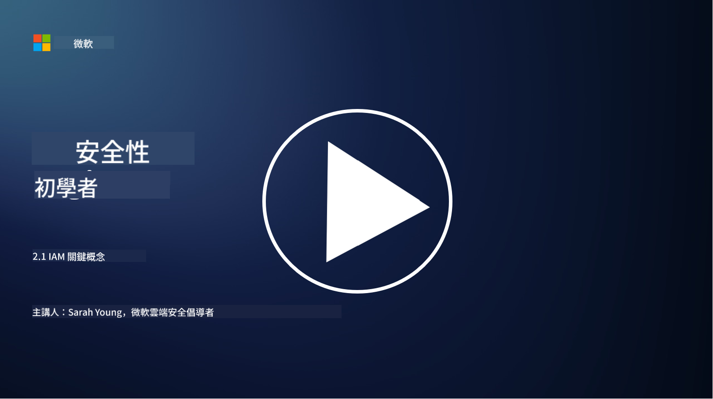

<!--
CO_OP_TRANSLATOR_METADATA:
{
  "original_hash": "2e3864e3d579f0dbb4ac2ec8c5f82acf",
  "translation_date": "2025-09-03T16:57:00+00:00",
  "source_file": "2.1 IAM key concepts.md",
  "language_code": "hk"
}
-->
# IAM 關鍵概念

你曾經登入過電腦或網站嗎？當然有！這意味著你已經在日常生活中使用了身份控制。身份與訪問管理（IAM）是安全性的核心支柱，我們會在接下來的課程中深入了解。

**簡介**

在本課程中，我們將探討：

- 在網絡安全的背景下，身份與訪問管理（IAM）是什麼意思？
- 最低權限原則是什麼？
- 職責分離是什麼？
- 認證與授權是什麼？

## 在網絡安全的背景下，身份與訪問管理（IAM）是什麼意思？

身份與訪問管理（IAM）指的是一套流程、技術和政策，旨在確保合適的人員擁有適當的權限來訪問組織數字環境中的資源。IAM 涉及管理數字身份（例如用戶、員工、合作夥伴）及其對系統、應用程式、數據和網絡的訪問。IAM 的主要目標是增強安全性、簡化用戶訪問並確保符合組織政策和法規。IAM 解決方案通常包括用戶認證、授權、身份配置、訪問控制以及用戶生命周期管理（確保不再使用的帳戶被刪除）。

## 最低權限原則是什麼？

最低權限原則是一個基本概念，主張僅授予用戶和系統完成其指定任務或角色所需的最低權限。這一原則有助於限制安全漏洞或內部威脅可能造成的損害。通過遵守最低權限原則，組織可以減少攻擊面並降低未授權訪問、數據洩露以及權限誤用的風險。實際操作中，這意味著用戶僅被授予完成其工作角色所需的特定資源和功能的訪問權限，而不會多餘。例如，如果你只需要閱讀一份文件，那麼授予你該文件的完整管理權限就顯得過於多餘。

## 職責分離是什麼？

職責分離是一項旨在防止利益衝突並降低欺詐和錯誤風險的原則，通過在組織內將關鍵任務和責任分配給不同的個人來實現。在網絡安全的背景下，職責分離確保沒有單一個人能完全控制關鍵流程或系統的所有方面。其目標是建立一個檢查和平衡的系統，防止任何人能夠同時執行流程的設置和批准階段。例如，在財務系統中，這可能要求輸入交易的人不能是批准交易的人。這樣可以降低未授權或欺詐行為未被發現的風險。

## 認證與授權是什麼？

認證與授權是網絡安全中的兩個基本概念，對於確保計算機系統和數據的安全性和完整性至關重要。它們通常結合使用，以控制資源訪問並保護敏感信息。

**1. 認證**：  
認證是驗證試圖訪問計算機系統或特定資源的用戶、系統或實體身份的過程。它確保聲稱的身份是真實且準確的。認證方法通常包括以下一種或多種因素：

a. 你知道的東西：包括密碼、PIN 碼或其他只有授權用戶才知道的秘密信息。  
b. 你擁有的東西：包括實物令牌或設備，例如智能卡、安全令牌或用於確認用戶身份的手機。  
c. 你是什麼：包括指紋、面部識別或視網膜掃描等獨特的生物識別因素。  

認證機制用於確認用戶的身份是否屬實，然後才允許其訪問系統或資源。它有助於防止未授權訪問，確保只有合法用戶能在系統內執行操作。

**2. 授權**：  
授權是在用戶或實體的身份被驗證後，授予或拒絕其特定權限和特權的過程。它決定用戶在系統內或特定資源上可以執行的操作或操作。授權通常基於預定的政策、訪問控制規則以及分配給用戶的角色。

授權可以被視為回答「已認證的用戶可以做什麼？」的問題。它涉及定義和執行訪問控制政策，以保護敏感數據和資源免受未授權的訪問或修改。

**總結：**

- 認證確定用戶或實體的身份。  
- 授權決定已認證的用戶可以訪問或操作的資源和行為。

## 延伸閱讀

- [描述身份概念 - Training | Microsoft Learn](https://learn.microsoft.com/training/modules/describe-identity-principles-concepts/?WT.mc_id=academic-96948-sayoung)  
- [身份簡介 - Microsoft Entra | Microsoft Learn](https://learn.microsoft.com/azure/active-directory/fundamentals/identity-fundamental-concepts?WT.mc_id=academic-96948-sayoung)  
- [什麼是身份與訪問管理（IAM）？ | Microsoft Security](https://www.microsoft.com/security/business/security-101/what-is-identity-access-management-iam?WT.mc_id=academic-96948-sayoung)  
- [什麼是 IAM？身份與訪問管理解釋 | CSO Online](https://www.csoonline.com/article/518296/what-is-iam-identity-and-access-management-explained.html)  
- [什麼是 IAM？(auth0.com)](https://auth0.com/blog/what-is-iam/)  
- [Security+: 實施身份與訪問管理（IAM）控制 [更新 2021] | Infosec (infosecinstitute.com)](https://resources.infosecinstitute.com/certifications/securityplus/security-implementing-identity-and-access-management-iam-controls/)  
- [最低權限 - 詞彙表 | CSRC (nist.gov)](https://csrc.nist.gov/glossary/term/least_privilege)  
- [安全性：最低權限原則（POLP） - Microsoft Community Hub](https://techcommunity.microsoft.com/t5/azure-sql-blog/security-the-principle-of-least-privilege-polp/ba-p/2067390?WT.mc_id=academic-96948-sayoung)  
- [最低權限原則 | CERT NZ](https://www.cert.govt.nz/it-specialists/critical-controls/principle-of-least-privilege/)  
- [為什麼 NIST 800-171 和 CMMC 要求職責分離？ - (totem.tech)](https://www.totem.tech/cmmc-separation-of-duties/)  

---

**免責聲明**：  
本文件已使用人工智能翻譯服務 [Co-op Translator](https://github.com/Azure/co-op-translator) 進行翻譯。儘管我們致力於提供準確的翻譯，但請注意，自動翻譯可能包含錯誤或不準確之處。原始文件的母語版本應被視為權威來源。對於重要信息，建議使用專業人工翻譯。我們對因使用此翻譯而引起的任何誤解或錯誤解釋概不負責。