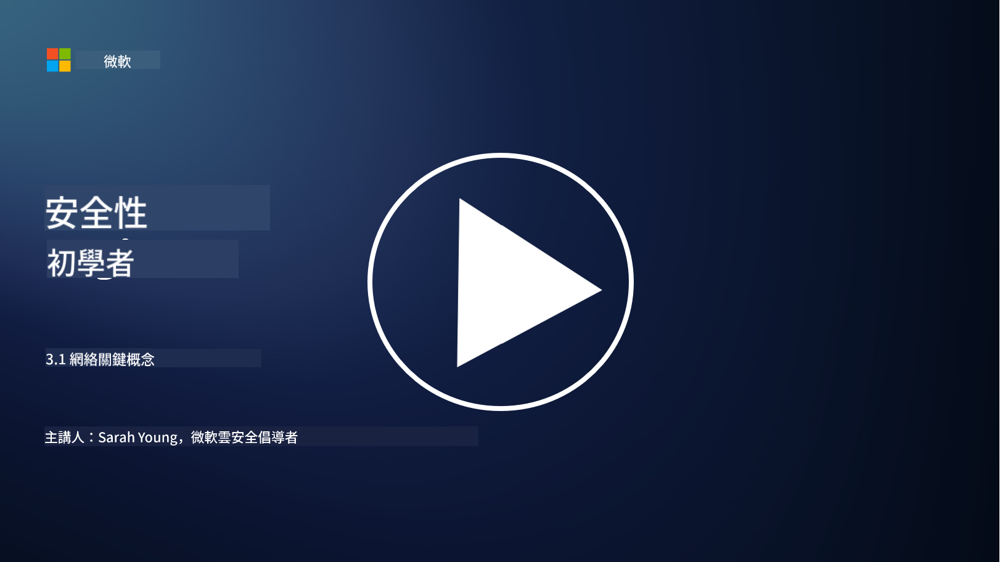

<!--
CO_OP_TRANSLATOR_METADATA:
{
  "original_hash": "252724eceeb183fb9018f88c5e1a3f0c",
  "translation_date": "2025-09-03T17:49:34+00:00",
  "source_file": "3.1 Networking key concepts.md",
  "language_code": "hk"
}
-->
# 網絡關鍵概念

如果你曾經從事過IT相關工作，可能已經接觸過網絡概念。雖然在現代環境中我們主要使用身份作為邊界控制，但這並不意味著網絡控制已經過時。這是一個非常廣泛的主題，但在本課程中，我們將探討一些關鍵的網絡概念。

在本課程中，我們將涵蓋：

- 什麼是IP地址？

- 什麼是OSI模型？

- 什麼是TCP/UDP？

- 什麼是端口號？

- 什麼是靜態加密和傳輸加密？

## 什麼是IP地址？

IP地址，即互聯網協議地址，是分配給每個使用互聯網協議進行通信的計算機網絡設備的數字標籤。它作為網絡中設備的唯一標識，允許它們在互聯網或其他互聯網絡中發送和接收數據。IP地址主要有兩個版本：IPv4（互聯網協議版本4）和IPv6（互聯網協議版本6）。IP地址通常以IPv4格式（例如：192.168.1.1）或IPv6格式（例如：2001:0db8:85a3:0000:0000:8a2e:0370:7334）表示。

## 什麼是OSI模型？

OSI（開放系統互連）模型是一個概念框架，將通信系統的功能標準化為七個不同的層級。每一層執行特定任務，並與相鄰層級進行通信，以確保網絡中設備之間的高效和可靠的數據通信。從底層到頂層，這些層級如下：

1. 實體層

2. 數據鏈路層

3. 網絡層

4. 傳輸層

5. 會話層

6. 表示層

7. 應用層

OSI模型提供了一個通用參考，用於理解網絡協議和技術如何交互，而不受特定硬件或軟件實現的影響。

_ref: https://en.wikipedia.org/wiki/OSI_model_

## 什麼是TCP/UDP？

TCP（傳輸控制協議）和UDP（用戶數據報協議）是計算機網絡中用於促進設備之間通信的兩個基本傳輸層協議。它們負責將數據分解為數據包進行傳輸，然後在接收端重新組裝這些數據包。然而，它們在特性和使用場景上有所不同。

**TCP（傳輸控制協議）**：

TCP是一種面向連接的協議，提供可靠且有序的數據傳輸。它在數據交換開始之前建立發送方和接收方之間的連接。TCP確保數據包按正確順序到達，並能處理丟失數據包的重傳，以保證數據的完整性和準確性。這使得TCP適用於需要可靠數據傳輸的應用，例如網頁瀏覽、電子郵件、文件傳輸（FTP）和數據庫通信。

**UDP（用戶數據報協議）**：

UDP是一種無連接的協議，提供更快的數據傳輸，但不具備TCP的可靠性。它在發送數據之前不建立正式連接，也不包含確認或重傳丟失數據包的機制。UDP適用於速度和效率比可靠性更重要的應用，例如實時通信、媒體流、在線遊戲和DNS查詢。

總結來說，TCP優先考慮可靠性和有序傳輸，適合需要數據準確性的應用，而UDP強調速度和效率，適合可以接受少量數據丟失或順序錯亂以換取低延遲的應用。選擇TCP或UDP取決於應用或服務的具體需求。

## 什麼是端口號？

在網絡中，端口號是一個數字標識，用於區分單個設備內運行的不同服務或應用。端口幫助將接收到的數據路由到適當的應用。端口號是16位無符號整數，範圍從0到65535。它們分為三個範圍：

- 知名端口（0-1023）：保留給標準服務，例如HTTP（端口80）和FTP（端口21）。

- 註冊端口（1024-49151）：用於不屬於知名範圍但已正式註冊的應用和服務。

- 動態/私有端口（49152-65535）：供應用臨時或私有使用。

## 什麼是靜態加密和傳輸加密？

加密是將數據轉換為安全格式以防止未授權訪問或篡改的過程。加密可以應用於“靜態”（存儲在設備或服務器上）和“傳輸”（在設備之間或網絡上傳輸）的數據。

靜態加密：這涉及加密存儲在設備、服務器或存儲系統上的數據。即使攻擊者獲得存儲媒體的物理訪問權限，沒有加密密鑰也無法訪問數據。這對於保護敏感數據免受設備被盜、數據洩露或未授權訪問至關重要。

傳輸加密：這涉及加密在設備之間或網絡上傳輸的數據。這可以防止在傳輸過程中數據被竊聽或未授權攔截。常見的傳輸加密協議包括用於網絡通信的HTTPS和用於保護各類網絡流量的TLS/SSL。

## 延伸閱讀
- [IP地址如何運作？ (howtogeek.com)](https://www.howtogeek.com/341307/how-do-ip-addresses-work/)
- [理解IP地址：入門指南 (geekflare.com)](https://geekflare.com/understanding-ip-address/)
- [什麼是OSI模型？OSI的7層解釋 (techtarget.com)](https://www.techtarget.com/searchnetworking/definition/OSI)
- [OSI模型——用簡單英語解釋的網絡7層 (freecodecamp.org)](https://www.freecodecamp.org/news/osi-model-networking-layers-explained-in-plain-english/)
- [TCP/IP協議 - IBM文檔](https://www.ibm.com/docs/en/aix/7.3?topic=protocol-tcpip-protocols)
- [常見端口速查表：終極端口和協議列表 (stationx.net)](https://www.stationx.net/common-ports-cheat-sheet/)
- [Azure靜態加密 - Azure安全 | Microsoft Learn](https://learn.microsoft.com/azure/security/fundamentals/encryption-atrest?WT.mc_id=academic-96948-sayoung)

---

**免責聲明**：  
本文件已使用人工智能翻譯服務 [Co-op Translator](https://github.com/Azure/co-op-translator) 進行翻譯。儘管我們致力於提供準確的翻譯，請注意自動翻譯可能包含錯誤或不準確之處。原始語言的文件應被視為權威來源。對於重要信息，建議使用專業人工翻譯。我們對因使用此翻譯而引起的任何誤解或錯誤解釋概不負責。