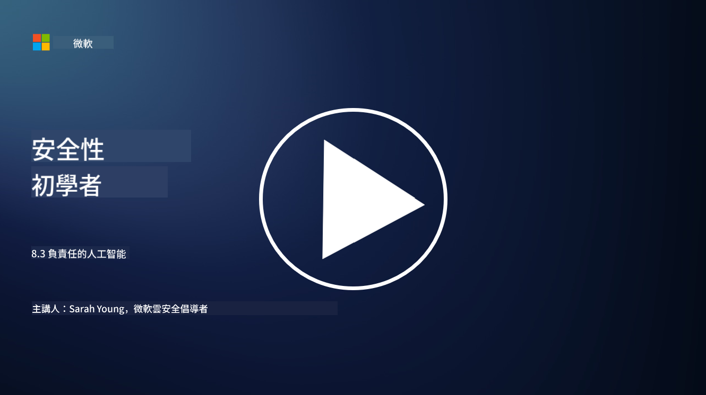

<!--
CO_OP_TRANSLATOR_METADATA:
{
  "original_hash": "5e9775ee91bde7d44577891d5f11c4c5",
  "translation_date": "2025-09-03T17:22:56+00:00",
  "source_file": "8.3 Responsible AI.md",
  "language_code": "hk"
}
-->
# 負責任的人工智能

## 什麼是負責任的人工智能？它與人工智能安全有什麼關係？

負責任的人工智能指的是以符合道德、透明並與社會價值一致的方式開發和使用人工智能。它涵蓋了公平性、問責性和穩健性等原則，確保人工智能系統的設計和運行能夠造福個人、社區和整個社會。

負責任的人工智能與人工智能安全之間的關係非常重要，因為：

- **道德考量**：負責任的人工智能涉及直接影響安全的道德考量，例如隱私和數據保護。確保人工智能系統尊重用戶隱私並保護個人數據是負責任人工智能的重要部分。
- **穩健性和可靠性**：人工智能系統必須能夠抵禦操控和攻擊，這是負責任人工智能和人工智能安全的核心原則之一。這包括防範對抗性攻擊並確保人工智能決策過程的完整性。
- **透明性和可解釋性**：負責任的人工智能的一部分是確保人工智能系統透明且其決策可以被解釋。這對安全至關重要，因為利益相關者需要了解人工智能系統的運作方式以信任其安全措施。
- **問責性**：人工智能系統應對其行為負責，這意味著必須有機制來追溯決策並糾正任何問題。這與安全實踐一致，安全實踐監控和審核系統活動以防止和應對漏洞。

總而言之，負責任的人工智能和人工智能安全是相互交織的，負責任人工智能的實踐能夠增強人工智能系統的安全性，反之亦然。實施負責任人工智能的原則有助於創建既符合道德又能抵禦潛在威脅的人工智能系統。

## 如何確保我的人工智能系統既安全又符合道德？

確保人工智能系統既安全又符合道德需要採取多方面的措施，包括以下步驟：

- **遵守道德原則**：遵循已建立的道德準則，強調人類、社會和環境福祉；公平性；隱私保護；可靠性；透明性；可質疑性；以及問責性。

- **實施穩健的安全措施**：使用主動安全測試和人工智能信任、風險、安全管理計劃來防範威脅和漏洞。

- **吸納多元化的利益相關者**：在人工智能開發過程中吸納包括倫理學家、社會科學家以及受影響社區代表在內的多元化參與者，以確保考慮到不同的觀點和價值。

- **確保透明性和可解釋性**：確保人工智能的決策過程透明且可解釋，從而增強信任並更容易識別潛在的偏見或錯誤。

- **維護數據隱私**：通過加密和其他數據保護措施來保護數據的隱私和真實性，以尊重用戶的隱私權。

- **提供人工監督**：實施人工監督機制，以便對人工智能系統的決策進行質疑並確保問責性。

- **關注人工智能安全**：保持對人工智能安全最新研究和討論的了解，以掌握人工智能安全和道德的演變趨勢。

- **遵守法規**：確保人工智能系統遵守所有相關法律和法規，包括數據保護法、反歧視法以及行業特定的指導方針。

## 能否舉例說明不道德使用人工智能引發的安全問題？

以下是一些因不道德使用人工智能而引發的安全問題的例子：

- **偏見的決策**：如果人工智能系統基於有偏見的數據集進行訓練，可能會延續並放大現有的偏見。例如，如果搜索引擎基於反映社會刻板印象的數據進行訓練，可能會顯示有偏見的搜索結果，導致不公平待遇或歧視。

- **司法系統中的人工智能**：在法律決策中使用人工智能可能引發道德問題，尤其是當人工智能的決策過程缺乏透明性或受到有偏見的數據影響時。這可能導致不公正的法律結果並侵犯個人權利。

- **人工智能系統的操控**：人工智能系統可能容易受到對抗性攻擊，稍微修改輸入數據就可能導致錯誤的結果。例如，無人駕駛車輛可能被誤導錯誤解讀交通標誌，從而引發安全風險。

- **人工智能驅動的監控**：使用人工智能進行監控可能會侵犯隱私，尤其是在未經適當同意或以侵犯個人自由的方式使用時。在威權政權中，人工智能可能被用來監控和壓制異議，這尤其令人擔憂。

這些例子突顯了在人工智能系統的開發和部署中考慮道德問題的重要性，以防止安全問題並保護個人權利和隱私。

## 延伸閱讀

- [Microsoft Responsible AI Standard v2 General Requirements](https://query.prod.cms.rt.microsoft.com/cms/api/am/binary/RE5cmFl?culture=en-us&country=us&WT.mc_id=academic-96948-sayoung)
- [Responsible AI (mit.edu)](https://sloanreview.mit.edu/big-ideas/responsible-ai/)
- [13 Principles for Using AI Responsibly (hbr.org)](https://hbr.org/2023/06/13-principles-for-using-ai-responsibly)

---

**免責聲明**：  
本文件已使用人工智能翻譯服務 [Co-op Translator](https://github.com/Azure/co-op-translator) 進行翻譯。儘管我們致力於提供準確的翻譯，但請注意，自動翻譯可能包含錯誤或不準確之處。原始語言的文件應被視為權威來源。對於重要信息，建議使用專業人工翻譯。我們對因使用此翻譯而引起的任何誤解或錯誤解釋概不負責。