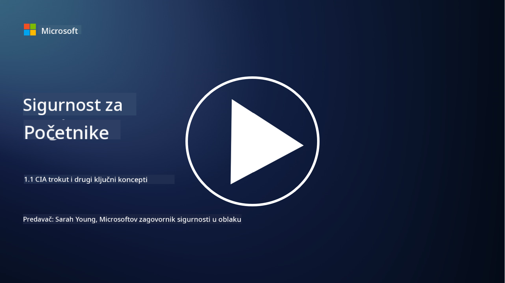
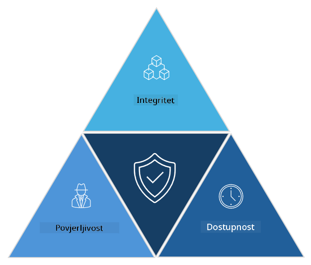

<!--
CO_OP_TRANSLATOR_METADATA:
{
  "original_hash": "16a76f9fa372fb63cffb6d76b855f023",
  "translation_date": "2025-09-03T21:40:31+00:00",
  "source_file": "1.1 The CIA triad and other key concepts.md",
  "language_code": "hr"
}
-->
# CIA trojstvo i drugi ključni pojmovi

## Uvod

U ovoj lekciji obradit ćemo:

 - Što je kibernetička sigurnost?
   
 
 - Što je CIA trojstvo kibernetičke sigurnosti?

   

 - Što su autentičnost, neporecivost i privatnost u kontekstu kibernetičke sigurnosti?

## Što je kibernetička sigurnost?

Kibernetička sigurnost, poznata i kao informacijska sigurnost, praksa je zaštite računalnih sustava, mreža, uređaja i podataka od digitalnih napada, neovlaštenog pristupa, oštećenja ili krađe. Primarni cilj kibernetičke sigurnosti je osigurati povjerljivost, integritet i dostupnost digitalnih sredstava i informacija. Stručnjaci za kibernetičku sigurnost osmišljavaju i implementiraju sigurnosne kontrole kako bi zaštitili sredstva, podatke i informacije. Kako sve više aspekata naših života postaje digitalizirano i online, kibernetička sigurnost postala je ključna briga i za privatne osobe i za organizacije.

## Što je CIA trojstvo kibernetičke sigurnosti?

CIA trojstvo kibernetičke sigurnosti odnosi se na model koji uključuje tri glavna razmatranja za bilo koji rad na kibernetičkoj sigurnosti ili dizajnu sustava/okruženja:

### Povjerljivost

Ovo je aspekt koji je većini ljudi poznat kada pomisle na "kibernetičku sigurnost": povjerljivost je proces zaštite podataka i informacija od pokušaja neovlaštenog pristupa, tj. samo osobe koje trebaju vidjeti informacije mogu im pristupiti. Međutim, nisu svi podaci jednako važni, pa se podaci obično kategoriziraju i štite na temelju potencijalne štete koja bi nastala ako bi ih neovlaštene osobe pristupile.

### Integritet

Odnosi se na zaštitu točnosti i pouzdanosti podataka unutar okruženja te sprječavanje da podaci budu izmijenjeni ili promijenjeni od strane neovlaštenih osoba. npr. student promijeni svoj datum rođenja u vozačkom zapisu u DMV-u kako bi se učinio starijim i ponovno izdao vozačku dozvolu s ranijim datumom rođenja kako bi mogao kupiti alkohol.

### Dostupnost

Ovo je aspekt koji se odnosi na operativnu IT infrastrukturu, ali dostupnost je također važna za kibernetičku sigurnost. Postoje specifične vrste napada koje ciljaju dostupnost i protiv kojih se stručnjaci za sigurnost moraju zaštititi (npr. napadi uskraćivanja usluge – DDoS).

**CIA trojstvo kibernetičke sigurnosti**

## Što su autentičnost, neporecivost i privatnost u kontekstu kibernetičke sigurnosti?

Ovo su dodatni važni pojmovi koji se odnose na osiguranje sigurnosti i pouzdanosti sustava i podataka:

**Autentičnost** - odnosi se na jamstvo da su informacije, komunikacija ili entitet s kojim komunicirate autentični i da ih neovlaštene strane nisu izmijenile ili manipulirale.

**Neporecivost** - koncept koji osigurava da stranka ne može poreći svoju uključenost ili autentičnost transakcije ili komunikacije. Sprječava nekoga da tvrdi da nije poslao poruku ili izvršio određenu radnju kada postoje dokazi koji to potvrđuju.

**Privatnost** - odnosi se na zaštitu osjetljivih i osobno identificirajućih informacija od neovlaštenog pristupa, korištenja, otkrivanja ili manipulacije. Uključuje kontrolu nad time tko ima pristup osobnim podacima i kako se ti podaci prikupljaju, pohranjuju i dijele.

## Dodatno čitanje

[Što je informacijska sigurnost (InfoSec)? | Microsoft Security](https://www.microsoft.com/security/business/security-101/what-is-information-security-infosec#:~:text=Three%20pillars%20of%20information%20security%3A%20the%20CIA%20triad,as%20guiding%20principles%20for%20implementing%20an%20InfoSec%20plan.)

---

**Odricanje od odgovornosti**:  
Ovaj dokument je preveden pomoću AI usluge za prevođenje [Co-op Translator](https://github.com/Azure/co-op-translator). Iako nastojimo osigurati točnost, imajte na umu da automatski prijevodi mogu sadržavati pogreške ili netočnosti. Izvorni dokument na izvornom jeziku treba smatrati autoritativnim izvorom. Za ključne informacije preporučuje se profesionalni prijevod od strane ljudskog prevoditelja. Ne preuzimamo odgovornost za bilo kakve nesporazume ili pogrešne interpretacije koje proizlaze iz korištenja ovog prijevoda.