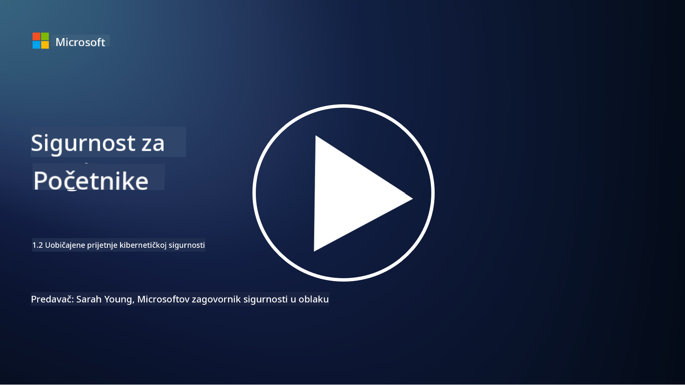

<!--
CO_OP_TRANSLATOR_METADATA:
{
  "original_hash": "6fc3030323139d7134a4ca9d03eccac9",
  "translation_date": "2025-09-03T20:14:10+00:00",
  "source_file": "1.2 Common cybersecurity threats.md",
  "language_code": "hr"
}
-->
# Uobičajene prijetnje kibernetičkoj sigurnosti

## Uvod

U ovoj lekciji obradit ćemo:

- Što je prijetnja kibernetičkoj sigurnosti?

- Zašto zlonamjerni akteri žele kompromitirati podatke i IT sustave?

- Koje su najčešće vrste prijetnji kibernetičkoj sigurnosti?

- Što je MITRE ATT&CK okvir?

- Gdje mogu pratiti najnovije informacije o prijetnjama kibernetičkoj sigurnosti?

## Što je prijetnja kibernetičkoj sigurnosti?

Prijetnja kibernetičkoj sigurnosti odnosi se na bilo kakvu potencijalnu opasnost ili rizik koji može ugroziti povjerljivost, integritet ili dostupnost podataka ili IT sustava. Ove prijetnje dolaze od zlonamjernih aktera koji pokušavaju iskoristiti ranjivosti kako bi dobili neovlašteni pristup, ukrali osjetljive informacije, poremetili operacije ili nanijeli štetu pojedincima, organizacijama ili čak cijelim državama. Prijetnje kibernetičkoj sigurnosti mogu poprimiti različite oblike i ciljati različite aspekte digitalnih sustava i podataka.

## Zašto zlonamjerni akteri žele kompromitirati podatke i IT sustave?

Zlonamjerni akteri kompromitiraju podatke i IT sustave iz različitih razloga, često vođeni osobnom koristi, ideološkim motivima ili željom za izazivanjem poremećaja. Razumijevanje ovih motiva može pomoći organizacijama i pojedincima da se bolje obrane od kibernetičkih prijetnji. Neki od uobičajenih razloga zašto zlonamjerni akteri provode kibernetičke napade uključuju:

1. **Financijska dobit**: Mnogi napadi motivirani su željom za financijskom koristi. Zlonamjerni akteri mogu ukrasti osjetljive informacije poput brojeva kreditnih kartica, podataka o bankovnim računima ili osobnih identifikacijskih podataka kako bi počinili prijevaru, krađu identiteta, ucjenjivali pojedince ili organizacije ili prodali ukradene podatke na dark webu.

2. **Špijunaža**: Države, konkurenti ili druge entitete mogu se baviti kibernetičkom špijunažom kako bi ukrali osjetljive vladine, korporativne ili istraživačke podatke za političku, ekonomsku ili vojnu prednost.

3. **Poremećaj i sabotaža**: Neki napadi imaju za cilj poremetiti ključnu infrastrukturu, usluge ili operacije iz političkih ili ideoloških razloga. Ovi napadi mogu izazvati široki kaos, financijske gubitke i štetu ugledu.

4. **Ideološki motivi**: Haktivisti i grupe s ideološkim ili političkim motivima mogu kompromitirati sustave kako bi podigli svijest o određenim pitanjima, promovirali svoja uvjerenja ili prosvjedovali protiv specifičnih akcija ili organizacija.

5. **Nenamjerne radnje**: Nisu sve zlonamjerne radnje namjerne; neki pojedinci mogu nesvjesno pridonijeti kibernetičkim prijetnjama postajući žrtve socijalnog inženjeringa ili dijelom kompromitirane mreže.

Na kraju, motivi za kompromitiranje podataka i IT sustava mogu biti vrlo različiti, a posljedice ovih napada mogu biti ozbiljne. Važno je da pojedinci, organizacije i vlade ozbiljno shvate kibernetičku sigurnost i implementiraju mjere za zaštitu od ovih prijetnji.

## Koje su najčešće vrste prijetnji kibernetičkoj sigurnosti?

Postoji nekoliko uobičajenih vrsta kibernetičkih napada koje zlonamjerni akteri koriste za kompromitiranje sustava, krađu podataka i izazivanje poremećaja. Evo nekih od najčešćih vrsta u trenutku pisanja:

1. **Phishing**:

Phishing uključuje slanje obmanjujućih e-poruka ili poruka koje izgledaju kao da dolaze iz legitimnih izvora kako bi se primatelje prevarilo da otkriju osjetljive informacije, poput lozinki, brojeva kreditnih kartica ili osobnih podataka. Phishing također može navesti žrtve na zlonamjerne web stranice ili preuzimanje malwarea.

2. **Malware**:

Malware (zlonamjerni softver) obuhvaća niz zlonamjernih programa dizajniranih za infekciju sustava, krađu podataka ili izazivanje štete. Vrste malwarea uključuju:

- **Ransomware**: Šifrira datoteke i zahtijeva otkupninu za njihovo dešifriranje.

- **Trojanci**: Prikazuju se kao legitimni softver, ali omogućuju napadačima neovlašteni pristup.

- **Virusi**: Samoreplicirajući programi koji se vežu za datoteke i šire.

- **Crvi**: Samoreplicirajući programi koji se šire kroz mreže.

3. **Denial of Service (DoS) i Distributed Denial of Service (DDoS)**:

DoS napadi preopterećuju ciljani sustav, čineći ga nedostupnim korisnicima. DDoS napadi uključuju korištenje mreže kompromitiranih uređaja za preplavljivanje cilja prometom, otežavajući ili potpuno onemogućujući rad sustava.

4. **SQL injekcija**:

U ovom napadu, napadači manipuliraju unosnim poljima web aplikacija kako bi ubacili zlonamjerne SQL upite, potencijalno dobivajući neovlašteni pristup bazama podataka i osjetljivim podacima.

5. **Cross-Site Scripting (XSS)**:

Napadači ubacuju zlonamjerne skripte u web aplikacije, koje zatim izvršavaju preglednici nesvjesnih korisnika. Ovo može dovesti do krađe korisničkih podataka i/ili širenja malwarea.

6. **Socijalni inženjering**:

Socijalni inženjering iskorištava ljudsku psihologiju kako bi manipulirao pojedincima da otkriju povjerljive informacije ili poduzmu radnje koje ugrožavaju sigurnost.

7. **Zero-Day (0day) eksploatacije**:

Ovi napadi ciljaju ranjivosti u softveru ili hardveru koje još nisu poznate dobavljaču ili javnosti. Napadači iskorištavaju ove ranjivosti prije nego što se razviju zakrpe. Mnoge organizacije brinu o zero-day napadima jer za njih ne postoji zakrpa, ali oni nisu tako česti kao drugi napadi na ovom popisu. Kada se otkrije zero-day, sigurnosni istraživači brzo rade na razvoju zakrpe, pa su zero-day napadi obično kratkog vijeka.

8. **Napadi na vjerodajnice**:

Ovi napadi uključuju brute force napade, gdje napadači ponavljano pogađaju lozinke, i credential stuffing napade, gdje se ukradeni vjerodajnici s jedne stranice koriste za pokušaj pristupa na drugim stranicama.

## Što je MITRE ATT&CK okvir?

[MITRE ATT&CK okvir](https://attack.mitre.org/) (Adversarial Tactics, Techniques, and Common Knowledge) je okvir koji katalogizira i kategorizira taktike, tehnike i procedure (TTP-ove) koje protivnici koriste tijekom kibernetičkih napada. Okvir je stvorila MITRE Corporation, neprofitna organizacija koja upravlja istraživačkim i razvojnim centrima za razne vladine agencije.

MITRE ATT&CK okvir pruža standardizirani način za opisivanje i analizu kibernetičkih prijetnji, omogućujući stručnjacima za kibernetičku sigurnost bolje razumijevanje i obranu od različitih tehnika napada. Široko ga koriste sigurnosni timovi, lovci na prijetnje i stručnjaci za odgovor na incidente kako bi:

1. **Razumjeli ponašanje protivnika**: Okvir dokumentira stvarna ponašanja napada, opisujući korake koje napadači poduzimaju od početnog ulaska do postizanja svojih ciljeva. Pokriva širok raspon tehnika napada koje koriste različite grupe prijetnji.

2. **Planirali i implementirali obrambene strategije**: Sigurnosni timovi mogu koristiti okvir za razvoj proaktivnih obrambenih strategija koje su usklađene s određenim taktikama i tehnikama koje protivnici mogu koristiti.

3. **Odgovor na incidente i lov na prijetnje**: Tijekom istrage incidenata ili provođenja lova na prijetnje, stručnjaci za sigurnost mogu se osloniti na okvir kako bi identificirali i ublažili specifične tehnike koje koriste napadači.

MITRE ATT&CK okvir organiziran je u matrice koje grupiraju tehnike napada na temelju specifičnih platformi i okruženja, poput Windowsa, macOS-a, Linuxa i cloud usluga. Svaka matrica podijeljena je na taktike (ciljevi visoke razine) i tehnike (specifične metode koje se koriste za postizanje tih ciljeva). Za svaku tehniku okvir pruža informacije o tome kako funkcionira, potencijalnim mjerama ublažavanja i relevantnim referencama na stvarne aktere prijetnji koji su koristili tehniku.

Okvir se kontinuirano ažurira i proširuje kako se prikupljaju nove informacije o prijetnjama i kako se krajolik kibernetičke sigurnosti razvija. To je vrijedan resurs za poboljšanje sigurnosnog položaja organizacije omogućujući dublje razumijevanje kako napadači djeluju i kako se obraniti od njihovih taktika.

## Gdje mogu pratiti najnovije informacije o prijetnjama kibernetičkoj sigurnosti?

Postoji mnogo izvora koji se mogu koristiti za praćenje prijetnji kibernetičkoj sigurnosti, evo nekoliko odabranih:

- [Open Web Application Security Project (OWASP) top 10 ranjivosti](https://owasp.org/Top10/)
- [Common Vulnerabilities and Exposures (CVEs)](https://www.bing.com/ck/a?!&&p=53df6007f017bca2JmltdHM9MTY5MjU3NjAwMCZpZ3VpZD0zYmY4N2RiYS1jYWI1LTYwMDgtMWY1YS02ZmYyY2JjNjYxZWUmaW5zaWQ9NTc2OQ&ptn=3&hsh=3&fclid=3bf87dba-cab5-6008-1f5a-6ff2cbc661ee&psq=cve&u=a1aHR0cHM6Ly9iaW5nLmNvbS9hbGluay9saW5rP3VybD1odHRwcyUzYSUyZiUyZmN2ZS5taXRyZS5vcmclMmYmc291cmNlPXNlcnAtcnImaD1BZXN4S0VBWTNnbGhNZEFpd3daMlNSZkZQNTlrODhIUnYxRUtlSkY1RTk0JTNkJnA9a2tvZmZjaWFsd2Vic2l0ZQ&ntb=1 "Common Vulnerabilities and Exposures")
- [Microsoft Security Response Center blogovi](https://msrc.microsoft.com/blog/)
- [National Institute of Standards and Technology (NIST)](https://www.dhs.gov/topics/cybersecurity): NIST pruža resurse, upozorenja i najnovije informacije o potencijalnim prijetnjama kibernetičkoj sigurnosti.
- [Cybersecurity and Infrastructure Security Agency (CISA)](https://www.cisa.gov/resources-tools/resources/free-cybersecurity-services-and-tools): CISA pruža resurse za kibernetičku sigurnost i najbolje prakse za tvrtke, vladine agencije i druge organizacije. CISA dijeli ažurirane informacije o vrstama sigurnosnih aktivnosti koje imaju veliki utjecaj na zajednicu te detaljne analize novih i razvijajućih prijetnji.
- [National Cybersecurity Center of Excellence (NCCoE)](https://www.dhs.gov/topics/cybersecurity): NCCoE je središte koje pruža praktična rješenja za kibernetičku sigurnost koja se mogu primijeniti u stvarnim situacijama.
- [US-CERT](https://www.cisa.gov/resources-tools/resources/free-cybersecurity-services-and-tools): United States Computer Emergency Readiness Team (US-CERT) pruža razne resurse za kibernetičku sigurnost, uključujući upozorenja, savjete i više.
- CERT vašeg vlastitog nacionalnog tima za hitne slučajeve u kibernetičkoj sigurnosti.

---

**Odricanje od odgovornosti**:  
Ovaj dokument je preveden pomoću AI usluge za prevođenje [Co-op Translator](https://github.com/Azure/co-op-translator). Iako nastojimo osigurati točnost, imajte na umu da automatski prijevodi mogu sadržavati pogreške ili netočnosti. Izvorni dokument na izvornom jeziku treba smatrati autoritativnim izvorom. Za ključne informacije preporučuje se profesionalni prijevod od strane ljudskog prevoditelja. Ne preuzimamo odgovornost za bilo kakve nesporazume ili pogrešne interpretacije koje proizlaze iz korištenja ovog prijevoda.