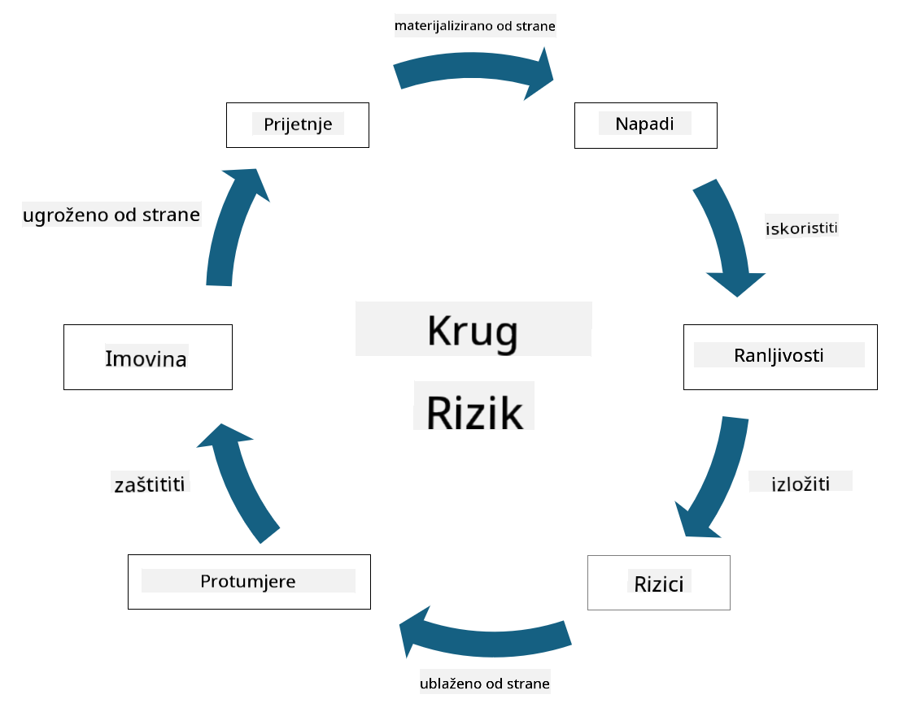

<!--
CO_OP_TRANSLATOR_METADATA:
{
  "original_hash": "fcca304f072cabf206388199e8e2e578",
  "translation_date": "2025-09-03T21:55:24+00:00",
  "source_file": "1.3 Understanding risk management.md",
  "language_code": "hr"
}
-->
# Razumijevanje upravljanja rizicima

## Uvod

U ovoj lekciji obradit ćemo:

 - Definicije često korištene sigurnosne terminologije
   
 - Vrste sigurnosnih kontrola

 - Procjenu sigurnosnih rizika

## Definicije često korištene sigurnosne terminologije

Ovi pojmovi su temeljni koncepti u području kibernetičke sigurnosti i upravljanja rizicima. Razmotrimo svaki pojam i kako se međusobno odnose:

1. **Agent prijetnje**:

Agent prijetnje je pojedinac, grupa, organizacija ili automatizirani sustav koji ima potencijal iskoristiti ranjivosti u sustavu ili mreži kako bi prouzročio štetu ili oštećenje. Agent prijetnje može biti haker, autor zlonamjernog softvera, nezadovoljni zaposlenik ili bilo koji entitet koji predstavlja rizik za informacijske i tehnološke sustave.

2. **Prijetnja**:

Prijetnja je potencijalni događaj ili radnja koja može iskoristiti ranjivosti u sustavu i prouzročiti štetu imovini. Prijetnje mogu uključivati radnje poput hakiranja, curenja podataka, napada uskraćivanjem usluge i slično. Prijetnje su "što" u smislu potencijalne štete koja se može nanijeti imovini organizacije.

3. **Ranjivost**:

Ranjivost je slabost ili nedostatak u dizajnu, implementaciji ili konfiguraciji sustava koji agent prijetnje može iskoristiti za ugrožavanje sigurnosti sustava. Ranjivosti mogu postojati u softveru, hardveru, procesima ili ljudskom ponašanju. Identificiranje i rješavanje ranjivosti ključno je za smanjenje rizika od uspješnih napada.

4. **Rizik**:

Rizik je potencijal za gubitak, štetu ili oštećenje koji proizlazi iz interakcije između prijetnje i ranjivosti. To je vjerojatnost da će agent prijetnje iskoristiti ranjivost kako bi prouzročio negativan utjecaj. Rizici se često procjenjuju prema njihovom potencijalnom utjecaju i vjerojatnosti pojave.

5. **Imovina**:

Imovina je sve što ima vrijednost i što organizacija želi zaštititi. Imovina može uključivati fizičke objekte (poput računala i poslužitelja), podatke (informacije o klijentima, financijske zapise), intelektualno vlasništvo (poslovne tajne, patente) i čak ljudske resurse (vještine i znanje zaposlenika). Zaštita imovine ključni je cilj kibernetičke sigurnosti.

6. **Izloženost**:

Izloženost se odnosi na stanje u kojem ste ranjivi na potencijalne prijetnje. To se događa kada postoji ranjivost koju agent prijetnje može iskoristiti. Izloženost naglašava rizik povezan s prisutnošću ranjivosti u sustavu ili mreži.

7. **Kontrola**:

Kontrola je mjera koja se postavlja kako bi se smanjio rizik povezan s ranjivostima i prijetnjama. Kontrole mogu biti tehničke, proceduralne ili administrativne prirode. Dizajnirane su za sprječavanje, otkrivanje ili ublažavanje potencijalnih prijetnji i ranjivosti. Primjeri uključuju vatrozidove, kontrole pristupa, enkripciju, sigurnosne politike i obuku zaposlenika.

Ukratko, odnos između ovih pojmova je sljedeći: Agenti prijetnje iskorištavaju ranjivosti kako bi ostvarili prijetnje, što može dovesti do rizika koji imaju potencijal prouzročiti štetu vrijednoj imovini. Izloženost se događa kada su prisutne ranjivosti, a kontrole se postavljaju kako bi se smanjio rizik sprječavanjem ili ublažavanjem utjecaja prijetnji na imovinu. Ovaj okvir čini osnovu upravljanja rizicima u kibernetičkoj sigurnosti, usmjeravajući organizacije u identificiranju, procjeni i rješavanju potencijalnih rizika za njihove informacijske sustave i imovinu.

## Vrste sigurnosnih kontrola

Sigurnosne kontrole su mjere ili zaštitne mjere implementirane za zaštitu informacijskih sustava i imovine od raznih prijetnji i ranjivosti. Mogu se klasificirati u nekoliko kategorija prema njihovom fokusu i svrsi. Evo nekih uobičajenih vrsta sigurnosnih kontrola:

1. **Administrativne kontrole**:

Ove kontrole odnose se na politike, procedure i smjernice koje upravljaju sigurnosnim praksama organizacije i ponašanjem korisnika.

- Sigurnosne politike i procedure: Dokumentirane smjernice koje definiraju kako se sigurnost održava unutar organizacije.

- Svijest o sigurnosti i obuka: Programi za edukaciju zaposlenika o najboljim praksama sigurnosti i potencijalnim prijetnjama.

- Odgovor na incidente i upravljanje: Planovi za reagiranje na sigurnosne incidente i njihovo ublažavanje.

2. **Tehničke kontrole**:

Tehničke kontrole uključuju korištenje tehnologije za provedbu sigurnosnih mjera i zaštitu sustava i podataka. Primjeri tehničkih kontrola su:

- Kontrole pristupa: Mjere koje ograničavaju pristup korisnika resursima na temelju njihovih uloga i dozvola.

- Enkripcija: Pretvaranje podataka u siguran format kako bi se spriječio neovlašteni pristup.

- Vatrozidi: Uređaji za sigurnost mreže koji filtriraju i kontroliraju dolazni i odlazni promet.

- Sustavi za otkrivanje i sprječavanje upada (IDPS): Alati koji prate mrežni promet radi sumnjivih aktivnosti.

- Antivirusni i anti-malware softver: Programi koji otkrivaju i uklanjaju zlonamjerni softver.

- Mehanizmi autentifikacije: Metode za provjeru identiteta korisnika, poput lozinki, biometrije i višefaktorske autentifikacije.

- Upravljanje zakrpama: Redovito ažuriranje softvera radi rješavanja poznatih ranjivosti.

3. **Fizičke kontrole**:

Fizičke kontrole su mjere za zaštitu fizičke imovine i objekata.

- Sigurnosni čuvari i osoblje za kontrolu pristupa: Osoblje koje nadzire i kontrolira pristup fizičkim prostorima.

- Kamere za nadzor: Sustavi za video nadzor koji prate i bilježe aktivnosti.

- Brave i fizičke barijere: Fizičke mjere za ograničavanje pristupa osjetljivim područjima.

- Kontrole okoliša: Mjere za regulaciju temperature, vlage i drugih okolišnih faktora koji utječu na opremu i podatkovne centre.

4. **Operativne kontrole**:

Ove kontrole odnose se na svakodnevne operacije i aktivnosti koje osiguravaju stalnu sigurnost sustava.

- Upravljanje promjenama: Procesi za praćenje i odobravanje promjena u sustavima i konfiguracijama.

- Sigurnosne kopije i oporavak od katastrofa: Planovi za sigurnosno kopiranje podataka i oporavak u slučaju kvarova sustava ili katastrofa.

- Evidentiranje i revizija: Praćenje i bilježenje aktivnosti sustava radi sigurnosti i usklađenosti.

- Sigurne prakse kodiranja: Smjernice za pisanje softvera kako bi se minimizirale ranjivosti.

5. **Pravne i regulatorne kontrole**:

Ove kontrole osiguravaju usklađenost s relevantnim zakonima, propisima i industrijskim standardima. Standardi koje organizacija mora poštovati ovise o jurisdikciji, industrijskom sektoru i drugim faktorima.

- Propisi o zaštiti podataka: Usklađenost sa zakonima poput GDPR-a, HIPAA-e i CCPA-a.

- Industrijski specifični standardi: Poštivanje standarda poput PCI DSS-a za sigurnost podataka o platnim karticama.

Ove kategorije sigurnosnih kontrola zajedno stvaraju sveobuhvatnu sigurnosnu strategiju za organizacije, pomažući u zaštiti njihovih sustava, podataka i imovine od širokog spektra prijetnji.

## Procjena sigurnosnih rizika

Neki stručnjaci za sigurnost smatraju da upravljanje rizicima treba prepustiti stručnjacima za rizike, no razumijevanje procesa upravljanja sigurnosnim rizicima važno je za svakog stručnjaka za sigurnost kako bi mogao izraziti sigurnosne rizike na način koji ostatak organizacije može razumjeti i djelovati na njih.

Organizacije moraju stalno procjenjivati sigurnosne rizike i odlučivati koje mjere (ili ne) poduzeti protiv rizika za poslovanje. U nastavku je pregled kako se to obično radi. Napominjemo da se ovaj proces obično provodi kroz nekoliko različitih timova unutar organizacije; rijetko je da jedan tim bude odgovoran za cjelokupno upravljanje rizicima.

1. **Identifikacija imovine i prijetnji**:

Organizacija identificira imovinu koju želi zaštititi. To može uključivati podatke, sustave, hardver, softver, intelektualno vlasništvo i drugo. Zatim identificira potencijalne prijetnje koje bi mogle ciljati tu imovinu.

2. **Procjena ranjivosti**:

Organizacije zatim identificiraju ranjivosti ili slabosti u sustavima ili procesima koje prijetnje mogu iskoristiti. Te ranjivosti mogu proizlaziti iz softverskih nedostataka, pogrešnih konfiguracija, nedostatka sigurnosnih kontrola i ljudskih pogrešaka.

3. **Procjena vjerojatnosti**:

Organizacija zatim procjenjuje vjerojatnost pojave svake prijetnje. To uključuje razmatranje povijesnih podataka, obavještajnih podataka o prijetnjama, industrijskih trendova i unutarnjih faktora. Vjerojatnost se može kategorizirati kao niska, srednja ili visoka na temelju vjerojatnosti realizacije prijetnje.

4. **Procjena utjecaja**:

Zatim organizacija određuje potencijalni utjecaj svake prijetnje ako bi iskoristila ranjivost. Utjecaj može obuhvatiti financijske gubitke, operativne poremećaje, štetu ugledu, pravne posljedice i drugo. Utjecaj se također može kategorizirati kao nizak, srednji ili visok na temelju potencijalnih posljedica.

5. **Izračun rizika**:

Procjene vjerojatnosti i utjecaja kombiniraju se kako bi se izračunala ukupna razina rizika za svaku identificiranu prijetnju. To se često radi pomoću matrice rizika koja dodjeljuje numeričke vrijednosti ili kvalitativne opise razinama vjerojatnosti i utjecaja. Dobivena razina rizika pomaže u određivanju prioriteta rizika koji zahtijevaju hitnu pažnju.

6. **Prioriteti i donošenje odluka**:

Organizacija zatim prioritizira rizike fokusirajući se na one s najvišim kombiniranim vrijednostima vjerojatnosti i utjecaja. To im omogućuje učinkovitiju raspodjelu resursa i implementaciju kontrola. Prijetnje visokog rizika zahtijevaju hitnu pažnju, dok se prijetnje nižeg rizika mogu rješavati tijekom duljeg vremenskog razdoblja.

7. **Upravljanje rizicima**:

Na temelju procjene rizika, organizacija odlučuje kako ublažiti ili upravljati svakim rizikom. To može uključivati implementaciju sigurnosnih kontrola, prijenos rizika putem osiguranja ili čak prihvaćanje određenih razina preostalog rizika ako se smatraju upravljivima/previše skupima za rješavanje itd.

8. **Kontinuirano praćenje i pregled**:

Procjena rizika nije jednokratan proces. Trebala bi se provoditi periodično ili kad god dođe do značajnih promjena u okruženju organizacije. Kontinuirano praćenje osigurava da se uzmu u obzir nove prijetnje, ranjivosti ili promjene u poslovnom okruženju.

Procjenjujući sigurnosne rizike na ovaj strukturirani način, organizacije mogu donositi informirane odluke o raspodjeli resursa, sigurnosnim kontrolama i strategijama upravljanja rizicima. Cilj je smanjiti ukupnu izloženost riziku organizacije, istovremeno usklađujući sigurnosne napore s poslovnim ciljevima i strategijama organizacije.

---

**Odricanje od odgovornosti**:  
Ovaj dokument je preveden pomoću AI usluge za prevođenje [Co-op Translator](https://github.com/Azure/co-op-translator). Iako nastojimo osigurati točnost, imajte na umu da automatski prijevodi mogu sadržavati pogreške ili netočnosti. Izvorni dokument na izvornom jeziku treba smatrati autoritativnim izvorom. Za ključne informacije preporučuje se profesionalni prijevod od strane čovjeka. Ne preuzimamo odgovornost za bilo kakva nesporazuma ili pogrešna tumačenja koja proizlaze iz korištenja ovog prijevoda.