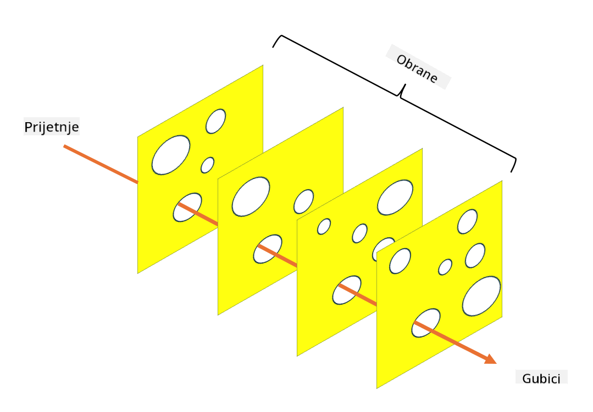

<!--
CO_OP_TRANSLATOR_METADATA:
{
  "original_hash": "75f77f972d2233c584f87c1eb96c983b",
  "translation_date": "2025-09-03T20:32:34+00:00",
  "source_file": "1.5 Zero trust.md",
  "language_code": "hr"
}
-->
# Zero Trust

"Zero trust" je izraz koji se danas često koristi u sigurnosnim krugovima. No, što to zapravo znači? Je li to samo popularna fraza? U ovoj lekciji ćemo detaljno istražiti što je zero trust.

## Uvod

 - U ovoj lekciji obradit ćemo:
   
   
 - Što je zero trust?

   
  

 - Kako se zero trust razlikuje od tradicionalnih sigurnosnih arhitektura?

   
   

 - Što je obrana u dubini?

## Zero Trust

Zero Trust je pristup kibernetičkoj sigurnosti koji dovodi u pitanje tradicionalni koncept "vjeruj, ali provjeri" pretpostavljajući da nijedan entitet, bilo unutar ili izvan mreže organizacije, ne bi trebao biti inherentno pouzdan. Umjesto toga, Zero Trust zagovara provjeru svakog korisnika, uređaja i aplikacije koji pokušavaju pristupiti resursima, bez obzira na njihovu lokaciju. Temeljno načelo Zero Trusta je minimiziranje "površine napada" i smanjenje potencijalnog utjecaja sigurnosnih proboja.

U modelu Zero Trust naglašavaju se sljedeća načela:

1. **Provjera identiteta**: Autentifikacija i autorizacija se strogo primjenjuju na sve korisnike i uređaje, bez obzira na njihovu lokaciju. Zapamtite da identitet ne mora nužno biti ljudski: može biti uređaj, aplikacija itd.

2. **Najmanje privilegije**: Korisnicima i uređajima dodjeljuje se minimalna razina pristupa potrebna za obavljanje njihovih zadataka, čime se smanjuje potencijalna šteta u slučaju kompromitacije.

3. **Mikro-segmentacija**: Mrežni resursi dijele se na manje segmente kako bi se ograničilo lateralno kretanje unutar mreže u slučaju proboja.

4. **Kontinuirano praćenje**: Provodi se stalno praćenje i analiza ponašanja korisnika i uređaja kako bi se otkrile anomalije i potencijalne prijetnje. Moderni pristupi praćenju koriste strojno učenje, AI i obavještajne podatke o prijetnjama za dodatne detalje i kontekst.

5. **Šifriranje podataka**: Podaci se šifriraju tijekom prijenosa i u mirovanju kako bi se spriječio neovlašteni pristup.

6. **Stroga kontrola pristupa**: Kontrole pristupa provode se na temelju konteksta, poput uloga korisnika, zdravlja uređaja i lokacije mreže.

Microsoft dijeli zero trust na pet stupova, o kojima ćemo raspravljati u kasnijoj lekciji.

## Razlike u odnosu na tradicionalne sigurnosne arhitekture

Zero Trust se razlikuje od tradicionalnih sigurnosnih arhitektura, poput modela temeljenih na perimetru, na nekoliko načina:

1. **Perimetar vs. identitet**: Tradicionalni modeli fokusiraju se na osiguranje perimetra mreže i pretpostavljaju da se unutarnjim korisnicima i uređajima može vjerovati jednom kad su unutra. Zero Trust, s druge strane, pretpostavlja da prijetnje mogu dolaziti i iznutra i izvana te provodi stroge kontrole temeljene na identitetu.

2. **Implicitno vs. eksplicitno povjerenje**: Tradicionalni modeli implicitno vjeruju uređajima i korisnicima unutar mreže dok se ne dokaže suprotno. Zero Trust eksplicitno provjerava identitete i kontinuirano prati anomalije.

3. **Ravna vs. segmentirana mreža**: Tradicionalne arhitekture često uključuju ravne mreže gdje unutarnji korisnici imaju širok pristup. Zero Trust zagovara segmentaciju mreže u manje, izolirane zone kako bi se ograničili potencijalni proboji.

4. **Reaktivno vs. proaktivno**: Tradicionalna sigurnost često se oslanja na reaktivne mjere poput vatrozida na perimetru i sustava za otkrivanje upada. Zero Trust zauzima proaktivan pristup pretpostavljajući da su proboji vjerojatni i minimizirajući njihov utjecaj.

## Obrana u dubini

Obrana u dubini, poznata i kao slojevita sigurnost, strategija je kibernetičke sigurnosti koja uključuje primjenu više slojeva sigurnosnih kontrola i mjera za zaštitu imovine organizacije. Cilj je stvoriti preklapajuće slojeve obrane kako bi, ako jedan sloj bude probijen, drugi i dalje pružali zaštitu. Svaki sloj fokusira se na različit aspekt sigurnosti i povećava ukupnu sigurnosnu razinu organizacije.

Obrana u dubini uključuje kombinaciju tehničkih, proceduralnih i fizičkih sigurnosnih mjera. To može uključivati vatrozide, sustave za otkrivanje upada, kontrole pristupa, šifriranje, obuku korisnika, sigurnosne politike i više. Ideja je stvoriti više barijera koje zajedno otežavaju napadačima proboj u sustave i mreže organizacije. Ovo se ponekad naziva i "model švicarskog sira", koji se također koristi u prevenciji nesreća u drugim industrijama (npr. transport).

## Dodatno čitanje

[Što je Zero Trust?](https://learn.microsoft.com/security/zero-trust/zero-trust-overview?WT.mc_id=academic-96948-sayoung)

[Evolucija Zero Trusta – Microsoftov pozicijski dokument](https://query.prod.cms.rt.microsoft.com/cms/api/am/binary/RWJJdT?WT.mc_id=academic-96948-sayoung)

[Zero Trust i BeyondCorp Google Cloud | Google Cloud Blog](https://cloud.google.com/blog/topics/developers-practitioners/zero-trust-and-beyondcorp-google-cloud)

---

**Odricanje od odgovornosti**:  
Ovaj dokument je preveden pomoću AI usluge za prevođenje [Co-op Translator](https://github.com/Azure/co-op-translator). Iako nastojimo osigurati točnost, imajte na umu da automatski prijevodi mogu sadržavati pogreške ili netočnosti. Izvorni dokument na izvornom jeziku treba smatrati autoritativnim izvorom. Za ključne informacije preporučuje se profesionalni prijevod od strane ljudskog prevoditelja. Ne preuzimamo odgovornost za bilo kakve nesporazume ili pogrešne interpretacije koje proizlaze iz korištenja ovog prijevoda.