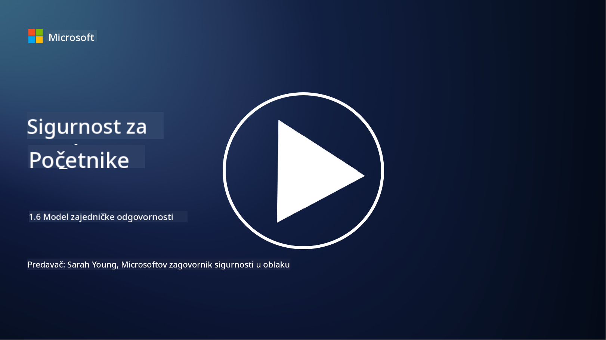

<!--
CO_OP_TRANSLATOR_METADATA:
{
  "original_hash": "a48db640d80c786b928ca178c414f084",
  "translation_date": "2025-09-03T21:05:27+00:00",
  "source_file": "1.6 Shared responsibility model.md",
  "language_code": "hr"
}
-->
# Model zajedničke odgovornosti

Zajednička odgovornost je noviji koncept u IT-u koji je nastao s pojavom računalstva u oblaku. Iz perspektive kibernetičke sigurnosti, ključno je razumjeti tko pruža koje sigurnosne kontrole kako bi se izbjegle praznine u obrani.

## Uvod

U ovoj lekciji obradit ćemo:

 - Što je zajednička odgovornost u kontekstu kibernetičke sigurnosti?
   
 - Koja je razlika u zajedničkoj odgovornosti za sigurnosne kontrole
   između IaaS, PaaS i SaaS?

   

 - Gdje možete pronaći informacije o sigurnosnim kontrolama koje pruža vaša platforma u oblaku?

   
 

 - Što znači "vjeruj, ali provjeri"?

## Što je zajednička odgovornost u kontekstu kibernetičke sigurnosti?

Zajednička odgovornost u kibernetičkoj sigurnosti odnosi se na podjelu sigurnosnih odgovornosti između pružatelja usluga u oblaku (CSP) i njegovih korisnika. U okruženjima računalstva u oblaku, kao što su Infrastructure as a Service (IaaS), Platform as a Service (PaaS) i Software as a Service (SaaS), i CSP i korisnik imaju uloge u osiguravanju sigurnosti podataka, aplikacija i sustava.

## Koja je razlika u zajedničkoj odgovornosti za sigurnosne kontrole između IaaS, PaaS i SaaS?

Podjela odgovornosti obično ovisi o vrsti usluge u oblaku koja se koristi:

 - **IaaS (Infrastructure as a Service)**: CSP pruža osnovnu infrastrukturu (poslužitelje, mreže, pohranu), dok je korisnik odgovoran za upravljanje operativnim sustavima, aplikacijama i sigurnosnim konfiguracijama na toj infrastrukturi.
   
   
 - **PaaS (Platform as a Service):** CSP nudi platformu na kojoj korisnici mogu graditi i implementirati aplikacije. CSP upravlja osnovnom infrastrukturom, a korisnik se fokusira na razvoj aplikacija i sigurnost podataka.

   

 - **SaaS (Software as a Service)**: CSP pruža potpuno funkcionalne aplikacije dostupne putem interneta. U ovom slučaju, CSP je odgovoran za sigurnost aplikacije i infrastrukture, dok korisnik upravlja pristupom korisnika i korištenjem podataka.

Razumijevanje zajedničke odgovornosti ključno je jer pojašnjava koji su sigurnosni aspekti pokriveni od strane CSP-a, a koje korisnik treba adresirati. To pomaže u sprječavanju nesporazuma i osigurava da se sigurnosne mjere provode cjelovito.

## Gdje možete pronaći informacije o sigurnosnim kontrolama koje pruža vaša platforma u oblaku?

Da biste saznali koje sigurnosne kontrole pruža vaša platforma u oblaku, trebate se obratiti dokumentaciji i resursima pružatelja usluga u oblaku. To uključuje:

 - **Web stranica i dokumentacija CSP-a**: Web stranica CSP-a sadržavat će informacije o sigurnosnim značajkama i kontrolama koje se nude kao dio njihovih usluga. CSP-ovi obično nude detaljnu dokumentaciju koja objašnjava njihove sigurnosne prakse, kontrole i preporuke. To može uključivati tehničke dokumente, vodiče za sigurnost i bijele knjige.
   
 - **Procjene i revizije sigurnosti**: Većina CSP-ova svoje sigurnosne kontrole procjenjuje od strane neovisnih stručnjaka i organizacija za sigurnost. Ove recenzije mogu pružiti uvid u kvalitetu sigurnosnih mjera CSP-a. Ponekad to dovodi do dobivanja certifikata o sigurnosnoj usklađenosti (vidi sljedeću točku).
 - **Certifikati o sigurnosnoj usklađenosti**: Većina CSP-ova dobiva certifikate poput ISO:27001, SOC 2 i FedRAMP, itd. Ovi certifikati pokazuju da pružatelj ispunjava određene sigurnosne i usklađenosti standarde.

Zapamtite da razina detalja i dostupnost informacija može varirati između pružatelja usluga u oblaku. Uvijek se pobrinite da konzultirate službene i ažurirane resurse koje pruža CSP kako biste donijeli informirane odluke o sigurnosti vaših resursa u oblaku.

## Što znači "vjeruj, ali provjeri"?

U kontekstu korištenja CSP-a, softvera treće strane ili druge IT sigurnosne usluge, organizacija može u početku vjerovati tvrdnjama pružatelja o sigurnosnim mjerama. Međutim, kako bi zaista osigurala sigurnost svojih podataka i sustava, trebala bi provjeriti te tvrdnje putem procjena sigurnosti, testiranja penetracije i pregleda sigurnosnih kontrola vanjskog pružatelja prije nego što u potpunosti integrira softver ili uslugu u svoje operacije. Svi pojedinci i organizacije trebali bi se voditi načelom "vjeruj, ali provjeri" za sigurnosne kontrole za koje nisu odgovorni.

## Zajednička odgovornost unutar organizacije

Zapamtite, zajednička odgovornost za sigurnost unutar organizacije između različitih timova također treba biti uzeta u obzir. Sigurnosni tim rijetko će samostalno implementirati sve kontrole i morat će surađivati s operativnim timovima, programerima i drugim dijelovima poslovanja kako bi implementirali sve potrebne sigurnosne kontrole za zaštitu organizacije.

## Dodatno čitanje
- [Shared responsibility in the cloud - Microsoft Azure | Microsoft Learn](https://learn.microsoft.com/azure/security/fundamentals/shared-responsibility?WT.mc_id=academic-96948-sayoung)
- [What is shared responsibility model? – Definition from TechTarget.com](https://www.techtarget.com/searchcloudcomputing/definition/shared-responsibility-model)
- [The shared responsibility model explained and what it means for cloud security | CSO Online](https://www.csoonline.com/article/570779/the-shared-responsibility-model-explained-and-what-it-means-for-cloud-security.html)
- [Shared Responsibility for Cloud Security: What You Need to Know (cisecurity.org)](https://www.cisecurity.org/insights/blog/shared-responsibility-cloud-security-what-you-need-to-know)

---

**Odricanje od odgovornosti**:  
Ovaj dokument je preveden pomoću AI usluge za prevođenje [Co-op Translator](https://github.com/Azure/co-op-translator). Iako nastojimo osigurati točnost, imajte na umu da automatski prijevodi mogu sadržavati pogreške ili netočnosti. Izvorni dokument na izvornom jeziku treba smatrati autoritativnim izvorom. Za ključne informacije preporučuje se profesionalni prijevod od strane čovjeka. Ne preuzimamo odgovornost za bilo kakva pogrešna tumačenja ili nesporazume koji mogu proizaći iz korištenja ovog prijevoda.