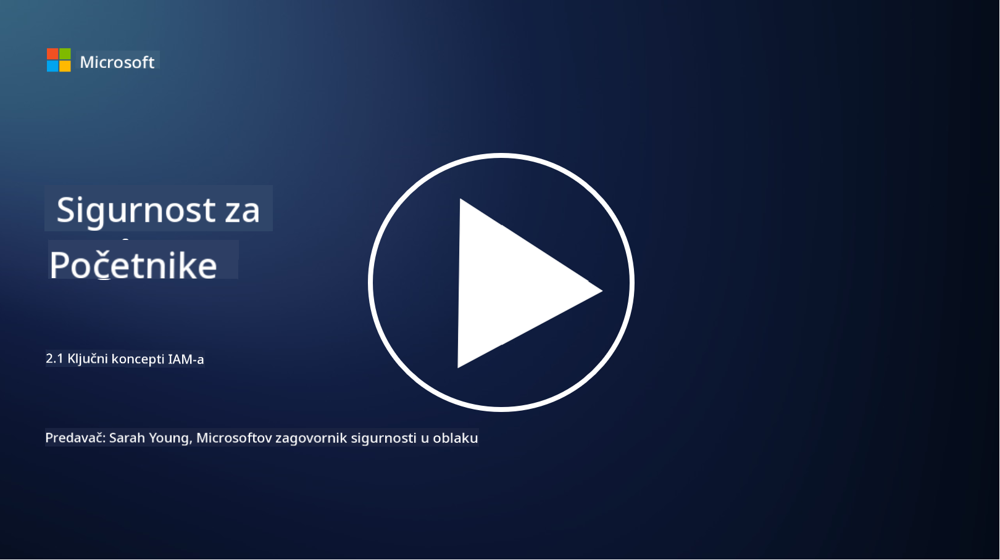

<!--
CO_OP_TRANSLATOR_METADATA:
{
  "original_hash": "2e3864e3d579f0dbb4ac2ec8c5f82acf",
  "translation_date": "2025-09-03T19:37:17+00:00",
  "source_file": "2.1 IAM key concepts.md",
  "language_code": "hr"
}
-->
# Ključni pojmovi IAM-a

Jeste li se ikada prijavili na računalo ili web stranicu? Naravno da jeste! To znači da ste već koristili kontrole identiteta u svakodnevnom životu. Upravljanje identitetom i pristupom (IAM) ključni je stup sigurnosti, a o njemu ćemo više naučiti u sljedećim lekcijama.

**Uvod**

U ovoj lekciji obradit ćemo:

- Što podrazumijevamo pod upravljanjem identitetom i pristupom (IAM) u kontekstu kibernetičke sigurnosti?

- Što je načelo najmanjih privilegija?

- Što je razdvajanje dužnosti?

- Što su autentifikacija i autorizacija?

## Što podrazumijevamo pod upravljanjem identitetom i pristupom (IAM) u kontekstu kibernetičke sigurnosti?

Upravljanje identitetom i pristupom (IAM) odnosi se na skup procesa, tehnologija i politika koje se provode kako bi se osiguralo da odgovarajuće osobe imaju odgovarajući pristup resursima unutar digitalnog okruženja organizacije. IAM uključuje upravljanje digitalnim identitetima (korisnici, zaposlenici, partneri) i njihovim pristupom sustavima, aplikacijama, podacima i mrežama. Primarni cilj IAM-a je poboljšanje sigurnosti, pojednostavljenje korisničkog pristupa i osiguranje usklađenosti s politikama i propisima organizacije. IAM rješenja obično obuhvaćaju autentifikaciju korisnika, autorizaciju, dodjelu identiteta, kontrolu pristupa i upravljanje životnim ciklusom korisnika (osiguravanje da se računi brišu kada se više ne koriste).

## Što je načelo najmanjih privilegija?

Načelo najmanjih privilegija temeljni je koncept koji zagovara dodjeljivanje korisnicima i sustavima samo onih privilegija koje su nužne za obavljanje njihovih zadataka ili uloga. Ovo načelo pomaže u ograničavanju potencijalne štete koja može nastati u slučaju sigurnosnog proboja ili prijetnje iznutra. Pridržavanjem načela najmanjih privilegija organizacije smanjuju površinu napada i minimiziraju rizik od neovlaštenog pristupa, curenja podataka i slučajnog zloupotrebljavanja privilegija. U praksi to znači da korisnici dobivaju pristup samo specifičnim resursima i funkcionalnostima potrebnim za njihove radne uloge, i ništa više. Na primjer, ako trebate samo pročitati dokument, bilo bi pretjerano da vam se dodijele pune administratorske privilegije za taj dokument.

## Što je razdvajanje dužnosti?

Razdvajanje dužnosti načelo je usmjereno na sprječavanje sukoba interesa i smanjenje rizika od prijevara i pogrešaka raspodjelom ključnih zadataka i odgovornosti među različitim osobama unutar organizacije. U kontekstu kibernetičke sigurnosti, razdvajanje dužnosti uključuje osiguranje da nijedna pojedinačna osoba nema kontrolu nad svim aspektima kritičnog procesa ili sustava. Cilj je stvoriti sustav provjera i ravnoteža koji sprječava da jedna osoba ima mogućnost obavljanja i postavljanja i odobravanja faza procesa. Na primjer, u financijskim sustavima to može značiti da osoba koja unosi transakcije u sustav ne smije biti ista osoba koja odobrava te transakcije. Ovo smanjuje rizik od neovlaštenih ili prijevarnih radnji koje bi mogle proći nezapaženo.

## Što su autentifikacija i autorizacija?

Autentifikacija i autorizacija dva su temeljna koncepta u kibernetičkoj sigurnosti koji igraju ključnu ulogu u osiguravanju sigurnosti i integriteta računalnih sustava i podataka. Često se koriste zajedno za kontrolu pristupa resursima i zaštitu osjetljivih informacija.

**1. Autentifikacija**: Autentifikacija je proces provjere identiteta korisnika, sustava ili entiteta koji pokušava pristupiti računalnom sustavu ili specifičnom resursu. Osigurava da je tvrdnja o identitetu istinita i točna. Metode autentifikacije obično uključuju korištenje jednog ili više od sljedećih faktora:

   a. Nešto što znate: To uključuje lozinke, PIN-ove ili druge tajne informacije koje bi trebao posjedovati samo ovlašteni korisnik.

   b. Nešto što imate: To uključuje fizičke tokene ili uređaje poput pametnih kartica, sigurnosnih tokena ili mobilnih telefona koji se koriste za potvrdu identiteta korisnika.

   c. Nešto što jeste: To se odnosi na biometrijske faktore poput otisaka prstiju, prepoznavanja lica ili skeniranja mrežnice koji su jedinstveni za pojedinca.

Mehanizmi autentifikacije koriste se za potvrdu da je korisnik ono za što se predstavlja prije nego što mu se omogući pristup sustavu ili resursu. Pomaže u sprječavanju neovlaštenog pristupa i osigurava da samo legitimni korisnici mogu izvršavati radnje unutar sustava.

**2. Autorizacija**: Autorizacija je proces dodjeljivanja ili uskraćivanja specifičnih dozvola i privilegija autentificiranim korisnicima ili entitetima nakon što je njihov identitet potvrđen. Određuje koje radnje ili operacije korisnik smije izvršavati unutar sustava ili na specifičnim resursima. Autorizacija se često temelji na unaprijed definiranim politikama, pravilima kontrole pristupa i ulogama dodijeljenim korisnicima.

Autorizacija se može smatrati odgovorom na pitanje: "Što autentificirani korisnik smije raditi?" Uključuje definiranje i provođenje politika kontrole pristupa kako bi se osjetljivi podaci i resursi zaštitili od neovlaštenog pristupa ili izmjena.

**Ukratko:**

- Autentifikacija utvrđuje identitet korisnika ili entiteta.
- Autorizacija određuje koje radnje i resurse autentificirani korisnici smiju pristupiti ili mijenjati.

## Dodatno čitanje

- [Describe identity concepts - Training | Microsoft Learn](https://learn.microsoft.com/training/modules/describe-identity-principles-concepts/?WT.mc_id=academic-96948-sayoung)
- [Introduction to identity - Microsoft Entra | Microsoft Learn](https://learn.microsoft.com/azure/active-directory/fundamentals/identity-fundamental-concepts?WT.mc_id=academic-96948-sayoung)
- [What is Identity Access Management (IAM)? | Microsoft Security](https://www.microsoft.com/security/business/security-101/what-is-identity-access-management-iam?WT.mc_id=academic-96948-sayoung)
- [What is IAM? Identity and access management explained | CSO Online](https://www.csoonline.com/article/518296/what-is-iam-identity-and-access-management-explained.html)
- [What is IAM? (auth0.com)](https://auth0.com/blog/what-is-iam/)
- [Security+: implementing Identity and Access Management (IAM) controls [updated 2021] | Infosec (infosecinstitute.com)](https://resources.infosecinstitute.com/certifications/securityplus/security-implementing-identity-and-access-management-iam-controls/)
- [least privilege - Glossary | CSRC (nist.gov)](https://csrc.nist.gov/glossary/term/least_privilege)
- [Security: The Principle of Least Privilege (POLP) - Microsoft Community Hub](https://techcommunity.microsoft.com/t5/azure-sql-blog/security-the-principle-of-least-privilege-polp/ba-p/2067390?WT.mc_id=academic-96948-sayoung)
- [Principle of least privilege | CERT NZ](https://www.cert.govt.nz/it-specialists/critical-controls/principle-of-least-privilege/)
- [Why is separation of duties required by NIST 800-171 and CMMC? - (totem.tech)](https://www.totem.tech/cmmc-separation-of-duties/)

---

**Odricanje od odgovornosti**:  
Ovaj dokument je preveden pomoću AI usluge za prevođenje [Co-op Translator](https://github.com/Azure/co-op-translator). Iako nastojimo osigurati točnost, imajte na umu da automatski prijevodi mogu sadržavati pogreške ili netočnosti. Izvorni dokument na izvornom jeziku treba smatrati autoritativnim izvorom. Za ključne informacije preporučuje se profesionalni prijevod od strane ljudskog prevoditelja. Ne preuzimamo odgovornost za bilo kakve nesporazume ili pogrešne interpretacije koje proizlaze iz korištenja ovog prijevoda.