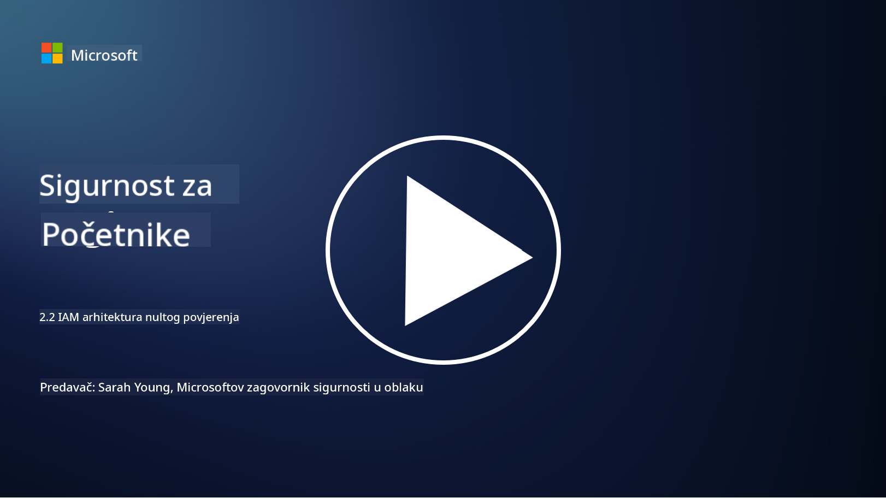

<!--
CO_OP_TRANSLATOR_METADATA:
{
  "original_hash": "4774a978af123f72ebb872199c4c4d4f",
  "translation_date": "2025-09-03T20:27:20+00:00",
  "source_file": "2.2 IAM zero trust architecture.md",
  "language_code": "hr"
}
-->
# IAM arhitektura nulte povjerenja

Identitet je ključni dio implementacije arhitekture nulte povjerenja i izgradnje perimetra za bilo koje IT okruženje. U ovom odjeljku istražit ćemo zašto je važno koristiti kontrole identiteta za implementaciju nulte povjerenja.

## Uvod

U ovoj lekciji obradit ćemo:

 - Zašto trebamo koristiti identitet kao naš perimetar u modernim IT okruženjima?
   
 - Kako se to razlikuje od tradicionalnih IT arhitektura?

 - Kako se identitet koristi za implementaciju arhitekture nulte povjerenja?

## Zašto trebamo koristiti identitet kao naš perimetar u modernim IT okruženjima?

U modernim IT okruženjima, tradicionalni koncept fizičkog perimetra (koristeći alate poput vatrozida i mrežnih granica) kao primarne linije obrane protiv kibernetičkih prijetnji postaje sve manje učinkovit zbog rastuće složenosti tehnologije, porasta rada na daljinu i usvajanja cloud usluga. Umjesto toga, organizacije se okreću korištenju identiteta kao novog perimetra. To znači da se sigurnost temelji na provjeri i upravljanju identitetom korisnika, uređaja i aplikacija koje pokušavaju pristupiti resursima, bez obzira na njihovu fizičku lokaciju.

Evo zašto je korištenje identiteta kao perimetra ključno u modernim IT okruženjima:

**Rad na daljinu**: S radom na daljinu i mobilnim uređajima koji postaju norma, korisnici mogu pristupiti resursima s različitih lokacija i uređaja. Tradicionalni pristup perimetru ne funkcionira kada korisnici više nisu ograničeni na fizički ured.

**Cloud i hibridna okruženja**: Organizacije sve više usvajaju cloud usluge i hibridna okruženja. Podaci i aplikacije više nisu isključivo smješteni unutar prostora organizacije, što čini tradicionalne obrane perimetra manje relevantnima.

**Sigurnost nulte povjerenja**: Koncept sigurnosti nulte povjerenja pretpostavlja da se nijednom entitetu, bilo unutar ili izvan mreže, ne smije automatski vjerovati. Identitet postaje temelj za provjeru zahtjeva za pristup, bez obzira na njihovo podrijetlo.

**Prijetnje**: Kibernetičke prijetnje evoluiraju, a napadači pronalaze načine zaobilaženja tradicionalnih obrana perimetra. Phishing, socijalni inženjering i prijetnje iznutra često iskorištavaju ljudske slabosti umjesto pokušaja probijanja mrežnih perimetara.

**Pristup usmjeren na podatke**: Zaštita osjetljivih podataka je ključna. Fokusiranjem na identitet, organizacije mogu kontrolirati tko pristupa kojim podacima, smanjujući rizik od curenja podataka.

## Kako se to razlikuje od tradicionalnih IT arhitektura?

Tradicionalne IT arhitekture uvelike su se oslanjale na sigurnosne modele temeljene na perimetru, gdje su vatrozidi i mrežne granice igrali značajnu ulogu u zaštiti od prijetnji. Glavne razlike između tradicionalnog i pristupa temeljenog na identitetu su:

|      Aspekt                 |      Tradicionalne IT arhitekture                                                                |      Pristup temeljen na identitetu                                                                         |
|-----------------------------|--------------------------------------------------------------------------------------------------|------------------------------------------------------------------------------------------------------------|
|     Fokus                   |     Fokus na perimetar: Oslanjanje na obranu perimetra poput vatrozida i   kontrole pristupa.    |     Fokus na provjeru identiteta: Pomak od mrežnih granica prema provjeri   identiteta korisnika/uređaja.  |
|     Lokacija                |     Ovisnost o lokaciji: Sigurnost vezana uz fizičke lokacije ureda i   mrežne granice.          |     Neovisnost o lokaciji: Sigurnost nije vezana uz specifične lokacije;   pristup s bilo kojeg mjesta.    |
|     Pretpostavka povjerenja |     Pretpostavljeno povjerenje: Povjerenje unutar mrežnog perimetra za   korisnike/uređaje.      |     Pristup nulte povjerenja: Povjerenje se nikada ne pretpostavlja;   pristup se provjerava na temelju identiteta i konteksta. |
|     Razmatranje uređaja     |     Raznolikost uređaja: Pretpostavka da su uređaji unutar mrežnog   perimetra sigurni.          |     Svijest o uređajima: Uzimanje u obzir zdravlja i sigurnosnog stanja   uređaja, bez obzira na lokaciju. |
|     Zaštita podataka        |     Zaštita podataka: Fokus na osiguranje mrežnih perimetara radi   zaštite podataka.            |     Zaštita usmjerena na podatke: Fokus na kontrolu pristupa podacima na   temelju identiteta i osjetljivosti podataka. |

## Kako se identitet koristi za implementaciju arhitekture nulte povjerenja?

U arhitekturi nulte povjerenja, temeljno načelo je da se nikada automatski ne vjeruje nijednom entitetu, bez obzira na to je li unutar ili izvan mrežnog perimetra. Identitet igra središnju ulogu u implementaciji pristupa nulte povjerenja omogućujući kontinuiranu provjeru entiteta koji pokušavaju pristupiti resursima. Moderni sigurnosni mehanizmi identiteta omogućuju da svaki korisnik, uređaj, aplikacija i usluga koja traži pristup resursima mora biti temeljito identificirana i autentificirana prije nego što se pristup odobri. To uključuje provjeru njihovog digitalnog identiteta putem metoda poput kombinacija korisničkog imena i lozinke, višefaktorske autentifikacije (MFA), biometrije i drugih snažnih mehanizama autentifikacije.

## Dodatno čitanje

- [Securing identity with Zero Trust | Microsoft Learn](https://learn.microsoft.com/security/zero-trust/deploy/identity?WT.mc_id=academic-96948-sayoung)
- [Zero Trust Principles and Guidance for Identity and Access | CSA (cloudsecurityalliance.org)](https://cloudsecurityalliance.org/artifacts/zero-trust-principles-and-guidance-for-iam/)
- [Zero Trust Identity Controls - Essentials Series - Episode 2 - YouTube](https://www.youtube.com/watch?v=fQZQznIKcGM&list=PLXtHYVsvn_b_gtX1-NB62wNervQx1Fhp4&index=13)

---

**Odricanje od odgovornosti**:  
Ovaj dokument je preveden pomoću AI usluge za prevođenje [Co-op Translator](https://github.com/Azure/co-op-translator). Iako nastojimo osigurati točnost, imajte na umu da automatski prijevodi mogu sadržavati pogreške ili netočnosti. Izvorni dokument na izvornom jeziku treba smatrati autoritativnim izvorom. Za ključne informacije preporučuje se profesionalni prijevod od strane ljudskog prevoditelja. Ne preuzimamo odgovornost za bilo kakva nesporazuma ili pogrešna tumačenja koja proizlaze iz korištenja ovog prijevoda.