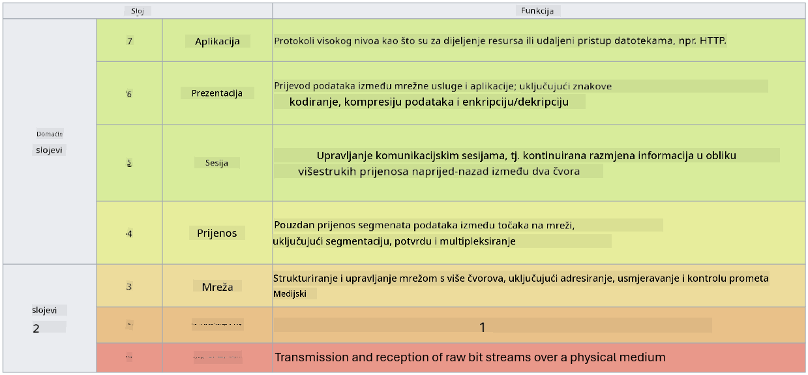

<!--
CO_OP_TRANSLATOR_METADATA:
{
  "original_hash": "252724eceeb183fb9018f88c5e1a3f0c",
  "translation_date": "2025-09-03T22:05:40+00:00",
  "source_file": "3.1 Networking key concepts.md",
  "language_code": "hr"
}
-->
# Ključni koncepti umrežavanja

Ako ste radili u IT-u, vjerojatno ste se susreli s konceptima umrežavanja. Iako identitet koristimo kao primarnu kontrolu perimetra u modernim okruženjima, to ne znači da su mrežne kontrole suvišne. Iako je ovo široka tema, u ovoj lekciji pokrit ćemo neke ključne koncepte umrežavanja.

U ovoj lekciji obradit ćemo:

 - Što je IP adresiranje?
   
 - Što je OSI model?

 

 - Što su TCP/UDP?

   
 

 - Što su brojevi portova?

   
  

 - Što je enkripcija u mirovanju i tijekom prijenosa?

## Što je IP adresiranje?

IP adresiranje, ili adresiranje putem Internet protokola, je numerička oznaka dodijeljena svakom uređaju povezanom na računalnu mrežu koja koristi Internet protokol za komunikaciju. Služi kao jedinstveni identifikator za uređaje unutar mreže, omogućujući im slanje i primanje podataka preko interneta ili drugih povezanih mreža. Postoje dvije glavne verzije IP adresiranja: IPv4 (Internet Protocol verzija 4) i IPv6 (Internet Protocol verzija 6). IP adresa obično se prikazuje u formatu IPv4 (npr. 192.168.1.1) ili IPv6 (npr. 2001:0db8:85a3:0000:0000:8a2e:0370:7334).

## Što je OSI model?

OSI (Open Systems Interconnection) model je konceptualni okvir koji standardizira funkcije komunikacijskog sustava u sedam različitih slojeva. Svaki sloj obavlja specifične zadatke i komunicira sa susjednim slojevima kako bi osigurao učinkovitu i pouzdanu komunikaciju podataka između uređaja u mreži. Slojevi, od donjeg prema gornjem, su sljedeći:

 1. Fizički sloj
    
 
 2. Sloj podatkovne veze

    
    

 1. Mrežni sloj

    
   

 1. Transportni sloj

    

 1. Sloj sesije

    
   

 1. Prezentacijski sloj

    
    

 1. Aplikacijski sloj

OSI model pruža zajedničku referencu za razumijevanje kako mrežni protokoli i tehnologije međusobno djeluju, bez obzira na specifične hardverske ili softverske implementacije.

_ref: https://en.wikipedia.org/wiki/OSI_model_

## Što su TCP/UDP?

TCP (Transmission Control Protocol) i UDP (User Datagram Protocol) su dva osnovna protokola transportnog sloja koja se koriste u računalnim mrežama za olakšavanje komunikacije između uređaja preko interneta ili unutar lokalne mreže. Oni su odgovorni za razbijanje podataka u pakete za prijenos i ponovno sastavljanje tih paketa u izvorne podatke na strani primatelja. Međutim, razlikuju se po svojim karakteristikama i primjenama.

**TCP (Transmission Control Protocol)**:

TCP je protokol temeljen na povezivanju koji osigurava pouzdanu i redoslijednu dostavu podataka između uređaja. Uspostavlja vezu između pošiljatelja i primatelja prije nego što započne razmjena podataka. TCP osigurava da paketi podataka stignu u ispravnom redoslijedu i može ponovno poslati izgubljene pakete kako bi zajamčio integritet i cjelovitost podataka. Ovo čini TCP pogodnim za aplikacije koje zahtijevaju pouzdanu dostavu podataka, poput pregledavanja weba, e-pošte, prijenosa datoteka (FTP) i komunikacije s bazama podataka.

**UDP (User Datagram Protocol)**:

UDP je protokol bez povezivanja koji nudi brži prijenos podataka, ali ne pruža istu razinu pouzdanosti kao TCP. Ne uspostavlja formalnu vezu prije slanja podataka i ne uključuje mehanizme za potvrdu ili ponovno slanje izgubljenih paketa. UDP je pogodan za aplikacije gdje su brzina i učinkovitost važniji od zajamčene dostave, poput komunikacije u stvarnom vremenu, streaminga medija, online igranja i DNS upita.

Ukratko, TCP daje prednost pouzdanosti i redoslijednoj dostavi, čineći ga pogodnim za aplikacije koje zahtijevaju točnost podataka, dok UDP naglašava brzinu i učinkovitost, čineći ga prikladnim za aplikacije gdje je prihvatljiv manji gubitak podataka ili promjena redoslijeda u zamjenu za smanjenu latenciju. Izbor između TCP-a i UDP-a ovisi o specifičnim zahtjevima aplikacije ili usluge koja se koristi.

## Što su brojevi portova?

U umrežavanju, broj porta je numerički identifikator koji se koristi za razlikovanje različitih usluga ili aplikacija koje rade na jednom uređaju unutar mreže. Portovi pomažu usmjeriti dolazne podatke na odgovarajuću aplikaciju. Brojevi portova su 16-bitni bez predznaka, što znači da se kreću od 0 do 65535. Podijeljeni su u tri raspona:

- Dobro poznati portovi (0-1023): Rezervirani za standardne usluge poput HTTP-a (port 80) i FTP-a (port 21).

- Registrirani portovi (1024-49151): Koriste se za aplikacije i usluge koje nisu dio dobro poznatog raspona, ali su službeno registrirane.

- Dinamički/privatni portovi (49152-65535): Dostupni za privremenu ili privatnu upotrebu od strane aplikacija.

## Što je enkripcija u mirovanju i tijekom prijenosa?

Enkripcija je proces pretvaranja podataka u siguran format kako bi se zaštitili od neovlaštenog pristupa ili manipulacije. Enkripcija se može primijeniti na podatke "u mirovanju" (kada su pohranjeni na uređaju ili serveru) i "tijekom prijenosa" (kada se prenose između uređaja ili preko mreža).

Enkripcija u mirovanju: Ovo uključuje enkripciju podataka koji su pohranjeni na uređajima, serverima ili sustavima za pohranu. Čak i ako napadač dobije fizički pristup mediju za pohranu, ne može pristupiti podacima bez ključeva za enkripciju. Ovo je ključno za zaštitu osjetljivih podataka u slučaju krađe uređaja, proboja podataka ili neovlaštenog pristupa.

Enkripcija tijekom prijenosa: Ovo uključuje enkripciju podataka dok putuju između uređaja ili preko mreža. Time se sprječava prisluškivanje i neovlašteno presretanje podataka tijekom prijenosa. Uobičajeni protokoli za enkripciju tijekom prijenosa uključuju HTTPS za web komunikaciju i TLS/SSL za osiguranje različitih vrsta mrežnog prometa.

## Dodatno čitanje
- [Kako funkcioniraju IP adrese? (howtogeek.com)](https://www.howtogeek.com/341307/how-do-ip-addresses-work/)
- [Razumijevanje IP adresa: Uvodni vodič (geekflare.com)](https://geekflare.com/understanding-ip-address/)
- [Što je OSI model? Objašnjenje 7 slojeva OSI-ja (techtarget.com)](https://www.techtarget.com/searchnetworking/definition/OSI)
- [OSI model – 7 slojeva umrežavanja objašnjeno jednostavnim jezikom (freecodecamp.org)](https://www.freecodecamp.org/news/osi-model-networking-layers-explained-in-plain-english/)
- [TCP/IP protokoli - IBM Dokumentacija](https://www.ibm.com/docs/en/aix/7.3?topic=protocol-tcpip-protocols)
- [Popis uobičajenih portova: Konačni vodič za portove i protokole (stationx.net)](https://www.stationx.net/common-ports-cheat-sheet/)
- [Azure enkripcija podataka u mirovanju - Azure sigurnost | Microsoft Learn](https://learn.microsoft.com/azure/security/fundamentals/encryption-atrest?WT.mc_id=academic-96948-sayoung)

---

**Odricanje od odgovornosti**:  
Ovaj dokument je preveden pomoću AI usluge za prevođenje [Co-op Translator](https://github.com/Azure/co-op-translator). Iako nastojimo osigurati točnost, imajte na umu da automatski prijevodi mogu sadržavati pogreške ili netočnosti. Izvorni dokument na izvornom jeziku treba smatrati autoritativnim izvorom. Za kritične informacije preporučuje se profesionalni prijevod od strane čovjeka. Ne preuzimamo odgovornost za bilo kakva nesporazuma ili pogrešna tumačenja koja proizlaze iz korištenja ovog prijevoda.