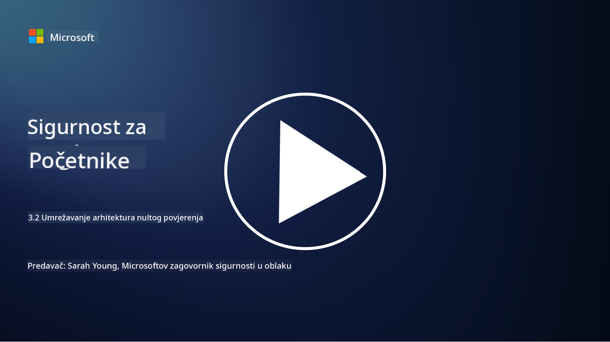

<!--
CO_OP_TRANSLATOR_METADATA:
{
  "original_hash": "680d6e14d9d33fc471c22f44679713f8",
  "translation_date": "2025-09-03T21:15:19+00:00",
  "source_file": "3.2 Networking zero trust architecture.md",
  "language_code": "hr"
}
-->
# Arhitekture mrežne nulte povjerenja

Mreža pruža ključni sloj u kontrolama nulte povjerenja, u ovoj lekciji saznat ćemo više o sljedećem:

- Što je segmentacija mreže?
- Kako segmentacija mreže pomaže u implementaciji nulte povjerenja?
- Što je enkripcija od kraja do kraja?

## Što je segmentacija mreže?

Segmentacija mreže je praksa dijeljenja mreže na manje, izolirane segmente ili podmreže. Svaki segment je izoliran od drugih, a pristup između segmenata kontrolira se i ograničava na temelju specifičnih sigurnosnih politika. Segmentacija mreže koristi se za poboljšanje sigurnosti ograničavanjem utjecaja potencijalnih proboja i smanjenjem lateralnog kretanja napadača unutar mreže.

Implementacijom segmentacije mreže, organizacija može stvoriti "zone" koje odvajaju različite vrste korisnika, aplikacija i podataka. To smanjuje površinu napada i minimizira potencijalnu štetu uzrokovanu sigurnosnim incidentom. Segmentacija mreže može se postići tehnologijama poput virtualnih LAN-ova (VLAN-ova), vatrozida i kontrola pristupa.

## Kako segmentacija mreže pomaže u implementaciji nulte povjerenja?

Segmentacija mreže usko se povezuje s principima modela nulte povjerenja. U arhitekturi nulte povjerenja, segmentacija mreže pomaže u provođenju principa "najmanjeg privilegija" osiguravajući da korisnici i uređaji imaju pristup samo specifičnim resursima i uslugama potrebnim za obavljanje njihovih zadataka. Segmentiranjem mreže u manje zone, organizacije mogu implementirati stroge kontrole pristupa, izolirati ključne resurse i spriječiti lateralno kretanje napadača.

Segmentacija mreže također pomaže u provođenju kontrola pristupa temeljenih na identitetu, gdje se korisnici i uređaji temeljito autentificiraju i autoriziraju prije pristupa određenim segmentima. To sprječava neovlašteni pristup osjetljivim resursima i ublažava potencijalni utjecaj kompromitiranih vjerodajnica.

## Što je enkripcija od kraja do kraja?

Enkripcija od kraja do kraja (E2E) je sigurnosna mjera koja osigurava da podaci ostanu šifrirani tijekom cijelog svog puta od pošiljatelja do primatelja. U ovom procesu, podaci se šifriraju na strani pošiljatelja, a samo primatelj posjeduje ključ za dešifriranje kako bi otključao i pročitao podatke. Procesi šifriranja i dešifriranja odvijaju se na krajnjim točkama, što otežava neovlaštenim stranama, uključujući pružatelje usluga i posrednike, pristup nešifriranim podacima.

E2E enkripcija pruža visoku razinu povjerljivosti i sigurnosti za prijenos podataka, čak i ako podaci prolaze kroz različite posredničke sustave ili mreže. Često se koristi u sigurnim aplikacijama za razmjenu poruka, uslugama e-pošte i drugim komunikacijskim platformama za zaštitu osjetljivih informacija od presretanja i neovlaštenog pristupa.

Ova metoda enkripcije osigurava da čak i ako napadači uspiju dobiti pristup podacima u prijenosu, vidjet će samo šifrirani sadržaj koji je besmislen bez ključa za dešifriranje. Enkripcija od kraja do kraja igra ključnu ulogu u zaštiti privatnosti korisnika i zaštiti osjetljivih informacija od izlaganja neovlaštenim stranama.

## Što je SASE?

SASE označava "Secure Access Service Edge" i predstavlja okvir i arhitekturu za kibernetičku sigurnost koja kombinira sigurnost mreže i mogućnosti širokopojasnog umrežavanja (WAN) u jednu uslugu temeljenu na oblaku. SASE je dizajniran za pružanje sigurnog i skalabilnog pristupa mrežnim resursima, aplikacijama i podacima za udaljene i mobilne korisnike, istovremeno pojednostavljujući upravljanje mrežom i smanjujući složenost tradicionalnih mrežnih i sigurnosnih arhitektura.

Ključne karakteristike i komponente SASE-a uključuju:

1. **Temeljeno na oblaku:** SASE se pruža kao usluga u oblaku, što znači da se sigurnosne i mrežne funkcije pružaju iz oblaka, umjesto da se oslanjaju na tradicionalni hardver i uređaje na lokaciji.

2. **Integracija sigurnosti i umrežavanja:** SASE integrira različite sigurnosne usluge poput sigurnih web pristupnika (SWG), vatrozida kao usluge (FWaaS), prevencije gubitka podataka (DLP), pristupa mreži s nultim povjerenjem (ZTNA) i optimizacije WAN-a s mogućnostima širokopojasnog umrežavanja. Ova integracija pomaže u pojednostavljenju operacija sigurnosti i umrežavanja.

3. **Nulto povjerenje:** SASE djeluje na principu nultog povjerenja, što znači da provodi stroge kontrole pristupa i politike najmanjeg privilegija. Korisnici i uređaji nisu automatski pouzdani, već se moraju autentificirati i autorizirati prije pristupa resursima.

4. **Usmjereno na identitet:** SASE se fokusira na identitete korisnika i uređaja kao osnovu za kontrolu pristupa. Politike temeljene na identitetu i kontekstu koriste se za određivanje dozvola pristupa, a te se politike dinamički prilagođavaju na temelju ponašanja korisnika i konteksta.

5. **Skalabilnost i fleksibilnost:** SASE se lako skalira kako bi podržao veliki broj korisnika i uređaja, što ga čini prikladnim za organizacije s raznolikim i promjenjivim potrebama za umrežavanjem i sigurnošću.

SASE je posebno relevantan u modernom dobu rada na daljinu i usvajanja oblaka, jer pruža sveobuhvatan i agilan pristup osiguravanju i upravljanju mrežnim pristupom. Pomaže organizacijama da se prilagode promjenjivim zahtjevima za sigurnost i umrežavanje, istovremeno održavajući snažan fokus na sigurnosnim modelima usmjerenim na korisnika i nulto povjerenje.

## Dodatno čitanje

- [What Is Network Segmentation? - Cisco](https://www.cisco.com/c/en/us/products/security/what-is-network-segmentation.html#~benefits)
- [What Is Micro-Segmentation? - Cisco](https://www.cisco.com/c/en/us/products/security/what-is-microsegmentation.html)
- [Implementing Network Segmentation and Segregation | Cyber.gov.au](https://www.cyber.gov.au/resources-business-and-government/maintaining-devices-and-systems/system-hardening-and-administration/network-hardening/implementing-network-segmentation-and-segregation)
- [What Is Network Segmentation and Why It Matters | CompTIA](https://www.comptia.org/blog/security-awareness-training-network-segmentation)
- [Network Segmentation: Concepts and Practices (cmu.edu)](https://insights.sei.cmu.edu/blog/network-segmentation-concepts-and-practices/)
- [Secure networks with Zero Trust | Microsoft Learn](https://learn.microsoft.com/security/zero-trust/deploy/networks?WT.mc_id=academic-96948-sayoung)
- [What is end-to-end encryption? | IBM](https://www.ibm.com/topics/end-to-end-encryption)
- [What Is End-to-End Encryption, and Why Does It Matter? (howtogeek.com)](https://www.howtogeek.com/711656/what-is-end-to-end-encryption-and-why-does-it-matter/)
- [Definition of Secure Access Service Edge (SASE) - Gartner Information Technology Glossary](https://www.gartner.com/en/information-technology/glossary/secure-access-service-edge-sase)
- [What Is Secure Access Service Edge (SASE)? | Microsoft Security](https://www.microsoft.com/security/business/security-101/what-is-sase?WT.mc_id=academic-96948-sayoung)

---

**Odricanje od odgovornosti**:  
Ovaj dokument je preveden pomoću AI usluge za prevođenje [Co-op Translator](https://github.com/Azure/co-op-translator). Iako nastojimo osigurati točnost, imajte na umu da automatski prijevodi mogu sadržavati pogreške ili netočnosti. Izvorni dokument na izvornom jeziku treba smatrati autoritativnim izvorom. Za ključne informacije preporučuje se profesionalni prijevod od strane čovjeka. Ne preuzimamo odgovornost za bilo kakve nesporazume ili pogrešne interpretacije koje proizlaze iz korištenja ovog prijevoda.